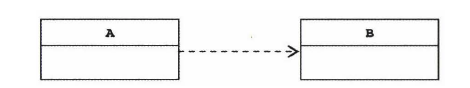
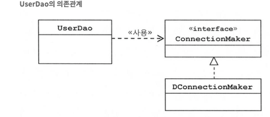

# 3일차 p.103 ~ 127

## 1.6 싱글톤 레지스트리와 오브젝트 스코프

DaoFactory 를 직접 사용하는 것과 @Configuration 애노테이션을 추가해서 스프링의 애플리케이션 컨텍스트를 사용하는 것은
테스트 결과만 보자면 동일한 것 같다. 그저 애플리케이션 컨텍스트에 userDao 라는 이름의 빈을 요청하면 DaoFactory 의
userDao() 메소드를 호출해서 그 결과를 돌려주는 것이라고 생각할지 모르겠다.

하지만 스프링의 애플리케이션 컨텍스트는 기존에 직접 만들었던 오브젝트 팩토리와는 중요한 차이점이 있다.

> **오브젝트의 동일성 과 동등성** <br/>
> 
> 자바에서 두 개의 오브젝트가 같은가라는 말은 주의해서 써야 한다 자바에서는 두 개의 오브젝트가 완전히 같은
> 동일한(identical) 오브젝트라고 말하는 것과, 동일한 정보를 담고 있는 (equivalent) 오브젝트라고 말하는 것은
> 분명히 차이가 있다. 전자는 동일성(identity) 비교라고 하고,
> 후자를 동등성(equality) 비교라고 한다. 동일성은 == 연산자로, 동등성은 equals() 메소드를 이용해 비교한다.
> <br/>
> 
> 두 개의 오브젝트가 동일하다면 사실은 하나의 오브젝트만 존재하는 것이고 두 개의 오브젝트 레퍼런스 변수를 갖고 있을 뿐이다.
> 두 개의 오브젝트가 동일하지는 않지만 동등한 경우엔느 두 개의 각기 다른 오브젝트가 메모리상에 존재하는 것인데,
> 오브젝트의 동등성 기준에 따라 두 오브젝트의 정보가 동등하다고 판단하는 것일 뿐이다. 물론 
> 동일한 오브젝트는 동등하기도 할 것이다. 하지만 그 반대는 항상 참이 아니다.
> <br/>
> 
> 자바 클래스를 만들 때 equals() 메소드를 따로 구현하지 않았다면, 최상위 클래스인 Object 클래스에
> 구현되어 있는 equals() 메소드가 사용된다. Object 의 equals() 메소드는 두 오브젝트의 동일성을 비교해서
> 그 결과를 돌려준다. 따라서 이때는 동일한 오브젝트여야지만 동등한 오브젝트라고 여겨질 것이다.

알아보고 싶은 것은 
DaoFactory 의 userDao() 를 여러 번 호출했을 때 동일한 오브젝트가 돌아오는가 아닌가이다.
코드를 보면 매번 userDao 메소드를 호출할 때마다 new 연산자에 의해 새로운 오브젝트가 만들어지게 되어 있다.
당연히 매번 다른 오브젝트가 만들어져서 돌아올 것이라고 에상할 수 있다.

`리스트 1-20 직접 생성한 DaoFactory 오브젝트 출력 코드`

```java
DaoFactory factory = new DaoFactory();
UserDao dao1 = factory.userDao();
UserDao dao2 = factory.userDao();

System.out.println(dao1);
System.out.println(dao2);
```

리스트 1-20 의 코드를 실행하면 다음과 같은 결과가 나온다. 
출력되는 값은 매번 달라질 수 있다.

출력 결과에서 알 수 있듯이, 두 개는 각기 다른 값을 가진 동일하지 않은 오브젝트다.
즉 오브젝트가 두 개가 생겼다는 사실을 알 수 있다.
userDao 를 매번 호출하면 계속해서 새로운 오브젝트가 만들어질 것이다. 
여기까지는 충분히 예상할 수 있는 당연한 결과다.

이번에 리스트 1-21 과 같이 스프링의 애플리케이션 컨텍스트에 DaoFactory 를 설정 정보로 등록하고 getBean() 메소드를 이용해 
userDao 라는 이름으로 등록된 오브젝트를 가져와 보자.

`리스트 1-21 스프링 컨텍스트로부터 가져온 오브젝트 출력 코드`

```java
AnnotationConfigApplicationContext context = new AnnotationConfigApplicationContext(DaoFactory.class);
UserDao dao1 = context.getBean("userDao", UserDao.class);
UserDao dao2 = context.getBean("userDao", UserDao.class);

System.out.println(dao1);
System.out.println(dao2);
```

두 오브젝트의 출력 값이 같으므로, getBean() 을 두 번 호출해서 가져온 오브젝트가 동일하다는 사실을 알 수 있다.

우리가 만들었던 오브젝트 팩토리와 스프링의 애플리케이션 컨텍스트의 동작 방식에는 무엇인가 차이점이 있다.
스프링은 여러 번에 걸쳐 빈을 요청하더라도 매번 동일한 오브젝트를 돌려준다는 것이다.
단순하게 getBean() 을 실행할 때마다 userDao() 메소드를 호출하고, 매번 new 에 의해 새로운 UserDao가 만들어지지 않는다는 뜻이다.

왜 그럴까?

### 1.6.1 싱글톤 레지스트리로서의 애플리케이션 콘텍스트

애플리케이션 콘텍스트는 우리가 만들었던 오브젝트 팩토리와 비슷한 방식으로 동작하는 IoC 컨테이너다.
그러면서 동시에 이 애플리케이션 컨텍스트는 싱글톤을 저장하고 관리하는 싱글톤 레지스트리(singleton registry) 이기도 하다.

스프링은 기본적으로 별다른 설정을 하지 않으면 내부에서 생성하는 빈 오브젝트를 모두 싱글톤으로 만든다.
여기서 싱글톤이라는 것은 디자인 패턴에서 나오는 싱글톤 패턴과 비슷한 개념이지만 그 구현 방법은 확연히 다르다.

### 서버 애플리케이션과 싱글톤

왜 스프링은 싱글톤으로 빈을 만드는 것일까?

태생적으로 스프링은 엔터프라이즈 시스템을 위해 고안된 기술이기 때문에 서버 환경에서 사용될 때 그 가치가 있다.
실제로 스프링은 대부분 서버환경에서 사용된다.

스프링이 처음 설계됐던 대규모의 엔터프라이즈 서버환경은 서버 하나당 최대로 초당 수십에서 수백 번씩 브라우저나 여타 시스템으로부터의 요청을 받아
처리할 수 있는 높은 성능이 요구되는 환경이었다.
또 하나의 요청을 처리하기 위해 데이터 엑세스 로직, 서비스 로직, 비즈니스 로직, 프레젠테이션 로직 등의 다양한 기능을 담당하는 오브젝트들이 참여하는
계층형 구조로 이뤄진 경우가 대부분이다.
비즈니스 로직도 복잡한 경우가 많다.


그래서 엔터프라이즈 분야에서는 서비스 오브젝트라는 개념을 일찍부터 사용해왔다.
서블릿은 자바 엔터프라이즈 기술의 가장 기본이 되는 서비스 오브젝트라고 할 수 있다.
스펙에서 강제하진 않지만, 서블릿은 대부분 멀티스레드 환경에서 싱글톤으로 동작한다.
서블릿 클래스당 하나의 오브젝트만 만들어두고, 사용자의 요청을 담당하는 여러 스레드에서 하나의 오브젝트를 공유해 동시에  사용한다.

하지만 디자인 패턴에 소개된 싱글톤 패턴은 사용하기가 까다로고 여러 가지 문제점이 있다.
그래서 심지어 이런 싱글톤 패턴을 피해야 할 패턴이라는 의미로 안티패턴(anti pattern) 이라고 부르는 사람도 있다.


> **싱글톤 패턴(Singleton Pattern)**
> <br/>
> 디자인 패턴 중에서 가장 자주 활용되는 패턴이기도 하지만 가장 많은 비판을 받는 패턴이기도 하다. 
> <br/>
> 싱글톤 패턴은 어떤 클래스를 애플리케이션 내에서 제한된 인스턴스 개수, 이름처럼 주로 하나만 존재하도록 강제하는 패턴이다.


### 싱긑톤 패턴의 한계

자바에서 싱글톤을 구현하는 방법은 보통 이렇다.

- 클래스 밖에서는 오브젝트를 생성하지 못하도록 생성자를 private 으로 만든다.
- 생성된 싱글톤 오브젝트를 저장할 수 있는 자신과 같은 타입의 스태틱 필드를 정의한다.


`리스트 1-22 싱글톤 패턴을 적용한 UserDao`

일단 깔끔하게 정리했던 UserDao 에 싱글톤을 위한 코드가 추가되고 나니 코드가 상당히 지저분해졌다는
느낌이 든다. 게다가 private 로 바뀐 생성자는 외부에서 호출할 수가 없기 때문에 DaoFactory 에서 UserDao 를 생성하며
ConnectionMaker 오브젝트를 넣어주는 게 이제는 불가능해졌다.


일반적으로 싱글톤 패턴 구현 방식에는 다음과 같은 문제가 있다.

- #### private 생성자를 갖고 잇기 때문에 상속할 수 없다.

싱글톤 패턴은 생성자를 private 으로 제한한다. 오직 싱글턴 클래스 자신만이 자기 오브젝트를 만들도록 제한하는 것이다.
기술적인 서비스만 제공하는 경우라면 상관없겠지만,
애플리케이션의 로직을 담고 있는 일반 오브젝트의 경우 싱글톤으로 만들었을 때 객체지향적인 설계의 장점을 적용하기가 어렵다는 점은 
심각한 문제다. 또한 상속과 다형성 같은 객체지향의 특징이 적용되지 않는 스태틱 필드와 메소드를 사용하는 것도 역시 동일한 문제를 발생시킨다.


- #### 싱글톤은 테스트하기가 힘들다.

싱글톤은 테스트하기가 어렵거나 테스트 방법에 따라 아예 테스트가 불가능하다.
싱글톤은 만들어지는 방식이 제한적이기 때문에 테스트에서 사용될 때 목 오브젝트 등으로 대체하기가 힘들다.
싱글톤은 초기화 과정에서 생성자 등을 통해 사용할 오브젝트를 다이내믹하게 주입하기도 힘들기 때문에 필요한 오브젝트는 직접 오브젝트를 만들어 사용할 수 밖에 없다.
이런 경우 테스트용 오브젝트로 대체하기가 힘들다.

- ####  서버환경에서는 싱글톤이 하나만 만들어지는 것을 보장하지 못한다.

서버에서 클래스 로더를 어떻게 구성하고 있느냐에 따라서 싱글톤 클래스임에도 하나 이상의 오브젝트가 만들어질 수 있다. 
따라서 자바 언어를 이용한 싱글톤 패턴 기법은 서버환경에서는 싱글톤이 꼭 보장된다고 볼 수 없다.

- #### 싱글톤의 사용은 전역 상태를 만들 수 있기 때문에 바람직하지 못하다.

싱글톤은 사용하는 클라이언트가 정해져 있지 않다. 싱글톤의 스태틱 메소드를 이용해 언제든지 싱글톤에 쉽게 접근할 수 있기 때문에
애플리케이션 어디서든지 사용될 수 있고, 그러다 보면 자연스럽게 전역 상태(global state)로 사용되기 쉽다.
아무 객체나 자유롭게 접근하고 수정하고 공유할 수 있는 전역 상태를 갖는 것은 객체지향 프로그램이에서는 권장되지 않는 프로그래밍 모델이다.

### 싱글톤 레지스트리

스프링은 서버환경에서 싱글톤이 만들어져서 서비스 오브젝트 방식으로 사용되는 것은 적극 지지한다.
자바의 기본적인 싱글톤 패턴의 구현 방식은 여러 가지 단점이 있기 때문에, 스프링은 직접 싱글톤 형태의 오브젝트를 만들고 관리하는 기능을
제공한다. 그것이 바로 **싱글톤 레지스트리(singleton registry)** 다. 
스프링 컨테이너는 싱글톤을 생성하고, 관리하고, 공급하는 싱글톤 관리 컨테이너이기도 하다.
싱글톤 레지스트리의 장점은 스태틱 메소드와 private 생성자를 사용해야 하는 비정상적인 클래스가 아니라 평범한 자바 클래스를 
싱글톤으로 활용하게 해준다는 점이다.

평범한 자바 클래스라도 IoC 방식의 컨테이너를 사용해서 생성과 관계 설정, 사용 등에 대한 제어권을 컨테이너에게 넘기면
손쉽게 싱글톤 방식으로 만들어져 관리되게 할 수 있다.
오브젝트 생성에 관한 모든 권한은 IoC 기능을 제공하는 애플리케이션 컨텍스트에게 있기 때문이다.

스프링의 싱글톤 레지스트리 덕분에 싱글톤 방식으로 사용될 애플리케이션 클래스라도 public 생성자를 가질 수 있다.
싱글톤으로 사용돼야 하는 환경이 아니라면 간단히 오브젝트를 생성해서 사용할 수 있다.
따라서 테스트 환경에서 자유롭게 오브젝트를 만들 수 있고, 테스트를 위한 목 오브젝트로 대체하는 것도 간단하다.

가장 중요한 것은 싱글톤 패턴과 달리 스프링이 지지하는 객체지향적인 설계 방식과 원칙, 디자인 패턴(싱글톤 패턴은 제외 ) 등을 적용하는 데 아무런 제약이 없다는 점이다.
스프링은 IoC 컨테이너일 뿐만 아니라, 고전적인 싱글톤 패턴을 대신해서 싱글톤을 만들고 관리해주는 싱글톤 레지스트리라는 점을 기억해두자.
스프링이 빈을 싱글톤으로 만드는 것은 결국 오브젝트의 생성 방법을 제어하는 IoC 컨테이너로서의 역할이다.


디음은 싱글톤으로 만들어지기 때문에 주의해야 할 점에 대해 알아보자


### 1.6.2 싱글톤과 오브젝트의 상태

싱글톤은 멀티 스레드 환경이라면 여러 스레드가 동시에 접근해서 사용할 수 있다. 따라서 상태 관리에 주의를 기울여야 한다.
기본적으로 싱글톤이 멀티스레드 환경에서 서비스 형태의 오브젝트로 사용되는 경우에는 상태정보를 내부에 갖고 있지 않은 무상태(stateless) 방식으로 
만들어져야 한다.
다중 사용자의 요청을 한꺼번에 처리하는 스레드들이 동시에 싱글톤 오브젝트의 인스턴스 변수를 수정하는 것은 매우 위험하다.

저장할 공간이 하나뿐이니 서로 값을 덮어쓰고 자신이 저장하지 않은 값을 읽어올 수 있기 때문이다.
따라서 싱글톤은 기본적으로 인스턴스 필드의 값을 변경하고 유지하는 상태유지(stateful) 방식으로 만들지 않는다.
이를 지키지 않으면 개발자 혼자서 개발하고 테스트 할 때는 아무런 문제가 없겠지만, 서버에 배포되고 여러 사용자가 동시에 
접속하면 데이터가 엉망이 돼버리는 등의 심각한 문제가 발생할 것이다.

상태가 없는 방식으로 클래스를 만드는 경우에 각 요청에 대한 정보나, DB 나 서버의 리소스로부터 생성한 정보는 어떻게 다뤄야 할까?
이때는 파라미터와 로컬 변수, 리턴 값등을 이용하면 된다.
메소드 파라미터나 , 메소드 안에서 생성되는 로컬 변수는 매번 새로운 값을 저장할 독립적인 공간이 만들어지기 때문에
싱글톤이라고 해도 여러 스레드가 변수의 값을 덮어쓸 일은 없다.


`리스트 1-23 인스턴스 변수를 사용하도록 수정한 UserDao`

기존에 만들었던 UserDao 와 다른 점은 기존에 로컬 변수로 선언하고 사용햇던 Connection 과 User 를 클래스의 인스턴스 필드로 선언했다는 것이다.
따라서 싱글톤으로 만들어져서 멀티스레드 환경에서 사용하면 위에서 설명한 대로 심각한 문제가 발생한다. 따라서
스프링의 싱글톤 빈으로 사용되는 클래스를 만들 때는 기존의 UserDao 처럼 개별적으로 바뀌는 정보는 로컬 변수로 정의하거나, 파라미터로 주고받으면서 사용하게 해야 한다.

그런데 기존의 UserDao 에서도 인스턴스 변수로 정의해서 사용한 것이 있다. 바로 ConnectionMaker 인터페이스 타입의 connectionMaker 다.
이것은 인스턴스 변수를 사용해도 상관없다. 왜냐하면 connectionMaker 는 읽기전용의 정보이기 때문이다.
이 변수에는 ConnectionMaker 타입의 싱글톤 오브젝트가 들어 있다.
이 connectionMaker 도 DaoFactory 에 @Bean 을 붙여서 만들었으니 스프링이 관리하는 빈이 될 것이고, 별다른 설정이 없다면 기본적으로 오브젝트 한 개만 만들어져서
UserDao 의 connectionMaker 인스턴스 필드에 저장된다.

### 1.6.3 스프링 빈의 스코프

스프링이 관리하는 오브젝트, 즉 빈이 생성되고 , 존재하고 , 적용되는 범위에 대해 알아보자.
스프링에서는 이것을 빈의 스코프(scope)라고 한다.
스프링 빈의 기본 스코프는 싱글톤이다. 싱글톤 스코프는 컨테이너 내에 한 개의 오브젝트만 만들어져서, 강제로 제거하지 않는 한 
스프링 컨테이너가 존재하는 동안 계속 유지된다.

스프링에서 만들어지는 대부분의 빈은 싱글톤 스코프를 갖는다.
경우에 따라서는 싱글톤 외의 스코프를 가질 수 있다. 대표적으로 프로토타입(prototype) 스코프가 있다. 프로토타입은 
싱글톤과 달리 컨테이너에 빈을 요청할 때마다 매번 새로운 오브젝트를 만들어준다.
그 외에도 웹을 통해 새로운 HTTP 요청이 생길 때마다 생성되는 요청 (request) 스코프가 있고, 
웹의 세션과 스코프가 유사한 세션(session) 스코프도 있다.
스프링에서 만들어지는 빈의 스코프는 싱글톤 외에도 다양한 스코프를 사용할 수 있다.

## 1.7 의존관계 주입 (DI)

### 1.7.1 제어의 역전(IoC) 과 의존관계 주입

객체지향적인 설계나, 디자인 패턴, 컨테이너에서 동작하는 서버 기술을 사용한다면 자연스럽게 IoC를 적용하거나 그 원리로 동작하는 기술을 사용하게 될 것이다.

DaoFactory 처럼 객체를 생성하고 관계를 맺어주는 등의 작업을 담당하는 기능을 일반화한 것이 스프링의 IoC 컨테이너다.

한 가지 짚고 넘어갈 것은 여기서 사용하는 IoC 라는 용어인데, IoC 가 매우 느슨하게 정의 돼서 
폭넓게 사용되는 용어라는 점이다. 때문에 스프링을 IoC 컨테이너라고만 해서는 스프링이 제공하는 기능의 특징을 명확하게 설명하지 못한다.

스프링이 서블릿 컨테이너처럼 서버에서 동작하는 서비스 컨테이너라는 뜻인지, 아니면 단순히 IoC 개념이 적용된 템플릿 메소드 패턴을 이용해 만들어진
프레임워크인지, 아니면 또 다른 IoC 특징을 지닌 기술이라는 것인지 파악하기 힘들다.
그래서 새로운 용어를 만드는 데 탁월한 재능이 있는 몇몇 사람의 제안으로 스프링이 제공하는 IoC 방식을 핵심을 짚어주는 의존관계 주입(Dependency Injection) 이라는, 좀 더 의도가 명확히 드러나는 이름을 
사용하기 시작했다. 스프링 IoC 기능의 대표적인 동작원리는 주로 의존관계 주입이라고 불린다.
물론 스프링이 컨테이너이고 프레임워크이니 기본적인 동작원리가 모두 IoC 방식이라고 할 수 있지만, 스프링이 여타 프레임워크와 차별화돼서 제공해주는 기능은 의존관계 주입이라는 새로운 용어를 
사용할 때 분명하게 드러난다.


> **의존관계 주입, 의존성 주입,  의존 오브젝트 주입?**
> <br/>
'Dependency Injection' 은 여러 가지 우리말로 번역돼서 사용된다. 그중에서 가장 흔히 사용되는 용어가 의존성 주입이다.
> 하지만 의존성이라는 말은 DI의 의미가 무엇인지 잘 드러내주지 못한다. 또한 의존(종속) 오브젝트 주입이라고도 부르기도 하는데, 이때는 DI가 일어나는
> 방법에 초점을 맞춘 것이다. 엄밀히 말해서 오브젝트는 다른 오브젝트에 주입할 수 있는게 아니다. 오브젝트의 레퍼런스가 전달 될 뿐이다. 
> DI는 오브젝트 레퍼런스를 외부로부터 제공받고 이를 통해 여타 오브젝트와 다이내믹하게 의존관계가 만들어지는 것이 핵심이다.

### 1.7.2 런타임 의존관계 설정

### 의존괸계

먼저 의존관계란 무엇인지 생각해보자.
두 개의 클래스 또는 모듈이 의존관계에 있다고 말할 때는 항상 방향성을 부여해줘야 한다.
즉 누가 누구에게 의존하는 관계에 있다는 식이어야 한다. 
UML 모델에서는 두 클래스의 의존 관계 (dependency relationship) 를 다음과 같이 점선으로 된 화살표로 표현한다.

`그림 1-10 클래스의 의존관계 다이어그램`



그렇다면 의존하고 있다는 건 무슨 의미일까? 
의존한다는 건 의존 대상, 여기서는 B가 변하면 그것이 A에 영향을 미친다는 뜻이다.
B의 기능이 추가되거나 변경되거나, 형식이 바뀌거나 하면 그 영향이 A로 전달된다는 것이다. 대표적인 예는 A가 B를 사용하는 경우,
예를 들어 A에서 B에 정의된 메소드를 호출해서 사용하는 경우다. 

이렇게 사용의 관계에 있는 경우에 A와 B는 의존관계가 있다고 말할 수 있다.
다시 말하지만 의존관계에는 방향성이 있다. A가 B에 의존하고 잇지만, 반대로 B는 A에 의존하지 않는다.
의존하지 않는다는 말은 B는 A의 변화에 영향을 받지 않는다는 뜻이다.

### UserDao 의 의존관계

UserDao가 ConnectionMaker 에 의존하고 있는 형태다.
그림 1-11은 앞에서 작업했던 UserDao 가 ConnectionMaker 인터페이스를 사용하는 것을 나타낸다. 
이 그림에서 UserDao 는 ConnectionMaker 인터페이스에만 의존하고 있다.

따라서 ConnectionMaker 인터페이스가 변한다면, 그 영향을 UserDao 가 직접적으로 받게 된다.
하지만 ConnectionMaker 인터페이스를 구현한 클래스, 즉 DConnectionMaker 등이 다른 것으로 바뀌거나 그 내 부에서 사용하는 메서드에
변화가 생겨도 UserDao 에 영향을 주지 않는다.

이렇게 인터페이스에 대해서만 의존관계를 만들어두면 인터페이스 구현 클래스와의 관계는 느슨해지면서 변화에 영향을 덜 받는 상태가 된다.
결합도가 낮다고 설명할 수 있다. 의존관계란 한쪽의 변화가 다른 쪽에 영향을 주는 것이라고 했으니, 
인터페이스를 통해 의존관계를 제한해주면 그만큼 변경에서 자유로워지는 셈이다.

`그림 1-11 인터페이스를 통한 느슨한 결합을 갖는 의존관계`




UML 에서 말하는 의존관계란 이렇게 설계 모델의 관점에서 이야기하는 것이다.
그런데, 모델이나 코드에서 클래스와 인터페이스를 통해 드러나는 의존 관계 말고, 런타임 시에 오브젝트 사이에서 만들어지는
의존관계도 있다. 런타임 의존관계 또는 오브젝트 의존관계인데, 설계 시점의 의존관계가 실체화된 것이라고 볼 수 있다.
런타임 의존관계는 모델링 시점의 의존관계와는 성격이 분명히 다르다.

인터페이스를 통해 설계 시점에 느슨한 의존관계를 갖는 경우에는 UserDao 의 오브젝트가 런타임 시에 사용할 오브젝트가 어떤 클래스로 만든 것인지 미리 알 수가 없다.

프로그램이 시작되고 UserDao 오브젝트가 만들어지고 나서 런타임 시에 의존관계를 맺는 대상, 즉 실제 사용대상인
오브젝트를 **의존 오브젝트(dependent object)** 라고 말한다.

의존관계 주입은 이렇게 구체적인 의존 오브젝트와 그것을 사용할 주체, 보통 클라이언트라고 부르는 오브젝트를 런탕미 시에 연결해주는 작업을 말한다.
UserDao 는 ConnectionMaker 인터페이스라는 매우 단순한 조건만 만족하면 어떤 클래스로부터 만들어졌뜬 상관없이 오브젝트를 받아들이고 사용한다.

정리하면 , 의존관계 주입이란 다음과 같은 세 가지 조건을 충족하는 작업을 말한다.

- 클래스 모델이나 코드에는 런타임 시점의 의존관계가 드러나지 않는다. 그러기 위해서는 인터페이스에만 의존하고 있어야 한다.
- 런타임 시점의 의존관계는 컨테이너나 팩토리 같은 제3의 존재가 결정한다.
- 의존관계는 사용할 오브젝트에 대한 레퍼런스를 외부에서 제공(주입)해줌으로써 만들어진다.

의존관계 주입의 핵심은 설계 시점에는 알지 못했던 두 오브젝트의 관계를 맺도록 도와주는 제3의 존재가 있다는 것이다.

DI에서 말하는 제 3의 존재는 바로 관계 설정 책임을 가진 코드를 분리해서 만들어진 오브젝트라고 볼 수 있다.

### UserDao 의 의존관계 주입

UserDao 에 적용된 의존관계 주입 기술을 다시 살펴보자.
인터페이스를 사이에 두고 UserDao 와 ConnectionMaker 구현 클래스 간에 의존관계를 느슨하게 만들긴 했지만,
마지막으로 남은 문제가 있었는데 그것은 UserDao 가 사용할 구체적인 클래스를 알고 있어야 한다는 점이었다.


`리스트 1-24  관계설정 책임 분리 전의 생성자`

```java
public UserDao() {
    this.simpleConnectionMaker = new SimpleConnectionMaker();
}

```

이 코드의 문제는 이미 런타임 시의 의존관계가 코드 속에 다 미리 결정되어 있다는 점이다.
그래서 IoC 방식을 써서 UserDao 로부터 런타임 의존관계를 드러내는 코드를 제거하고,
제 3의 존재인 런타임 의존관계 결정 권한을 위임한다.
그래서 최종적으로 만들어진 것이 DaoFactory 다.


`그림 1-12 클래스/코드 레벨의 의존관계`


런타임 시점의 의존관계를 결정하고 만들려면 제 3의 존재가 필요하다고 했다.
DaoFactory 가 그 역할을 담당한다고 해보자. 
DaoFactory 는 여기서 두 오브젝트 사이의 런타임 의존관계를 설정해주는 의존관계 주입 작업을 주도하는 존재이며, 
동시에 IoC 방식으로 오브젝트의 생성과 초기화, 제공 등의 작업을 수행하는 컨테이너다.

따라서 의존관계 주입을 담당하는 컨테이너라고 볼 수 있고, 줄여서 DI 컨테이너라고 불러도 된다.
보통 DI는 그 근간이 되는 개념인 IoC 와 함께 사용해서 IoC/DI 컨테이너라는 식으로 함께 사용하기도 한다.
아무튼 DaoFactory 는 그래서 DI 컨테이너다.

주입이라는 건 외부에서 내부로 무엇인가를 넘겨줘야 하는 것인데,
자바에서 오브젝트에 무엇인가를 넣어준다는 개념은 메소드를 실행하면서 파라미터로 오브젝트의 레퍼런스를 전달해주는 방법 뿐이다.
가장 손쉽게 사용할 수 있는 파라미터 전달이 가능한 메소드는 바로 생성자다.

DI 컨테이너는 자신이 결정한 의존관계를 맺어줄 클래스의 오브젝트를 만들고 이 생성자의 파라미터로 오브젝트의 레퍼런스를 전달해준다.


`리스트 1-25 의존관계 주입을 위한 코드`

```java
public class UserDao {
    private ConnectionMaker connectionMaker;

    public UserDao(ConnectionMaker simpleConnectionMaker) {
        this.connectionMaker = simpleConnectionMaker;
    }
    ...

}
```


`그림 1-13 런타임 시의 의존관계 주입과 사용 의존관계`


DI는 자신이 사용할 오브젝트에 대한 선택과 생성 제어권을 외부로 넘기고 자신은 수동적으로 주입받은 오브젝트를 사용한다는 점에서
IoC의 개념에 잘 들어맞는다.

### 1.7.3 의존관계 검색과 주입

스프링이 제공하는 IoC 방법에는 의존관계 주입만 있는 것이 아니다.
코드에서는 구체적인 클래스에 의존하지 않고, 런타임 시에 의존관계를 결정한다는 점에서 의존관계 주입과 비슷하지만, 
의존관계를 맺는 방법이 외부로부터의 주입이 아니라 스스로 검색을 이용하기 때문에 의존관게 검색(dependency lookup)이라고 불리는 것도 있다.

의존 관계 검색은 자신이 필요로 하는 오브젝트를 능동적으로 찾는다. 물론 자신이 어떤 클래스의 오브젝트를 이용할지 결정하지는 않는다.

의존관계 검색은 런타임 시 의존관계를 맺을 오브젝트르 결정하는 것과 오브젝트의 생성작업은 외부 컨테이너에게 IoC 로 맡기지만, 이를 가져올 땐느 메소드나 생성자를 
통한 주입 대신 스스로 컨테이너에게 요청하는 방법을 사용한다.

`리스트 1-26 DaoFactory 를 이용하는 생성자`

```java
public UserDao() {
    DaoFactory daoFactory = new DaoFactory();
    this.connectionMaker = daoFactory.connectionMaker();
}
```

이렇게 해도 UserDao 는 여전히 자신이 어떤 ConnectionMaker 오브젝트를 사용할지 미리 알지 못한다.
여전히 코드의 의존대상은 ConnectionMaker 인터페이스 뿐이다. 

런타임 시에 DaoFactory 가 만들어서 돌려주는 오브젝트와 다이내믹하게 런타임 의존관계를 맺는다.
따라서 IoC 개념을 잘 따르고 있으며, 그 혜택을 받고 있는 코드다.
하지만 적용 방법은 외부로부터의 주입이 아니라 스스로 IoC 컨테이너인 DaoFactory 에게 요청하는 것이다.

스프링의 IoC 컨테이너인 애플리케이션 컨텍스트는 getBean() 이라는 메소드를 제공한다.
바로 이 메소드가 의존관계 검색에 사용되는 것이다. 

`리스트 1-27 의존관계 검색을 이용하는 UserDao 생성자.`

````java
public UserDao() {
    AnnotationConfigApplicationContext context =
	      new AnnotationConfigApplicationContext(DaoFactory.class);
    this.connectionMaker = context.getBean("connectionMaker" , ConnectionMaker.class);
}
````

의존관계 검색은 기존 의존관계 주입의 거의 모든 장점을 갖고 있다.

그렇다면 의존관계 검색과 앞에서 살펴봤던 의존관계 주입 방버 중 어떤 것이 더 나을까?
코드를 보면 느낄 수 있겠지만 의존관계 주입 쪽이 훨씬 단순하고 깔끔하다.

애플리케이션 컴포넌트가 컨테이너와 같이 성격이 다른 오브젝트에 의존하게 되는 것이므로 바람직하지 않다.
사용자에 대한 DB 정보를 어떻게 가져올 것인가에 집중해야 하는 UserDao 에서 스프링이나 오브젝트 팩토리를 만들고 API를 
이용하는 코드가 섞여 있는 것은 어색하다.
따라서 대개는 의존관계 주입 방식을 사용하는 편이 낫다.

서버에는 main()과 같은 기둥 메소드는 없지만, 사용자의 요청을 받을 때마다 main() 메소드와 비슷한 역할을 하는 서블릿에서 스프링 컨테이너에 담긴 오브젝트를 
사용하려면 한 번은 의존관계 검색 방식을 사용해 오브젝트를 가져와야 한다.

의존관계 검색과 의존관계 주입을 적용할 때 발견할 수 있는 중요한 차이점이 하나 있다.
의존관계 검색 방식에서는 검색하는 오브젝트는 자신이 스프링의 빈일 필요가 없다는 점이다.
UserDao 에 스프링의 getBean() 을 사용한 의존관계 검색 방법을 적용했다고 해보자 이 경우 UserDao는 굳이 스프링이 만들고 관리하는 빈일 필요가 없다.
 그냥 어딘가에서 직접 new UserDao() 해서 만들어서 사용해도 된다. 
이때는 ConnectionMaker 만 스프링의 빈이기만 하면 된다.


반면에 의존관계 주입에서는 UserDao 와 ConnecionMaker 사이에 DI가 적용되려면 UserDao도 반드시 컨테이너가 만드는 
빈 오브젝트여야 한다. 컨테이너가 UserDao 에 ConnectionMaker 오브젝트를 주입해주려면 UserDao 에 대한 생성과 초기화 권한을 갖고 있어야 하고,
그러려면 UserDao 는 IoC 방식을 컨테이너에서 생성되는 오브젝트, 즉 빈이어야 하기 때문이다.

DI를 원하는 오브젝트는 먼저 자기 자신이 컨테이너가 관리하는 빈이 돼야 한다는 사실을 잊지말자.


> **DI 받는다**
> <br/>
> DI의 동작방식은 이름 그대로 외부로부터의 주입이다. 하지만 단지 외부에서 파라미터로 오브젝트를 넘겨줬다고 해서, 즉 주입해줬다고 해서 다 DI가 아니라는 점을 주의해야 한다.


### 1.7.4 의존관계 주입의 응용

런타임 시에 사용 의존관계를 맺을 오브젝트를 주입해준다는 DI 기술의 장점은 무엇일까?

코드에는 런타임 클래스에 대한 의존관계가 나타나지 않고, 인터페이스를 통해 결합도가 낮은 코드를 만들므로,
다른 책임을 가진 사용 의존관계에 있는 대상이 바뀌거나 변경되더라도 자신은 영향을 받지 않으며, 변경을 통한 다양한 확장 방법에는 자유롭다는 게 지금까지 설명한 장점이었다.

스프링이 제공하는 기능의 99% DI의 혜택을 이용하고 있다. DI 없이는 스프링도 없다. 
그만큼 DI를 활용할 방법은 다양하다.

UserDao 가 ConnectionMaker 라는 인터페이스에만 의존하고 있다는 건, ConnectionMaker 를 구현하기만 하고 있다면 어떤 오브젝트든지 사용할 수 있다는 뜻이다.

### 기능 구현의 교환

실제 운영에 사용할 데이터베이스는 매우 중요한 자원이다.

모든 DAO 는 생성 시점에 ConnectionMaker 타입의 오브젝트를 컨테이너로부터 제공받는다. 구체적인 사용 클래스 이름은 컨테이너가 사용할 설정정보에 들어 있다.
@Configuration 이 붙은 DaoFactory 를 사용한다고 하면 개발자 PC 에서는 DaoFactory 의 코드를 리스트 1-28과 같이 만들어서 사용하면 된다.

`리스트 1-28 개발용 ConnectionMaker 생성 코드`

`리스트 1-29 운영용 ConnectionMaker 생성 코드`


### 부가기능 추가

DI 컨테이너에서라면 아주 간단한 방법으로 가능하다.
DAO 와 , DB 커넥션을 만드는 오브젝트 사이에 연결횟수를 카운팅하는 오브젝트를 하나 더 추가하는 것이다.
뭔가 새로운 기능을 호출 과정에 추가하려고 한다면 분명 그 앞뒤의 코드를 같이 수정해야 하는 것이 아닐까?

DI를 이용한다고 했으니 당연히 기본 코드는 수정하지 않아도 된다. 그리고 컨테이너가 사용하는 설정정보만 수정해서 런타임 의존관계만 새롭게 정의해주면 된다.


`리스트 1-30 연결횟수 카운팅 기능이 있는 클래스`

```java
public class CountingConnectionMaker implements ConnectionMaker {
    int counter = 0;
    private ConnectionMaker realConnectionMaker;


    public CountingConnectionMaker(ConnectionMaker realConnectionMaker) {
        this.realConnectionMaker = realConnectionMaker;
    }

    @Override
    public Connection makeConnection() {
        this.counter++;
        return realConnectionMaker.makeConnection();
    }

    public int getCounter() {
        return counter;
    }
}

```

CountingConnectionMaker 클래스는 ConnectionMaker 인터페이스를 구현했지만 내부에서 직접 DB 커넥션을 만들지 않는다.

CountingConnectionMaker 는 자신의 관심사인 DB 연결 횟수 카운팅 작업을 마치면 실제 DB 커넥션을 만들어주는 realConnectionMaker 에 저장된
ConnectionMaker 타입 오브젝트의 makeConnection() 을 호출해서 그 결과를 DAO에게 돌려준다.

`그림 1-14 CountingConnectionMaker 를 적용하기 전의 런타임 오브젝트 의존관계`


UserDao 는 ConnectionMaker 의 인터페이스에만 의존하고 있기 때문에,
ConnectionMaker 인터페이스를 구현하고 있다면 어떤 것이든 DI가 가능하다.
그래서 UserDao 오브젝트가 DI 받는 대상의 설정을 조절해서 DConnection 오브젝트 대신 CountingConnectionMaker 오브젝트로 바꿔치기하는 것이다.

그렇다고 해서 DB 커넥션을 제공해주지 않으면 DAO 가 동작하지 않을 테니 CountingConnectionMaker 가 다시 실제 사용할 DB 커넥션을 제공해주는 
DConnectionMaker 를 호출하도록 만들어야 한다. 역시 DI를 사용하면 된다. 이렇게 해서 재구성된 새로운 런타임 의존관계는 
그림 1-15와 같다.

`그림 1-15 CountingConnectionMaker 를 적용한 후의 런타임 오브젝트 의존관계`


새로운 의존관계를 컨테이너가 사용할 설정정보를 이용해 만들어보자.
CountingDaoFactory 라는 이름의 설정용 클래스를 만든다.

기존 DaoFactory와 달리, connectionMaker()  메소드에서 CountingConnectionMaker 타입 오브젝트를 생성하도록 만든다.

`리스트 1-31 CountingConnectionMaker 의존관계가 추가된 DI 설정용 클래스`

```java
@Configuration
public class CountingDaoFactory {

    @Bean
    public UserDao userDao() {
        return new UserDao(connectionMaker());
    }
    @Bean
    public ConnectionMaker connectionMaker() {
        return new CountingConnectionMaker(realConnectionMaker());
    }
    
    @Bean
    public ConnectionMaker realConnectionMaker() {
        return new DConnectionMaker();
    }
}

```

이제 커넥션 카운팅을 위한 실행 코드를 만든다.
 기본적으로 UserDaoTest 와 같지만 설정용 클래스를 CountingDaoFactory 로 변경해줘야 한다.

`리스트 1-32 CountingConnectionMaker 에 대한 테스트 클래스`

```java
public class UserDaoConnectionCountingTest {
	public static void main(String[] args) throws ClassNotFoundException,
			SQLException {
		AnnotationConfigApplicationContext context = 
			new AnnotationConfigApplicationContext(CountingDaoFactory.class);		
		UserDao dao = context.getBean("userDao", UserDao.class);

		for(int i=0; i<10; i++) {
			User user = new User();
			user.setId(""+i);
			user.setName(""+i);
			user.setPassword(""+i);
			dao.add(user);
		}

		CountingConnectionMaker ccm =  context.getBean("connectionMaker", CountingConnectionMaker.class);
		System.out.println("Connection counter : " + ccm.getCounter());		
	}
}

```

지금은 DAO 가 하나뿐이지만 DAO 가 수십, 수백 개여도 상관없다. DI 의 장점은 관심사의 분리를 통해 얻어지는 높은 응집도에서 나온다.

스프링은 DI를 편하게 사용할 수 있도록 도와주는 도구이면서 그 자체로 DI를 적극 활용한 프래임워크이기도 하다.


### 1.7..5 메소드를 이용한 의존관계 주입

지금까지는 UserDao 의 의존관계 주입을 위해 생성자를 사용했다. 생성자에 파라미터를 만들어두고
이를 통해 DI 컨테이너가 의존할 오브젝트 레퍼런스를 넘겨주도록 만들었다. 

생성자가 아닌 일반 메소드를 이용해 의존 오브젝트와의 관계를 주입해주는 데는 크게 두 가지 방법이 있다.

- ### 수정자 메소드를 이용한 주입

수정자 메소드는 외부에서 오브젝트 내부의 애트리뷰트 값을 변경하려는 용도로 주로 사용된다.

수정자 메소드는 외부로부터 제공받은 오브젝트 레퍼런스를 저장해뒀다가 내부의 메소드에서 사용하게 하는
DI 방식에서 활용하기에 적당하다.


- ### 일반 메소드를 이용한 주입

수정자 메소드처럼 set으로 시작해야 하고 한 번에 한 개의 파라미터만 가질 수 있다는 제약이 
싫다면 여러 개의 파라미터를 갖는 일반 메소드를 DI용으로 사용할 수도 있다.
생성자가 수정자 메소드보다 나은 점은 한 번에 여러 개의 파라미터를 받을 수 있다는 점이다. 
하지만 파라미터의 개수가 많아지고 비슷한 타입이 여러 개라면 실수 하기쉽다.
임의의 초기화 메소드를 이용하느 DI는 적절한 개수의 파라미터를 가진 여러 개의 초기화 메소드를 만들 수도 있기 때문에
한 번에 모든 필요한 파라미터를 다 받아야 하는 생성자보다 낫다.

`리스트 1-33 수정자 메소드 DI 방식을 사용한 UserDao`

```java
public class UserDao {
    private ConnectionMaker connectionMaker;

    public void setConnectionMaker(ConnectionMaker simpleConnectionMaker) {
        this.connectionMaker = simpleConnectionMaker;
    }
}
```

UserDao 를 수정자 메소드 DI 방식이 가능하도록 변경했으니 DI 를 적용하는 
DaoFactory 의 코드도 함께 수정해줘야 한다. 

`리스트 1-34 수정자 메소드 DI 를 사용하는 팩토리 메소드`

```java
@Configuration
public class DaoFactory {
    @Bean
    public UserDao userDao() {
        UserDao dao = new UserDao();
        dao.setConnectionMaker(connectionMaker());
        return dao;
    }
}
```