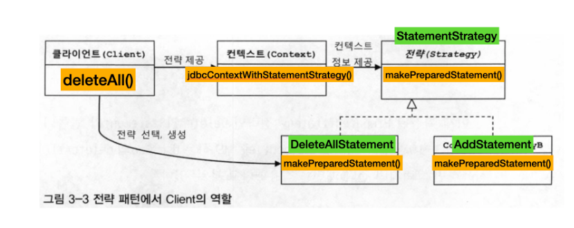

# 9일차 2024-07-30  p.209 ~  224

## 3장 템플릿
확장에는 자유롭게 열려 있꼬 변경에는 굳게 닫혀 있다는 객체지향 설계의 핵심 원칙인 
개방 폐쇄 원칙 (OCP) 를 다시 한번 생각해보자.
이 원칙은 코드에서 어떤 부분은 변경을 통해 그 기능이 다양해지고 확장하련느 성질이 있고,
어떤 부분은 고정되어 있고 변하지 않으려는 성질이 있음을 말해준다.

변화의 특성이 다른 부분을 구분해주고, 각각 다른 목적과 다른 이유에 의해 다른 시점에 독립적으로 변경될 수 있는
효율적인 구조를 만들어주는 것이 바로 이 개방 폐쇄 원칙이다.

템플릿이란 이렇게 바뀌는 성질이 다른 코드 중에서 변경이 거의 일어나지 않으며
일정한 패턴으로 유지되는 특성을 가진 부분을 자유롭게 변경되는 성질을 가진 부분으로부터 독립시켜서
효과적으로 활용할 수 있도록 하는 방법이다.

## 3.1 다시 보는 초난감 DAO 

UserDao 코드에는 아직 문제점이 남아 있다. 
DB 연결과 관련된 여러 가지 개선 작업은 했지만, 다른 면에서 심각한 문제점이 있다.
바로 예외상황에 대한 처리다.

### 3.1.1 예외처리 기능을 갖춘 DAO

DB 커넥션이라는 제한적인 리소스를 공유해 사용하는 서버에서 동작하는 JDBC 코드에는 반드시
지켜야 할 원칙이 있다. 바로 예외처리다. 정상적인 JDBC 코드의 흐름을 따르지 않고
중간에 어떤 이유로든 예외가 발생했을 경우에도 사용한 리소스를 반드시 반환하도록 만들어야 하기 때문이다. 
그렇지 않으면 시스템에 심각한 문제를 일으킬 수 있다.

###  JDBC 수정 기능의 예외처리 코드

`리스트 3-1 JDBC API 를 이용한 DAO 코드인 deleteAll()`


```java
public void deleteAll() throws SQLException {
		Connection c = dataSource.getConnection();
	
		PreparedStatement ps = c.prepareStatement("delete from users");
		ps.executeUpdate();

		ps.close();
		c.close();
	}	
```

일반적으로 서버에서는 제한된 개수의 DB 커넥션을 만들어서 재사용 가능한 풀로 관리한다.
DB 풀은 매번 getConnection() 으로 가져간 커넥션을 명시적으로 close() 해서
돌려줘야지만 다시 풀에 넣었다가 다음 커넥션 요청이 있을 때 재사용할 수 있다.
그런데 이런 식으로 오류가 날 때마다 미처 반환되지 못한 Conneciton 이 계속 쌓이면 어느 순간에 커넥션 풀에
여유가 없어지고 리소스가 모자란다는 심각한 오류를 내며 서버가 중단될 수 있다. 

따라서 위의 코드는 한 번 실행되고 애플리케이션 전체가 종료되는 간단한 예제에서는 괜찮겠지만, 장시간 운영되는 다중 사용자를 위한 서버에 적용하기에는
치명적인 위험을 내포하고 있따.

> **리소스 반환과 close()**
> <br/>
> Connection 이나 PreparedStatement 에는 close() 메소드가 있다. 


그래서 이런 JDBC 코드에서는 어떤 상황에서도 가져온 리소스를 반환하도록 try/catch/finally 구문 사용을 권장하고 있다.
예외 상황에서도 리소스를 제대로 반환할 수 있도록 try/catch/finally 를 적용해보자.


`리스트 3-2 예외 발생 시에도 리소스를 반환하도록 수정한 deleteAll()`

```java

  public void deleteAll() throws SQLException {
    Connection c = null;
    PreparedStatement ps = null;

    try {
      c = dataSource.getConnection();
      ps = c.prepareStatement("delete from users");
      ps.executeUpdate();

    } catch (SQLException e) {
      throw e;
    } finally {
      if (ps != null) {
        try {

          ps.close();
        } catch (SQLException e) {

        }
      }
      if (c != null) {
        try {

          c.close();
        } catch (SQLException e) {

        }
      }

    }
  }
```

이제 예외상황에서도 안전한 코드가 됐다. 

어느 시점에서 예외가 발생했는지에 따라서 close() 를 사용할 수 있는 변수가 달라질 수 있기 때문에
finally 에서는 반드시 c 와 ps 가 null 이 아닌지 먼저 확인한 후에 
close() 메소드를 호출해야 한다.


#### JDBC 조회 기능의 예외 처리

조회를 위한 JDBC 코드는 좀 더 복잡해진다. Connection, PreparedStatement 외에도
ResultSet 이 추가되기 때문이다. 구성은 마찬가지다. 
다만 ResultSet 의 close() 메소드가 반드시 호출되도록 만들면 된다.

`리스트 3-3 JDBC 예외처리를 적용한 getCount() 메소드 `

이렇게 예외상황에 대한 처리까지 모두 머쳤으니, 드디도 초난감 DAO 라는 모든 오명에서 벗어날 수 있게 됐다.
이제 서버환경에서도 안정적으로 수행될 수 있으면서 DB 연결 기능을 자유롭게 확장할 수 있는 이상적인 DAO가 완성됐다.


## 3.2 변하는 것과 변하지 않는 것

### 3.2.1 JDBC try/catch/finally 코드의 문제점

이제 try/catch/finally 블록도 적용돼서 완성도 높은 DAO 코드가 된 UserDao 이지만, 막상 코드를 훑어보면 한숨부터 나온다.
복잡한 try/catch/finally 블록이 2중으로 중첩까지 되어 나오는데다, 모든 메소드마다 반복된다.

누군가 DAO 로직을 수정하려고 했을 때 복잡한 try/catch/finally 블록 안에서 필요한 부분을 찾아서 수정해야 하고,
언젠가 꼭 필요한 부분을 잘못 삭제해버리면 역시 같은 문제가 반복된다. 언제 터질지도 모르는 폭탄과 같은 코드가 되는 것이다.

그렇다면 테스트를 통해 DAO 마다 예외상황에서 리소스를 반납하는지 체크하게 했으면 어땠을까? 
좋은 생각이긴 한데 막상 적용하기는 쉽지 않을 것이다. 예외상황을 처리하는 코드는 테스트 하기 매우 어렵고 모든 DAO 메소드에 대해 이런 테스트를 
일일이 한다는 건 매우 번거롭기 때문이다.

이런 코드를 효과적으로 다룰 수 있는 방법은 없을까?

이 문제의 핵심은 변하지 않는, 그러나 많은 곳에서 중복되는 코드와 로직에 따라 자꾸 확장되고 자주 변하는 코드를 잘 분리해내는 작업이다.

### 3.2.2  분리와 재사용을 위한 디자인 패턴 적용

`리스트 3-4 개선할 deleteAll() 메소드`

비슷한 기능의 메소드에서 동일하게 나타날 수 있는 변하지 않고 고정되는 부분과, 각 메소드마다 로직에 따라 변하는 부분을
위와 같이 구분해 볼 수 있다.

`리스트 3-5 add() 메소드에서 수정할 부분`


### 메소드 추출

변하지 않는 부분이 변하는 부분을 감싸고 있어서 변하지 않는 부분을 추출하기가 어려워 보이기 때문에 반대로 해봤다.

`리스트 3-6 변하는 부분을 메소드로 추출한 후의 deleteAll()`

자주 바뀌는 부분을 메소드로 독립시켰는데 당장 봐서는 별 이득이 없어 보인다.
왜냐하면 보통 메소드 추출 리팩토링을 적용하는 경우에는 분리시킨 메소드를 다른 곳에서 재사용할 수 있어야 하는데,
이건 반대로 분리시키고 남은 메소드가 재사용이 필요한 부분이고, 분리된 메소드는 DAO 로직마다 새롭게 만들어서 확장돼야 하는 부분이기 때문이다.


#### 템플릿 메소드 패턴의 적용

탬플릿 메소드 패턴은 상속을 통해 기능을 확장해서 사용되는 부분이다
변하지 않는 부분은 슈퍼클래스에 두고 변하는 부분을 추상 메소드로 정의해둬서 서브클래스에서 오버라이드 하여
새롭게 정의해 쓰도록 하는 것이다.

추출해서 별도의 메소드로 독립시킨 makeStatement() 메소드를 다음과 같이 추상 메소드 선언으로 변경한다.
물론 UserDao 클래스도 추상 클래스가 돼야 할 것이다.

```java
import java.sql.Connection;
import java.sql.PreparedStatement;
import java.sql.SQLException;

abstract protected PreparedStatement makeStatement(Connection c) throws SQLException;
```


`리스트 3-7 makeStatement() 를 구현한 UserDao 서브클래스`


하지만 템플릿 메소드 패턴으로의 접근은 제한이 많다. 가장 큰 문제는 DAO 로직마다  상속을 통해
새로운 클래스를 만들어야 한다는 점이다.

`그림 3-1 템플릿 메소드 패턴의 적용`

변하지 않는 코드를 가진 UserDao 의 JDBC try/catch/finally 블록과 변하는 
PreparedStatement 를 담고 있는 서브 클래스들이 이미 클래스 레벨에서 컴파일 시점에 이미 그 관계가 결정되어 있다.
따라서 그 관계에 대한 유연성이 떨어져 버린다. 상속을 통해 확장을 꾀하는 템플릿 메소드 패턴의 단점이 고스란히 드러난다.


### 전략 패턴의 적용

전략 패턴은 OCP 관점에 보면 확장에 해당하는 변하는 부분을 별도의 클래스로 만들어 추상화된 인터페이스를 통해 위임하는 방식이다.

`그림 3-2 전략 패턴의 구조`

deleteAll() 메소드에서 변하지 않는 부분이라고 명시한 것이 바로 이 contextMethod() 가 된다.

deleteAll() 의 컨텍스트를 정리해보면 다음과 같다.

- DB 커넥션 가져오기
- PreparedStatement 를 만들어줄 외부 기능 호출하기
- 전달받은 PreparedStatement 실행하기
- 예외가 발생하면 이를 다시 메소드 밖으로 던지기
- 모든 경우에 만들어진 PreparedStatement 와 Connection 적절히 닫아주기


`리스트 3-8 StatementStrategy 인터페이스`

```java
public interface StatementStrategy {
    
    PreparedStatement makePreparedStatement(Connection c) throws SQLException;
        
}
```


`리스트 3-9 deleteAll() 메소드의 기능을 구현한 StatementStrategy 전략 클래스`


### DI 적용을 위한 클라이언트/컨텍스트 분리

전략 패턴에 따르면 Context 가 어떤 전략을 사용하게 할 것인가는 Context 를 사용하는 앞단의 Client 가 결정하는 게 일반적이다.

`그림 3-3 전략패턴에서 Client 역할`



결국 DI 란 이러한 전략 패턴의 장점을 일반적으로 활용할 수 있도록 만든 구조라고 볼 수 있다.

`리스트 3-11 메도스로 분리한 try/catch/finally 컨텍스트 코드 `


```java
  public void jdbcContextWithStatementStrategy(StatementStrategy stmt) throws SQLException {
        Connection c = null;
        PreparedStatement ps = null;

        try {
            c = dataSource.getConnection();

            ps = stmt.makePreparedStatement(c);

            ps.executeUpdate();
        } catch (SQLException e) {
            throw e;
        } finally {
            if (ps != null) { try { ps.close(); } catch (SQLException e) {} }
            if (c != null) { try {c.close(); } catch (SQLException e) {} }
        }
    }
```


이 메소드는 컨텍스트의 핵심적인 내용을 잘 담고 있다.
클라이언트로부터 StatementStrategy 타입의 전략 오브젝트를 제공받고 JDBC try/catch/finally 구조로 만들어진
컨텍스트 내에서 작업을 수행한다.


`리스트 3-12 클라이언트 책임을 담당할 deleteAll() 메소드`

```java
  public void deleteAll() throws SQLException {
        StatementStrategy st = new DeleteAllStatement();
        jdbcContextWithStatementStrategy(st);
    }
```

이제 구조로 볼 때 완벽한 전략 패턴의 모습을 갖췄다. 비록 클라이언트와 컨텍스트는 클래스를 분리하지
않았지만, 의존관계와 책임으로 볼 때 이상적인 클라이언트/컨텍스트 관계를 갖고 있다.
특히 클라이언트가 컨텍스트가 사용할 전략을 정해서 전달하는 면에서 DI 구조라고 이해할 수도 있다.


> **마이크로 DI**
> <br/>
> 의존관계 주입은 다양한 형태로 적용할 수 있다. DI의 가장 중요한 개념은 제 3자의 도움을 통해
> 두 오브젝트 사이의 유연한 관계가 설정되도록 만든다는 것이다.
> 이 개념만 따른다면 DI를 이루는 오브젝트와 구성요소의 구조나 관계는 다양하게 만들 수 있다.
> <br/>
> 일반적으로 DI는 의존관계에 있는 두 개의 오브젝트와 이 관계를 다이내믹하게 설정해주는 오브젝트 팩토리
> (DI 컨테이너) 그리고 이를 사용하는 클라이언트라는 4개의 오브젝트 사이에서 일어난다.