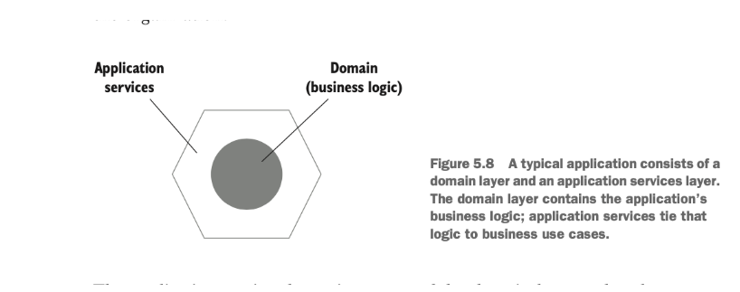
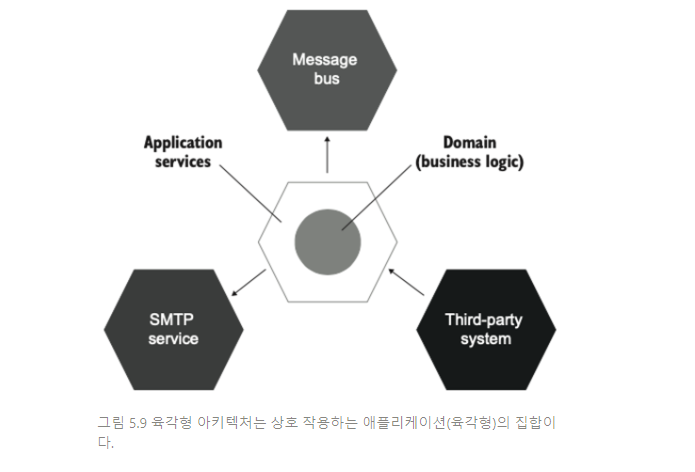
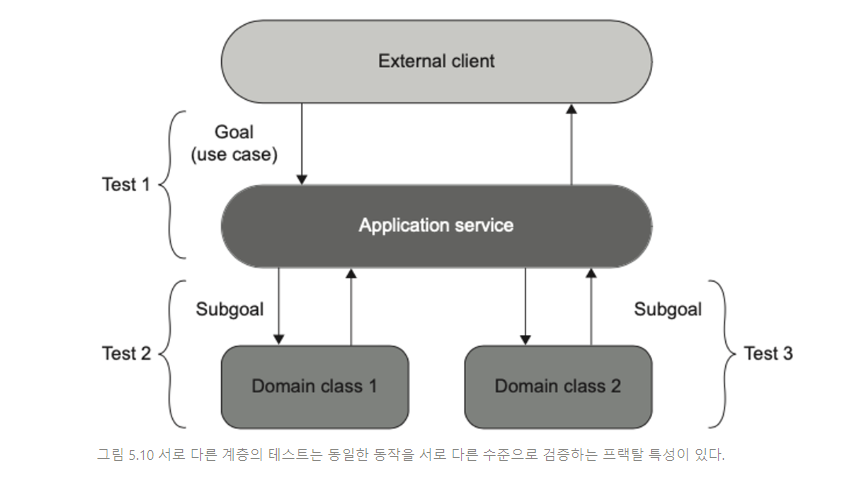
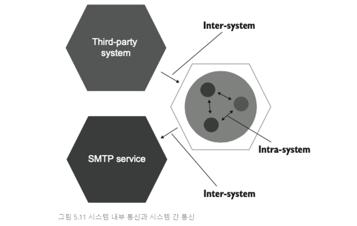
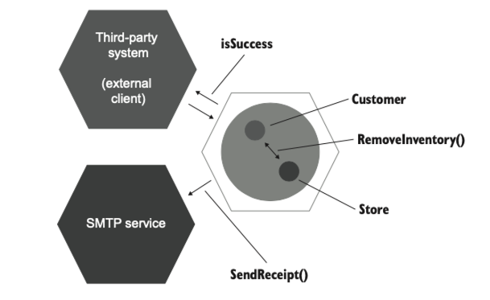

# 10일차 2024-04-19 p.165 ~ 175

## 목과 테스트 취약성 관계

### 육각형 아키텍처 정의




애플리케이션 서비스 계층은 도메인 계층 위에 있으며
외부 환경과의 통신을 조정한다.

이 계층은 도메인 클래스와 프로세스 외부 의존성 간의 작업을
조정한다. 

- 데이터베이스르 조회하고 해당 데이터로 도메인 클래스 인스턴스 구체화
- 해당 인스턴스에 연산 호출
- 결과를 데이터베이스에 다시 저장

애플리케이션 서비스 계층과 도메인 계층의 조합은 
육각형을 형성하며, 이 육각형은 애플리케이션을 나타낸다.



육각형 아키텍처라는 용어는 앨리슽 코오번이 처음 소개했다.

그 목적은 세 가지 중요한 지침을 강조하는 것이다.

#### 도메인 계층과 애플리케이션 서비스 계층 간의 관심사 분리

비즈니스 로직은 애플리케이션의 가장 중요한 부분이다.

따라서 도메인 계층은 해당 비즈니스 로직에 대해서만 책임을 져야 하며,
다른 모든 책임에서는 제외돼야 한다. 외부 애플리케이션과 
통신하거나 데이터베이스에서 데이터를 검색하는 것과 같은 책임은
애플리케이션 서비스에 귀속돼야 한다. 반대로 애플리케이션 서비스에는
어떤 비즈니스 로직도 있으면 안된다. 

요청이 들어오면 도메인 클래스의 연산으로 변환한 다음 결과를 저장하거나
호출자에게 다시 반환해서 도메인 계층으로 변환하는 책임이 있다.

도메인 계층을 애플리케이션의 도메인 지식 모음으로, 
애플리케이션 서비스 계층을 일련의 비즈니스 유스케이스로 볼 수 있다.

#### 애플리케이션 내부 통신

육각형 아키텍처는 애플리케이션 서비스 계층에서 도메인 계층으로 흐르는 
단방향 의존성 흐름을 규정한다.

도메인 계층 내부 클래스는 도메인 계층 내부 클래스끼리 서로 의존하고
애플리케이션 서비스 계층의 클래스에 의존하지 않는다.

이 지침은 이전 지침에서 나온 것이다. 애플리케이션 서비스 계층과 도메인 계층 간에 관심사를
분리하는 것은 애플리케이션 서비스 계층이 도메인 계층에 대해 아는 것을 의미하지만,

반대는 아니다. 도메인 계층은 외부 환경에서 완전히 격리돼야 한다.

#### 애플리케이션 간의 통신 

외부 애플리케이션은 애플리케이션 서비스 계층에 있는 공통 인터페이스를 통해
해당 애플리케이션에 연결된다. 아무도 도메인 계층에 직접 접근할 수 없다.

육각형의 각 면은 애플리케이션 내외부 연결을 나타낸다. 육각형에는 여섯 면이 있지만,

애플리케이션이 다른 애플리케이션을 여섯 개만 연결할 수 있는 것은 아니다.
연결 수는 임의로 정할 수 있다.

요점은 이러한 연결이 많을 수 있다는 것이다.

잘 설계된 API의 원칙에는 프랙탈 특성이 있는데,

각 계층의 API를 잘 설계하면 테스트도 프랙탈 구조를 갖기 시작한다.

즉, 달성하는 목표는 같지만 서로 다른 수준에서 동작을 검증한다. 

애플리케이션 서비스를 다루는 테스트는 해당 서비스가 외부 클라이언트에게 매우 중요하고 큰 목표를 어떻게 이루는지 확인한다.




이전 장에서 어떤 테스트든 비즈니스 요구 사항으로 거슬러 올라갈 수 있어야 한다고 했다.

각 테스트는 도메인 전문가에게 의미 있는 이야기를 전달해야 하며,
그렇지 않으면 테스트가 구현 세부 사항과  결합 돼 있으므로 불안정하다는 강한 암시다.


#### 시스템 내부 통신과 시스템 간 통신

일반적인 애플리케이션에는 시스템 내부 통신과 시스템 간 통신이 있다.

시스템 내부 통신은 애플리케이션 내 클래스 간의 통신이다. 

시스템 간 통신은 애플리케이션이 다른 애플리케이션과 통신하는 것을 말한다.




연산을 수행하기 위한 도메인 클래스 간의 협력은 식별할 수 있는 동작이 아니므로
시스템 내부 통신은 구현 세부 사항에 해당한다. 
이러한 협력은 클라이언트의 목표와 직접적인 관계가 없다.

애플리케이션 내부의 클래스 간 협력과 달리 시스템 외부 환경과 통신하는 방식은
전체적으로 해당 시스템의 식별할 수 있는 동작을 나타낸다.

이는 애플리케이션에 항상 있어야 하는 계약이다.

시스템 간 통신의 특성은 별도 애플리케이션과 함께 성장하는 방식에 비롯된다.

성장의 주요 원칙 중 하나로 하위 호환성을 지키는 것이다.

시스템 내부에서 하는 리팩토링과 다르게, 

외부 애플리케이션과 통신할 때 사용하는 통신 패턴은 항상 외부 애플리케이션이
이해할 수 있도록 유지해야 한다.

목을 상요하면 시스템과 외부 애플리케이션 간의 통신 패턴을 확인할 때 좋다.
반대로 시스템 내 클래스 간의 통신을 검증하는 데 상요하면 
테스트가 구현 세부 사항과 결합되며, 그에 따라 리팩터링 내성 지표가 미흡해진다.

#### 시스템 내부 통신과 시스템 간 통신의 예

비즈니스 유스케이스

- 고객이 상점에서 제품을 구매하려고 한다.
- 매장 내 제품 수량이 충분하면
  - 재고가 상점에서 줄어든다.
  - 고객에게 이메일로 영수증을 발송한다.
  - 확인 내역을 반환한다.

애플리케이션은 사용자 인터페이스가 없는 API 라고 가정

CustomerController 클래스는 도메인 클래스와 외부 애플리케이션
간의 작업을 조정하는 애플리케이션 서비스다.

```java
public class CustomerController {
    
    private CustomerRepository customerRepository;
    private ProductRepository productRepository;
    private Store mainStore;
    private IEmailGateway emailGateway;
    
    public CustomerController(IEmailGateway emailGateway){
        this.emailGateway = emailGateway;
        this.customerRepository = new CustomerRepository();
        this.productRepository = new ProductRepository();
        this.mainStore = new Store();
    }
    
    public boolean purchase(int customerId , int productId , int quantity) throws Exception {
        Customer customer = customerRepository.getById(customerId);
        Product product = productRepository.getById(productId);

        /*
         * 스토어가 비어있으므로 임시조치
         * customerEmail, ProductName 임시조치
         */
        mainStore.addInventory(product, 5);
        customer.setEmail("customer@email.com");
        product.setName("Shampoo");

        boolean isSuccess = customer.purchase(mainStore, product, quantity);

        if (isSuccess) {
            emailGateway.sendReceipt(customer.email, product.name, quantity);
        }

        return isSuccess;
    }
}
```





SMTP 서비스에 대한 호출을 목으로 하는 이유는 타당하다.

리팩터링 후에도 이러한 통신 유형이 그대로 유지되도록 하기 때문에

테스트 취약성을 야기하지 않는다.


`취약한 테스트로 이어지지 않는 목 사용`

```java
  @Test
    @DisplayName("취약한 테스트로 이어지지 않는 목 사용")
    public void successfulPurchase() throws Exception {
        IEmailGateway mock = mock(IEmailGateway.class);
        CustomerController sut = new CustomerController(mock);

        boolean isSuccess = sut.purchase(1, 2, 5);

        Assertions.assertTrue(isSuccess);

        verify(mock, times(1))
                .sendReceipt(
                        "customer@email.com",
                        "Shampoo",
                        5
                );
    }
```

isSuccess 플래그는 외부 클라이언트에서도 확인할 수 있으며,

검증도 필요하다. 하지만 이 플래그는 목이 필요 없고, 간단한 값 비교만으로 충분하다.

`취약한 테스트로 이어지는 목 사용`

```java
  @Test
    @DisplayName("취약한 테스트로 이어지는 목 사용")
    public void purchaseSucceedsWhenEnoughInventory() throws Exception {
        IStore storeMock = mock(IStore.class);
        when(storeMock.hasEnoughInventory(Product.Shampoo, 5)).thenReturn(true);
        Customer customer = new Customer();

        boolean success = customer.purchase(storeMock, Product.Shampoo, 5);

        Assertions.assertTrue(success);

        verify(storeMock, times(1)).removeInventory(Product.Shampoo, 5);
    }
```

CustomerController 와 SMTP 서비스 간의 통신과 달리, 
Customer 클래스에서 Store 클래스로의 메서드 호출은

애플리케이션 경계를 넘지 않는다. 

호출자와 수신자 모두 애플리케이션 내에 있다.

또한 이 메서드는 클라이언트가 목푤르 달성하는 데 도움이 되는
연산이나 상태가 아니다. 이 두 도메인 클래스의 클라이언트는
구매를 목표로 하는 CustomerController 다. 

이 목표에 직접적인 관련이 있는 멤버는 customer.Purchase() 와

store.GetInventory() 이렇게 둘 뿐이다.

