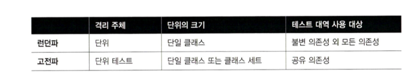
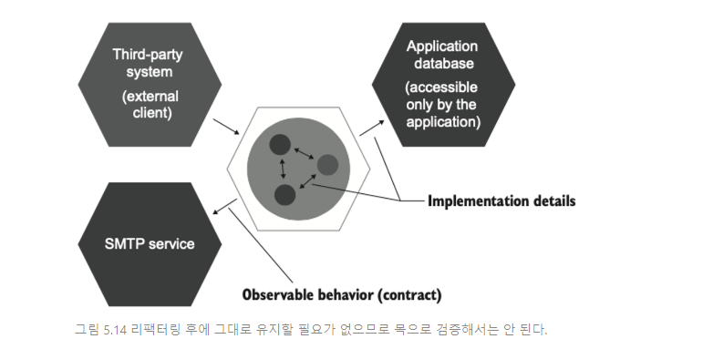

# 11일차  2024-04-20  p.176 ~ 181

## 단위 테스트의 고전파와 런던파 재고

런던파는 불변 의존성을 제외한 모든 의존성에 목 사용을 
권장하며 시스템 내 통신과 시스템 간 통신을 구분하지 않는다.

그 결과, 테스트는 애플리케이션과 외부 시스템 간의
통신을 확인하는 것처럼 클래스 간 통신도 확인한다.

런던파를 따라 목을 무분별하게 사용하면 종종 구현 세부 사항에
결합 돼 테스트에 리팩토링 내성이 없게 된다.

리팩터링 내성은 대부분 이진 선택이다. 

즉, 테스트에 리팩터링 내성이 있거나 아예 없다.
리팩터링 내성이 저하되면 테스트는 가치가 없게 된다.

고전파는 테스트 간에 공유하는 의존성만 교체하자고 하므로
이 문제에 훨씬 유리하다. 그러나 고전파 역시
시스템 간 통신에 대한 처리에 이상적이지는 않다.

런던파만큼은 아니지만, 고전파도 목 사용을 지나치게 장려한다.

### 모든 프로세스 외부 의존성을 목으로 해야 하는 것은 아니다.

프로세스 외부 의존성과 목을 설명하기 전에 의존성 유형에 대해 훑어 보자

- 공유 의존성 : 테스트 간에 공유하는 의존성
- 프로세스 외부 의존성 : 프로그램의 실행 프로세스 외에 다른 프로세스를 점유하는 의존성
- 비공개 의존성 : 공유하지 않는 모든 의존성

고전파에서는 공유 의존성을 피할 것을 권고한다. 
테스트가 실행 컨텍스트를 서로 방해하고, 결국 병렬 처리를 할 수 없기 때문이다.

테스트를 병령적, 순차적 또는 임의의 순서로 실행할 수 있는  것을
테스트 격리라고 부른다.

공유 의존성이 프로세스 외부에 있는 것이 아니면 각 테스트 실행 시
해당 의존성을 새 인스턴스로 써서 재사용을 피하기 쉽다.

공유 의존성이 프로세스 외부에 있으면, 테스트가 더 복잡해진다.

각 테스트 실행 전에 데이터베이스를 인스턴스화하거나 메세지 버스를 새로 준비할 수 가 없다.

일반적인 접근법은 이러한 의존성을 테스트 대역, 즉 목과 스텁으로 교체하는 것이다. 

그러나 모든 프로세스 외부 의존성을 목으로 해야 하는 것은 아니다.
프로세스 외부 의존성이 애플리케이션을 통해서만 접근할 수 있으면,
이러한 의존성과의 통신은 시스템에서 식별할 수 있는 동작이 아니다.

실제로 외부에서 관찰할 수 없는 프로세스 외부 의존성은 애플리케이션의
일부로 작용한다.

애플리케이션과 외부 시스템 간의 통신 패턴을 항상 지켜야 하는
요구 사항은 하위 호환성을 지켜야 한다는 점에서 비롯된다.

애플리케이션이 외부 시스템과 통신하는 방식을 지켜야 한다.

애플리케이션과 외부 시스템을 동시에 변경할 수  없기 때문이다.

완전히 통제권을 가진 프로세스 외부 의존성에 목을 사용하면
깨지기 쉬운 테스트로 이어진다. 

데이터베이스에서 테이블을 분할하거나 저장 프로시저에서
매개변수 탕비을 변경할 때마다 테스트가 빨간색이 되는 것을
아무도 원하지 않는다. 

데이터베이스와 애플리케이션은 하나의 시스템으로 취급해야 한다.

#### 목을 사용한 동작 검증

종종 목이 동작을 검증한다고 한다. 하지만 대부분의 경우
그렇지 않다. 목표를 달성하고자 각 개별 클래스가
이웃 클래스와 소통하는 방식은 식별할 수 있는 동작과는 
아무런 관계가 없다.

클래스 간의 통신을 검증하는 것은 두뇌의 뉴런이  서로 통과하는 
신호를 측정해 사람의 행동을 유추하는 것과 유사하다.

이러한 세부 수준은 너무 세밀하다.
중요한 것은 클라이언트 목표로 거슬러 올라갈 수 있는 동작이다.

클라이언트는 도움을 청할 때 두뇌의 어떤 뉴런이 켜지는지
신경 쓰지 않는다.

클라이언트에게 중요한 것은 도움뿐이다.

목은 애플리케이션의 경계를 넘나드는 상호 작용을 검증할 때와
이러한  상호 작용의 사이드 이펙트가 외부 환경에서 보일 때만
동작과 관련이 있다.

### 요약

- 테스트 대역은 테스트에서 비제품 가짜 의존성의 모든 유형을 설명하는 포괄적인 용어다
테스트 대역에는 더미,스텁,스파이,목,페이크 등의 다섯 가지 변형이 있는데, 이는 다시 목과 스텁이라는 두 가지 유형으로 분류할 수이 있다.
스파이는 기능적으로 목과 같고, 더미와 페이크는 스텁과 같은 역할을 한다.
- 목은 외부로 나가는 상호 작용(SUT 에서 의존성으로의 호출로, 해당 의존성의 상태를 변경)을 모방하고 검사하는 데 도움이 된다. 
스텁은 내부로 들어오는 상호 작용(SUT가 해당 의존성을 호출해 입력 데이터를 가져옴)을 모방하는 데 도움이 된다.
- Mock(도구) 은 목(테스트 대역) 이나 스텁을 만드는 데 사용할 수 있는 목 라이브러리의 클래스다.
- 스텁과의 상호 작용을 검증하면 취약한 테스트로 이어진다. 이러한 상호 작용은 최종 결과와 일치 하지 않는다. 이는 결과로 가는 중간 단계로, 구현 세부 사항에 해당한다.
- 명령 조회 분리 (CQS) 원칙에 따르면, 모든 메서드가 명령 또는 조회 중 하나여야 하지만 둘 다는 안 된다.
명령을 대체하는 테스트 대역은 목이다. 조회를 대체하는 테스트 대역은 스텁이다.
- 모든 제품 코드는 공개 API 인지 비공개 API 인지와 식별할 수  있는 동작인지 구현 세부 사항 인지라는 두 가지 차원으로 분류할 수 있다.
코드의 공개성은 private, public , internal 키워드 중 접근 제한자에 의해 제어 된다.
다음 요구 사항을 하나라도 충족하면 식별할 수 있는 동작이다.
  - 클라이언트가 목표를 달성하는 데 도움이 되는 연산을 노출하라. 연산은 계산을 수행하거나 사이드 이펙트를 초래하거나 또는 둘 다 하는 메서드다.
  - 클라이언트가 목표를 달성하는 데 도움이 되는 상태를 노출하라. 상태는 시스템의 현재 상태다.
- 잘 설계된 코드는 식별할 수 있는 동작이 공개 API 와 일치하고 구현 세부 사항이 비공개 API 뒤에 숨겨져 있는 코드다. 
공개 API가 식별할 수 있는 동작 이상 으로 커지면 코드는 구현 세부 사항을 유출 한다.
- 캡술화는 코드를 불변성 위반으로부터 보호하는 행위다. 클라이언트는 구현 세부 사항을 사용해 코드의 불변성을 우회할 수 있기 때문에 구현 세부 사항을 노출하면
캡슐화가 위반되는 경우가 종종 있다.
- 육각형 아키텍처는 상호 작용하는 애플리케이션의  집합이고 각 애플리케이션은 육각형으로 표시한다. 
각 육각형은 도메인과 애플리케이션 서비스라는 두 계층으로 구성된다.
- 육각형 아키텍터는 다음과 같은 세 가지 관점을 강조한다.
  - 도메인과 애플리케이션 서비스 계층 간의 영향 분리, 도메인 계층은 비즈니스 로직을 책임져야 하고, 애플리케이션 서비스는 도메인 계층과 외부 애플리케이션 간의 작업을 조정해야 한다.
  - 애플리케이션 서비스 계층은 도메인 계층으로의 단방향 의존성 흐름, 도메인 계층 내 클래스는 서로에게만 의존해야 하고, 애플리케이션 서비스 계층의 클래스에 의존해서는 안된다.
  - 외부 애플리케이션은 애플리케이션 서비스 계층이 유지하는 공통 인터페이스를 통해 연결 된다. 아무도 도메인 계층에 직접 액세스 할 수 없다.
- 육각형의 각 계층은 식별할 수 있는 동작을 나타내며 각각의 구현 세부 사항이 있다.
- 애플리케이션에는 시스템 내부 통신과 시스템 간 통신이라는 두 가지 통신 유형이 있다. 시스템 내부 통신은 애플리케이션  내 클래스 간의 통신이다.
시스템 간 통신은 애플리케이션이 외부 애플리케이션과 통신할 때를 말한다.
- 시스템 내 통신은 구현 세부 사항이다. 애플리케이션을 통해서만 접근할 수 있는 외부 시스템을 제외하고 시스템 간 통신은 식별할 수 있는 동작이다. 애플리케이션을 통해섬나 접근할 수 있는 외부 시스템과의 상호 작용도 구현 세부 사항인데,
그 결과의 사이드 이펙트를 외부에서 확인할 수 없기 때문이다.
- 시스템 내 통신을 검증하고자 목을 사용하면 취약한 테스트로 이어진다. 따라서 시스템 간 통신과 해당 통신의 사이드 이펙트가 외부 환경에서 보일 때만 목을 사용하는 것이 타당하다.
