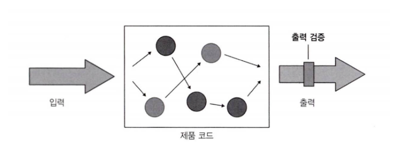
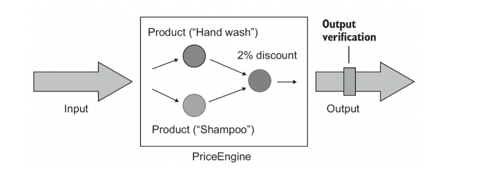
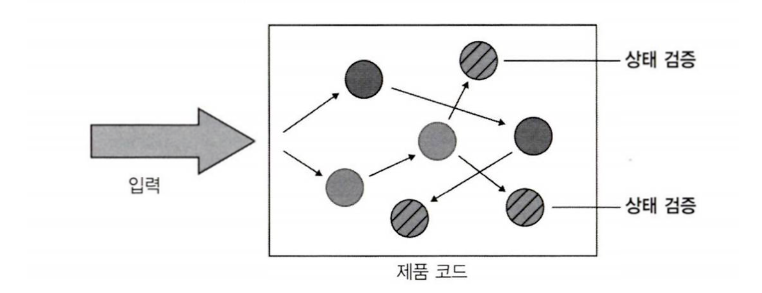
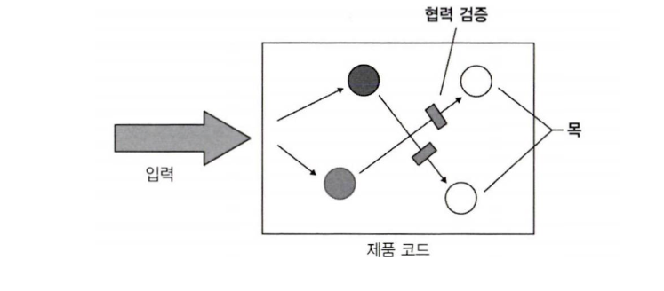

# 12일차 2024-04-21 p.183 ~ 194

## 6장 단위 테스트 스타일

단위 테스트 스타일에 대한 동일한 기준틀

출력 기반, 상태 기반 , 통신 기반이라는 세 가지 테스트 스타일이 있다.

출력 기반 스타일의 테스트가 가장 품질이 좋고, 
상태 기반 테스트는 두 번째로 좋은 선택이며,
통신 기반 테스트는 간헐적으로만 사용해야 한다.

안타깝게도 출력 기반 테스트 스타일은 아무데서나 사용할 수 없으며,
순수 함수 방식으로 작성된 코드에만 적용된다.

그러나 출력 기반 스타일로 변환하는 데 도움이 되는 기법이 있다.

이를 위해 함수형 프로그래밍 원칙을 사용해 기반 코드가 함수형 아키텍처를
지향하게끔 재구성해야 한다.

### 단위 테스트의 세 가지 스타일

- 출력 기반 테스트
- 상태 기반 테스트
- 통신 기반 테스트

하나의 테스트에서 하나 또는 둘, 심지어 세 가지 스타일 모두를 함께
사용할 수 있다.

#### 출력 기반 테스트 정의

첫 번째 단위 테스트 스타일은 출력 기반 스타일로, 테스트 대상 시스템 (SUT)에 입력을 넣고 
생성되는 출력을 점검하는 방식이다.

이러한 단위 테스트 스타일은 전역 상태나 내부 상태를 변경하지 않는
코드에만 적용되므로 반환 값만 검증하면 된다.




`출력 기반 테스트`

```java
public class PriceEngine {
    public double calculateDiscount(Product[] products){
        double discount = products.length * 0.01;
        return Math.min(discount, 0.2);
    }
}

```


```java
public class CustomerControllerTests {

    @Test
    @DisplayName("예제 6.1 출력 기반 테스트")
    void discountOfTwoProducts() {
        // given
        Product product1 = new Product("Hand wash");
        Product product2 = new Product("Shampoo");

        Product[] products = {product1, product2};

        PriceEngine sut = new PriceEngine();

        // when 
        double discount = sut.calculateDiscount(products);

        // then
        Assertions.assertEquals(0.02, discount);
    }
}

```

PriceEngine 은 상품 수에 1% 를 곱하고 그 결과를 20%로 제한한다.

이 클래스에는 다른 것이 없으며, 내부 컬렉션에 상품을 추가하거나 데이터베이스에 저장하지 않는다.

CalculateDiscount() 메서드의 결과는 반환된 할인, 즉 출력 값 뿐이다.



출력 기반 단위 테스트 스타일은 함수형 이라고도 한다.

이 이름은 사이드 이펙트 없는 코드 신호를 강조하는 
프로그래밍 방식인 함수형 프로그램이에 뿌리를 두고 있다.


### 상태 기반 스타일 정의

상태 기반 스타일은 작업이 완료된 후 시스템 상태를 확인하는 것이다.
이 테스트 스타일에서 상태라는 용어는 SUT 나 협력자 중 하나 , 또는 데이터베이스나 파일 시스템 등과 같은
프로세스 외부 의존성의 상태 등을 의미할 수 있다.




`상태 기반 테스트`

```java
public class Order {
    
    private List<Product> _products = new ArrayList<>();
    public final List<Product> products = _products;
    
    public void addProduct(Product product) {
        _products.add(product);
    }
}

```

```java
public class CustomerControllerTests {

    @Test
    @DisplayName("예제 6.2 상태 기반 테스트")
    void addingAProductToAnOrder() {
        // given
        Product product = new Product("Hand Wash");
        Order sut = new Order();

        // when 
        sut.addProduct(product);

        // then
        assertEquals(1, sut.products.size());
        assertEquals(product, sut.products.get(0));

    }
}

```

테스트는 상품을 추가한 후 Products 컬렉션을 검증한다. 

AddProduct() 의 결과는 주문 상태의 변경이다.

### 통신 기반 스타일 정의

통신 기반 스타일은 목을 사용해 테스트 대상 시스템과 협력자 간의 통신을 검증한다.



```java
public class CustomerControllerTests {

    @Test
    @DisplayName("예제 6.3 통신 기반 테스트")
    public void sendingGreetingsEmail() {
        IEmailGateway emailGatewayMock = mock(IEmailGateway.class);
        Controller sut = new Controller(emailGatewayMock);

        sut.greetUser("user@email.com");

        verify(emailGatewayMock, times(1)).sendGreetingsEmail("user@email.com");
    }

}

```


## 단위 테스트 스타일 비교

- 회귀 방지
- 리팩터링 내성
- 빠른 피드백
- 유지 보수성

### 회귀 방지와 피드백 속도 지표로 스타일 비교하기

회귀 방지 지표는 특정 스타일에 따라 달라지지 않는다.
회귀 방지 지표는 다음 세 가지 특성으로 결정된다.

- 테스트 중에 실행되는 코드의 양
- 코드 복잡도
- 도메인 유의성

보통 실행하는 코드가 많든 적든 원하는 대로 테스트를 작성할 수 있다.
어떤 스타일도 이 부분에서 도움이 되지 않는다.

코드 복잡도와 도메인 유의성 역시 마찬가지다.

통신 기반 스타일에는 예외가 하나 있다.

남용하면 작은 코드 조각을 검증하고 다른 것은 모두 목을 사용하는 등 
피상적인 테스트가 될 수 있다.

하지만 이는 통신 기반 테스트의 결정적인 특징이 아니라 기술을 남용하는 극단적인 사례다.

테스트 스타일과 테스트 피드백 속도 사이에는 상관관계가 거의 없다.
테스트가 프로세스 외부 의존성과 떨어져 단위 테스트 영역에 있는 한,
모든 스타일은 테스트 실행 속도가 거의 동일하다.

목은 런타임에 지연 시간이 생기는 편이므로 통신 기반 테스트가 약간 나쁠수 있다
그러나 이러한 테스트가 수만 개 수준이 아니라면 별로 차이는 없다.

### 리팩터링 내성 지표로 스타일 비교하기

리팩터링 내성 지표와 관련해서는 상황이 다르다. 
리팩터링 내성은 리팩터링 중에 발생하는 거짓 양성 수에 대한 척도다.

결국 거짓 양성은 식별할 수 있는 동작이 아니라 코드의 구현 세부 사항에 결합된 테스트의 결과다.

출력 기반 테스트는 테스트가 테스트 대성 메서드에만 결합되므로 거짓 양성 방지가 가장 우수하다.
이러한 테스트가 구현 세부 사항에 결합하는 경우는 테스트 대상 메서드가 구현 세부 사항일 때 뿐이다.

상태 기반 테스트는 일반적으로 거짓 양성이 되기 쉽다. 
이러한 테스트는 테스트 대상 메서드 외에도 클래스 상태와 함께 작동한다.
확률적으로 말하면 , 테스트와 제품 코드 간의 결합도가 클수록 유출되는 구현 세부 사항에 테스트가 얽매일 가능성이 커진다.
상태 기반 테스트는 큰 API 노출 영역에 의존하므로, 구현 세부 사항과 결합할 가능성도 더 높다.

통신 기반 테스트가 허위 경보에 가장 취약하다. 테스트 대역으로 상호 작용을 확인하는 테스트는 
대부분 깨지기 쉽다. 이는 항상 스텁과 상호 작용하는 경우다. 이러한 상호 작용을 확인해서는 안 된다.
애플리케이션 경계를 넘는 상호 작용을 확인하고 해당 상호 작용의 사이드 이펙트가
외부 환경에 보이는 경우에만 목이 괜찮다. 

보다시피, 리팩터링 내성을 잘 지키려면 통신 기반 테스트를 사용할 때 더 시준해야 한다 .

그러나 피상적인 테스트가 통신 기반 테스트의 결정적인 특징이 아닌 것 처럼,
불안정성도 통신 기반 테스트의 결정적인 특징이 아니다.

캡슐화를 잘 지키고 테스트를 식별할 수 있는 동작에만 결합하면 거짓 양성을 최소로 줄일 수 있다.

물론 단위 테스트 스타일에 따라 필요한 노력도 다르다.


### 유지 보수성 지표로 스타일 비교하기

유지 보수성 지표는 단위 테스트 스타일과 밀접한 관련이 있다.
그러나 리팩터링 내성과 달리 완화할 수 있는 방법이 많지 않다.

유지 보수성은 단위 테스트의 유지비를 측정하며, 다음 두 가지 특성으로 정의한다.

- 테스트를 이해하기 얼마나 어려운가?
- 테스트를 실행하기 얼마나 어려운가?

테스트가 크면, 필요할 때 파악하기도 변경하기도 어려우므로 유지 보수가 쉽지 않다.
마찬가지로 하나 이상의 프로세스 외부 의존성 과 직접 작동하는 테스트는 데이터베이스 서버 재부팅, 네트워크 연결 문제 해결 등과 같이
운영하는 데 시간이 필요하므로 유지 보수가 어렵다.

#### 출력 기반  테스트의 유지 보수성

출력 기반 테스트가 가장 유지 보수하기 용이하다.
출력 기반 테스트는 거의 항상 짧고 간결하므로 유지 보수가 쉽다.
이러한 이점은 메서드로 입력을 공급하는 것과 출력을 검증하는 두 가지로 요약할 수 있다는 사실에서 
비롯된다.

단 몇 줄로 이 두 가지를 수행할 수 있다.

출력 기반 테스트의 기반 코드는 전역 상태나 내부 상태를 변경할 리 없으므로, 프로세스 외부 의존성을 다루지 않는다.
따라서 두 가지 유지 보수성 모두의 측면에서 출력 기반 테스트가 가장 좋다.

#### 상태 기반 테스트의 유지 보수성

상태 기반 테스트는 일반적으로 출력 기반 테스트보다 유지 보수가 쉽지 않다.
상태 검증은 종종 출력 검증보다 더 많은 공간을 차지하기 때문이다.

`많은 공간을 차지하는 상태 검증`

```java
public class CustomerControllerTests {

    @Test
    @DisplayName("예제 6.4 많은 공간을 차지하는 상태 검증")
    void addingACommentToAnArticle1() {
        // given
        Article sut = new Article();
        String text = "Comment text";
        String author = "John Doe";
        LocalDateTime now = LocalDateTime.of(2022, 11, 8, 0, 0);

        // when 
        sut.addComment(text, author, now);

        // then
        assertEquals(1, sut.getCommentsCount());
        assertEquals(text, sut._comments.get(0).text);
        assertEquals(author, sut._comments.get(0).author);
        assertEquals(now, sut._comments.get(0).dateCreated);

    }
    

}

```

이 테스트는 단순하고 댓글이 하나 있지만, 
검증부는 네 줄에 걸쳐 있다.

상태 기반 테스트는 종종 훨씬 많은 데이터를 확인해야 하므로

크기가 대폭 커질 수 있다.

대부분 코드를 숨기고 테스트를 단축하는 헬퍼 메서드로
문제를 완화할 수 있지만
이러한 메서드를 작성하고 유지하는 데 상당한 노력이 필요하다.

여러 테스트에서 이 메서드를 재사용할 때만 이러한 노력에 명분이 생기지만,
그런 경우는 드물다.

`검증문에 헬퍼 메서드 사용`

```java
public class CustomerControllerTests {
    

    @Test
    @DisplayName("예제 6.5 검증문에 헬퍼 메서드 사용")
    void addingACommentToAnArticle2() {
        // given
        Article sut = new Article();
        String text = "Comment text";
        String author = "John Doe";
        LocalDateTime now = LocalDateTime.of(2024, 4, 22, 0, 0);
        ArticleExtensions helper = new ArticleExtensions();

        // when 
        sut.addComment(text, author, now);

        // then
        helper.shouldContainsNumberOfComments(sut, 1)
                .withComment(sut, text, author, now);
    }

}

```

상태 깁나 테스트를 단축하는 또 다른 방법으로, 
검증 대산 클래스의 동등 멤버를 정의할 수 있다.

다음 예제에서 보듯이 값 객체로 변환할 수 있다.
또한 Fluent Assertions 와 같은 검증문 라이브러리를 써서
테스트를 단순하게 할 수 있다.

```java
    @Test
    @DisplayName("예제 6.6 값으로 비교하는 Comment")
    void addingACommentToAnArticle3() {
        // given
        Article sut = new Article();
        Comment comment = new Comment(
                "Commennt text",
                "John Doe" ,
                LocalDateTime.of(2024,4,24,0,0));
        
        // when 
        sut.addComment(comment.text, comment.author , comment.dateCreated);
        
        // then
        assertEquals(comment , sut._comments.get(0));
    }
```

이 테스트에서 댓글을 개별 속성으로 지정하지 않고도 전체 값으로 비교할 수 있다.

#### 통신 기반 테스트의 유지 보수성

통신 기반 테스트는 유지 보수성 지표에서 출력 기반 테스트와 상태 기반 테스트보다 점수가 낮다.
통신 기반 테스트에는 테스트 대역과 상호 작용 검증을 설정해야 하며, 
이는 공간을 많이 차지한다. 

목이 사슬 형태로 있을 때 테스트는 더 커지고 유지 보수하기가 어려워진다.

#### 스타일 비교하기 : 결론

세 가지 스타일 모두가 회귀 방지와 피드백 속도 지표에서는 점수가 같다.


출력 기반 테스트가 가장 결과가 좋다. 
이 스타일은 구현 세부 사항과 거의 결합되지 않으므로 
리팩터링 내성을 적절히 유지하고자 주의를 많이 기울일 필요가 없다.

상태 기반 테스트와 통신 기반 테스트는 두 지표 모두 좋지 않다.
유출된 구현 세부 사항에 결합할 가능성이 높고, 크기도 커서 유지비가 많이 든다.

그러므로 항상 다른 것보다 출력 기반 테스트를 선호하라. 
하지만 말하기는 쉬워도 행하기는 어렵다.

출력 기반 스타일은 함수형으로 작성된 코드에만 적용할 수 있고,
대부분의 객체지향 프로그래밍 언어에는 해당하지 않는다.