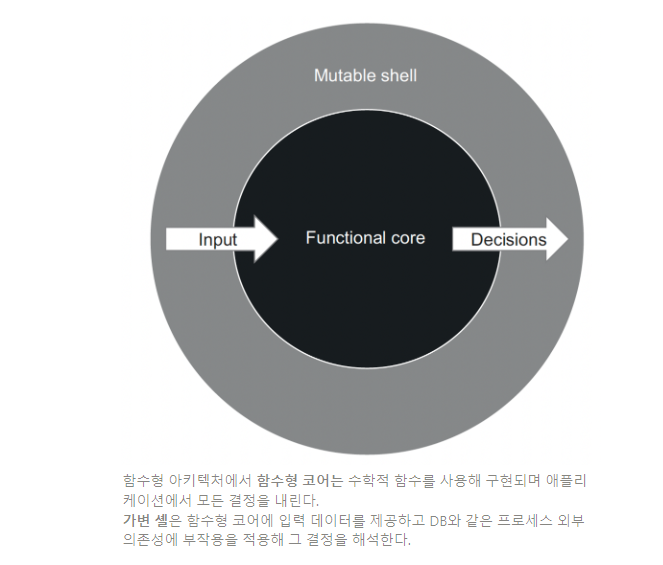
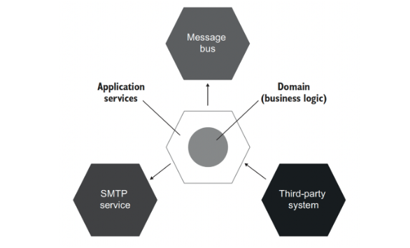

# 13일차 2024-04-23 p.195 ~ 203

## 함수형 아키텍처 이해

### 함수형 프로그래밍이란?

출력 기반 단위 테스트 스타일은 함수형이라고도 한다. 
기반 제품 코드를 함수형 프로그래밍을 이용해 순수 함수 방식으로 작성해야 하기 때문이다.

그렇다면 함수형 프로그래밍이란?

함수형 프로그래밍은 수학적 함수(순수 함수) 를 사용한 프로그래밍이다.

수학적 함수는 숨은 입출력이 없는 함수다. 수학적 함수의 모든 입출력은 메서드 이름, 인수, 반환 타입으로 구성된
메서드 시그니처에 명시 해야 한다.

수학적 함수는 호출 횟수에 상관없이 주어진 입력에 대해 동일한 출력을 생성한다.

```java
    public double calculateDiscount(Product[] products){
        double discount = products.length * 0.01;
        return Math.min(discount, 0.2);
    }
```

이 메서드는 하나의 입력과 하나의 출력이 있으며, 둘 다 메서드 시그니처에 명시돼 있다.

숨은 입출력이 없는 메서드는 수학에서 말하는 함수의 정의를 준수하기 때문에 수학적 함수라고 한다.

입출력을 명시한 수학적 함수는 이에 따르는 테스트가 짧고 간결하며 이해하고 유지 보수하기 쉬우므로 테스트하기가 매우 쉽다.

출력 기반 테스트를 적용할 수 있는 메서드 유형은 수학적 함수 뿐이다. 

이는 유지 보수성이 뛰어나고 거짓 양성 빈도가 낮다.

반면에 숨은 입출력은 코드를 테스트 하기 힘들게 한다. 

숨은 입출력의 유형

- 사이드 이펙트 : 사이드 이펙트는 메서드 시그니처에 표시 되지 않은 출력이며, 따라서 숨어있다. 연산은 클래스 인스턴스의 상태를 변경하고 디스크의 파일을 업데이트 하는 등 사이드 이펙트를 발생시킨다.
- 예외 : 메서드가 예외를 던지면, 프로그램 흐름에 메서드 시그니처에 설정된 계약을 우회하는 경로를 만든다. 호출된 예외는 호출 스택의 어느 곳에서도 발생할 수 있으므로, 메서드 시그니처가 전달하지 않는 출력을 추가한다.
- 내외부 상태에 대한 참조 : DateTime.Now() 와 같이 정적 속성을 사용해 현재 날짜와  시간을 가져오는 메서드가 있을 수 있다. 데이터베이스에서 데이터를 질의할 수 있고, 비공개 변경 가능 필드를 참조를 할 수도 있다. 이 모두 메서드 시그니처에 없는 실행 흐름에 대한 입력이며, 따라서 숨어있다.

메서드가 수학적 함수인지 판별하는 가장 좋은 방법은 프로그램의 동작을 변경하지 않고 해당 메서드에 대한 호출을 반환 값으로 대체할 수 있는지
확인하는 것이다.

메서드 호출을 해당 값으로 바꾸는 것을 참조 투명성 (referential transparency) 라고 한다.

예를 들어 다음 메서드를 보자

```java
public int Increment(int x) {
    return x+1;    
}
```

이 메서드는 수학적 함수이다. 다음 두 구문은 서로 동일하다.

```java
int y = Increment(4);
int y = 5;
```

반면에 다음 메서드는 수학적 함수가 아니다. 반환 값이 메서드의 출력을 모두 나타내지 않으므로 반환 값으로 대체할 수 없다.

이 예제에서 숨은 출력은 필드 x의 변경 (사이드 이펙트) 이다.

```java
int x = 0;
public int Increment()
        {
            x++;
            return x;
        }
```

사이드 이펙트는 숨은 출력의 가장 일반적인 유형이다. 다음 예제는 겉으로 수학적 함수처럼 보이지만,
실제로 그렇지 않은 AddComment 메서드를 보여준다.

```java
public Comment AddComment(String text)
        {
            Comment comment = new Comment(text);
            _comments.add(comment);
            return comment;
        }
```

### 함수형 아키텍처란?

함수형 프로그래밍의 목표는 사이드 이펙트를 완전히 제거하는 것이 아니라 비즈니스 로직을 처리하는 코드와
사이드 이펙트를 일으키는 코드를 분리하는 것이다.

이 두가지 책임은 각각만 보더라도 충분히 복잡하다. 모두 고려하면 복잡도가 배가되고 장기적으로 코드의 유지 보수성을 방해한다.

함수형 아키텍처는 바로 이곳에 적용된다.
사이드 이펙트를 비즈니스 연산 끝으로 몰아서 비즈니스 로직을 사이드 이펙트와 분리한다.

다음 두 가지 코드 유형을 구분해서 비즈니스 로직과 사이드 이펙트를 분리할 수 있다.

- 결정을 내리는 코드 : 이 코드는 사이드 이펙트가 필요 없기 때문에 수학적 함수를 사용해 작성할 수 있다.
- 해당 결정에 따라 작용하는 코드 : 이 코드는 수학적 함수에 의해 이뤄진 모든 결정을 데이터베이스의 변경이나 메시지 버스로 전송된 메시지와 같이 가시적인
부분으로 변환한다.

결정을 내리는 코드는 종종 함수형 코어라고도 한다. 해당 결정에 따라 작용하는 코드는 가변 셸이다.





### 함수형 아키텍처와 육각형 아키텍처 비교

함수형 아키텍처와 육각형 아키텍처는 비슷한 점이 많다.
둘 다 관심사 분리란느 아이디어를 기반으로 한다. 

육각형 아키텍처는 도메인 계층과 애플리케이션 서비스 계층을 구별한다. 

도메인 계층은 비즈니스 로직에 책임이 있는 반면, 애플리케이션 서비스 계층은 
데이터베이스나 SMTP 서비스와 같이 외부 애플리케이션과 통신에 책임이 있다.

이는 결정과 실행을 분리하는 함수형 아키텍처와 매우 유사하다.



또 다른 유사점은 의존성 간의 단방향 흐름이다. 

육각형 아키텍처에서 도메인 계층 내 클래스는 서로에게만 의존해야 한다. 