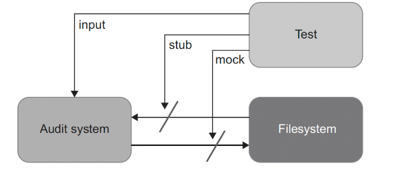
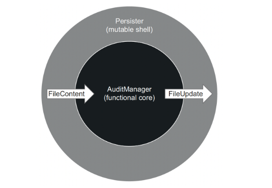
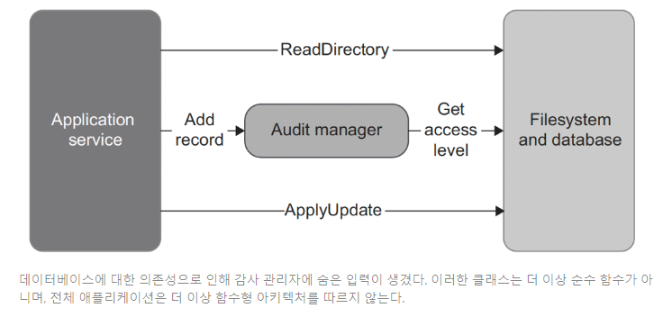

# 14일차 2024-04-24 p.204 ~ 225

## 함수형 아키텍처와 출력 기반 테스트로의 전환

샘플 애플리케이션을 함수형 아키텍처로 리팩토링 한다.

- 프로세스 외부 의존성에서 목으로 변경
- 목에서 함수형 아키텍처로 변경

이러한 전환은 테스트 코드에도 영향을 미친다. 

상태 기반 테스트와 통신 기반 테스트를 출력 기반 테스트 스타일로 리팩토링 할 것이다.

### 감사 시스템 소개

샘플 프로젝트는 조직의 모든 방문자를 추적하는 감사 시스템이다.

`감사 시스템의 초기 구현`

AuditManager 클래스는 파일 시스템과 밀접하게 연결돼 있어 그대로 테스트하기가 어렵다.
테스트 전에 파일을 올바른 위치에 배치하고, 테스트가 끝나면 해당 파일을 읽고 내용을 확인한 후 삭제해야 한다.

파일 시스템은 테스트를 느리게 한다. 

로컬 시스템과 빌드 서버 모두 작업 디렉터리가 있고 테스트할 수 있어야 하므로 유지 보수성도 저하된다.

파일 시스템에 직접 작동하는 테스트는 단위 테스트의 정의에 맞지 않는다.
단위 테스트의 두 번째와 세 번째 특성을 준수하지 않으므로, 통합 테스트 범주에 속한다.

- 단위 테스트는 단일 동작 단위를 검증하고
- 빠르게 수행하고
- 다른 테스트와 별도로 처리한다. 

### 테스트를 파일 시스템에서 분리하기 위한 목 사용

테스트가 밀접하게 결합된 문제는 일반적으로 파일 시스템을 목으로 처리해 해결한다.
파일의 모든 연산을 별도의 클래스로 도출하고 AuditManager 에 생성자로 해당 클래스를 주입할 수 있다.
그런 다음 테스트는 이 클래스를 목으로 처리하고 감사 시스템이 파일에 수행하는 쓰기를 캡처한다.

AuditManager 가 파일 시스템에서 분리되므로, 공유 의존성이 사라지고 테스트를 서로 독립적으로 실행 할 수 있다.

이 테스트는 현재 파일의 항목 수가 한계에 도달했을 때, 감사 항목이 하나 있는  새 파일을 생성하는 지 검증한다. 

이는 목을 타당하게 사용하는 것이다. 애플리케이션은 최종 사용자가 볼 수 있는 파일을 생성한다. 

더 개선할 수 있다.

위의 테스트는 복잡한  설정을 포함하며, 이는 유지비 측면에서 이상적이지 않다.
목 라이브러리가 최선을 다해 도움을 주지만, 작성된 테스트는 여전히 평이한 입출력에 의존하는 테스트만큼 읽기가 쉽지 않다. 

### 함수형 아키텍처로 리팩터링하기

인터페이스 뒤로 사이드 이펙트를 숨기고 해당 인터페이스를 AuditManager 에 주입하는 대신,
사이드 이펙트를 클래스 외부로 완전히 이동할 수 있다.

그러면 AuditManager 는 파일에 수행할 작업을 둘러싼 결정만 책임지게 된다.

새로운 클래스인 Persister 는 그 결정에 따라 파일 시스템에 업데이트를 적용한다.

클래스가 간결해졌다.

작업 디렉터리에서 내용을 읽고 AuditManager 에서 받은 업데이트 명령을 작업 디렉터리에 다시 수행하기만 하면 된다.

여기에는 분기가 없다. 따라서 모든 복잡도는 AuditManager 클래스에 있다. 

이것이 비즈시느 로직과 사이드 이펙트의 분리다. 

이렇게 분리를 유지하려면, FileContent 와 FileUpdate 의 인터페이스를 프레임워크에 내장된 파일 상호 작용 명령과 최대한 가깝게 둬야 한다.
파싱과 준비 모두 함수형 코어애서 수행하므로, 함수형 코어 외부의 코드는 간결하게 유지된다. 

`ApplicationService` 는 함수형 코어와 가변 셸을 붙이면서 애플리케이션 서비스가 외부 클라이언트를 위한 시스템의 진입점을 제공한다.

이러한 구현으로 감사 시스템의 동작을 쉽게 확인할 수 있다. 

## 함수형 아키텍처의 단점 이해하기

### 함수형 아키텍처 적용 가능성

감사 시스템은 결정을 내리기 전에 입력을 모두 미리 수집할 수 있으므로 함수형 아키텍처가 잘 작동했다.

그러나 종종 실행 흐름이 간단하지 않다. 의사 결정 절차의 중간 결과에 따라
프로세스 외부 의존성에서 추가 데이터를 질의할 수도 있다.

지난 24시간 동안 방문 횟수가 임계치를 초과하면 감사 시스템이 방문자의 접근 레벨을 확인해야 한다고 해보자
그리고 방문자의 접근 레벨이 모두 데이터베이스에 저장돼 있다고 가정하자.
다음과 같이 IDatabase 인스턴스를 AuditManager에 전달할 수 있다.

AddRecord() 메서드에 숨은 입력이 생겼다. 따라서 이 메서드는 수학적 함수가 될 수 없으며, 더 이상 출력 기반 테스트를 
적용할 수 없다.

### 성능 단점

시스템 전체에 영향을 미치는 성능은 함수형 아키텍처의 흔한 논쟁이다.

출력 기반 테스트는 목을 사용한 테스트만큼 빠르게 작동한다.

이제 시스템은 프로세스 외부 의존성을 더 많이 호출하고, 그 결과로 성능이 떨어졌다.

함수형 아키텍처와 전통적인 아키텍처 사이의 선택은 성능과 코드 유지 보수성 간의 절충이다.

성능 영향이 그다지 눈에 띄지 않는 일부 시스템에서는 함수형 아키텍처를 사용해 유지 보수성을 향상 시키는 것이 낫다.

### 코드베이스 크기 증가

함수형 방식에서 순수성에 많은 비용이 든다면 순수성을 따르지 말라.
대부분의 프로젝트에서는 모든 도메인 모델을 불변으로 할 수 없기 때문에
출력 기반 테스트에만 의존할 수 없다.

대부분의 경우 출력 기반 스타일과 상태 기반 스타일을 조합하게 되며. 통신 기반 스타일을 약간 섞어도 괜찮다.

### 요약

- 출력 기반 테스트는 SUT 에 입력을 주고 출력을 확인하는 테스트 스타일이다. 이 테스트 스타일은 숨은 입출력이 없다고 가정하고,
SUT 작업의 결과는 반환하는 것 뿐이다.
- 상태 기반 테스트는 작업이 완료된 후의 시스템 상태를 확인 한다.
- 통신 기반 테스트는 목을 사용해서 테스트 대상 시스템과 협력자 간의 통신을 검증 한다.
- 단위 테스트의 고전파는 통신 기반 스타일보다 상태 기반 스타일을 선호한다. 런던파는 반대를 선호한다. 두 분파 모두 출력 기반 테스트를 사용 한다.
- 출력 기반 테스트가 테스트 품질이 가장 좋다. 이러한 테스트는 구현 세부 사항에 거의 결합되지 않으므로 리팩토링 내성이 있다. 또한 작고 간결하므로 유지 보수하기도 쉽다.
- 상태 기반 테스트는 안정성을 위해 더 신중해야 한다. 단위 테스트를 하려면 비공개 상태를 노출하지 않도록 해야 한다. 상태 기반 테스트는
출력 기반 테스트보다 크기가 큰 편이므로 유지 보수가 쉽지 않다. 헬퍼 메서드와 값 객체를 사용해 유지 보수성 문제를 완화할 수도 있지만 제거할 수는 없다.
- 통신 기반 테스트도 안정성을 위해 더 신중해야 한다. 애플리케이션 경계를 넘어서 외부 환경에 사이드 이펙트가 보이는 통신만 확인해야 한다.
- 함수형 프로그래밍은 수학적 함수로 된 프로그래밍이다.
- 수학적 함수는 숨은 입출력이 없는 함수다. 사이드 이펙트와 예외가 숨은 출력에 해당한다.
내부 상태 또는 외부 상태에 대한 참조는 숨은 입력이다. 수학적 함수는 명시적이므로 테스트 용이성을 상당히 높인다.
- 함수형 프로그래밍의 목표는 비즈니스 로직과 사이드 이펙트를 분리하는 것이다.
- 함수형 아키텍처는 사이드 이펙트를 비즈니스 연산의 가장자리로 밀어내 분리를 이루는 데 도움이 된다. 이 방법으로, 사이드 이펙트를
다루는 코드를 최소화하면서 순수 함수 방식으로 작성된 코드의 양을 최대화할 수 있다.
- 함수형 아키텍처와 육각형 아키텍처의 차이는 사이드 이펙트의 처리에 있다. 
함수형 아키텍처는 모든 사이드 이팩트를 도메인 계층 밖으로 밀어낸다. 이와 반대로, 육각형 아키텍처는 
도메인 계층에만 한정돼 있는 한은 도메인 계층에 의해 만들어진 사이드 이팩트도 괜찮다. 극단적으로 함수형 아키텍처는 육각형 아키텍처다.