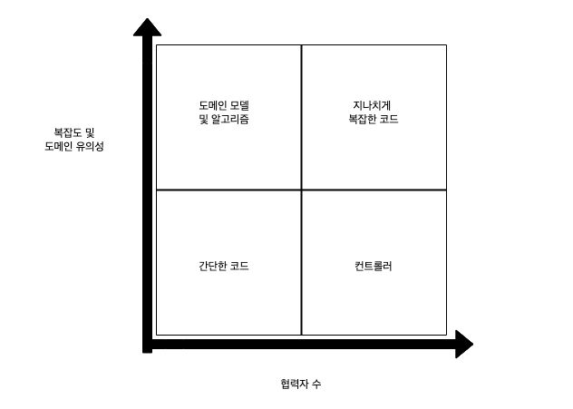
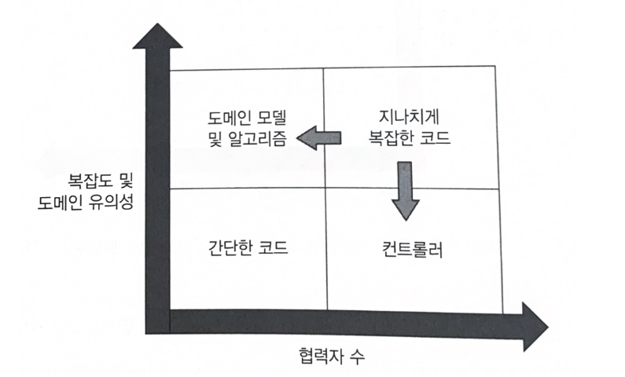
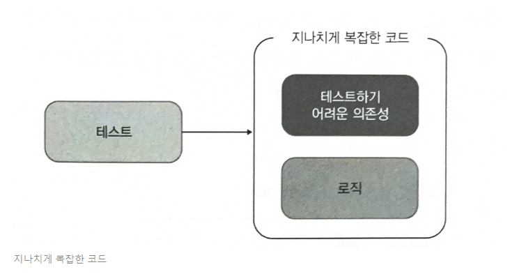
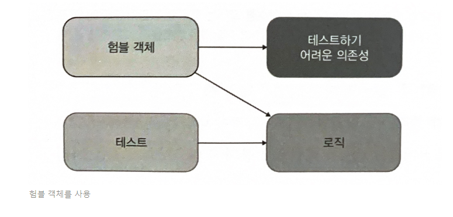

# 15일차 2024-04-25 p.227 ~ 236

## 가치 있는 단위 테스트를 위한 리팩터링

좋은 단위 테스트 스위트의 속성

- 개발 주기에 통합돼 있다.
- 코드베이스 중 가장 중요한 부분만을 대상으로 한다.
- 최소한의 유지비로 최대의 가치를 끌어낸다. 이를 달성하려면 다음을 할 수 있어야 한다.
  - 가치 있는 테스트 식별하기
  - 가치 있는 테스트 작성하기

단위 테스트와 기반 코드는 서로 매우 얽혀 있기 때문에 코드베이스에 노력을 기울이지 않고서는
가치 있는 테스트를 만들 수 없다.

## 리팩터링할 코드 식별하기

기반 코드를 리팩터링하지 않고서는 테스트 스위트를 크게 개선할 수 없다.
테스트 코드와 제품 코드는 본질적으로 관련돼 있기 때문에 다른 방도는 없다.

리팩터링의 방향을 설명하고자 코드를 네 가지 유형으로 분류해보자

### 코드의 네 가지 유형

모든 제품 코드는 2차원으로 분류할 수 있다.

- 복잡도 또는 도메인 유의성
- 협력자 수

코드 복잡도는 코드 내 의사 결정 지점 수로 정의 한다. 
이 숫자가 클수록 복잡도는 더 높아진다.

> **순환 복잡도 계산 법**
>  
> 컴퓨터 과학에서 코드 복잡도를 설명하는 특별한 용어로 순환 복잡도가 있다.
> 순환 복잡도는 주어진 프로그램 또는 메서드의 분기 수를 나타낸다. 이 지표는 다음과 같이 계산한다.  
> 1 + <분기점 수>
>  
> 따라서 제어 흐름문 (예: if 문 또는 조건문 루프)이 없는 메서드에서는 순환 복잡도가 1 + 0 = 1이다.
>  
> 이 지표에는 또 다른 의미가 있다. 메서드에서 시작부터 끝으로 가는 데 독립적인 경로의 수가 또는 100% 분기 커버리지를 얻는 데
> 필요한 테스트의 수로 생각해 볼 수 있다.

도메인 유의성은 코드가 프로젝트의 문제 도메인에 대해 얼마나 의미 있는지를 나타낸다.
일반적으로 도메인 계층의 모든 코드는 최종 사용자의 목표와 직접적인 연관성이 있으므로 도메인 유의성이 높다.

반면에 유틸리티 코드는 그런 연관성이 없다.

복잡한 코드와 도메인 유의성을 갖는 코드가 단위 테스트에서 가장 이롭다. 
해당 테스트가 회귀 방지에 뛰어나기 때문이다. 도메인 코드는 복잡할 필요가 없으며,
복잡한 코드는 도메인 유의성이 나타나지 않아도 테스트할 만하다.

이 두 요소는 서로 독립적이다. 예를 들어 주문 가격을 계산하는 메서드에 조건문이 없다면 순환 복잡도는 1이다.
그러나 이러한 메서드는 비즈니스에 중요한 기능이므로 테스트하는 것이 중요하다.

두 번째 차원은 클래스 또는 메서드가 가진 협력자 수다. 
협력자는 가변 의존성이거나 프로세스 외부 의존성이다. 협력자가 많은 코드는 테스트 비용이 많이 든다. 
테스트 크기에 따라 달라지는 유지 보수성 지표 때문이다. 협력자를 예상되는 조건으로 두고
상태나 상호 작용을 확인하게끔 코드를 작성해야 한다. 

협력자가 많을수록 테스트도 커진다.

협력자의 유형도 중요하다. 도메인 모델이라면 프로세스 외부 협력자를 사용하면 안 된다. 
테스트에서 목 체계가 복잡하기 때문에 유지비가 더 든다. 
또한 리팩터링 내성을 잘 지키려면 아주 신중하게 목을 사용해야 하는데, 애플리케이션 경계를 넘는 상호 작용을 검증하는 데만 사용해야 한다. 

프로세스 외부 의존성을 가진 모든 통신은 도메인 계층 외부의 클래스에 위임하는 것이 좋다.
그러면 도메인 클래스는 프로세스 내부 의존성에만 동작하게 된다.

암시적 협력자와 명시적 협력자 모두 이 숫자에 해당한다. 
테스트 대상 시스템(SUT)이 협력자를 인수로 받거나 정적 메서드를 통해 암시적으로 참조해도 상관없지만,
테스트에서 이 협력자를 설정해야 한다. 

코드 복잡도, 도메인 유의성, 협력자 수의 조합으로 네 가지 코드 유형을 볼 수 있다.

- 도메인 모델과 알고리즘 : 보통 복잡한 코드는 도메인 모델이지만, 100%는 아니다. 문제 도메인과 직접적으로 관련이 없는 복잡한 알고리즘이 있을 수 있다.
- 간단한 코드 : C# 에서 이러한 코드의 예로 매개변수가 없는 생성자와 한 줄 속성 등이 있다. 협력자가 있는 경우가 거의 없고 복잡도나 도메인 유의성도 거의 없다.
- 컨트롤러 : 이 코드는 복잡하거나 비즈니스에 중요한 작업을 하는 것이 아니라 도메인 클래스와 외부 애플리케이션 같은 다른 구성 요소의 작업을 조정한다. 
- 지나치게 복잡한 코드 : 이러한 코드는 두 가지 지표 모두 높다. 협력자가 많으며 복잡하거나 중요하다. 한 가지 예로 덩치가 큰 컨트롤러가 있다.

도메인 모델 및 알고리즘을 단위 테스트 하면 노력 대비 가장 이롭다. 이러한 단위 테스트는 매우 가치 있고
저렴하다. 

해당 코드가 복잡하거나 중요한 로직을 수행해서 테스트의 회귀 방지가 향상되기 때문에 가치가 있다.

또한 코드에 협력자가 거의 없어서 테스트 유지비를 낮추기 때문에 저렴하다.

간단한 코드는 테스트할 필요가 전혀 없다. 이러한 테스트는 가치가 0에 가깝다. 컨트롤러의 경우,
포괄적인 통합 테스트의 일부로서 간단히 테스트 해야 한다.

가장 문제가 되는 코드 유형은 지나치게 복잡한 코드다. 단위 테스트가 어렵겠지만, 테스트 커버리지 없이
내버려두는 것은 너무 위험하다.

> **팁**  
> 코드가 더 중요해지거나 복잡해질수록 협력자는 더 적어야 한다.

지나치게 복잡한 코드를 피하고 도메인 모델과 알고리즘만 단위 테스트하는 것이 매우 가치 있고
유지 보수가 쉬운 테스트 스위트로 가는 길이다. 하지만 이 방법으로도  테스트 커버리지를 100% 달성할 수 없으며,

이를 목표로 해서도 안 된다. 목표는 각각의 테스트가 프로젝트 가치를 높이는 테스트 스위트다.

다른 모든 테스트를 리팩터링 하거나 제거하라.

테스트 스위트의 크기를 부풀리지 마라.

### 험블 객체 패턴을 사용해 지나치게 복잡한 코드 분할하기

지나치게 복잡한 코드를 쪼개려면, 험블 객체 패턴을 써야 한다.

나는 코드가 프레임워크 의존성에 결합돼 있기 때문에 테스트가 어렵다는 사실을 깨달은 적이 종종 있다.

예를 들어 비동기 또는 멀티스레드 실행, 사용자 인터페이스, 프로세스 외부 의존성과 통신 등이 있다.

테스트 대상 코드의 로직을 테스트하려면, 테스트가 가능한 부분을 추출해야 한다. 
결과적으로 코드는 테스트 가능한 부분을 둘러싼 얇은 험블 래퍼가 된다. 
이 험블 래퍼가 테스트하기 어려운 의존성과 새로 추출된 구성 요소를 붙이지만, 
자체적인 로직이 거의 없거나 전혀 없으므로 테스트 팔 필요가 없다.

육각형 아키텍처는 비즈니스 로직과 프로세스 외부 의존성과의 통신을 분리한다. 

이는 도메인 계층과 애플리케이션 서비스 계층이 각각 담당하는 것이다.

함수형 아키텍터는 더 나아가 프로세스 외부 의존성 뿐만 아니라 모든 협력자와의 커뮤니케이션에서 비즈니스 로직을 분리한다.

이는 함수형 아키텍처가 테스트를 용이하게 하는 것이다. 즉, 함수형 코어엔느 아무런 협력자도 없다.
함수형 코어의 모든 의존성은 불변이므로 코드 유형 도표에서 세로축에 근접한다.

험블 객체 패턴을 보는 또 다른 방법은 단일 책임 원칙을 지키는 것이다.
이는 각 클래스가 단일한 책임만 가져야 한다는 원칙이다. 그러한 책임 중 하나로 늘 비즈니스 로직이 있는데,

이 패턴을 적용하면 비즈니스 로직을 거의 모든 것과 분리할 수 있다.

특정 상황을 예로 들자면, 비즈니스 로직과 오케스트레이션을 분리하는 경우다. 
코드의 깊이와 코드의 너비 관점에서 이 두 가지 책임을 생각해볼 수 있다. 코드가 깊거나
넓을 수 있지만, 둘 다 가능하지는 않다. 

비즈니스 로직과 오케스트레이션을 계속 분리해야 하는 이유는 테스트 용이성이 좋아져서만은 아니다.

이렇게 분리하면 코드 복잡도를 해결할 수 있으며, 프로젝트 성장에도 중요한 역할을 한다. 

개인적으로는 항상 테스트 가능한 설계가 어떻게 테스트를 용이하게 할 뿐만 아니라 유지 보수도 
쉽게 해주는지를 흥미롭게 생각한다.