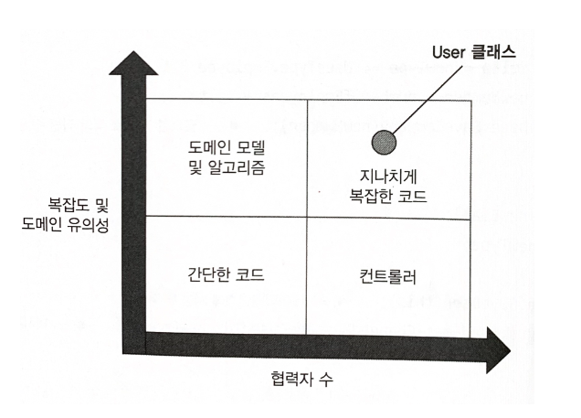
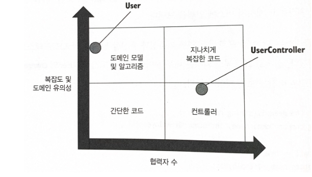
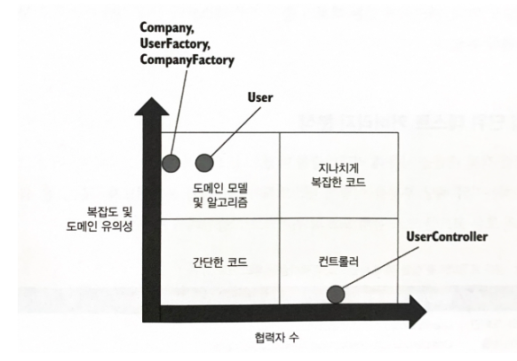

# 16일차  2024-04-29  p.236 ~ 248

## 가치 있는 단위 테스트를 위한 리펙터링 하기

### 고객 관리 시스템 소개

 사용자 등록을 처리하는 고객 관리 시스템 
 
모든 사용자가 데이터베이스에 저장된다. 현재 시스템은 사용자 이메일 변경이라는 단 하나의 유스케이스만 지원한다.

이 연산에는 세 가지 비즈니스 규칙

- 사용자 이메일이 회사 도메인에 속한 경우 해당 사용자는 직원으로 표시된다. 그렇지 않으면 고객으로 간주한다.
- 시스템은 회사의 직원 수를 추적해야 한다. 사용자 유형이 직원에서 고객으로, 또는 그 반대로 변경 되면 이 숫자도 변경해야 한다.
- 이메일이 변경되면 시스템은 메시지 버스로 메세지를 보내 외부 시스템에 알려야 한다.


`CRM 시스템의 초기 구현 `

```java
@Getter
@Setter
public class User {

    private int userId;
    private String email;
    private UserType userType;

    public void changeEmail(int userId, String newEmail) {
        Object[] data = Database.getUserById(userId);
        this.userId = userId;
        this.email = (String) data[0];
        this.userType = (UserType) data[1];

        if (email.equals(newEmail))
            return;

        Object[] companyData = Database.getCompany();

        String companyDomainName = (String) companyData[0];
        int numberOfEmployees = (int) companyData[1];

        String emailDomain = newEmail.split("@")[1];
        boolean isEmailCorporate = emailDomain == companyDomainName;

        UserType newType = isEmailCorporate ? userType.EMPLOYEE : userType.CUSTOMER;

        if (userType != newType) {
            int delta = newType == UserType.EMPLOYEE ? 1 : -1;
            int newNumber = numberOfEmployees + delta;
            Database.saveCompany(newNumber);
        }

        this.email = newEmail;
        this.userType = newType;

        Database.saveUser(this);
        MessageBus.sendEmailChangedMessage(userId, newEmail);


    }
}
```

User 클래스에는 네 개의 의존성이 있으며, 그중 두 개는 명시적이고 나머지 두 개는 암시적이다.

명시적 의존성은 useId 와 newEmail 인수다. 그러나 이 둘은 값이므로 클래스의 협력자 수에는 포함되지 않는다.

암시적인 것은 Database 와 MessageBus 이다. 이 둘은 프로세스 외부 협력자다. 
앞에서 언급했듯이 도메인 유의성이 높은 코드에서 프로세스 외부 협력자는 사용하면 안 된다. 

따라서 User 클래스는 협력자 측면에서도 점수가 높으므로 이 클래스는 지나치게 복잡한 코드로 분류된다.



도메인 클래스가 스스로 데이터베이스를 검색하고 다시 저장하는 이러한 방식을 활성 레코드 패턴이라고 한다. 단순한 프로젝트나 
단기 프로젝트에서는 잘 작동하지만 코드베이스가 커지면 확장하지 못하는 경우가 많다. 

그 이유는 정확히 두 가지 책임, 즉 비즈니스 로직과 프로세스 외부 의존성과의 통신 사이에 분리가 없기 때문이다.

### 1단계 : 암시적 의존성을 명시적으로 만들기

테스트 용이성을 개선하는 일반적인 방법은 암시적 의존성을 명시적으로 만드는 것이다. 
즉, 데이터베이스와 메시지 버스에 대한 인터페이스르 두고, 이 인터페이스를 User 에 주입한 후 테스트에서 목으로 처리한다. 

코드 유형 도표 관점에서 도메인 모데일이 프로세스 외부 의존성을 직접 참조하든 인터페이스를 통해 참조하든 상관 없다. 

해당 의존성은 여전히 프로세스 외부에 있다. 아직 메모리에 데이터가 없는 프록시 형태다. 이러한 클래스를 테스트하려면 복잡한 목 체계가 필요한데,
여기서 테스트 유지비가 증가한다. 

그리고 목을 데이터베이스 의존성에 사용하면 테스트 취약성을 야기할 수 있다.

결국 도메인 모델을 직접적으로든 간접적으로든 프로세스 외부 협력자에게 의존하지 않는 것이 훨씬 더 깔끔하다. 
이것이 바로 육각형 아키텍처에서 바라는 바다.  도메인 모델은 외부 시스템과의 통신을 책임지지 않아야 한다.


### 2단계 : 애플리케이션 서비스 계층 도입

도메인 모델이 외부 시스템과 직접 통신하는 문제를 극복하려면 다른 클래스인 험블 컨트롤러로 책임을 옮겨야 한다. 
일반적으로 도메인 클래스는 다른 도메인 클래스나 단순 값과 같은 프로세스 내부 의존성에만 의존해야 한다.


`애플리케이션 서비스, 버전 1`

```java
public class UserController {

    private Database _database = new Database();
    private MessageBus _messageBus = new MessageBus();

    public void changeEmail(int userId, String newEmail) {
        Object[] data = _database.getUserById(userId);

        String email = (String) data[1];
        UserType userType = (UserType) data[2];
        User user = new User(userId, email, userType);

        Object[] companyData = _database.getCompany();
        String companyDomainName = (String) companyData[0];
        int numberOfEmployees = (int) companyData[1];
        
        int newNumberOfEmployees = user.changeEmail(newEmail, companyDomainName , numberOfEmployees);
        
        _database.saveCompany(newNumberOfEmployees);
        _database.saveUser(user);
        _messageBus.sendEmailChangedMessage(userId, newEmail);
        
    }
}

```

괜찮은 시도다. 

User 클래스로부터 프로세스 외부 의존성과의 작업을 줄이는 데 애플리케이션 서비스가 도움이 됐다. 
그러나 이 구현에는 몇 가지 문제가 있다.

- 프로세스 외부 의존성이 주입되지 않고 직접 인스턴스화된다. 이는 이 클래스를 위해 작성할 통합 테스트에서 문제가 될 것이다.
- 컨트롤러는 데이터베이스에서 받은 원시 데이터를 User 인스턴스로 재구성한다.  이는 복잡한 로직이므로 애플리케이션 서비스에 속하면 안 된다.
애플리케이션 서비스의 역할은 복잡도나 도메인 유의성의 로직이 아니라 오케스트레이션만 해당한다. 
- 회사 데이터도 마찬가지다. 이 데이터의 다른 문제는 다음과 같다. User 는 이제 업데이트된 직원 수를 반환하는데, 이 부분이 이상해 보인다. 회사 직원 수는 특정 사용자와는 관련이 없다. 이 책임은 다른 곳에 있어야 한다.
- 컨트롤러는 새로운 이메일이 전과 다른지 여부와 관계없이 무조건 데이터를 수정해서 저장하고 메시지 버스에 알림을 보낸다.

User 클래스는 더 이상 프로세스 외부 의존성과 통신할 필요가 없으므로 
테스트하기가 매우 쉬워졌다. 실제로 프로세스 외부든 내부든 어떤 협력자도 없다.

User의 changeEmail 메서드의 새로운 버전을 보면 다음과 같다.


```java
@Getter
@Setter
public class User {

    private int userId;
    private String email;
    private UserType userType;

    public User(int userId, String email, UserType userType) {
        this.userId = userId;
        this.email = email;
        this.userType = userType;
    }


    public int changeEmail(String newEmail, String companyDomainName, int numberOfEmployees) {
        if (email.equals(newEmail)) {
            return numberOfEmployees;
        }

        String emailDomain = newEmail.split("@")[1];
        boolean isEmailCorporate = emailDomain.equals(companyDomainName);


        UserType newType = isEmailCorporate ? userType.EMPLOYEE : userType.CUSTOMER;

        if (userType != newType) {
            int delta = newType == UserType.EMPLOYEE ? 1 : -1;
            numberOfEmployees = numberOfEmployees + delta;
        }
        email = newEmail;
        userType = newType;

        return numberOfEmployees;
    }
}
```




### 3단계 : 애플리케이션 서비스 복잡도 낮추기

UserController 가 컨트롤러 사분면에 확실히 있으려면 재구성 로직을 추출해야 한다.
ORM 라이브러리를 사용해 데이터베이스를 도메인 모델에 매핑하면, 
재구성 로직을 옮기기에 적절한 위치가 될 수 있다.

모든 ORM 라이브러리는 데이터베이스 테이블을 도메인 클래스에 어떻게 매핑하는지를 지정할 수 있게 한다.

ORM 을 사용하지 않거나 사용할 수 없으면, 도메인 모델에 원시 데이터베이스 데이터로
도메인 클래스를 인스턴스화하는 팩토리 클래스를 작성하라.

이 팩토리 클래스는 별도 클래스가 될 수도 있고, 더 간단한 경우
기존 도메인 클래스의 정적 메서드가 될 수도 있다.

샘플 애플리케이션의 재구성 로직이 그다지 복잡하지 않지만 분리해두는 것이 좋기 때문에

UserFactory 클래스를 둔다. 


```java
public class UserFactory {

    public static User create(Object[] data) {
        Precondition.Requires(data.length >= 3);

        int id = (int) data[0];
        String email = (String) data[1];
        UserType type = (UserType) data[2];

        return new User(id, email, type);
    }
}

```

이 코드는 이제 모든 협력자와 완전히 격리돼 있으므로 테스트가 쉬워졌다.
이 메서드에는 데이터 배열에 최소 세 개인 요소가 있어야 한다는 요구 사항에 대한
안전 장치가 있다.

Precondition 은 불 인수(boolean argument) 가 false 인 경우 예외를 발생시키는
간단한 사용자 정의 클래스다. 


### 4단계 : 새 Company 클래스 소개


User 에서 업데이트된 직원 수를 반환하는 부분이 어색하다.

이는 책임을 잘못 뒀다는 신호이자 추상화가 없다는 신호다. 

이 문제를 해결하려면, 회사 관련 로직과 데이터를 함께 묶는 
또 다른 도메인 클래스인 Company 를 만들어야 한다.

`도메인 계층의 새로운 클래스`


```java
@Getter
@Setter
public class Company {

    private String domainName;
    private int numberOfEmployees;

    public void changeNumberOfEmployees(int delta) {
        Precondition.Requires(numberOfEmployees+delta >=0);
        
        numberOfEmployees += delta;
    }
    
    public boolean isEmailCorporate(String email) {
        String emailDomain = email.split("@")[1];
        return emailDomain.equals(domainName);
    }
}

```
changeNumberOfEmployees 메서드와 isEmailCorporate 메서드로 인해

'묻지 말고 말하라 ( tell - don't ask)' 라는 원칙을 준수하는 데 
도움이 된다.

이 원칙을 따르면 데이터와 해당 데이터에 대한 작업을 묶는다. 

User 인스턴스는 직원 수를 변경하거나 특정 이메일이 회사 이메일인지 여부를 파악하도록 회사에 말하며,
원시 데이터를 묻지 않고 모든 작업을 자체적으로 수행한다. 


`리팩터링 후 UserController`

```java
public class UserController {

    private Database _database = new Database();
    private MessageBus _messageBus = new MessageBus();

    public void changeEmail(int userId, String newEmail) {
        Object[] data = _database.getUserById(userId);

        String email = (String) data[1];
        UserType userType = (UserType) data[2];
        User user = new User(userId, email, userType);

        Object[] companyData = _database.getCompany();

        Company company = CompanyFactory.create(companyData);

        user.changeEmail(newEmail, company);

        _database.saveCompany(company);
        _database.saveUser(user);
        _messageBus.sendEmailChangedMessage(userId, newEmail);

    }
}


```

`리팩터링 후 User`


```java
@Getter
@Setter
public class User {

    private int userId;
    private String email;
    private UserType userType;

    public User(int userId, String email, UserType userType) {
        this.userId = userId;
        this.email = email;
        this.userType = userType;
    }


    public void changeEmail(String newEmail, Company company) {
        if (email.equals(newEmail)) {
            return;
        }
        
        UserType newType = company.isEmailCorporate(newEmail) ? userType.EMPLOYEE : userType.CUSTOMER;

        if (userType != newType) {
            int delta = newType == UserType.EMPLOYEE ? 1 : -1;
           company.changeNumberOfEmployees(delta);
        }
        email = newEmail;
        userType = newType;

      
    }
}
```

잘못 둔 책임을 제거하니 User 가 훨씬 더 깔끔해졌다.

회사 데이터를 처리하는 대신 Company 인스턴스를 받아, 이메일이 회사 이메일인지 결정하는 것과
회사의 직원수를 변경하는 것, 이 두 가지 중요한 작업을 해당 인스턴스에 위임한다.




이제 모든 복잡도가 팩토리로 이동했기 때문에 UserController 는 확실히 컨트롤러 사분면에 속한다. 

이 클래스가 담당하는 것은 모든 협력자를 한데 모으는 것이다.


컨트롤러가 User 객체와 Company 객체를 데이터베이스에 저장할 때만 사이드 이펙트가 도메인 모델의 경계를 넘는다.

마지막 순간까지 모든 사이드 이펙트가 메모리에 남아있다는 사실로 인해 테스트 용이성이 크게 향상된다.
테스트가 프로세스 외부 의존성을 검사할 필요가 없고 통신 기반 테스트에 의존할 필요도 없다.

메모리에 있는 객체의 출력 기반 테스트와 상태 깁나 테스트로 모든 검증을 수행할 수 있다.