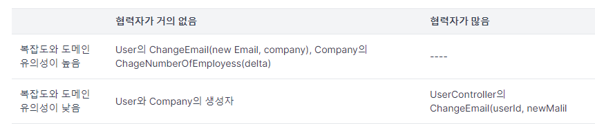
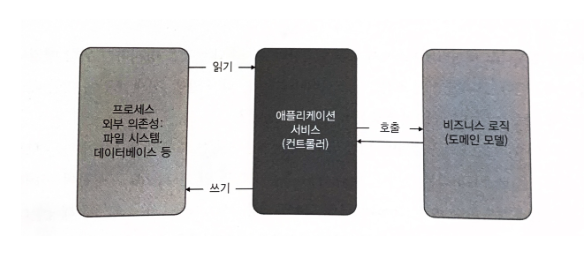
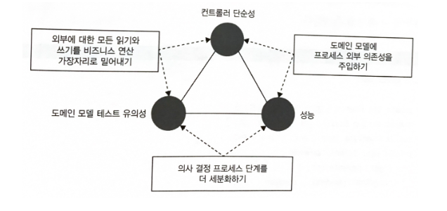

# 17일차 2024-04-30 p.248 ~ 269

## 최적의 단위 테스트 커버리지 분석



비즈니스 로직과 오커스트레이션을 완전히 분리하면 코드베이스의 어느 부분을 테스트 단위로 할지 쉽게 결정할 수 있다.

코드의 복잡도나 도메인 유의성이 높으면 회귀 방지가 뛰어나고 협력자가 거의 없어 유지비도 가장 낮다.


복잡도가 낮고 협력자가 거의 없는 코드는  생성자이다.

생성자는 단순해서 노력을 들일 필요가 없으며, 테스트는 회귀 방지가 떨어질 것이다.


복잡도가 높고 협력자가 많은 모든 코드를 리팩토링으로 제거했으므로 테스트할 것이 없다.

### 전제 조건을 테스트해야 하는 가?

특별한 종류의 분기점을 살펴보고 이를 테스트해야 하는지 확인 해보자


```java
  public void changeNumberOfEmployees(int delta) {
        Precondition.Requires(numberOfEmployees+delta >=0);

        numberOfEmployees += delta;
    }
```

회사의 직원 수가 음수가 돼서는 안 된다는 전제 조건이 있다. 
이 전제 조건은 예외 상황에서만 활성화되는 보호 장치다.

이러한 예외 상황은 보통 버그의 결과다. 직원 수가 0 미만으로 내려가는 까닭은 코드에 오류가 있는 경우뿐이다. 

이 보호 장치는 소프트웨어가 빠르게 실패하고 데이터베이스에서 오류가 확산하고 지속되는 것을 방지하기 위한 메커니즘을 제공한다.

그러한 전제 조건을 테스트해야 하는가? 다시 말해, 전제 조건에 대한 테스트가 테스트 스위트에 있을 만큼 충분히 가치가 있는가?

여기에 어려운 규칙은 없지만, 일반적으로 권장하는 지침은 도메인 유의성이 있는 모든 전제 조건을 테스트하라는 것이다. 
직원 수가 음수가 되면 안 된다는 요구 사항이 이러한 전제 조건에 해당한다. 

이는 Company 클래스의 불변성에 해당한다. 
그러나 도메인 유의성이 없는 전제 조건을 테스트하는 데 시간을 들이지 말라.


## 컨트롤러에서 조건부 로직 처리

조건부 로직을 처리하면서 동시에 프로세스 외부 협력자 없이 도메인 계층을 유지 보수하는 것은 까다롭고 절충이 있기 마련이다.


비즈니스 로직과 오케스트레이션의 분리는 다음과 같이 비즈니스 연산이 세 단계로 있을 때 가장 효과적이다.

- 저장소에서 데이터 검색
- 비즈니스 로직 실행
- 데이터를 다시 저장소에 저장



비즈니스 연산 중에 프로세스 외부 의존성을 참조해야 하는 경우 육각형 아키텍처가 제대로 작동하지 않는다.

이러한 상황에서 다음과 같이 세 가지 방법이 있다.

- 외부에 대한 모든 읽기와 쓰기를 가장자리로 밀어낸다.  이 방법은 "읽고-결정하고-실행하기" 구졸르 유지하지만 성능이 저하된다. 필요 없는 경우에도 컨트롤러가 프로세스 외부 의존성을 호출한다.
- 도메인 모델에 프로세스 외부 의존성을 주입하고 비즈니스 로직이 해당 의존성을 호출할 시점에 직접 결정할 수 있게 한다.
- 의사 결정 프로세스 단계를 더 세분화하고, 각 단계별로 컨트롤러를 실행하도록 한다.

문제는 다음 세 가지 특성의 균형을 맞추는 것이다.

- 도메인 모델 테스트 유의성 : 도메인 클래스의 협력자 수의 유형에 따른 함수
- 컨트롤러 단순성 : 의사 결정 지점이 있는지에 따라 다름
- 성능 : 프로세스 외부 의존성에 대한 호출 수로 정의

위에서 언급한 방법은 세 가지 특성 중 두 가지 특성만 갖는다.

- 외부에 대한 모든 읽기와 쓰기를 비즈니즈 연산 가장자리로 밀어내기: 컨트롤러를 계속 단순하게 하고 프로세스 외부 의존성과 도메인 모델을 분리하지만 , 성능이 저하된다.
- 도메인 모델에 프로세스 외부 의존성 주입하기 : 성능을 유지하면서 컨트롤러를 단순하게 하지만, 도메인 모델의 유의성이 떨어진다.
- 의사 결정 프로세스 단계를 더 세분화하기 : 성능과 도메인 모델 테스트 유의성에 도움을 주지만, 컨트롤러가 단순하지 않다. 이러한 세부 단계를 관리하려면 컨트롤러에 의사 결정 지점이 있어야 한다.




컨트롤러 단순성, 도메인 모델 테스트 유의성, 성능 이라는 세 가지 특성을 모두 충족하는 해법은 없다. 
따라서 세 가지 중 두 가지를 선택해야 한다.

### CanExecute / Execute 패턴 사용

컨트롤러 복잡도가 커지는 것을 완화하는 첫 번째 방법은 CanExecute/Execute 패턴을 사용해 비즈니스 로직이 도메인 모델에서 
컨트롤러로 유출되는 것을 방지하는 것이다.


샘플 프로젝트 확장 하기

이메일은 사용자가 확인할 때까지만 변경할 수 있다 사용자가 확인한 후에 이메일을 변경 하려고 하면 오류 메시지가 표시돼야 한다.

```java
public class User {

    private int userId;
    private String email;
    private UserType userType;
    private boolean isEmailConfirmed;
    
  // ...


    public String changeEmail(String newEmail, Company company) {
        if (isEmailConfirmed) 
            return "Can't change a confirmed email";
        
        
      // .. 나머지
       
    }
}
```

두 번째 옵션은 IsEmailConfirmed 확인을 User 에서 컨트롤러로 옮기는 것이다.

`사용자의 이메일을 변경할 지 여부를 결정하는 컨트롤러`

이러한 구현으로 성능은 그대로 유지된다. 

Company 인스턴스는 확실히 이메일 변경이 가능한 후에만 데이터베이스에서 검색된다. 
그러나 이제 의사 결정 프로세스는 두 부분으로 나뉜다. 

- 이메일 변경 진행 여부 (컨트롤러에서 수행)
- 변경 시 해야 할 일 (User 에서 수행)

이제 IsEmailConfirmed 플래그를 먼저 확인하지 않고 이메일을 변경할 수 있지만 , 도메인 모델의 캡슐화가 떨어진다. 

이러한 파편화로 비즈니스 로직과 오케스트레이션 간의 분리가 방해되고 지나치케 복잡한 위험 영역에 더 가까워진다. 

이러한 파편화를 방지하려면 User 에 새 메서드를 둬서 이 메서드가 잘 실행 되는 것을 이메일 변경의 전제 조건으로 한다. 

`CanExecute / Execute 패턴을 사용한 이메일 변경`


이 방법에는 두 가지 중요한 이점이 있다.

- 컨트롤러는 더 이상 이메일 변경 프로세스를 알 필요가 없다. CanChangeEmail() 메서드를 호출해서 연산을 수행할 수 있는지 확인하기만 하면 된다. 이 메서드에 여러가지 유효성 검사가 있을 수 있고, 
유효성 검사 모두 컨트롤러로부터 캡슐화 돼 있다.
- ChangeEmail() 의 전제 조건이 추가돼도 먼저 확인하지 않으며 이메일을 변경할 수 없도록 보장한다. 


이 패턴을 사용하면 도메인 계층의 모든 결정을 통합할 수 있다. 

이제 컨트롤러에 이메일을 확인할 일이 없기 때문에 더 이상 의사 결정 지점은 없다. 따라서 컨트롤러에 CanChangeEmail() 을 호출하는 if 문이 있어도
if 문을 테스트 할 필요는 없다. User 클래스의 전제 조건을 단위 테스트 하는 것으로 충분하다.

### 도메인 이벤트를 사용해 도메인 모델 변경 사항 추적

도메인 모델을 현재 상태로 만든 단계를 빼기 어려울 때가 있다. 그러나 애플리케이션에서 정확히 무슨 일이 일어나는지 외부 시스템 알려야 하기 때문에 

이러한 단계들을 아는 것이 중요할지도 모른다. 컨트롤러에 이러한 책임도 있으면 더 복잡해진다. 

이를 피하려면 , 도메인 모델에서 중요한 변경 사항을 추적하고 비즈니스 연산이 완료된 후 해당 변경 사항을 프로세스 외부 의존성 호출로 변환한다.

도메인 이벤트로 이러한 추적을 구현할 수 있다.


> 도메인 이벤트는 애플리케이션 내에서 도메인 전문가에게 중요한 이벤트를 말한다. 도메인 전문가에게는 무엇으로 도메인 이벤트와 
> 일반 이벤트를 구별하는지가 중요하다. 도메인 이벤트는 종종 시스템에서 발생하는 중요한 변경 사항을 외부 애플리케이션에 알리는 데 사용된다.

CRM 에는 추적 요구 사항도 있다. 

메시지 버스에 메시지를 보내서 외부 시스템에 변경 된 사용자 이메밀을 알려줘야 한다.

`이메일이 변경되지 않은 경우에도 메시지를 보냄`

이메일이 같은지 검사하는 부분을 컨트롤러로 옮겨서 버그를 해결할 수 있지만, 비즈니스 로직이 파편화되는 문제가 있다.
새 이메일이 이전 이메일과 동일하다면 애플리케이션이 오류를 반환해서는 안 되므로 CanChanegEmail() 에 검사하는 부분을 넣을 수 없다.


> 도메인 이벤트는 이미 일어난 일들을 나타내기 때문에 항상 과거 시제로 명명해야 한다. 도메인 이벤트는 값이다.
> 둘 다 불변이고, 서로 바꿔서 쓸 수 있다.

저장 로직이 도메인 이벤트에 의존하지 않으므로 여전히 Company 인스턴스와 User 인스턴스는 무조건 데이터베이스에 저장된다. 
이는 데이터베이스의 변경 사항과 메시지 버스의 메시지가 다르기 때문이다.

CRM 을 제외한 어떤 애플리케이션도 데이터베이스에 대한 접근 권한을 갖지 않는다고 하면, 해당 데이터베이스와의 통신은 CRM 의 식별할 수 있는 동작이 아니고
구현 세부 사항이다.

### 결론

외부 시스템에 대한 애플리케이션의 사이드 이팩트를 추상화하는 것이었다. 비즈니스 연산이 끝날 때까지 이러한 사이드 이펙트를 메모리에 둬서 
추상화하고, 프로세스 외부 의존성 없이 단순한 단위 테스트로 테스트할 수 있다.

도메인 이벤트는 메시지 버스에서 메시지에 기반한 추상화에 해당한다.

도메인 클래스의 변경 사항은 데이터베이스의 향후 수정 사장에 대한 추상화다.

도메인 이벤트와 CanExecute / Execute 패턴을 사용해 도메인 모델에 모든 의사 결정을 잘 담을 수 있었지만, 
항상 그렇게 할 수는 없다. 비즈니스 로직 파편화가 불가피한 상황들이 있다.
