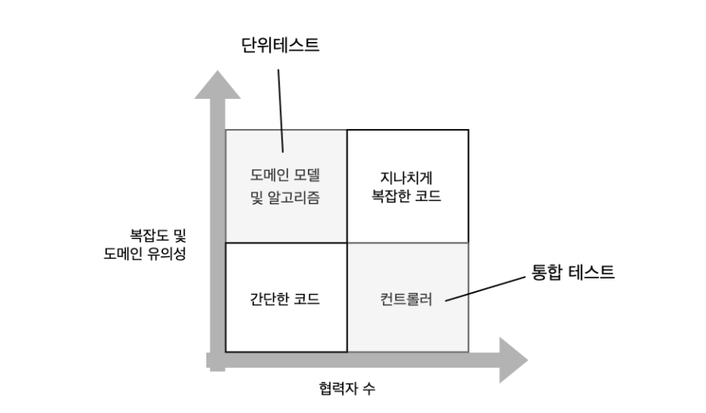

# 18일차 2024-05-01  p.271 ~ 286

## 통합 테스트를 하는 이유

단위 테스트에만 전적으로 의존하면 시스템이 전체적으로 잘 작동하는지 확신 할 수 없다.
단위 테스트가 비즈니스 로직을 확인하는 데 좋지만, 비즈니스 로직을 외부와 단절된 상태로 확인하는 것만으로는 충분하지 않다.

각 부분이 데이터베이스나 메시지 버스 등의 외부 시스템과 어떻게 통합되는지 확인해야 한다.

## 통합 테스트는 무엇인가?

통합 테스트는 테스트 스위트에서 중요한 역할을 하며, 단위 테스트 개수와 통합 테스트 개수의 균형을 맞추는 것도 중요하다.

### 통합 테스트의 역할

단위 테스트는 다음 세가지 요구 사항을 충족하는 테스트다.

- 단일 동작 단위를 검증하고,
- 빠르게 수행하고,
- 다른 테스트와 별도로 처리한다.

이 세 가지 요구 사항 중 하나라도 충족하지 못하는 테스트는 통합 테스트 범주에 속한다.

단위 테스트가 아닌 모든 테스트가 통합 테스트에 해당한다.

실제로 통합 테스트는 대부분 시스템이 프로세스 외부 의존성과 통합해 어떻게 작동하는지를 검증한다.
다시 말해, 이 테스트는 컨트롤러 사분면에 속하는 코드를 다룬다.

단위 테스트는 도메인 모델을 다루는 반면, 통합 테스트는 프로세스 외부 의존성과 도메인 모델을 연결하는 코드를 확인한다.



컨트롤러 사분면을 다루는 테스트가 단위 테스트일 수도 있다. 모든 프로세스 외부 의존성을 목으로 대체하면 테스트 간에 의존성이 없어지므로 
테스트 속도가 빨라지고 서로 격리될 수 있다. 그러나 대부분의 애플리케이션은 목으로 대체할 수 없는 프로세스 외부 의존성이 있다.

대개 데이터베이스이며, 다른 애플리케이션에서 볼 수 없는 의존성이다.

간단한 코드는 노력을 들일 만한 가치가 없고, 지나치게 복잡한 코드는 알고리즘과 컨트롤러로 리팩토링 해야 한다.
따라서 모든 테스트는 도메인 모델과 컨트롤러 사분면에만 초점을 맞춰야 한다.


### 다시 보는 테스트 피라미드

단위 테스트와 통합 테스트 간의 균형을 유지하는 것이 중요하다. 통합 테스트가 프로세스 외부 의존성에 직접 작동하면 느려지며, 
이러한 테스트는 유지비가 많이 든다. 유지비 증가의 이유는 다음과 같다.

- 프로세스 외부 의존성 운영이 필요함
- 관련된 협력자가 많아서 테스트가 비대해짐

반면 통합 테스트는 코드(애플리케이션 코드와 애플리케이션에서 사용하는 라이브러리와 코드를 모두 포함)를 더 많이 거치므로
회귀 방지가 단위 테스트 보다 우수하다. 또한 제품 코드와의 결합도가 낮아서 리팩터링 내성도 우수하다.

단위 테스트로 가능한 많이 비즈니스 시나리오의 예외 상황을 확인하고, 통합 테스트는 주요 흐름과 단위 테스트가 다루지 못하는 기타 예외 상황을 다룬다.

대부분을 단위 테스트로 전환하면 유지빌르 절감할 수 있다. 또한 중요한 통합 테스트가 비즈니스 시나리오당 하나 또는 두 개 있으면 시스템 전체의 정확도를 보장할 수 있다.


테스트 피라미드는 프로젝트의 복잡도에 따라 모양이 다를 수 있다. 
단순 애플리케이션은 도메인 모델과 알고리즘 사분면에 거의 코드가 없다.
결국 테스트 구성이 피라미드 대신 직사각형이 되며, 단위 테스트와 통합 테스트의 수가 같다.


### 통합 테스트와 빠른 실패

통합 테스트에서 프로세스 외부 의존성과 상호 작용을 모두 확인하려면 가장 긴 주요 흐름을 선택하라.


단위 테스트에 다룰 수 없는 예외 상황이 있듯이 이 부분도 예외가 있다. 
어떠한 예외 상황에 잘못 실행돼 전체 애플리케이션이 즉시 실패하면 해당 예외 상황은 테스트할 필요가 없다.


> 좋지 않은 테스트를 작성하는 것보다는 테스트를 작성하지 않는 것이 좋다. 가치가 별로 없는 테스트는 좋지 않은 테스트다.


버그를 빨리 나타나게 하는 것을 빠른 실패 원칙 (Fast Fail principle) 이라고 하며, 통합 테스트에서 할 수 있는 대안이다.


> **빠른 실패 원칙** <br/>
> 빠른 실패 원칙은 예기치 않은 오류가 발생하자마자 현재 연산을 중단하는 것을 의미한다. 이 원칙은 다음을 통해 애플리케이션의 안정성을 높인다.
> <br/>
> - 피드백 루프 단축 : 버그를 빨리 발견할수록 더 쉽게 해결할 수 있다. 이미 운영 환경으로 넘어 온 버그는 개발 중에 발견된 버그 보다 수정 비용이 훨씬 더 크다.
> - 지속성 상태 보호 : 버그는 애플리케이션 상태를 손상시킨다. 손상된 상태가 데이터베이스로 침투하면, 고치기가 훨씬 어려워진다. 빨리 실패하면 손상이 확산 되는 것을 막을 수 있다.
> <br/> <br/>
> 보통 예외를 던져서 현재 연산을 중지한다. 
> 예외는 그 의미가 빠른 실패 원칙에 완벽히 부합되기 때문이다.
> 예외는 프로그램 흐름을 중단하고 실행 스택에서 가장 높은 레벨로 올라 간 후 로그를 
> 남기고 작업을 종료하거나 재시작할 수 있다.


## 어떤 프로세스 외부 의존성을 직접 테스트 해야 하는가?

통합 테스트는 시스템이 프로세스 외부 의존성과 어떻게 통합하는지를 검증한다.

이러한 검증을 구현하는 방식은 두 가지가 있다. 실제 프로세스 외부 의존성을 
사용하거나 해당 의존성을 목으로 대체하는 것이다. 


### 프로세스 외부 의존성의 두 가지 유형

- 관리 의존성 (전체를 제어할 수 있는 프로세스 외부 의존성 ) : 이러한 의존성은 애플리케이션을 통해서만 접근할 수 있으며, 해당 의존성과의 상호 작용은 외부 환경에서 볼 수 없다.
대표적인 예로 데이터베이스가 있다. 외부 시스템은 보통 데이터베이스에 직접 접근하지 않고 애플리케이션에서 제공하는 API 를 통해 접근한다.
- 비관리 의존성 (전체를 제어할 수 없는 프로세스 외부 의존성): 해당 의존성과의 상호 작용을 외부에서 볼 수 있다.
예를 들어 SMTP 서버와 메시지 버스 등이 있다. 둘 다 다른 애플리케이션에서 볼 수 있는 사이드 이펙트를 발생시킨다.

5장에서 관리 의존성과의 통신은 구현 세부 사항이라고 했다. 반대로, 비관리 의존성과의
통신은 시스템의 식별할 수 있는 동작이다. 이러한 차이로 인해 통합 테스트에서 
프로세스 외부 의존성의 처리가 달라진다.


> 관리 의존성은 실제 인슽너스를 사용하고, 비관리 의존성은 목으로 대체하라.

5장에서 말했듯이, 비관리 의존성에 대한 통신 패턴을 유지해야 하는 것은 
하위 호환성을 지켜야 하기 때문이다. 이 작업에는 목이 제격이다.

목을 사용하면 모든 가능한 리팩터링을 고려해서 통신 패턴 영속성을 보장할 수 있다.


그러나 관리 의존성과 통신하는 것은 애플리케이션 뿐이므로 하위 호환성을 유지할 필요가 없다.
외부 클라이언트는 데이터베이스를 어떻게 구성하는지 신경 쓰지 않는다.

중요한 것은 시스템의 최종 상태다. 
통합 테스트에서 관리 의존성이 실제 인스턴스를 사용하면 
외부 클라이언트 관점에서 최종 상태를 확인할 수 있다.

또한 컬럼 이름을 변경하거나 데이터베이스를 이관하는 등 데이터베이스 리팩터링에도 도움이 된다.

### 관리 의존성이면서 비관리 의존성인 프로세스 외부 의존성 다루기

때로는 관리 의존성과 비관리 의존성 모두의 속성을 나타내는 프로세스 외부 의존성이 있을 수 있다.

좋은 예로, 다른 애플리케이션이 접근할 수 있는 데이터베이스가 있다.

시스템 간의 통합을 구현하는 데 데이터베이스를 사용하면 시스템이 서로 결합되고 
추가 개발을 복잡하게 만들기 때문에 좋지 않다. 
그러므로 다른 방법이 없을 경우에만 이 방법을 사용하라

API 나 메시지 버스를 사용하는 것이 더 낫다.

그러나 이미 공유 데이터베이스가 있고 근래에 할 수 있는 것이 아무것도 없으면
어떻게 해야 할까? 이 경우 다른 애플리케이션에서 볼 수 있는 테이블을
비관리 의존성으로 취급하라. 이러한 테이블은 사실상 메시지 버스 역할을 하고, 
각 행이 메시지 역할을 한다. 
이러한 테이블을 이용한 통신 패턴이 바뀌지 않도록 하려면 목을 사용하라.
그리고 나머지 데이터베이스를 관리 의존서으로 처리하고, 데이터베이스와의
상호 작용을 검증하지 말고 데이터베이스의 최종 상태를 확인하라.


### 통합 테스트에서 실제 데이터베이스를 사용할 수 없으면 어떻게 할까?

때로는 관리 범위를 벗어난다는 이유로, 통합 테스트에서 관리 의존성을 실제 버전으로
사용할 수 없는 경우도 있다.

테스트 자동화 환경에 배포할 수 없는 레거시 데이터베이스를 예롤 들 수 있다.

관리 의존성을 목으로 대체하면 통합 테스트의 리팩터링 내성이 저하된다.
게다가 이렇게 하면 테스트는 회귀 방지도 떨어진다.
그리고 데이터베이스가 프로젝트에서 유일한 프로세스 외부 의존성이면,
통합 테스트는 회귀 방지에 있어 기존 단위 테스트 세트와 다를 바 없다.


데이터베이스를 그대로 테스트할 수 없으면 통합 테스트를 아예 작성하지 말고
도메인 모델의 단위 테스트에만 집중하라. 항상 모든 단위 테스트를 철저히 검토해야 한다.
가치가 충분 하지 않은 테스트는 테스트 스위트에 있어서는 안 된다.


## 통합 테스트 : 예제

7장의 샘플 CRM 시스템 통합 테스트


`사용자 컨트롤러`

```java
public class UserController {
    private final Database _database;
    private final IMessageBus _messageBus;

    public UserController(Database database, IMessageBus messageBus)
    {
        _database = database;
        _messageBus = messageBus;
    }

    public String changeEmail(int userId, String newEmail)
    {
        Object[] userData = _database.getUserById(userId);
        User user = UserFactory.create(userData);

        String error = user.canChangeEmail();
        if (error != null) {
            return error;
        }

        Object[] companyData = _database.getCompany();
        Company company = CompanyFactory.create(companyData);

        user.changeEmail(newEmail, company);

        _database.saveCompany(company);
        _database.saveUser(user);
        for (EmailChangedEvent ev: user.emailChangedEvents)
        {
            _messageBus.sendEmailChangedMessage(ev.userId, ev.newEmail);
        }

        return "OK";
    }
}
```

### 어떤 시나리오를 테스트할까?

통합 테스트에 대한 일반적인 지침은 가장 긴 주요 흐름과 단위 테스트로는
수행할 수 없는 모든 예외 상황을 다루는 것이다.

가장 긴 주요 흐름은 모든 프로세스 외부 의존성을 거치는 것이다.

CRM 프로젝트에서 가장 긴 주요 흐름은 기업 이메일에서 일반 이메일로 변경하는 것이다.

이 변경으로 인해 사이드 이펙트가 많다.

- 데이터베이스에서 사용자와 회사 모두 업데이트 된다. 즉 사용자는 유형을 변경하고 이메일도 변경하며, 회사는 직원 수를 변경한다.
- 메시지 버스로 메시지를 보낸다.

단위 테스트로 테스트하지 않는 한 가지 예외 상황이 있는데, 
바로 이메일을 변경할 수 없는 시나리오다. 그러나 이 시나리오를 
테스트할 필요는 없다. 컨트롤러에 이러한 확인이 없으면 애플리케이션이
빨리 실패하기 때문이다.


### 데이터베이스와 메시지 버스 분류하기

통합 테스트를 작성하기 전에 프로세스 외부 의존성을 두 가지로 분류해서
직접 테스트할 대상과 목으로 대체할 대상을 결정해야 한다.

애플리케이션 데이터베이스는 어떤 시스템도 접근할 수 없으므로 
관리 의존성이다. 따라서 실제 인스턴스를 사용해야 하나. 통합 테스트는

- 데이터베이스에 사용자와 회사를 삽입하고,
- 해당 데이터베이스에서 이메일 변경 시나리오를 실행하며,
- 데이터베이스 상태를 검증하게 된다.

반면 메시지 버스는 비관리 의존성이다. 메시지 버스의 목적은
다른 시스템과의 통신을 가능하게 하는 것 뿐이다.
통합 테스트는 메시지 버스를 목으로 대체하고 컨트롤러와 목 간의 상호 작용을
검증하게 된다.

### 엔드 투 엔드 테스트는 어떤가?

샘플 프로젝트는 엔드 투 엔드 테스트가 없을 것이다.
API로 시나리오를 엔드 투 엔드 테스트하면 배포해서 모두 작동하는 버전의
API로 테스트하게 되고, 이는 어떤 프로세스 외부 의존성도 목으로 대체하지 않는 것을 의미한다.

반면 통합 테스트는 동일한 프로세스 내에서 애플리케이션을 호스팅하고 비관리 의존성을 목으로 대체한다.

엔드 투 엔트 테스트의 사용 여부는 각자의 판단에 맡긴다.

대부분의 경우 통합 테스트 범주에 관리 의존성을 포함시키고 비 관리 의존성만 목으로 대체하면
통합 테스트의 보호 수준이 엔드 투 엔드 테스트와 비슷해지므로 엔드 투 엔드 테스트를 생략할 수 있다.

하지만 배포 후 프로젝트의 상태 점검을 위해 한 개 또는 두 개 정도의 
중요한 엔드 투 엔드 테스트를 작성할 수 있다.


### 통합 테스트: 첫 번째 시도

```java
public class IntegrationTest {

//    private final static String ConnectionString = "Server=.\Sql;Database=IntegrationTests;Trusted_Connection=true;";
    private final static String ConnectionString = "TEST";


    @Test
    @DisplayName("통합 테스트")
    public void changingEmailFromCorporateToNonCorporate() {
        // Arrange
        Database db = new Database(ConnectionString);
        User user = createUser(
            "user@mycorp.com", UserType.Employee, db);
        createCompany("mycorp.com", 1, db);

        IMessageBus messageBusMock = mock(MessageBus.class);
        UserController sut = new UserController(db, messageBusMock);

        // Act
        String result = sut.changeEmail(user.UserId, "new@gmail.com");

        // Assert
        assertEquals("OK", result);

        Object[] userData = db.getUserById(user.UserId);
        User userFromDb = UserFactory.create(userData);
        assertEquals("new@gmail.com", userFromDb.Email);
        assertEquals(UserType.Customer, userFromDb.Type);

        Object[] companyData = db.getCompany();
        Company companyFromDb = CompanyFactory.create(companyData);
        assertEquals(0, companyFromDb.NumberOfEmployees);

        verify(messageBusMock, times(1))
            .sendEmailChangedMessage(user.getUserId(), "new@gmail.com");
    }

    private Company createCompany(String domainName, int numberOfEmployees, Database database) {
        Company company = new Company(domainName, numberOfEmployees);
        database.saveCompany(company);
        return company;
    }

    private User createUser(String email, UserType type, Database database) {
        User user = new User(0, email, type, false);
        database.saveUser(user);
        return user;
    }

}

```

입력 매개변수로 사용한 데이터와 별개로 데이터베이스 상태를 확인하는 것이 중요하다.
이를 위해 통합 테스트는 검증 구절에서 사용자와 회사 데이터를 각각 조회하고, 
새로운 userFromDb 와 companyFromDb 인스턴스를 생성한 후에 해당 상태를 검증만 한다.

이 방법을 사용하면 테스트가 데이터베이스에 대해 읽기와 쓰기를 모두 수행하므로 회귀 방지를 최대로 얻을 수 있다. 
읽기는 컨트롤러에서 내부적으로 사용하는 동일한 코드를 써서 구현해야 한다.
