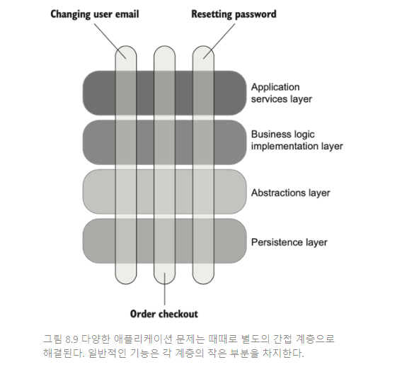
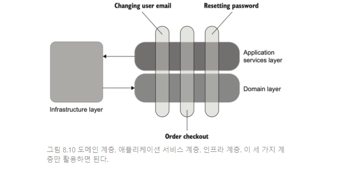
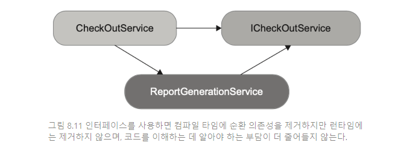

# 19일차 2024-05-02 p.286 ~

## 의존성 추상화를 위한 인터페이스 사용

### 인터페이스와 느슨한 결합

많은 개발자가 데이터베이스나 메시지 버스와 같은 프로세스 외부
의존성을 위해 인터페이스를 도입한다. 심지어 인터페이스에
구현이 하나만 있는 경우에도 그렇다.

```java
public interface IMessageBus {
    
}
public class MessageBus implements IMessageBus{
    
}
```

이렇게 인터페이스를 사용하는 일반적인 이유는 인터페이스가 

- 프로세스 외부 의존성을 추상화해 느슨한 결합을 달성하고,
- 기존 코드를 변경하지 않고 새로운 기능을 추가해 공개 폐쇄 원칙을 지키기 때문이다.

이 두가지 이유 모두 오해다.  단일 구현을 위한 인터페이스는 추상화가 아니며,
해당 인터페이스를 구현하는 구체 클래스보다 결합도가 낮지 않다.
진정한 추상화는 발견하는 것이지, 발명하는 것이 아니다. 의미상 추상화가
이미 존재하지만 코드에서 아직 명확하게 정의되지 않았을 때 
그 이후에 발견되는 것이다.

따라서 인터페이스가 진정으로 추상화되려면 구현이 적어도 두 가지는 있어야 한다.

두 번째 이유(기존 코드를 변경하지 않고 새로운 기능을 추가하는 것)는
더 기본적인 원칙인 YAGNI(You aren't gonna need it) 를 위반하기 대문에
잘못된 생각이다. YAGNI 는 현재 필요하지 않은 기능에
시간을 들이지 말라는 것이다. 이러한 향후 기능이 어떤지
설명하려고 기능을 개발해서도, 기존 코드를 수정해서도 안 된다.

크게 두 가지 이유가 있으며, 다음과 같다.

- **기회 비용** : 현재 비즈니스 담당자들에게 필요하지 않는 기능에 시간을 보낸다면, 
지금 당장 필요한 기능을 제치고 시간을 허비하는 것이다. 
게다가 비즈니스 담당자가 마침내 개발한 기능을 요구했을 때, 비즈니스 담당자의 눈높이는 높아졌고 여전히 
이미 작성한 코드를 수정해야 한다. 이런 일은 낭비다. 처음부터 실제 필요에 따라 기능을 구현하는 것이 더 유리하다.
- 프로젝트 코드가 적을수록 좋다. 요구 사항이 바로 있는 경우가 아닌데도 만일을 위해
코드를 작성하면 코드베이스의 소유 비용이 불필요하게 증가한다. 
가능한  새로운 기능의 도입을 미루는 것이 좋다.

> 코드를 작성하는 것은 문제를 해결하는 값비싼 방법이다. 해결책에 필요한 코드가 적고 간단할수록 좋다.

### 프로세스 외부 의존성에 인터페이스를 사용하는 이유는 무엇인가?

그렇다면 각 인터페이스에 구현이 하나만 있다고 가정할 때 프로세스 외부 의존성에
인터페이스를 사용하는 이유는 무엇일까? 진짜 이유는 
훨씬 더 실용적이고 현실적이다. 간단히 말하자면, 목을 사용하기 위함이다. 
인터페이스가 없으면 테스트 대역을 만들 수 없으므로 테스트 대상 시스템과
프로세스 외부 의존성 간의 상호 작용을 확인할 수 업다.

따라서 이러한 의존성을 목으로 처리할 필요가 없는 한, 프로세스 외부 의존성에 대한
인터페이스를 두지 말라. 비관리 의존성만 목으로 처리하므로, 
결국 비관리 의존성에 대해서만 인터페이스를 쓰라는 지침이 된다.

관리 의존성을 컨트롤러에 명시적으로 주입하고, 해당 의존성을 구체 클래스로 사용하라.


진정한 추상화는 목과 상관없이 인터페이스로 나타낼 수 있ㅎ따.
그러나 목 대체 이외의 이유로 단일 구현을 위해 인터페이스를 도입하는 것은
YAGNI 에 위배 된다.

### 프로세스 내부 의존성을 위한 인터페이스 사용

때로는 프로세스 외부 의존성 뿐만 아니라 프로세스 내부 의존성도 인터페이스
기반인 코드를 볼 수 있다.

```java
public interface IUser {
	int userId;
	String email;
	String canChangeEmail;
	
	void changeEmail(String newEmail, Company company);
}

public class User implements IUser {
	/* ... */
}
```

IUser 에 구현이 하나만 있다고 가정하면, 
이는 좋지 않은 신호다. 프로세스 외부 의존성과 마찬가지로
도메인 클래스에 대해 단일 구현으로 인터페이스를 도입하는 이유는
목으로 처리하기 위한 것 뿐이다.

그러나 프로세스 외부 의존성과 달리 도메인 클래스 간의 상호 작용을 확인해서는 안 된다.
그렇게 하면 깨지기 쉬운 테스트로 이어지고, 결국 리팩터링 내성이 떨어지게 된다.


## 통합 테스트 모범 사례

통합 테스트를 최대한 활용하는 데 도움이 되는 몇 가지 일반적인 지침

- 도메인 모델 경계 명시하기
- 애플리케이션 내 계층 줄이기
- 순환 의존성 제거하기

### 도메인 모델 경계 명시하기

항상 도메인 모델을 코드베이스에서 명시적이고 잘 알려진 위치에 
두도록 하라. 도메인 모델을 프로젝트가 해결하고자 하는 문제에 대한
도메인 지식의 모음이다. 도메인 모델에 명시적 경계를 지정하면
코드의 해당 부분을 더 잘 보여주고 더 잘 설명할 수 있다.

이렇게 하면 테스트에도 도움이 된다. 단위 테스트는 도메인 모델과
알고리즘을 대상으로 하고, 통합 테스트는 컨트롤러를 대상으로 한다.
도메인 클래스와 컨트롤러 사이의 명확한 경계로 단위 테스트와
통합 테스트의 차이점을 쉽게 구별할 수 있다.

### 계층 수 줄이기

대부분의 프로그래머는 간접 계층을 추가해서 코드를 추상화하고 일반화하려고 한다.
일반적인 엔터프라이즈급 애플리케이션에서 여러 계층을 쉽게 찾아볼 수 있다.



극단적인 경우로, 애플리케이션에 추상 계층이 너무 많으면
코드베이스를 탐색하기 어렵고 아주 간단한 연산이라 해도
숨은 로직을 이해하기가 너무 어려워진다. 단순히 직면한 문제의
구체적인 해결 방법을 알고 싶을 뿐이지, 외부와 단결한 채로 
해결책을 일반화하려는 것은 아니다. 


> 컴퓨터 과학의 모든 문제는 또 다른 간접 계층으로 해결할 수 있다.
> 간접 계층이 너무 많아서 문제가 생기지 않는다면 말이다.


간접 계층은 코드를 추론하는 데 부정적인 영향을 미친다. 모든 기능이
각각의 계층으로 전개되면 모든 조각을 하나의 그림으로 만드는 데 상당한 노력이 필요하다.
이는 개발 과정을 방해해서 정신적으로 더 부담된다

추상화가 지나치게 많으면 단위 테스트와 통합 테스트에도 도움이 되지 않는다.
간접 계층이 많은 코드베이스는 컨트롤러와 도메인 모델 사이에 명확한 경계가 없는 편이다.
그리고 각 계층을 따로 검증하는 경향이 훨씬 강하다. 
이러한 경향으로 인해 통합 테스트는 가치가 떨어지며, 각 테스트는
특정 계층의 코드만 실행하고 하위 계층은 목으로 처리한다. 
최종 결과는 항상 똑같이 나은 리팩터링 내성과 불충분한 회귀 방지다.

가능한 간접 계층을 적게 사용하라. 대부분의 백엔드 시스템에서는 도메인 모델,
애플리케이션 서비스 계층, 인프라 계층, 이 세 가지만 활용하면 된다.
인프라 계층은 보통 도메인 모델에 속하지 않는 알고리즘과 프로세스 외부 의존성에 접근할 수 있는 코드로 구성된다.



### 순환 의존성 제거하기

코드베이스의 유지 보수성을 대폭 개선하고 테스트를 더 쉽게 할 수 있는 또 다른 방법으로
순환 의존성을 제거하는 것이 있다.


> 순환 의존성은 둘 이상의 클래스가 제대로 작동하고자 직간접적으로 서로 의존하는 것을 말한다.

순환 의존성의 대표적인 예는 콜백이다.

```java
public class CheckOutService {
	public void checkOut(int orderId) {
		ReportGenerationSerivce service = new ReportGenerationService();
		service.generateReport(orderId, this);
		/* 기타 코드 */
	}
}


public class ReportGenerationService {
	public void generateReport(int orderId, CheckoutService checkoutService) {
		/* 생성이 완료되면 checkoutService 호출 */
	}
}
```

여기서 **CheckOutService** 는 **ReportGenerationService** 인터페이스를 생성하고 
해당 인스턴스에 자신을 인수로 전달한다. ReportGenerationService 는 CheckoutService 를 다시 호출해 보고서 생성 결과를 알려준다.

추상 계층이 너무 많은 것과 마찬가지로, 
순환 의존성은 코드를 읽고 이해하려고 할 때 알아야 할 것이
많아서 큰 부담이 된다.

순환 의존성이 있으면 해결책을 찾기 위한 출발점이 명확하지 않기 때문이다.
하나의 클래스를 이해하려면 주변 클래스 그래프 전체를 한 번에 읽고
이해해야 하며, 심지어 소규모의 독립된 클래스 조차도 파악하기가 어려워질 수 있다.

또한 순환 의존성은 테스트를 방해한다. 클래스 그래프를 나눠서 
동작 단위를 하나 분리하려면 인터페이스에 의존해 목으로 처리해야 하는 경우가 많으며,
이는 도메인 모델을 테스트할 때 해서는 안 된다.

인터페이스 사용은 순환 의존성의 문제만 가린다.
CheckOutService 에 대한 인터페이스를 두고 ReportGenerationService 를
구체 클래스 대신 인터페이스에 의존하게 하는 경우 컴파일 타임에
순환 참조를 제거할 수 있지만 여전히 런타임에는 순환이 있다.

컴파일러가 더 이상 클래스 구성을 순환 참조로 여기지 않더라도 코드를 
이해하는 데 알아야 하는 부담이 줄어들지 않으며, 오히려 인터페이스 추가로 인해 늘어난다.





순환 의존성을 처리하는 더 좋은 방법은 순환 의존성을 제거하는 것이다.
ReportGenerationService 를 리팩터링해서 CheckoutService 나
ICheckOutService 인터페이스에 의존하지 않도록 하고, 
ReportGenerationService 가 CheckOutService 를 호출하는 대신
작업 결과를 일반 값으로 리턴하게 하라.

```java
public class CheckOutService {
	public void checkOut(int orderId) {
		ReportGenerationService service = new ReportGenerationService();
		Report report = service.generateReport(orderId);
		/* 기타 작업 */
	}
}

public class ReportGenerationService {
	public Report generateReport(int orderId) {
		/* ... */
	}
}
```

코드베이스에서 순환 의존성을 모두 제거하는 것은 거의 불가능하다.
설령 그렇더라도 서로 의존적인 클래스의 그래프를 가능한 작게 만들면
손상을 최소화할 수 있다.

### 테스트에서 다중 실행 구절 사용

테스트에서 두 개 이상의 준비나 실행 또는 검증 구절을 두는 것은
'코드 악취' 에 해당한다.
이는 테스트가 여러 가지 동작 단위를 확인해서 테스트의 유지 보수성을
저해한다는 신호다. 예를 들어, 사용자 등록과 사용자 삭제와 같이
두 가지 관련 유스케이스가 있으면 하나의 통합 테스트에서 두 유스케이스를 모두 확인하려고 할 수 있다.

- 준비 : 사용자 등록에 필요한 데이터 준비
- 실행 : UserController.RegisterUser() 호출
- 검증 : 등록이 성공적으로 완료됐는지 확인하기 위해 데이터베이스 조회
- 실행 : UserController.DeleteUser() 호출
- 검증 : 사용자가 삭제됐는지 확인하기 위해 데이터베이스 조회

각 실행을 고유의 테스트로 추출해 테스트를 나누는 것이 좋다. 
불필요한 작업처럼 보일 수 있지만 이 작업은 장기적으로 유리 하다.
각 테스트가 단일 동작 단위에 초점을 맞추게 하면,
테스트를 더 쉽게 이해하고 필요할 때 수정할 수 있다.

둘 이상의 실행 구절로 테스트를 작성하는 것이 타당한 이유를
생각해보면, 프로세스 외부 의존성을 관리하기 어려운 경우뿐이다.
따라서 단위 테스트는 프로세스 외부 의존성으로 작동하지 않기 때문에
절대로 실행 구절이 여러 개 있어서는 안 된다.

통합 테스트 조차도 실행을 여러 단계로 하는 경우는 드물다.