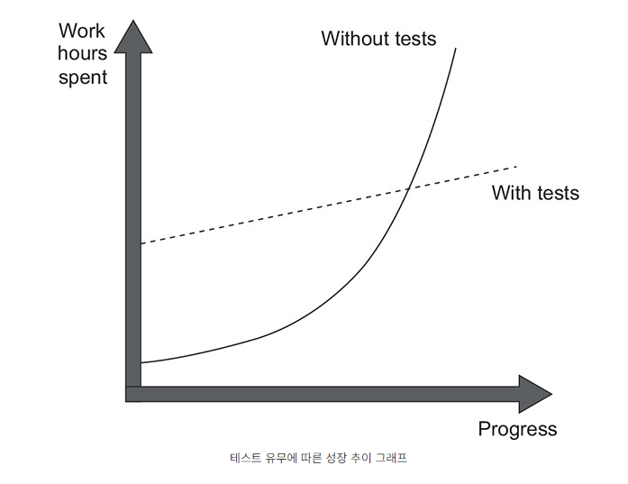

# 1일차 2024-04-01 (p.29 ~ 50)

## 단위 테스트의 목표 

단위 테스트에 시간을 투자할 때는 항상 최대한 이득을 얻도록 노력해야 하며,
테스트에 드는 노력을 가능한 줄이고 그에 따르는 이득을 최대화해야 한다. 두 가지를 모두 달성하기란 쉬운 일이 아니다.


### 단위 테스트 현황

단위 테스트를 적용해야 하는지는 더 이상 논쟁거리가 아니다.
그냥 쓰고 버리는 프로젝트가 아니면, 단위 테스트는 늘 적용해야 한다.

모든 새로운 기술과 마찬가지로 단위 테스트도 계속 발전하고 있다. 논쟁은 '단위 테스트를 작성해야 하는가?' 에서
'좋은 단위 테스트를 작성하는 것은 어떤 의미인가?' 로 바뀌었다. 이는 여전히 매우 혼란스럽다.

좋은 테스트와 좋지 않은 테스트의 차이는 취향이나 개인적인 선호도의 문제가 아니라 현재 작업 중인 중대한 프로젝트의 성패를 가르는 문제다.

### 단위 테스트의 목표

흔히 단위 테스트 활동이 더 나은 설계로 이어진다고 한다. 이는 사실이다. 
코드베이스에 대해 단위 테스트 작성이 필요하면 일반적으로 더 나은 설계로 이어진다. 

하지만 단위 테스트의 주 목표는 아니다. 더 나은 설계는 단지 좋은 사이드 이펙트일 뿐이다.


> 단위 테스트와 코드 설계의 관계 <br/>
> 코드를 단위 테스트 하기 어렵다면 코드 개선이 반드시 필요하다는 것을 의미한다. <br/>
> 보통 강결합에서 저품질이 나타나는데, 여기서 강결합은 제품 코드가  서로 충분히 분리되지 않아서 따로 테스트하기 어려움을 뜻한다. <br/>
> 안타깝게도 코드 조각을 단위 테스트할 수 있다는 것은 좋지 않은 긍정 지표다. 코드베이스를 쉽게 단위 테스트할 수 있다고 해도 반드시 코드 품질이 좋은 것을
> 의미하지는 않는다. 낮은 결합도를 보여도 프로젝트는 '대참사'가 될 수 있다.


그럼 단위 테스트의 목표는 무엇인가? 소프트웨어 프로젝트의 지속 가능한 성장을 가능하게 하는 것이다. 지속 가능하다는 것이 핵심이다. 
프로젝트가 상당히 쉽게 성장할 수 있다. 특히 처음부터 시작할 때 그렇다.  하지만 시간이 지나면서 이렇게 계속 성장하기는 훨씬 어렵다.



테스트가 없는 일반 프로젝트는 빨리 시작할 수 있다. 아직 잘못된 아키텍처 결정이 없고, 걱정할 만한 코드가 있지도 않다.
그러나 시간이 지나면서 점점 더 많은 시간을 들여야 처음에 보여준 것과 같은 정도의 진척을 낼 수 있다. 결국 개발 속도가 현저히 느려지고, 
심지어 전혀 진행하지 못할 정도로 느려질 수도 있다.

개발 속도가 빠르게 감소하는 이러한 현상을 소프트웨어 엔트로피라고도 한다. 엔트로피는 소프트웨어 시스템에도 적용할 수 있는 수학적이고 과학적인 개념이다.

소프트웨어에서 엔트로피는 품질을 떨어뜨리는 코드 형태로 나타난다. 코드베이스에서 무언가를 변경할 때마다 무질서도는 증가한다. 지속적인 정리와
리팩터링 등과 같은 적절한 관리를 하지 않고 방치하면 시스템이 점점 더 복잡해지고 무질서해진다. 하나의 버그를 수정하면 더 많은 버그를 양산하고, 
소프트웨어의 한 부분을 수정하면 다른 부분들이 고장 난다.  즉, 도미노 현상과 같다. 결국 코드베이스를 신뢰할 수 없게 된다. 
그리고 최악의 경우 안정되게 복구하는 것은 어렵다. 

테스트로 이러한 경향을 뒤집을 수 있다. 테스트는 안정망 역할을 하며, 대부분의 회귀에 대한 보험을 제공하는 도구라 할 수 있다. 

테스트는  새로운 기능을 도입하거나 새로운 요구 사항에 더 잘 맞게 리팩토링 한 후에도 기존 기능이 잘 작동한는지 확인하는 데 도움이 된다.

> 회귀는 특정 사건 후에 기능이 의도한 대로 작동하지 않는 경우다. 소프트웨어 버그와 회귀라는 용어는 동의어이며 바꿔서 사용할 수 있다.

여기서 한 가지 단점을 생각해볼 수 있는데, 이러한 테스트는 초반에 노력이 필요하다는 것이다. 그러나 프로젝트 후반에도 잘 성장할 수 있도록 
하므로 장기적으로 보면 그 비용을 메울 수 있다. 코드베이스를 지속적으로 검증하는 테스트 없이는 소프트웨어 개발이 쉽게 확장 되지는 않는다. 

지속성과 확장성이 핵심이며, 이를 통해 장기적으로 개발 속도를 유지할 수 있다.

#### 좋은 테스트와 좋지 않은 테스트를 가르는 요인

단위 테스트가 프로젝트 성장에 도움이 되는 것은 맞지만, 테스트를 작성하는 것만으로는 충분하지 않다. 잘못 작성한 테스트는 여전히 같은 결과를 낳는다.


테스트가 좋은지 나쁜지에 따른 프로젝트 간 성장 추이의 차이. 테스트가 잘못 작성된 프로젝트는 초반에는 테스트가 잘 작성된 프로젝트의 속성을 보여주지만,
결국 침체 단계에 빠진다.


- 기반 코드를 리팩터링할 때 테스트도 리팩토링하라. 
- 각 코드 변경 시 테스트를 실행하라.
- 테스트가 잘못된 경고를 발생시킬 경우 처리하라.
- 기반 코드가 어떻게 동작하는지 이해라려고 할 때는 테스트를 읽는 데 시간을 투자하라.


> 제품 코드 대 테스트 코드 <br/>
> 사람들은 종종 제품 코드와 테스트 코드가 다르다고 생각한다.  테스트는 제품 코드에 추가된 것으로 간주되며 소유 비용이 없다. <br/>
> 또한 사람들은 종종 테스트가 많으면 많을 수록 좋다고 생각한다. 하지만 그렇지 않다.  코드는 자산이 아니라 책임이다. 
> 코드가 더 많아질수록, 소프트웨어 내의 잠재적인 버그에 노출되는 표면적이 더 넓어지고 프로젝트 유지비가 증가한다. 따라서 가능한 적은 코드로 문제를 해결하는 것이 좋다.


#### 테스트 스위트 품질 측정을 위한 커버리지 지표 

> 커버리지 지표는 테스트 스위트가 소스 코드를 얼마나 실행하는 지를 백분율로 나타낸다. 


커버리지 지표는 각기 다른 유형이 있으며, 테스트 스위트의 품질을 평가하는 데 자주 사용된다. 일반적으로 커버리지 숫자가 높을 수록 더 좋다.

커버리지 지표는 중요한 피드백을 주더라도 테스트 스위트 품질을 효과적으로 측정하는 데 사용될 수 없다. 코드를 단위 테스트 하는 것과
같은 상황이다. 즉 , 커버리지 지표는 괜찮은 부정 지표이지만 좋지 않은 긍정 지표다. 

코드 커버리지가 너무 적을 때는 테스트가 충분치 않다는 좋은 증거다. 
그러나 반대의 경우는 그렇지 못하다. 100% 커버리지라고 해서 반드시 양질의 테스트 스위트라고 보장하지는 않는다. 

높은 커버리지의 테스트 스위트도 품질이 떨어질 수 있다.


```java
public static isStringLong(input: string): boolean {
  if(input.length > 5) {
    return true;
  }
  return false;
}
```

입력 매개변수로 제공된 문자열이 긴지 여부를 판별한다. 


테스트는 "abc" 를 사용해 메서드를 점검하고 이 문자열이 길지 않다고 판별하는지 확인한다. 

```java
public void Test()
        {
            bool result = isStringLong("abc");
            Assert.Equal(false,result);
            
        }
```

여기서 코드 커버리지를 쉽게 계산할 수 있다. 

메서드 전체 라인 수는 중괄호를 포함해 5이다. 테스트가 실행하는 라인 수는
4이다.

테스트는 true 를 반환하는 구문을 제외한 모든 코드 라인을 통과한다.

따라서 코드 커버리지는 4/5 = 0.8 = 80% 이다.

이제 메서드를 리팩토링하고 불필요한 if 문을 한 줄로 처리하면 어떻게 될까?

```java
public staticisStringLong(input: string): boolean {
   return input.length > 5;
}
```

코드 커버리지 숫자가 변경되었다. 테스트는 이제 코드 세 줄을 모두
점검하기 때문에 코드 커버리지가 100%로 증가했다.

하지만 리팩터링으로 테스트 스위트를 개선했는가? 물론 그렇지 않다.
단지 메서드 내 코드를 바꿨을 뿐이다. 이 테스트가 검증하는 결과 개수는 여전히 같다.


코드를 더 작게 해도 테스트 스위트의 가치나 기반 코드베이스의 유지 보수성이 변경되지 않는다.


#### 분기 커버리지 지표에 대한 이해

또 다른 커버리지 지표는 분기 커버리지다. 분기 커버리지는 
코드 커버리지의 단점을 극복하는 데 도움이 되므로 코드 커버리지보다 
더 정확한 결과를 제공한다. 분기 커버리지 지표는 원시 코드 라인 수를 
사용하는 대신 if 문과 switch 문과 같은 제어 구조에 중점을 둔다.


분기 커버리지 지표를 계산하려면 코드베이스에서 모든 가능한 분기를 
합산하고 그 중 테스트가 얼마나 많이 실행되는지 확인해야 한다.


```java
public static isStringLong(input: string): boolean {
   return input.length > 5;
}


public void Test()
        {
        bool result = isStringLong("abc");
        Assert.Equal(false,result);

        }
```


isStringLong 메서드에 두 개의 분기가 있는데, 
하나는 문자열 인수의 길이가 다섯 자를 초과하는 상황에 대한 것이고
다른 하나는 그렇지 않은 경우다. 테스트는 이런 분기 중 하나에 
대해서만 적용되므로  분기 커버리지 지표는 1/2 = 0.5 = 50% 이다.

이전과 같이 if 문을 사용하든 더 짧은 표기법을 사용하든, 테스트 코드는
어떻게 작성해도 상관없다. 분기 커버리지 지표는 분기 개수만 다루며,
해당 분기를 구현하는 데 얼마나 코드가 필요한 지 고려하지 않는다.

#### 커버리지 지표에 관한 문제점

분기 커버리지로 코드 커버리지보다 더 나은 결과를 얻을 수 있지만,
테스트 스위트의 품질을 결정하는 데 어떤 커버리지 지표도 의존할 수 없는
이유는 다음과 같다.

- 테스트 대상 시스템의 모든 가능한 결괄르 검증한다고 보장할 수 없다.
- 외부 라이브러리의 코드 경로를 고려할 수 있는 커버리지 지표는 없다.


#### 가능한 모든 결과를 검증한다고 보증할 수 없음

단지 코드 경로를 통과하는 것이 아니라 실제로 테스트하려면, 단위 테스트에는
반드시 적절한 검증이 있어야 한다. 다시 말해, 테스트 대상 시스템이 낸 결과가
정확히 예상하는 결과인지 확인해야 한다. 더구나 결과가 여러 개 있을 수 있다.

따라서 커버리지 지표가 의미가 있으려면, 모든 측정 지표를 검증 해야 한다.

isStringLong 메서드의 다른 버전

```java
public static bool WasLastStringLong {get; private set;}

public static isStringLong(input: string)
        {
            bool result = input.Length > 5;
        WasLastStringLong = result;
        return result;
}


public void Test()
        {
        bool result = isStringLong("abc");
        Assert.Equal(false,result);

        }
```

isStringLong 메서드에는 값을 반환하는 명시적인 결과와 속성에
새로운 값을 쓰는 암묵적인 결과가 있다. 그리고 두 번째 암묵적인
결과를 검증하지 않더라도 커버리지 지표는 100% 코드 커버리지와 50% 분기
커버리지의 동일한 결과를 보여준다. 보다시피 커버리지 지표는 기반 코드를 테스트했다고
보장할 수 없으며, 일부 실행된 것만 보장한다. 

이렇게 결과를 부분적으로 테스트한 것보다 더 극단적인 상황은 검증이 전혀 없는
테스트의 경우다. 

#### 외부 라이브러리의 코드 경로를 고려할 수 없음

두 번째 문제는 모든 커버리지의 지표가 테스트 대상 시스템이 메서드를 호출할 때
외부 라이브러리가 통과하는 코드 경로를 고려하지 않는다는 것이다. 

```java
public static int Parse(string input) {
    return int.Parse(input);
}

public void Test()
        {
        
            int result = Parse("5");
            Assert.Equal(5, result);
        }
```

분기 커버리지의 지표는 100%로 표시되며, 테스트는 메서드의 결과의 모든 구성 요소를
검증한다. 단지 값을 반환하는 한 줄이라 하더라도 단일한 구성 요소이기는 하다.
하지만 이 테스트는 완벽하지 않다. .NET 프레임워크의 int.Parse 메서드가 
수행하는 코드 경로는 고려하지 않는다. 

빌트인 정수 타입에는 메서드의 입력 매개변수를 변경하면 다른 결과로 이어질  수 있고
테스트로부터 숨어있는 분기가 많다. 다음은 정수로 변환할 수 없는 몇 가지 가능한 인수다.

- 널 값
- 빈 문자열


수많은 예외 상황에 빠질 수 있지만, 테스트에서 모든 예외  상황을 다루는지 확인할 방법이 없다.

이는 커버리지 지표가 외부 라이브러리의 코드 경로를 고려해야 한다는 것이 아니라고, 해당 지표로는 단위 테스트가 얼마나 좋은지 나쁜지를 판단할 수 없다는 것을 보여준다.


#### 특정 커버리지 숫자를 목표로 하기

테스트 스위트 품질을 결정하기에 커버리지 지표만으로는 충분하지 않다는 것을 알길 바란다.
100% , 90% , 심지어 중간 정도인 70% 까지 특정 커버리지 숫자를 목표로 삼기 시작하면 
위험 영역으로 이어질 수 있다. 커버리지 지표를 보는 가장 좋은 방법은 지표 그 자체로 보는 것이며, 목표로 여겨서는 안 된다.

특정 커버리지 숫자를 목표로 하는 것은 단위 테스트의 목표와 반대되는 그릇된 동기 부여가 된다.  사람들은 중요한 것을 테스트하는 데 집중하느 대신
인공적인 목표를 달성하기 위한 방법을 찾기 시작한다.


적절한 단위 테스트는 이미 충분히 어렵다. 
커버리지 숫자를 강요하면 개발자들은 테스트 대상에 신경 쓰지 못하고, 결국 적절한 단위 테스트는 더욱 달성하기 어려워진다.

다시 말하면, 커버리지 지표는 좋은 부정 지표이지만 나쁜 긍정 지표다. 커버리지 숫자가 낮으면 문제 징후라 할 수 있다.

코드베이스에 테스트되지 않은 코드가 많다는 뜻이다. 그러나 높은 숫자도 별 의미는 없다. 그러므로 코드 커버리지를 측정하는 것은
품질 테스트 스위트로 가는 첫걸음일 뿐이다.

### 무엇이 성공적인 테스트 스위트를 만드는가?

믿을 만한 방법은 스위트 내 각 테스트를 하나씩 따로 평가하는 것 뿐이다. 
물론 한 번에 모든 것을 평가할 필요는 없다. 꽤 큰 작업이 될 수 있고, 이에 앞서 노력을 상당히 들여야 할수도 있다. 
평가를 하나씩 늘려가며 수행할 수도 있다. 요점은 테스트 스위트가 얼마나 좋은지 자동으로 확인할 수 없다는 것이다. 

성공적인 테스트 스위트는 다음과 같은 특성을 갖고 있다. 

- 개발 주기에 통합돼 있다.
- 코드베이스에서 가장 중요한 부분만을 대상으로 한다.
- 최소한의 유지비로 최대의 가치를 끌어낸다. 


#### 개발 주기에 통합돼 있음

자동화된 테스트를 할 수 있는 방법은 끊임없이 하는 것 뿐이다. 모든 테스트는 개발 주기에 통합돼야 한다. 
이상적으로는 코드가 변경될 때마다 아무리 작은 것이라도 실행해야 한다. 

#### 코드베이스에서 가장 중요한 부분만을 대상으로 함

모든 테스트가 똑같이 작성되지 않은 것처럼 단위테스트 측면에서 코드베이스의 모든 부분에 똑같이 주목할 필요는 없다. 
테스트가 주는 가치는 테스트 구조 뿐만 아니라 검증하는 코드에도 있다.

시스템의 가장 중요한 부분에 단위 테스트 노력을 기울이고, 다른 부분은 간략하게 또는 간접적으로 검증하는 것이 좋다.
대부분의 애플리케이션에서 가장 중요한 부분은 비즈니스 로직이 있는 부분이다. 비즈니스 로직 테스트가 시간 투자 대비 최고의 수익을 낼 수 있다.

다른 모든 부분은 세 가지 범주로 나눌 수 있다.

- 인프라 코드
- 데이터베이스나  서드파티 시스템과 같은 외부 서비스 및 종속성
- 모든 것을 하나로 묶는 코드

그러나 이 중 일부는 단위 테스트를 철저히 해야 할 수 있다. 예를 들어 인프라 코드에 복잡하고 중요한 알고리즘이 있을 수 있으므로,
테스트를 많이 하는 것이 좋다. 그러나 일반적으로 도메인 모델에 관심을 더 많이 갖는 것이 옳다.


#### 최소 유지비로 최대 가치를 끌어냄

단위 테스트에서 가장 어려운 부분은 최소 유지비로 최대 가치를 달성하는 것이다. 