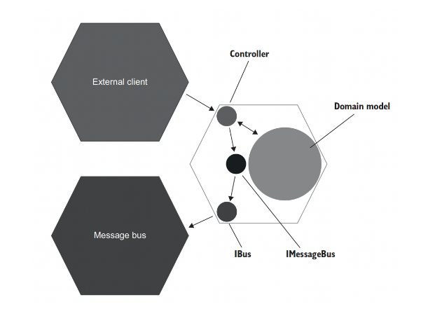

# 21일차 2024-05-05 p.313 ~ 330

## 목 처리에 대한 모범 사례

목은 테스트 대상 시스템과 의존성 간의 상호 작용을 모방하고
검사하는 데 도움이 되는 테스트 대역이다.

목은 비관리 의존성 (외부 애플리케이션에서 식별할 수 있음)에만
적용해야 한다. 다른 것에 목을 사용하면 깨지기 쉬운 테스트
(리팩토링 내성이 없는 테스트)가 된다.

목에 관한 한, 이 지침 하나면 대략 3분의 2 정도의 성공을 거둘 수 있다.

이 장에서는 목에 대해 리팩터링 내성과 회귀 방지를 최대화해서 최대 가치의
통합 테스트를 개발하는 데 도움이 되는 지침을 마저 알아본다.

먼저 일반적인 목 사용법과 그 단점을 알아보고, 단점을 극복할 수 있는 방법을 살펴본다.

### 목의 가치를 극대화하기

비관리 의존성에만 목을 사용하게끔 제한하는 것이 중요하지만,
이는 목의 가치를 극대화하기 위한 첫 번째 단계일 뿐이다.

CRM 시스템

```java
public class UserController {
    private final Database _database;
    private final EventDispatcher _eventDispatcher;

    public UserController(Database database, IMessageBus messageBus, IDomainLogger domainLogger) {
        _database = database;
        _eventDispatcher = new EventDispatcher(messageBus, domainLogger);
    }

    public String changeEmail(int userId, String newEmail) {
        Object[] userData = _database.getUserById(userId);
        User user = UserFactory.create(userData);

        String error = user.canChangeEmail();
        if (error != null) {
            return error;
        }

        Object[] companyData = _database.getCompany();
        Company company = CompanyFactory.create(companyData);

        user.changeEmail(newEmail, company);

        _database.saveCompany(company);
        _database.saveUser(user);
        _eventDispatcher.dispatch(user.domainEvents);
      

        return "OK";
    }
}

```

 통합  테스트

이 테스트는 모든 프로세스 외부 의존성을 거친다. 

```java
public void Changing_email_from_corporate_to_non_corporate(){
    // 준비
        var db = new Database(ConnectionString);
        User user = CreateUser("user@mycorp.com", UserType.Employee ,db);
        CreateCompany("mycorp.com" , 1 , db);
        
        var messageBusMock = new Mock<IMessageBus>();
        var loggerMock = new Mock<IDomainLogger>();
        var sut = new UserController(db , messageBusMock.Object , loggerMock.Object);
        
  // 실행
  string result = sut.ChangeEmail(user.UserId , "new@gmail.com");
  
  // 검증
  Assert.Equal("OK" , result);
  
  object[] userData = db.GetUserById(user.UserId);
  User userFromDb = UserFactory.Create(userData);
  Assert.Equal("new@gmail.com", userFromDb.Email);
  Assert.Equal(UserType.Customer , userFromDb.Type);
  
  object[] companyData = db.GetCompany();
  Company companyFromDb = CompanyFactory.Create(companyData);
  Assert.Equal(0, companyFromDb.NumberOfEmployees);
  
  messageBusMock.Verify(
          x => x.SendEmailChangedMessage(
          user.UserId , "new@gmail.com",
        Times.Once);
        );
  
  loggerMock.verify(
        x => x.UserTypeHasChanged(
        user.UserId, UserType.Employee ,UserType.Customer)
        , Times.Once);
                )
          )
  
  )
}
```

### 시스템 끝에서 상호 작용 검증하기

위의 통합 테스트에서 사용했던 목이 회귀 방지와 리팩터링 내성 측면에서
이상적이지 않은 이유와 이를 해결하는 방법을 살펴보자.

위 테스트에서 messageBusMock 의 문제점은 
IMessageBus 인터페이스가 시스템 끝에 있지 않다는 것이다. 

MessageBus 와 IBus 인터페이스 둘 다 프로젝트 코드베이스에
속한다. IBus 는 메시지 버스 SDK 라이브러리 위에 있는
래퍼다.  이 래퍼는 연결 자격 증명과 같이 꼭 필요하지 않은
기술 세부 사항을 캡슐화하고, 임의의 텍스트 메시지를 메시지 버스로
보낼 수 있는 멋지고 깔끔한 인터페이스다.

IMessageBus 는 IBus 위에 있는 래퍼로, 도메인과 관련된 메시지를 정의한다. 

IMessageBus 를 사용하면 이러한 모든 메시지를 한 곳에 보관하고
애플리케이션에서 재사용할 수 있다.

IBus 와 IMessageBus 인터페이스를 합칠 수 있지만, 그것은 어디까지나 차선책이다.

이렇게 두 가지 책임은 분리돼 있는 것이 좋다.



IBus 는 컨트롤러와 메시지 버스 사이의 타입 사슬에서 마지막 고리이며,
IMessageBus 는 중간이다.

IMessageBus 대신 IBus를 목으로 처리하면 회귀 방지를 극대화할 수 있다.

회귀 방지는 테스트 중에 실행된느 코드 양에 대한 함수다.
비관리 의존성과 통신 하는 마지막 타입을 목으로 처리하면 
통합 테스트가 거치는 클래스의 수가 증가하므로 보호가 향상된다.

다음은 IMessageBus 에서 IBus 로 대상을 바꾼 후의 통합 테스트다.

`IBus를 대상으로 한 통합 테스트`

```java
public void Changing_email_from_corporate_to_non_corporate()
        {
            var busMock = new Mock<IBus>();
            var messageBus = new MessageBus(busMock.Object);
            var loggerMock = new Mock(<IDomainLogger>)();
            var sut = new UserController(db , messageBus , loggerMock.Object);
            
            busMock.Verify(
                    x => x.Send(
                            "Type : USER EMAIL CHANGED; " +
                            $"Id :  {user.UserId};" +
                            "NewEmail : new@gmail.com"),
        
        Times.Once);
        )
        }
```

이제 테스트에서 해당 ImessageBus 인터페이스가 아닌 MessageBus 구체 클래스를 어떻게
사용하는지 보라. ImessageBus 는 구현이 하나뿐인 인터페이스이며,
이러한 인터페이스를 두기에 타당한 이유는 목으로 처리하기 위한 것 뿐이다.

ImessageBus 를 더 이상 목으로 처리하지 않기 때문에 
이 인터페이스를 삭제하고 MessageBus 로 대체할 수 있다.

작성했던 사용자 정의 클래스에 대한 호출을 검증하는 것과
외부 시스템에 전송한 실제 텍스트 사이에는 큰 차이가 있다. 
외부 시스템은 애플리케이션으로부터 텍스트 메시지를 수신하고,
MessageBus  와 같은 클래스를 호출하지 않는다.

실제로 텍스트 메시지는 외부에서 식별할 수 있는 유일한 사이드 이펙트이다.

이러한 메시지를 생성하는 데 참여하는 클래스는 단지 구현 세부 사항일 뿐이다.
따라서 시스템 끝에서 상호 작용을 확인하면 회귀 방지가 좋아질 뿐만 아니라
리팩터링 내성도 향상된다. 결국 테스트는 잠재적인 거짓 양성에 
노출될 가능성이 낮아진다. 리팩터링을 하더라도 메시지 구조를 유지하는 한, 해당 테스트는 빨간색으로 바뀌지 않는다.

단위 테스트에 비해 통합 테스트와 엔드 투 엔드 테스트가 리팩터링 내성이 우수한 것 처럼,
여기서도 동일한 메커니즘을 가진다. 그러므로 이러한 코드는 코드베이스와의 결합도가 낮기 때문에 
낮은 수준의 리팩터링에도 영향을 많이 받지 않는다.

### 목을 스파이로 대체하기

스파이는 목과 같은 목적을 수행하는 테스트 대역이다.

스파이는 수동으로 작성하는 반면에 목은 목 프레임워크의 도움을 받아
생성한다는 것이 유일한 차이점이다.

실제로 스파이는 종종 직접 작성한 목이라고도 한다.

시스템 끝에 있는 클래스의 경우 스파이가 목보다 낫다.

스파이는 검증 단계에서 코드를 재사용해 테스트 크기를 줄이고 가독성을 향상시킨다.


```java
class BusSpy: IBus {

    private val _sentMessages: MutableList<String> = mutableListOf()

    override fun send(message: String) {
        _sentMessages.add(message)
    }

    fun shouldSendNumberOfMessages(number: Int): BusSpy {
        assertEquals(number, _sentMessages.count())
        return this
    }

    fun withEmailChangedMessage(userId: Int, newEmail: String): BusSpy {
        val message = "Type: USER EMAIL CHANGE; " +
                "ID: $userId;" +
                "NewEmail: $newEmail"
        assertContains(_sentMessages, message)

        return this
    }

}
```

```java
@Test
fun changing_email_from_corporate_to_non_corporate_v3() {

    val db = Database(CONNECTION_STRING)
    val user: User = createUser("user@gmail.com", UserType.Employee, db)
    createCompany("gmail.com", 1, db)

    val spyBus = BusSpy()
    val messageBus = MessageBus(spyBus)
    val mockLogger = mock<DomainLogger>()
    val sut = UserController(
        db, messageBus, mockLogger
    )

    // ...

    spyBus.shouldSendNumberOfMessages(1)
        .withEmailChangedMessage(user.userId, "new@gmail.com")

}
```

BusSpy 가 제공하는 플루언트 인터페이스 덕분에 이제 메시지 버스와의 상호작용을 검증하는 것이 간결해졌고
표현력도 생겼다. 이 플루언트 인터페이스 덕분에 여러 가지 검증을 묶을 수 있으므로
응집도가 높고 쉬운 영어 문장을 형성할 수 있다.

### 목 처리에 대한 모범 사례

목을 처리하는 것과 관련해 지금까지 두 가지 주요 모범 사례를 배웠다.

- 비관리 의존성에만 목 적용하기
- 시스템 끝에 있는 의존성에 대해 상호 작용 검증하기

이 절에서는 나머지 모범 사례를 설명한다.

- 통합 테스트에서만 목을 사용하고 단위 테스트에서는 하지 않기
- 항상 목 호출 수 확인하기
- 보유 타입만 목으로 처리하기

#### 목은 통합 테스트 만을 위한 것

목이 통합 테스트만을 위한 것이며 단위 테스트에서 목을 사용하면 안 된다는 지침은
비즈니스 로직과 오케스트레이션의 분리에서 비롯된다. 
코드가 복잡하거나 프로세스 외부 의존성과 통신할 수 있지만,
둘 다는 아니다. 이 원칙은 자연스럽게 도메인 모델과 컨트롤러라는 고유 계층 두 개로 만들어진다.
도메인 모델에 대한 테스트는 단위 테스트 범주에 속하며, 컨트롤러를 다루는 테스트는 
통합 테스트다. 목은 비관리 의존성에만 해당하며 컨트롤러만 이러한 의존성을 처리하는 코드 이기 때문에
통합 테스트에서 컨트롤러를 테스트할 때만 목을 적용해야 한다.

#### 테스트당 목이 하나일 필요는 없음

테스트당 목을 하나만 두라는 지침을 들을 수도 있다.
이 지침에 따르면, 목이 둘 이상인 경우 한 번에 여러 가지를 테스트할 가능성이 있다.

이는 2장에서 다뤘던 기본적인 오해 (단위 테스트에서의 '단위'는 코드 단위를 나타내며, 이러한 모든 단위는 서로 격리해 테스트해야 한다는 것)에서
비롯된 또 다른 오해다.

오히려 '단위'라는 용어는 코드 단위가 아니라 동작 단위를 의미한다.
동작 단위를 구현하는 데 필요한 코드의 양은 관계가 없다.

단일 클래스부터 여러 클래스에 이르기까지 다양하게 걸쳐 있을 수 있고,
아주 작은 메서드에 불과할 수도 있다.

목을 사용해도 같은 원칙이 적용된다. 동작 단위를 검증하는 데 필요한 목의 수는
관계가 없다.

목을 사용해도 같은 원칙이 적용된다. 동작 단위를 검증하는 데 필요한 목의 수는 
관계가 없다.
이 장의 앞부분에서 사용자 이메일을 기업에서 일반으로 변경하는 시나리오를 확인하는 데
두 가지 목이 필요했다. 개수는 더 많을 수 있다. 

실제로 통합 테스트에 사용할 목의 수를 통제할 수 없다.

목의 수는 운영에 참여하는 비관리 의존성 수에만 의존한다.

#### 호출 횟수 검증하기

비관리 의존성과의 통신에 관해서는 다음 두 가지 모두 확인하는 것이 중요하다.

- 예상하는 호출이 있는가?
- 예상치 못한 호출은 없는가?

#### 보유 타입만 목으로 처리 하기

서드파티 라이브러리 위에 항상 어댑터를 작성하고 기본 타입 대신
해당 어댑터를 목으로 처리해야 한다. 관련된 몇 가지 주장을 소개하면
다음과 같다.

- 서드파티 코드의 작동 방식에 대해 깊이 이해하지 못하는 경우가 많다.
- 해당 코드가 이미 내장 인터페이스를 제공하더라도 목으로 처리한 동작이 실제로 외부 라이브러리와 일치하는지 확인해야 하므로, 해당 인터페이스를 목으로 처리하는 것은 위험하다.
- 서드파티 코드의 기술 세부 사항까지는 꼭 필요하지 않기에 어댑터는 이를 추상화하고, 애플리케이션 관점에서 라이브러리와의 관계를 정의한다.

실제로 어댑터는 코드와 외부 환경 사이의 손상 방지 계층으로 작동한다.

어댑터를 통해

- 기본 라이브러리의 복잡성을 추상화하고
- 라이브러리에서 필요한 기능만 노출하며
- 프로젝트 도메인 언어를 사용해 수행할 수 있다. 

