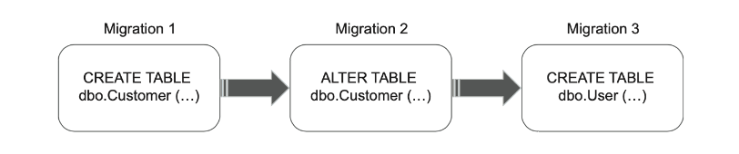
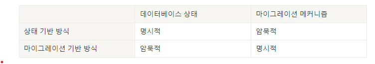
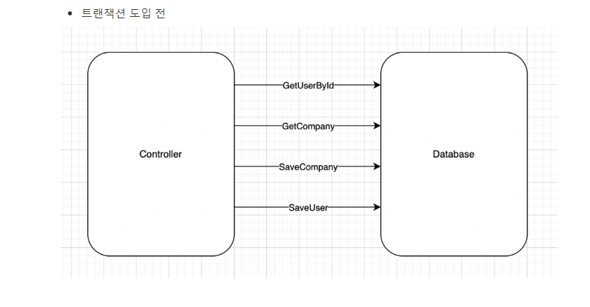
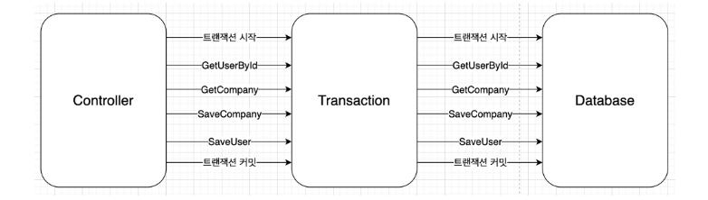
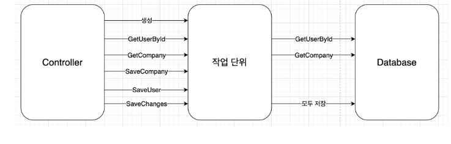

# 22일차 2024-05-07  p.331 ~ 350

## 데이터베이스 테스트

튱합 테스트라는 퍼즐의 마지막 조건은 프로세스 외부 관리 의존성이다.
가장 일반적인 예는 애플리케이션 데이터베이스다. 
애플리케이션 데이터베이스는 다른 애플리케이션이 접근할 수 없는 데이터베이스다.

실제 데이터베이스를 테스트하면 회귀 방지가 아주 뛰어나지만 
설정하기가 쉽지 않다. 

### 데이터베이스 테스트를 위한 전제 조건

통합 테스트에는 관리 의존성이 그대로 있어야 한다. 

목을 사용하는 것은 불가능하기 때문에 
비관리 의존성보다 작업하기가 더 힘들 수 있다.

- 형상 관리 시스템에 데이터베이스 유지
- 모든 개발자를 위한 별도의 데이터베이스 인스턴스 사용
- 데이터베이스 배포에 마이그레이션 기반 방식 적용

#### 데이터베이스를 형상 관리 시스템에 유지

데이터베이스를 테스트하는 방법의 첫 번째 단계는 데이터베이스 스키마를
일반 코드로 취급하는 것이다.

일반 코드와 마찬가지로 데이터베이스 스키마는 Git 과 같은 형상 관리 시스템에
저장하는 것이 최선이다.

프로그래머가 전용 데이터베이스 인스턴스를 유지 보수하는 프로젝트를 
진행한 적이 있다. 
그 데이터베이스 인스터느는 기준점 역할을 했다. 
개발 중에 모든 스키마 변경 사항이 해당 인스턴스에 쌓여갔다.
운영 배포할 때 팀은 운영 데이터베이스와 모델 데이터베이스를 비교하고,
업데이트 스크립트를 생성하기 위한 전문 도구를 사용햇으며,
운영 환경에서 해당 스크립트를 실행했다.

모델 데이터베이스를 사용하는 것은 데이터베이스 스키마를 유지하는 데 
상당히 좋지 못한 방법이다. 
그 이유는 다음과 같다. 

- 변경 내역 부재 :  데이터베이스 스키마를 과거의 특성 시점으로 되돌릴 수 없다. 이는 운영 환경에서 버그를 재현할 때 중요할 수 있다.
- 복수의 원천 정보:  모델 데이터베이스는 개발 상태에 대한 원천 정보를 둘러싸고 경합하게 된다. 이렇게 기준을 두 가지로 두면 부담이 가중 된다.

반면 모든 데이터베이스 스키말 업데이트를 형상 관리 시스템에 두면
원천 정보를 하나로 할 수 있고, 일반 코드 변경과 함께
데이터베이스 변경을 추적할 수 있다.
형상 관리 외부에서는 데이터베이스 구조를 수정하면 안 된다.

#### 참조 데이터도 데이터베이스 스키마다.

데이터베이스 스키마에 관해 유력한 용의자는 테이블, 뷰, 인덱스, 저장 프로시저 그리고
데이터베이스가 어떻게 구성되는지에 대한 청사진을 형성하는 나머지 모든 것이다.
스키마는 SQL 스크립트 형태로 표현된다. 개발 중에 언제든지 
이러한 스크립트로 기능을 완전히 갖춘 최신 데이터베이스 인스턴스를 만들 수 있어야 한다.
그러나 데이터베이스 스키마에 속하지만, 데이터베이스 스키마로 거의 여기지 않는 부분이 있다. 
바로 참조 데이터다.

> 참조 데이터는 애플리케이션이 제대로 작동하도록 미리 채워야 하는 데이터다.

참조 데이터는 애플리케이션의 필수 사항이므로, 테이블, 뷰 그리고 다른 데이터베이스
 스키마와 함께 SQL INSERT 문 형태로 형상 관리 시스템에 저장해야 한다.

참조 데이터는 보통 일반 데이터와 별도로 저장되지만, 두 데이터가 동일한 테이블에
공존하는 경우도 있다. 이렇게 하려면 수정할 수 있는 데이터와 수정할 수 없는 데이터를 
구분하는 플래그를 두고, 애플리케이션이 참조 데이터를 변경하지 못하게 해야 한다.

#### 모든 개발자를 위한 별도의 데이터베이스 인스턴스

실제 데이터베이스로 테스트하는 것은 충분히 어렵다. 
다른 개발자들과 데이터베이스를 공유해야 한다면 훨씬 더 어려워진다.
공유 데이터베이스를 사용하면 개발 프로세스를 방해하게 된다. 

- 서로 다른 개발자가 실행한 테스트는 서로 간섭되기 때문이다.
- 하위 호환성이 없는 변경으로 다른 개발자의 작업을 막을 수 있기 때문이다.

테스트 실행 속도를 극대화하려면 개발자마다 별도로 데이터베이스 인스턴스를 사용하라.

#### 상태 기반 데이터베이스 배포와 마이그레이션 기반 데이터베이스 배포

데이터베이스 배포에는 상태 기반과 마이그레이션 기반이라는 두 가지 방식이 있다.
마이그레이션 기반 방식은 초기에는 구현하고 유지 보수하기가 어렵지만 장기적으로 상태 기반 방식보다 훨씬 효과적이다.

#### 상태 기반 방식

상태 기반 데이터베이스 배포 방식은 배포 중에 비교 도구가 스크립트를 생성해서
운영 데이터베이스를 모델 데이터베이스와 비교해 최신 상태로 유지한다.
차이점은 상태 기반 방식을 사용하면 물리적인 모델 데이터베이스는 원천 데이터가 아니라는 것이다.

대신 해당 데이터베이스를 작성하는 데 사용할 수 있는 SQL 스크립트가 있다.
스크립트는 형상 관리에 저장된다.

상태 기반 접근 방식에서 비교 도구는 모든 어려운 작업을 수행한다.
운영 데이터베이스의 상태와 관계없이, 비교 도구는 불필요한 테이블을 삭제하고
새 테이블을 생성하고 컬럼명을 바꾸는 등 모델 데이터베이스와 동기화하는 데 필요한 모든 작업을 수행한다.

#### 마이그레이션 기반 방식

마이그레이션 기반 방식은 데이터베이스를 어떤 버전에서 다른 버전으로 전환하는 명시적인
마이그레이션을 의미한다. 이 방식은 운영 데이터베이스와 개발 데이터베이스를 자동으로 동기화하기 위하 도구를 
쓸 수 없고, 업그레이드 스크립트를 직접 작성해야 한다. 
하지만 운영 데이터베이스 스키마에서 문서화되지 않은 변경 사항을 발견할 때 
데이터베이스 비교 도구가 아직 유용할 수 있다.

마이그레이션 기반 방식에서 형상 관리에 저장하는 산출물은 
데이터베이스 상태가 아닌 마이그레이션이다. 
마이그레이션은 일반적으로 평이한 SQL 스크립트로 표시하지만,
SQL로 변환할 수 있는 DSL 같은 언어를 사용해 작성할 수도 있다.

#### 상태 기반 방식보다 마이그레이션 기반 방식을 선호하라

데이터베이스 배포와 관련해 상태 기반 방식과 마이그레이션 기반 방식의 차이점은 
이름에서 알 수 있듯이 상태와 마이그레이션에 해당한다.

- 상태 기반 방식은 상태를 형상 관리에 저장함으로써 상태를 명시하고 비교 도구가 마이그레이션을 암묵적으로 제어할 수 있게 한다.
- 마이그레이션 기반 방식은 마이그레이션을 명시적으로 하지만 상태를 암묵적으로 둔다. 데이터베이스 상태를 직접 볼 수 없으며 마이그레이션으로 조합해야 한다.

이렇게 구분하면 다른 형태의 절충으로 이어진다.
데이터베이스 상태가 명확하면 병합 충돌을 처리하기가 수월한 반면,
명시적 마이그레이션은 데이터 모션 문제를 해결하는 데 도움이 된다.

병합 충돌 완화와 데이터 모션 용이성은 똑같이 중요한 이점처럼 보일 수 있지만,
대부분의 프로젝트는 데이터 모션이 병합 충돌보다 훨씬 더 중요하다.

아직 애플리케이션을 운영 환경에서 릴리스 하지 않은 경우가 아니라면
쉽게 폐기할 수 없는 데이터가 반드시 있을 것이다.

### 데이터베이스 트랜잭션 관리

데이터베이스 트랜잭션 관리는 제품 코드와 테스트 코드 모두애 
중요한 주제다. 제품 코드에서 트랜잭션 관리를 적절히 하면
데이터 모순을 피할 수 있다. 

테스트에서는 운영 환경에 근접한 설정으로 데이터베이스 통합을 검증하는 데 도움이 된다.

#### 제품 코드에서 데이터베이스 트랜잭션 관리하기

CRM 프로젝트는 Database 클래스를 사용해 User 및 Company 와 작동한다.
Database 는 각 메서드 호출에서 별도의 SQL 연결을 생성한다.

읽기 전용 연산 중에는 여러 트랜잭션을 열어도 괜찮다.
그러나 비즈니스 연산에 데이터 변경이 포함된다면, 모순을
피하고자 이 연산에 포함된 모든 업데이트는 원자적이어야 한다.
예를 들어, 컨트롤러가 회사는 잘 저장해도 데이터베이스 연결 문제가
생기면 사용자를 저장할 때 실패하게 된다. 

결국 회사의 NumberOfEmployees 는 데이터베이스에 있는 Employee
사용자 수와 일치하지 않을 수 있다.

#### 데이터베이스 트랜잭션에서 데이터베이스 연결 분리하기

- 업데이트할 데이터
- 업데이트 유지 또는 롤백 여부

컨트롤러가 이러한 결정을 동시에 내릴 수 없으므로 이렇게 분리하는 것이
중요하며, 비즈니스 연산의 모든 단계가 성공했을 때 업데이트를 수행할 수 있는지 여부만 안다.
또한 데이터베이스에 접근하고 업데이트를 시도해야만 이러한 단계를 밟을 수 있다.
Database 클래스를 리포지토리와 트랜잭션으로 나눠서 이러한 책임을 구분할 수 있다.

- 리포지토리는 데이터베이스의 데이터에 대한 접근과 수정을 가능하게 하는 클래스다.
샘플 프로젝트는 User 를 위한 리포지터리와 Company 를 위한 리포지토리, 이렇게 두 개가 있게 된다.
- 트랜잭션은 데이터 업데이트를 완전히 커밋하거나 롤백하는 클래스다. 데이터 수정의 원자성 확보를 위해 기본 데이터베이스 트랜잭션에 의존하는 사용자 정의 클래스다.

리포지토리와 트랜잭션은 책임이 서로 다를 뿐만 아니라 수명도 다르다.
트랜잭션은 전체 비즈니스 연산 동안 있으며 연산이 끝나면 폐기된다.
반면에 리포지토리는 수명이 짧다. 데이터베이스 호출이 완료되는 즉시
리포지토리를 폐기할 수 있다. 결국 리포지토리는 항상 현재 트랜잭션 위에서 작동한다.
데이터베이스에 연결할 때는 리포지터리가 트랜잭션에 등록해서 연결 중에 이뤄진 모든 데이터 수정 사항이 나중에
트랜잭션에 의해 롤백될 수 있도록 한다.

명시적 트랜잭션 도입 후

#### 작업 단위로 트랜잭션 업그레이드 하기

리포지토리와 트랜잭션을 도입하면 잠재적인 데이터 모순을 피할 수 있지만
더 좋은 방법이 있다. Transaction 클래스를 작업 단위로 업그레이드할 수 있다.

일반 트랜잭션과 비교해서 작업 단위가 갖는 가장 큰 장점은 업데이트 지연이다.
트랜잭션과 달리 작업 단위는 비즈니스 연산 종료 시점에 
모든 업데이트를 실행하므로 데이터베이스 트랜잭션의 기간을 단축하고
데이터 혼잡을 줄인다.
이 패턴은 종종 데이터베이스 호출 수를 줄이는 데도 도움이 된다

수정된 객체 목록을 관리하고 생성하기 위한 SQL 스크립트를 파악하는 것은
작업이 많아 보일 수 있다. 그러나 실제로는 이러한 작업을 직접 할 필요가 없다.
대부분의 ORM 라이브러리가 작업 단위 패턴을 구현한다.

#### 통합 테스트에서 데이터베이스 트랜잭션 관리하기

통합 테스트에서 데이터베이스 트랜잭션을 관리하는 경우 다음 지침을 
준수하라. 테스트 구절 간에 데이터베이스 트랜잭션이나 작업 단위를 
재사용하지 말라

준비 ,실행, 검증 이라는 세 구절 모두에 동일한 인스턴스를 사용하면 
컨틀롤러가 운영 환경에서 하는 것과 다른 환경을 만들기 때문에 문제가 된다.

동작 모순에 빠지지 않으려면 통합 테스트를 가능한 운영 환경에서와 비슷하게
해야 한다.

> 통합 테스트에서 적어도 세 개의 트랜잭션 또는 작업 단위를 사용하라
(준비, 실행, 검증 구절당 하나씩)
