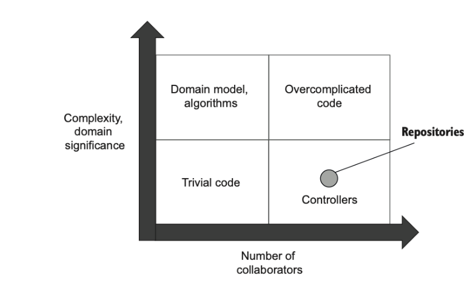

# 23일차 2024-05-08 p.350 ~ 367

### 10.3 테스트 데이터 생명 주기

공유 데이터 베이스를 사용하면 통합 테스트를 서로 분리할 수 없는 문제가 생긴다. 이 문제를 해결하려면,

- 통합 테스트를 순차적으로 실행하라
- 테스트 실행 간에 남은 데이터를 제거하라.

전체적으로 테스트는 데이터베이스 상태에 따라 달라지면 안 된다.
테스트는 데이터베이스 상태를 원하는 조건으로 만들어야 한다.

#### 10.3.1 병렬 테스트 실행과 순차적 테스트 실행

통합 테스트를 병렬로 실행하려면 상당한 노력이 필요하다. 모든 테스트 데이터가 고유한지 확인해야 데이터베이스
제약 조건을 위반하지 않고 테스트가 다른 테스트 후에 입력 데이터를 잘못 수집하는 일이 없다.

남은 데이터를 정리하는 것도 까다로워진다. 성능 향상을 위해 시간을 허비하지 말고 순차적으로 통합 테스트를 실행하는 것이 더 실용적이다.

대부분의 단위 테스트 프레임워크는 별도의 테스트 모음을 정의하고 일부에 대해 병렬 처리를 비활성화할 수 있다.

두 가지의 테스트군을 만들고, 통합 테스트 군은 테스트 병렬 처리를 비활성화한다.

대안으로 컨테이너를 사용해 테스트를 병렬 처리할 수도 있다. 예를 들어 모델 데이터베이스를 도커 이미지로 만들고,
각 통합 테스트를 위해 해당 이미지에서 새 컨테이너를 인스턴스화할 수 있다. 그러나 이러한 방식은 실제로 유지 보수 부담이 너무 커지게 된다.
도커를 사용하면 데이터베이스를 추적해야 할 뿐만 아니라,

- 도커 이미지를 유지 보수해야 하고
- 각 테스트마다 컨테이너 인스턴스가 있는지 확인해야 하며
- 통합 테스트를 일괄 처리하고
- 다 사용한 컨테이너는 폐기해야 한다.

통합 테스트의  실행 시간을 최소화해야 하는 경우가 아니라면 컨테이너를 사용하지 않는 것이 좋다. 다시 말하면,
데이터베이스는 개발자당 하나의 인스턴스만 갖는 것이 더 실용적이다. 
물론 그러한 단일 인스턴스를 도커로 실행할 수도 있다.

#### 10.3.2 테스트 실행 간 데이터 정리

테스트 실행 간에 남은 데이터를 정리하는 방법은 네 가지가 있다.

- 각 테스트 전에 데이터베이스 백업 복원하기 : 이 방법은 데이터 정리 문제를 해결할 수 있지만 다른 세 가지 방법보다 훨씬 느리다. 
컨테이너를 사용하더라도 컨테이너 인스턴스를 제거하고 새 컨테이너를 생성하는 데 보통 몇 초 정도 걸리기 때문에 전체 테스트 스위트 실행 시간이 빠르게 늘어난다.
- 테스트 종료 시점에 데이터 정리하기 : 이 방법은 빠르지만 정리 단계를 건너뛰기 쉽다. 테스트 도중에 빌드 서버가 중단하거나 디버거에서 테스트를 종료하면 입력 데이터는
데이터베이스에 남아 있고 이후 테스트 실행에 영향을 주게 된다.
- 데이터베이스 트랜잭션에 각 테스트를 래핑하고 커밋하지 않기: 이 경우 테스트와 SUT에서 변경한 모든 내용이 자동으로 롤백된다. 이 접근 방식은 정리 단계를 건너뛰는 문제를 해결하지만
또 다른 문제를 제기한다. 이는 작업 단위를 재사용할 때와 같은 문제인데, 추가 트랜잭션으로 인해 운영 환경과 다른 설정이 생성되는 것이다.
- 테스트 시작 시점에 데이터 정리하기 : 이 방법이 가장 좋다. 빠르게 작동하고 일관성이 없는 동작을 일으키지 않으며, 정리 단계를 실수로 건너뛰지 않는다.

데이터베이스의 외래 키 제약 조건을 준수하려면 특정 순서에 따라 데이터를 제거해야 한다.

모든 통합 테스트의 기초 클래스를 두고, 기초 클래스에 삭제 스크립트를 작성하라.

#### 10.3.3 인메모리 데이터베이스 피하기

통합 테스트를 서로 분리하는 또 다른 방법으로 데이터베이스를 SQLite 와 같은 인메모리 데이터베이스로 교체할 수도 있다. 

인 메모리 데이터베이스는 다음과 같은 장점이 있다.

- 테스트 데이터를 제거할 필요가 없음
- 작업 속도 향상
- 테스트가 실행될 때마다 인스턴스화 가능

인메모리 데이터베이스의 장점에도 불구하고, 인메모리 데이터베이스는 일반 데이터베이스와 기능적으로 일관성이 없기 때문에
사용하지 않느 것이 좋다. 이는 또 다시 운영 환경과 테스트 환경이 일치하지 않는 문제이며, 일반 데이터베이스와 인메모리 데이터베이스의 차이로 인해
테스트에서 거짓 양성 또는 거짓 음성이 발생하기 쉽다. 이러한 테스트로는 높은 보호 수준을 기대하기 어렵고, 어쨌든 수동으로 회귀 테스트를 많이 수행해야 할 것이다.

### 10.4 테스트 구절에서 코드 재사용하기

통합 테스트가 너무 빨리 커지면 유지 보수 지표가 나빠질 수 있다. 통합 테스트는 가능한 짧게 하되 서로 결합하거나 가독성에
영향을 주지 않는 것이 중요하다. 아무리 짧은 테스트일지라도 서로 의존해서는 안 된다.
또한 테스트 시나리오의 전체 컨텍스트를 유지해야 하며, 진행 상황을 이해하려고 테스트 클래스의 다른 부분을 검사해서는 안 된다.

통합 테스트를 짧게 하기에 가장 좋은 방법은 비즈니스와 관련이 없는 기술적인 부분을 비공개 메서드나 헬퍼 클래스로 추출하는 것이다. 
더구나 그 부부은 재사용할 수 있다. 

#### 10.4.1 준비 구절에서 코드 재사용하기

테스트 준비 구절 간에 코드를 재사용하기에 가장 좋은 방법은 비공개 팩토리 메서드를 도입하는 것이다.

기본값을 사용하면 인수를 선택적으로 지정할 수 있으므로 테스트를 단축할 수 있다.

#### 팩토리 메서드를 배치할 위치 

테스트에서 중요한 부분만 남기고자 기술적인 부분을 팩토리 메서드로 옮길 때는 이 메서드를 어디에 둬야 하는지를 묻는 질문에 직면하게 된다.

테스트와 같은 클래스에 있어야 할까? 아니면 별도의 헬퍼 클래스에 둘까?

단순하게 시작하라. 기본적으로 팩토리 메서드를 동일한 클래스에 배치하라
코드 복제가 중요한 문제가 될 경우에만 별도의 헬퍼 클래스로 이동하라 기초 클래스에 팩토리 메서드를 넣지 말라
기초 클래스는 데이터 정리와 같이 모든 테스트에서 실행해야 하는 코드를 위한 클래스로 남겨둬야 한다.

#### 10.4.2 실행 구절에서 코드 재사용하기

모든 통합 테스트의 실행 구절에서 데이터베이스 트랜잭션이나 작업 단위를 만든다.

실행 구절도 줄일 수 있다. 
어떤 컨트롤러 기능을 호출해야 하는 지에 대한 정보가 있는 대리자를 받는 메서드를 도입할 수 있다.

#### 10.4.3 검증 구절에서 코드 재사용하기

마지막으로 검증 구절도 줄일 수 있다.

CreateUser 나 CreateCompany와 유사한 헬퍼 메서드를 두는 것이다.

#### 10.4.4 테스트가 데이터베이스 트랜잭션을 너무 많이 생성하는가?

이전에 설명한 대로 통합 테스트를 간결하게 하면 더 읽기 쉽고 유지 보수가 용이하다. 
그러나 한 가지 단점이 있는데, 트랜잭션을 더 많이 생성한다는 것이다.

### 10.5 데이터베이스 테스트에 대한 일반적인 질문

#### 10.5.1 읽기 테스트를 해야 하는가?

읽기 작업의 예는 사용자 정보를 외부 클라이언트로 반환하는 것이다. 
쓰기와 읽기를 모두 테스트해야 하는가?

쓰기를 철저히 테스트하는 것이 매우 중요하다. 왜냐하면 위험성이 높기 때문이다.
쓰기 작업이 잘못되면 데이터가 손상돼 데이터베이스뿐만 아니라 외부 애플리케이션에도 영향을 미칠 수 있다.
쓰기를 다루는 테스트는 이러한 실수에 대비한 보호책이 되므로 매우 가치가 있다.

그러나 읽기는 이에 해당하지 않는다. 읽기 작업의 버그에는 보통 해로운 문제가 없다.
따라서 읽기 테스트 임계치는 쓰기 테스트 임계치보다 높아야 한다. 가장 복잡하거나 중요한 읽기 작업만 테스트하고, 나머지는 무시하라

또한 읽기에는 도메인 모델도 필요하지 않다. 도메인 모델링의 주요 목표 중 하나는 캡슐화다. 
캡슐화는 변경 사항에 비춰 데이터 일관성을 유지하는 것이다. 데이터 변경이 없으면 읽기 캡슐화는 의미가 없다.

불필요한 추상화 계층을 피해서 성능 면에서 ORM 보다 우수한 일반 SQL 을 사용하는 것이 좋다.

읽기에는 추상화 계층이 거의 없기 때문에 (도메인 모델은 이러한 계층 중 하나임) 단위 테스트가 아무 소용이 없다. 
읽기를 테스트하기로 결정한 경우에는 실제 데이터베이스에서 통합 테스트를 하라.

#### 10.5.2 리포지토리 테스트를 해야 하는가?

리포지토리는 데이터베이스 위에 유용한 추상화를 제공한다. 

리포지토리를 다른 통합 테스트와 독립적으로 테스트해야 하는가?
리포지토리가 도메인 객체를 어떻게 데이터베이스에 매핑하는지를 테스트하는 것이 유익할지 모른다.
결국 이 기능에는 실수가 상당히 있을 여지가 있다. 그러나 이러한 테스트는 유지비가 높고 회귀 방지가 떨어져서 테스트 스위트에 손실이 된다.

#### 높은 유지비

리포지터리는 코드 유형 다이어그램에서 컨트롤러 사분면에 포함되며 , 복잡도가 거의 없고
프로세스 외부 의존성인 데이터베이스와 통신한다.

프로세스 외부 의존성이 있으면 테스트의 유지비가 증가한다.

유지비와 관련해 리포지터리 테스트와 일반 통합 테스트는 그 부담 정도가 비슷하다.
그러나 이러한 테스트가 그 대가로 유익한 것도 비슷한가? 

#### 낮은 회귀 방지

리포지터리는 그렇게 복잡하지 않으며 회귀 방지에서 일반적인 통합 테스트가 주는 이점과 겹친다. 
따라서 리포지터리에 대한 테스트는 가치를 충분히 더 주지 못한다. 
리포지터리를 테스트하기에 가장 좋은 방법은 리포지터리가 갖고 있는 약간의 복잡도를 별도의 알고리즘으로 추출하고 해당 알고리즘 전용 테스트를 작성하는 것이다.

안타깝게도 ORM 을 사용할 때 데이터 매핑과 데이터베이스 상호 작용 간의 분리는 불가능하다. 
적어도 리팩토링 내성이 저하되지 않고서는 데이터베이스 호출 없이 ORM 매핑을 테스트할 수 없다.

### 10.6 결론

데이터베이스 테스트를 잘 만들면 버그로부터 훌륭히 보호할 수 있다. 경험상 아주 효과적인 도구인데,
이러한 도구 없이는 해당 소프트웨어를 완전히 신뢰할 수 없다.
이러한 테스트는 데이터베이스를 리팩터링하거나 ORM을 전환하거나 데이터베이스 공급업체를 변경할 때 큰 도움이 된다.

### 요약

- 데이터베이스 스키마를 소스 코드와 같이 형상 관리 시스템에 저장하라.
- 참조 데이터도 데이터베이스 스키마에 해당한다.
- 개발자마다 데이터베이스 인스턴스를 별도로 두게 하라.
- 상태 기반 데이터베이스 배포 방식은 상태를 명시적으로 만들고 비교 도구가 마이그레이션을 암묵적으로 제어할 수 있도록 한다. 