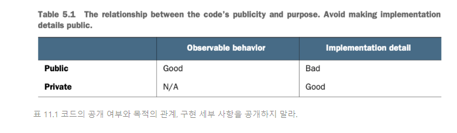

# 24일차 2024-05-09 p.369 ~ 380

## Part 4 단위 테스트 안티 패턴

## 11 단위 테스트 안티 패턴

### 11.1 비공개 메서드 단위 테스트

#### 11.1.1 비공개 메서드와 테스트 취약성

단위 테스트를 하려고 비공개 메서드를 노출하는 경우에는 5장에서 다 룬 기본 원칙 중 하나인 식별할 수 있는 동작만
테스트하는 것을 위반한다. 비공개 메서드를 노출하면 테스트가 구현 세부 사항과 결합되고 결과적으로 리팩토링 내성이 떨어진다.

비공개 메서드를 직접 테스트하는 대신, 포괄적인 식별할 수 있는 동작으로서 간접적으로 테스트하는 것이 좋다.

#### 11.1.2 비공개 메서드와 불필요한 커버리지

때로는 비공개 메서드가 너무 복잡해서 식별할 수 있는 동작으로 테스트하기에 충분히 커버리지를 얻을 수 없는 경우가 있다.
식별할 수 있는 동작에 이미 합리적인 테스트 커버리지가 있다고 가정하면 다음 두 가지 문제가 발생할 수 있다.

- 죽은 코드다. 테스트에서 벗어난 코드가 어디에도 사용되지 않는다면 리팩터링 후에도 남아서 관계없는 코드일 수 있다.
이러한 코드는 삭제하는 것이 좋다.
- 추상화가 누락돼 있다. 비공개 메서드가 너무 복잡하면(그래스 클래스의 공개 API를 통해 테스트하기 어렵다면) 별도의 클래스로 도출해야 하는 추상화가 누락됐다는 징후다.


`예제 11.1 복잡한 비공개 메서드가 있는 클래스`

```java
public class Order {
    private Customer _customer;
    private List<Product> _products;

  

    public String generateDescription() {
        return "Customer name : " + _customer.name +
                "total number of products : " + _products.size() +
                "total price : " + getPrice();
    }

    private BigDecimal getPrice() {
        BigDecimal basePrice = BigDecimal.valueOf(1);
        BigDecimal discounts = BigDecimal.valueOf(1);
        BigDecimal taxes = BigDecimal.valueOf(1);

        return basePrice.subtract(discounts).add(taxes);
    }
}

```

중요한 비즈니스 로직이 있기 때문에 테스트를 철저히 해야 한다. 이 로직은 추상화가 누락됐다. 
GetPrice 메서드를 노출하기 보다는 다음 예제와 같이 추상화를 별도의 클래스로 도출해서 명시적으로 작성하는 것이 좋다.

`예제 11.2 복잡한 비공개 메서드 추출`

```java
public class Order {
    private Customer _customer;
    private List<Product> _products;

    public String generateDescription() {
        PriceCalculator calc = new PriceCalculator();

        return "Customer name : " + _customer.name +
                "total number of products : " + _products.size() +
                "total price : " + calc.calculator(_customer, _products);
    }
}
```


```java
public class PriceCalculator {
    public BigDecimal calculator(Customer customer, List<Product> products) {
        BigDecimal basePrice = BigDecimal.valueOf(1); /* _products 기반한 계산 */
        BigDecimal discounts = BigDecimal.valueOf(1); /* _customer 기반한 계산 */
        BigDecimal taxes = BigDecimal.valueOf(1); /* _products 기반한 계산 */

        return basePrice.subtract(discounts).add(taxes);
    }
}


```

이제 Order 와 별개로 PriceCalculator 를 테스트할 수 있다.
PriceCalculator 에는 숨은 입출력이 없으므로 출력 기반 스타일의 단위 테스트를 사용할 수도 있다.

#### 11.1.3 비공개 메서드 테스트가 타당한 경우

비공개 메서드를 절대 테스트하지 말라는 규칙에도 예외가 있다.



5장에서 살펴봤듯이, 식별할 수 있는 동작을 공개로 하고 구현 세부 사항을 비공개로 하면 API가
잘 설계됐다고 할 수 있다. 반면에 구현 세부 사항이 유출되면 코드 캡슐화를 해친다.

표에서 식별할 수 있는 동작과 비공개 메서드가 만나는 부분은 '해당 없음'으로 돼있다.
메서드가 식별할 수 있는 동작이 되려면 클라이언트 코드에서 사용돼야 하므로 
해당 메서드가 비공개인 경우에는 불가능하다.

비공개 메서드를 테스트하는 것 자체는 나쁘지 않다. 비공개 메서드가 구현 세부 사항의 프록시에 
해당하므로 나쁜 것이다. 구현 세부 사항을 테스트하면 궁극적으로 테스트가 깨지기 쉽다.
그렇기는 해도 메서드가 비공개이면서 식별할 수 있는 동작인 경우는 드물다.

신용 조회를 관리하는  시스템을 예로 들어보자. 하루에 한 번 데이터베이스에 직접 대량으로 새로운 조회를 로드한다.
관리자는 그 조회를 하나씩 검토하고 승인 여부를 결정한다. 

`11.3 비공개 생성자가 있는 클래스`

```java
public class Inquiry {
    public boolean isApproved;
    public LocalDateTime timeApproved;

    private Inquiry(boolean isApproved, LocalDateTime timeApproved) throws Exception {
        if (isApproved && timeApproved == null) {
            throw new Exception();
        }
        this.isApproved = isApproved;
        this.timeApproved = timeApproved;
    }

    public void approve(LocalDateTime now) {
        if (isApproved) {
            return;
        }

        isApproved = true;
        timeApproved = now;
    }
}
```

ORM (객체 관계 매핑) 라이브러리에 의해 데이터베이스에서 클래스가 복원되기 때문에
비공개 생성자는 비공개다.  ORM 은 공개 생성자가 필요하지 않으며, 비공개 생성자로 잘 작동할 수 있다.
그리고 시스템이 이러한 조회를 만들어낼 책임도 없기 때문에 생성자가 필요하지 않다.

객체를 인스턴스화할 수 없다는 점을 고려해 Inquiry 클래스를 어떻게 테스트할까? 한편 승인 로직은 분명히 중요하므로 
단위 테스트를 거쳐야 한다. 그러나 다른 한편으로 생성자를 공개하는 것은 비공개 메서드를 노출하지 않는 규칙을 위반하게 된다.

Inquiry 생성자는 비공개이면서 식별할 수 있는 동작인 메서드의 예다. 이 생성자는 ORM 과의 계약을 지키며, 생성자가
비공개라고 해서 계약이 덜 중요하지 않다. ORM 은 생성자 없이 데이터베이스에서 조회를 복원할 수 없기 때문이다.

따라서 이러한 경우에 Inquiry 생성자를 공개한다고 해서 테스트가 쉽게 깨지지는 않는다.
실제로 클래스 API가 잘 설계된 API에 가까워지는 것임은 분명하다. 생성자가 캡슐화를 지키는 데 필요한 전제 조건이 모두 포함돼 있는지 확인하라

또한 클래스의 공개 API 노출 영역을 가능한 작게 하려면 테스트에서 리플랙션을 통해 Inquiry 를 인스턴스화할 수 있다.
해킹처럼 보이지만, ORM을 따르고 있으며 배후에서 리플렉션을 사용하기도 한다.

### 11.2 비공개 상태 노출

또 다른 일반적인 안티 패턴으로 단위 테스트 목적으로만 비공개 상태를 노출하는 것이 있다.
이 지침은 비공개로 지켜야 하는 상태를 노출하지 말고 식별할 수 있는 동작만 테스트하라는 비공개 메서드 지침과 같다.

`예제 11.4 비공개 상태가 있는 클래스`

```java
public class Customer {

    private CustomerStatus _status = CustomerStatus.REGULAR; // 비공개 상태

    public void promote() {
        _status = CustomerStatus.PREFERRED;
    }

    public double getDiscount() {
        return _status == CustomerStatus.PREFERRED ? 0.05 : 0;
    }

}

```

```java
public enum CustomerStatus {
    REGULAR,
    PREFERRED,
}

```

Promote() 메서드를 어떻게 테스트하겠는가? 이 메서드의 사이드 이펙트는 _status 필드의 변경이지만, 
필드는 비공개 이므로 테스트 할 수 없다.
솔깃한 해결책은 이 필드를 공개하는 것이다. 결국 Promote() 호출의 궁극적인 목표는 상태 변경이 아니겠는가?

그러나 이는 안티 패턴일 것이다. 테스트는 제품 코드와 정확히 같은 방식으로 테스트 대상  시스템과 상호 작용해야 하며,
특별한 권한이 따로 있어서는 안 된다.   예제 11.4 에서 _status 필드는 제품 코드에 숨어있으므로 SUT의 식별할 수 있는 동작이 아니다.
해당 필드를 공개하면 테스트가 구현 세부 사항에 결합된다. 그렇다면 Promote() 를 어떻게 테스트할까?

그 방법은 제품 코드가 이 클래스를 어떻게 사용하는지를 대신 살펴보는 것이다. 이 예제에서 제품 코드는 고객의 상태를 신경 쓰지 않는다.
그렇지 않으면 해당 필드를 공개해야 한다. 제품 코드가 관심을 갖는 정보는 승격 후 고객이 받는 할인뿐이다. 
이것이 테스트에서 확인해야 할 사항이다.

- 새로 생성된 고객은 할인이 없음
- 업그레이드 시 5% 할인율 적용


> **참고**
> <br/>
> 테스트 유의성을 위해 공개 API 노출 영역을 넓히는 것은 좋지 않은 관습이다.

### 11.3 테스트로 유출된 도메인 지식

도메인 지식을 테스트로 유출하는 것은 또 하나의 흔한 안티 패턴이며, 보통 복잡한 알고리즘을 다루는 테스트에서 일어난다.
다음과 같이 (분명 그리 복잡하지 않은) 계산 알고리즘을 예로 들어보자


```java
public class Calculator {
    public static int add(int value1, int value2) {
        return value1 + value2;
    }
}

```

`예제 11.5 알고리즘 구현 유출`

```java
public class CalculatorTests {

    @Test
    @DisplayName("알고리즘 구현 유출")
    public void adding_two_numbers() {
        int value1 = 1;
        int value2 = 3;
        int expected = value1 + value2; // <- 유출

        int actual = Calculator.add(value1, value2);

        assertEquals(expected, actual);
    }
}
```

추가 비용 없이 몇 가지 테스트 사례를 추가도 처리하도록 테스트를 매개변수화할 수도 있다.

`예제 11.6 같은 테스트의 매개변수화 버전`

```java
 @Test
    @DisplayName("같은 테스트의 매개변수화 버전")
    @MethodSource("numberData")
    public void adding_rwo_numbers(int value1, int value2) {
        int expected = value1 + value2; // <- 유출

        int actual = Calculator.add(value1, value2);

        assertEquals(expected, actual);
    }

    private static Stream<Arguments> numberData() {
        return Stream.of(
            Arguments.of(1, 3),
            Arguments.of(11, 33),
            Arguments.of(100, 500)
        );
    }
```

예제 11.5와 11.6은 처음에는 괜찮아 보이지만 , 사실은 안티 패턴의 예다.

이러한 테스트는 구현 세부 사항과 결합되는 또 다른 예다. 리팩터링 내성 지표에서 거의 0점을 받게 되고
결국 가치가 없다. 

이러한 테스트는 타당한 실패와 거짓 양성을 구별할 가능성이 없다.

그렇다면 어떻게 알고리즘을 올바르게 테스트할 수 있는가? 
테스트를 작성할 때 특정 구현을 암시하지 말라. 알고리즘을 복제하는 대신 다음 예제와 같이 결과를 테스트에 하드 코딩 한다.

`예제 11.7 도메인 지식이 없는 테스트`

```java
  @Test
    @DisplayName("도메인 지식이 없는 테스트")
    @MethodSource("numberDataAndExpected")
    public void adding_two_numbers(int value1, int value2, int expected) {
        int actual = Calculator.add(value1, value2);
        assertEquals(expected, actual);
    }

    private static Stream<Arguments> numberDataAndExpected() {
        return Stream.of(
            Arguments.of(1, 3, 4),
            Arguments.of(11, 33, 44),
            Arguments.of(100, 500, 600)
        );
    }
```

처음에는 직관적이지 않아 보일 수 있지만, 단위 테스트에서는 예상 결과를 하드코딩하는 것이 좋다.
하드코딩된 값의 중요한 부분은 (이상적으로 도메인 전문가의 도움을 받아) SUT 가 
아닌 다른 것을 사용해 미리 계산하는 것이다. 물론 알고리즘이 충분히 복잡한 경우에만 그렇다.
(모든 독자는 숫자 두 개를 더하는 데 있어서 전문가다.) 
또는 레거시 애플리케이션을 리팩터링 할 경우에는 레거시 코드가 이러한 결과를 생성하도록 한 후 테스트에서 예상 값ㅇ로
사용할 수 있다.

