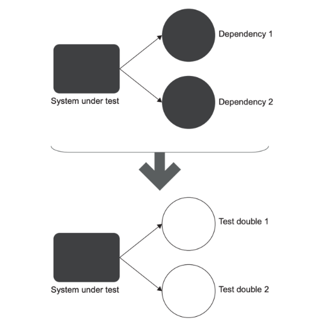
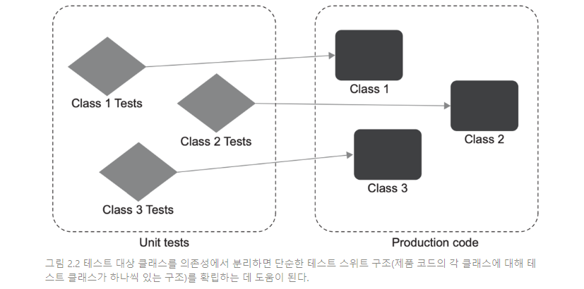
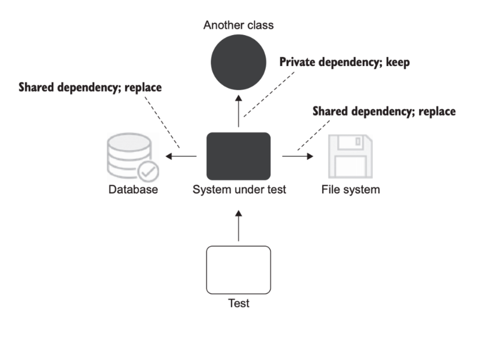

# 2일차 2024-04-02 (p.51 ~ 63)

## 단위 테스트란 무엇인가

단위 테스트에 접근하는 방법이 두 가지 뚜렷한 견해로 나뉘었다.

두 가지 견해는 각각 '고전파' 와 '런던파'로 알려져 있다.

고전파는 모든 사람이 단위 테스트와 테스트 주도 개발에 원론적으로 접근하는 방식이기 때문에 '고전'이라고 한다. 

런단파는 런던의 프로그래밍 커뮤니티에서 시작됐다. 


### 단위 테스트의 정의

- 작은 코드 조각을 검증하고,
- 빠르게 수행하고,
- 격리된 방식으로 처리하는 자동화된 테스트다.

여기서 처음 두 속성은 논란의 여지가 없다.

대중의 의견이 크게 다른 것은 세 번째 속성이다. 격리 문제는 단위 테스트의 고전파와 런던파를 구분할 수 있게 해주는 근원적 차이에 속한다. 


> 단위 테스트의 고전파와 런던파 <br/>
> 고전적 접근법은 '디트로이트'라고도 하며, 때로는 단위 테스트에 대한 고전주의적 접근법이라고도 한다. <br/>
> 아마도 고전파의 입장에서 가장 고전적인 책은 켄트 백이 지은 [테스트 주도 개발]일 것이다. <br/>
> 런턴 스타일을 때때로 '목 추종자'로 표현된다. 목 추종자라는 용어가 널리 퍼져 있지만, 런던 스타일을 따르는 사람들은 보통 그렇게 부르는 것을 좋아하지 않으므로
> 이 책에서는 런던 스타일이라고 소개한다. 

#### 격리 문제에 대한 런던파의 접근

코드 조각을 격리된 방식으로 검증한다는 것은 무엇을 의미하는가? 런던파에서는 테스트 대상 시스템을 협력자 에게서 격리하는 것을 일컫는다.

즉, 하나의 클래스가 다른 클래스 또는 여러 클래스에 의존하면 이 모든 의존성을 테스트 대역 으로 대체해야 한다.
이런 식으로 동작을 외부 영향과 분리해서 테스트 대상 클래스에만 집중할 수 있다.

이 방식의 한 가지 이점은 테스트가 실패하면 코드베이스의 어느 부분이 고장 났는지 확실히 알 수 있다는 것이다. 즉, 확실히 테스트 대상 시스템이 
고장 난 것이다.  클래스의 모든 의존성은 테스트 대역으로 대체됐기 때문에 의심할 여지가 없다.

또 다른 이점은 객체 그래프를 분할할 수 있는 것이다. 모든 클래스가 각각 직접적인 의존성을 갖고 있으며 또 그 의존성이 또 다른 의존성을 갖고 있는 식으로,
그래프가 상당히 복잡해질 수 있다. 클래스는 심지어 순환 의존성이 있을 수도 있는데, 이는 의존성 사슬이 결국 시작된 위치로 돌아오는 것이다.

의존성을 가진 코드베이스를 테스트 하느 것은 테스트 대역 없이는 어렵다. 유일하게 남은 선택은 전체 객체 그래프를 다시 만드는 것이다. 
하지만 클래스의 수가 너무 많으면 어려운 작업일 수 있다.




> 테스트 대상 시스템의 의존성을 테스트 대역으로 대체하면 , 테스트 대상 시스템만 검증하는 데 집중할 수 있을 뿐만 아니라 규모가 큰 상호 연결
> 객체 그래프를 분할 할 수 있다.


테스트 대역을 사용하면 객체 그래프를 다시 만들지 않아도 된다. 또한 클래스의 직접적인 의존성을 대체할 수 있고, 
더 나아가 의존성의 의존성을 다룰 필요도 없다. 그래프를 효과적으로 분해해 단위 테스트에서 준비를 크게 줄일 수 있다.

또한 단위 테스트 격리에는 작지만 유익한 부가적인 이점이 더 있다. 프로젝트 전반적으로 한 번에 한 클래스만 테스트하라는 지침을 도입하면
전체 단위 테스트 스위트를 간단한 구조로 할 수 있다. 더 이상 코드베이스를 테스트 하는 방법을 고민할 필요가 없다.




테스트 예시 


상점에 재고가 충분하면 구매는 성공으로 간주되고, 구매 수량만큼 상점의 제품 수량이 줄어든다. 제품이 충분하지 않으면 구매는 성공하지 못하며
상점에 아무 일도 일어나지 않는다.


고전적인 스타일

```java
public class ClassicStyleTest {

    @Test
    @DisplayName("재고 내에서 구매 요청 성공 테스트")
    void purchaseSucceedsWhenEnoughInventory() throws Exception {
        ClassicStore store = new ClassicStore();
        store.addInventory(SHAMPOO,10);

        ClassicCustomer customer = new ClassicCustomer();
        boolean result = customer.purchase(store, SHAMPOO, 5);
        assertTrue((result));
        assertEquals(5,store.getInventory(SHAMPOO));

    }

    @Test
    @DisplayName("재고 보다 많은 구매 요청 실패 테스트")
    public void purchaseFailsWhenNotEnoughInventory() throws Exception {
        ClassicStore store = new ClassicStore();
        store.addInventory(SHAMPOO,10);
        ClassicCustomer customer = new ClassicCustomer();

        boolean result = customer.purchase(store, SHAMPOO, 15);

        assertFalse(result);
        assertEquals(10,store.getInventory(SHAMPOO));

    }
}

```

준비 부분은 의존성과 테스트 대상 시스템을 모두 준비하는 부분이다.

준비 단계에서는 테스트 대상 시스템과(SUT , System Under Test) 하나의 협력자를 준비한다. 

이 경우 고객이 SUT에, 상점이 협력자에 해당한다.  다음 두 가지 이유로 협력자가 필요하다.

- 테스트 대상 메서드를 컴파일하려면 customer.Purchase() 가 Store 인스턴스를 인수로 필요로 하기 때문에
- 검증 단계에서 customer.Purchase() 의 결과 중 하나로 상점 제품 수량이 감소할 가능성이 있기 때문에

> 테스트 대상 메서드(MUT , Method Under Test) 는 테스트에서 호출한 SUT 의 메서드다. 
> MUT 와 SUT 는 흔히 동의어로 사용하지만, 일반적으로 MUT 는 메서드를 가리키는 데 반해 SUT 는 클래스 전체를 가리킨다. 


이 코드는 단위 테스트의 고전 스타일 예로, 테스트는 협력자(Store 클래스)를 대체하지 않고 운영용 인스턴스를 사용한다.
고전적인 방식의 자연스러운 결과로, 이제 Customer 만이 아니라 Customer 와 Store 둘 다 효과적으로 검증한다. 
그러나 Customer 가 올바르게 작동하더라도 Customer 에 영향을 미치는 Store 내부에 버그가 있으면 단위 테스트에 실패할 수 있다.

테스트에서 두 클래스는 서로 격리돼 있지 않다.


이제 런던 스타일로 예제를 수정해보자. 동일한 테스트에서 Store 인스턴스는 테스트 대역, 구체적으로 목으로 교체해본다.

> 목은 테스트 대상 시스템과 협력자 간의  상호 작용을 검사할 수 있는 특별한 테스트 대역이다. 

흔히 테스트 대역과 목을 동의어로 사용하지만, 기술적으로는 그렇지 않다. 

- 테스트 대역은 실행과 관련 없이 모든 종류의 가짜 의존성을 설명하는 포괄적인 용어다.
- 목은 그러한 의존성의 한 종류 일 뿐이다.


런던 스타일로 작성한 단위 테스트 

```java
@ExtendWith(MockitoExtension.class)
public class LondonStyleTest {

    @Test
    @DisplayName("재고 내에서 구매 요청 성공 테스트")
    void purchaseSucceedsWhenEnoughInventory() throws Exception {
        // given
        IStore store = mock(LondonStore.class);
        when(store.hasInsufficientInventory(SHAMPOO, 5)).thenReturn(false);
        // when
        LondonCustomer customer = new LondonCustomer();
        boolean result = customer.purchase(store, SHAMPOO, 5);
        // then
        assertTrue(result);
        verify(store, times(1)).removeInventory(SHAMPOO, 5);
    }

    @Test
    @DisplayName("재고보다 많은 구매요청 실패 테스트")
    void purchaseFailsWhenNotEnoughInventory() throws Exception {
        // given
        IStore store = mock(LondonStore.class);
        when(store.hasInsufficientInventory(SHAMPOO,15)).thenReturn(true);

        // when
        LondonCustomer customer = new LondonCustomer();

        boolean result = customer.purchase(store, SHAMPOO, 15);

        // then
        assertFalse(result);
        verify(store,times(0)).removeInventory(SHAMPOO,5);
    }
}

```

고전 스타일로 작성된 테스트와 얼마나 다른지 살펴보자. 

준비 단계에서 테스트는 Store 의 실제 인스턴스를 생성하지 않고  mock 를 사용해 대체한다.

또한 샴푸 재고를 추가해 Store 상태를 수정하는 대신 hasInsufficientInventory() 메서드 호출에 어떻게 응답하는지
목에 직접 정의한다. Store 의 실제 상태와 관계없이 테스트가 요구하는 방식으로 요청에 응답한다. 

사실 테스트는 더 이상 Store 를 사용하지 않는다. Store 클래스 대신 IStroe 인터페이스로 목을 만들어 사용했다.

검증 단계도 바뀌었고 중요한 차이점이 여기에 있다. 여전히 이전과 같이 customer.Purchase 호출 결과를 확인하지만, 
고객이 상점에서 올바르게 했는지 확인하는 방법이 다르다. 이전에는 상점 상태를 검증했다. 

지금은 Customer 와 Store 간의 상호 작용을 검사한다. 

즉, 고객이 상점에서 호출을 올바르게 했는지 확인한다. 고객이 상점으로 호출해야 하는 메서드 뿐만 아니라 호출 횟수까지 검증할 수 있다.

고객은 구매가 성공하면 이 메서드를 한 번만 호출해야 하고, 구매가 실패하면 저래도 호출하면 안 된다. 


### 격리 문제에 대한 고전파의 접근

런던 스타일은 테스트 대역으로 테스트 대상 코드 조각을 분리해서 격리 요구 사항에 다가간다. 
흥미롭게도 이 관점은 무엇이 작은 코드 조각에 해당하는지에 대한 견해에도 양행을 미친다.

단위 테스트의 속성을 다시 한 번 살펴보자.

- 단위 테스트는 작은 코드 조각을 검증한다. 
- 신속하게 수행하고,
- 격리된 방식으로 진행한다.

첫 번째 속성에도 다양한 해석이 가능하다.

작은 코드 조각은 얼마나 작아야 하는가? 각각의 모든 클래스를 격리해야 한다면 테스트 대상 코드 조각은 당연히 단일 클래스이거나 
해당 클래스 내의 메서드여야 한다. 격리 문제에 접근하는 방식 때문에 이보다 더 클 수가 없다.

때에 따라 한 번에 몇 개의 클래스를 테스트할 수도 있기는 하다. 그러나 일반적으로 한 번에 한 클래스로 테스트하는 지침을 따르려고 노력해야 한다.

앞에서 언급했듯이 격리 특성을 해석하는 또 다른 방법으로 고전적인 방법이 있다. 
고전적인 방법에서 코드를 꼭 격리하는 방식으로 테스트 해야 하는 것은 아니다. 
대신 단위 테스트는 서로 격리해서 실행해야 한다. 이렇게 하면 테스트를 어떤 순서로 가장 적합한 방식으로 실행할 수 있으며
서로의 결과에 영향을 미치지 않는다. 

각각의 테스트를 격리하는 것은 여러 클래스가 모두 메모리에 상주하고 공유 상태에 도달하지 않는 한, 여러 클래스를 한 번에 테스트 해도 괜찮다는 뜻이다.
이를 통해 테스트가 서로 소통하고 실행 컨텍스트에 영향을 줄 수 있다.

예를 들어 어떤 테스트가 준비 단계에서 데이터베이스에서 고객을 생성할 수 있고, 이 테스트가 실행되기 전에 다른 테스트의 준비 단계에서
고객을 삭제할 수도 있다. 이 두 가지 테스트를 병렬로 실행하면 첫 번째 테스트가 실패하는데, 이는 제품 코드가 고장 나서가 아니라 
두 번째 테스트의 간섭 때문이다.

> 공유 의존성, 비공개 의존성, 프로세스 외부 의존성 <br/>
> 공유 의존성은 테스트 간에 공유되고 서로의 결과에 영향을 미칠 수 있는 수단을 제공하는 의존성이다. 
> <br/> 공유 의존성의 전형적인 예는 정적 가변 필드다. 이러한 필드의 변경 사항은 동일한 프로세스 내에서 실행된느 모든 단위 테스트에서 볼 수 있다. <br/>
> 데이터베이스도 공유 의존성의 전형적인 예가 될 수 있다. <br/> <br/>
> 비공개 의존성은 공유하지 않는 의존성이다. <br/>
> 프로세스 외부 의존성은 애플리케이션 실행 프로세스 외부에서 실행되는 의존성이며, 아직 메모리에 없는 데이터에 대한 프록시다.  <br/>
> 프로세스 외부 의존성은 대부분 공유 의존성에 해당하지만 모두 그런 것은 아니다. 예를 들어 데이터베이스는 프로세스 외부이면서 공유 의존성이다. <br/>
> 그러나 각 테스트 실행 전에 도커 컨테이너로 데이터베이스를 시작하면 테스트가 더 이상 동일한 인스턴스로 작동하지 않기 때문에 프로세스 외부이면서
> 공유하지 않는 의존성이 된다. 이러한 데이터베이스 환경에서는 테스트가 데이터를 변경할 수 없으므로 결과에 서로 영향을 미칠 수 없다.

격리 문제에 대한 이러한 견해는 목과 기타 테스트 대역의 사용에 대한 훨씬 더 평범한 견해를 수반한다. 
테스트 대역을 사용할 수 있지만, 보통 테스트 간에 공유 상태를 일으키는 의존성에 대해서만 사용한다. 



> 단위 테스트를 서로 격리하는 것은 테스트 대상 클래스에서 공유 의존성만 격리하는 것을 의미한다. 비공개 의존성은 그대로 둘 수 있다.


공유 의존성은 테스트 대상 클래스 간이 아니라 단위 테스트 간에 공유한다. 
그런 의미에서 싱글턴 의존성은 각 테스트에서 새 인스턴스를 만들 수 있기만 하면 공유 되지 않는다.
제품 코드에는 싱글턴 인스턴스가 단 하나만 있지만, 테스트는 이 패턴을 따르지 않고 재사용하지도 않는다.

따라서 이러한 의존성은 비공개인 것이다.

예를 들어 설정 클래스는 일반적으로 한 개 뿐이며, 모든 제품 코드에서 이 인스턴스를 재사용한다. 그러나 생성자 등을 통해
다른 모든 의존성이 SUT 에 주입되면 각 테스트에서 새 인스턴스를 만들 수 있다. 테스트 스위트 전체에서 단일 인스턴스를 유지 할 필요는 없다.


> 공유 의존성과 휘발성 의존성 <br/>
> 비슷하지만 동일하지는 않은 또 다른 용어로 휘발성 의존성이 있다.  <br/>
> 휘발성 의존성은 다음 속성 중 하나를 나타내는 의존성이다.  <br/>
> - 개발자 머신에 기본  설치된 환경 외에 런타임 환경의 설정 및 구성을 요구한다. 데이터베이스와 API 서비스가 좋은 예다. 추가 설정이 필요하며 시스템에 기본으로 설치돼 있지 않다. <br/>
> - 비결정적 동작을 포함한다. 예를 들어 난수 생성기 또는 현재 날짜와 시간을 반환하는 클래스 등이 있다. 이런 의존성은 각 호출에 대해 다른 결과를 제공하기 때문에 비결정적이라 한다.
> <br/>
> 공유 의존성과 휘발성 의존성이 겹치는 부분이 있다. 예를 들어 데이터베이스에 대한 의존성은 공유 의존성이자 휘발성 의존성이다.
> 파일 시스템은 모든 개발자 머신에 설치되고 대부분 결정적으로 작동하므로 휘발성이 아니다. 파일 시스템은 단위 테스트가 실행 컨텍스트를 
> 서로 방해할 수 있는 수단이 될 수 있으므로 공유 의존성이다. 마찬가지로 난수 생성기는 휘발성이지만, 각 테스트에 별도의 인스턴스를
> 제공할 수 있으므로 공유 의존성이 아니다.


