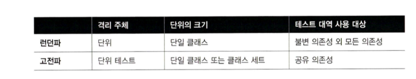
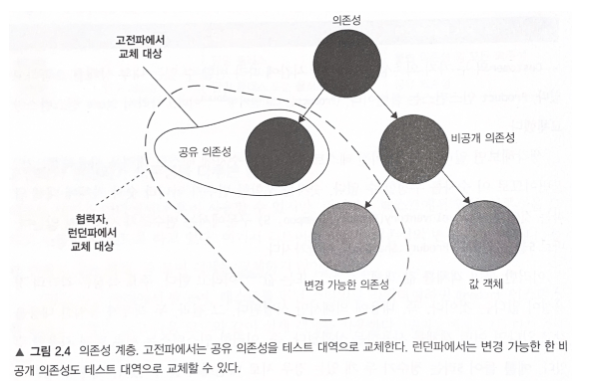
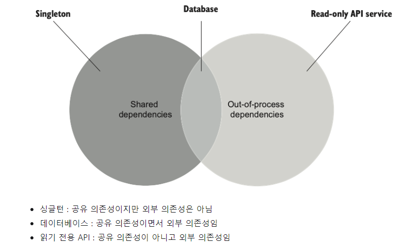
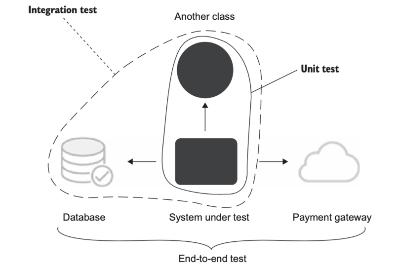

# 3일차 2024-04-03 p.64 ~ 

## 단위 테스트의 런던파와 고전파

런던파와 고전파로 나눠진 원인은 격리 특성에 있다. 
런던파는 테스트 대상 시스템에서 협력자를 격리하는 것으로 보는 반면, 고전파는 단위 테스트끼리 격리하는 것으로 본다.

이러한 사소한 차이 때문에 단위 테스트에 접근하는 방법을 두고 의견이 크게 갈렸고, 
이로 인해 두 개의 분파로 나뉘었다.  종합하면 세 가지 주요 주제에 대해 의견 차이가 있다.

- 격리 요구 사항
- 테스트 대상 코드 조각의 구성 요소
- 의존성 처리



### 고전파와 런던파가 의존성을 다루는 방법

테스트 대역은 어디에서나 흔히 사용할 수 있지만 , 런던파는 테스트에서 일부 의존성을 그대로 사용할 수 있도록 하고 있다.

```java
@Test
@DisplayName("재고보다 많은 구매요청 실패 테스트")
void purchaseFailsWhenNotEnoughInventory() throws Exception {
        // given
        IStore store = mock(LondonStore.class);
        when(store.hasInsufficientInventory(SHAMPOO,15)).thenReturn(true);

        // when
        LondonCustomer customer = new LondonCustomer();

        boolean result = customer.purchase(store, SHAMPOO, 15);

        // then
        assertFalse(result);
        verify(store,times(0)).removeInventory(SHAMPOO,5);
}
```

Customer 의 두 가지 의존성 중 Store 만 시간에 따라 변할 수 잇는 내부 상태를 포함하고 있다.
Product 인스턴스는 불변이다.  따라서 Store 인스턴스만 교체했다.

생각해보면 일리가 있다. 이전 테스트에서 5라는 숫자에 테스트 대역을 사용하겠는가?

불변이므로 이 숫자를 수정할 수 없다.  숫자를 포함한 변수가 아니라 숫자 자체에 대해 말하는 것이다.

이러한 불변 객체를 값 객체 또는 값이라고 한다.  주요 특징은 각각의 정체성이 없다는 것이다. 
즉, 내용에 의해서만 식별된다. 

그 결과, 두 객체가 동일한 내용을 갖고 있다면 어떤 객체를 사용하든 상관없다. 즉, 이러한 인스턴스는 서로 바꿔 사용할 수 있다. 
예를 들어 5라는 정수가 두 개 있는 경우 서로 대신해서 쓸 수 있다. 



의존성의 종류를 나타내고 단위 테스트의 두 분파가 각각 어떻게 처리하는지 보여준다. 
결국 비공개 의존성은 변경 가능하거나 불변일 수 있다. 불변인 경우 값 객체라고 부른다. 

예를 들어 데이터베이스는 공유 의존성이며, 내부 상태는 모든 자동화된 테스트에서 공유한다. 내부 상태는 모든 자동화된 테스트에서 공유한다.

Store 인스턴스는 변경 가능한 비공개 의존성이다. 

> **협력자 대 의존성** <br/> <br/>
> 협력자는 공유하거나 변경 가능한 의존성이다.  
> 예를 들어, 데이터베이스는 공유 의존성이므로 데이터베이스 접근 권한을 제공하는 클래스는 협력자다. 
> Store 도 시간에 따라 상태가 변할 수 있기 때문에 협력자다.
> <br/>
> Product 와 숫자 5도 역시 의존성이지만 협력자는 아니다. 값 또는 값 객체로 분류된ㄷ.
> 일반적인 클래스는 두 가지 유형의 의존성으로 동작한다. 협력자와 값이다. 
> <br/>
> customer.Purchase(store , Product.Shampoo ,5) <br/>
> 여기에 세 가지 의존성이 있다. 하나(store)는 협력자고, 나머지 둘(Product.Shampoo, 5)은 아니다.


의존성에 대해 한 가지만 다시 강조해본다. 
모든 프로세스 외부 의존성이 공유 의존성의 범주에 속하는 것은 아니다. 공유 의존성은 거의 항상 프로세스 외부에 있지만,

 그 반대는 그렇지 않다. 프로세스 외부 의존성을 공유하려면 단위 테스트가 서로 통신할 수 있는 수단이 있어야 한다. 
 의존성 내부 상태를 수정하면 통신이 이뤄진다. 그런 의미에서 프로세스 외부의 불변 의존성은 그런 수단을 제공하지 않는다. 
 


- 싱글턴 : 공유 의존성이지만 외부 의존성은 아님
- 데이터베이스 : 공유 의존성이면서 외부 의존성임
- 읽기 전용 API : 공유 의존성이 아니고 외부 의존성임

모든 제품에 대한 카탈로그를 반환하는 API가 있다면, API는 카탈로그를 변경하는 기능을 노출하지 않는 한 공유 의존성이 아니다.

### 고전파와 런던파의 비교

고전파와 런던파 간의 주요 차이는 단위 테스트의 정의에서 격리 문제를 어떻게 다루는지에 있다.
이는 결국 테스트해야 할 단위의 처리와 의존성 취급에 대한 방법으로 넘어간다.

단위 테스트 고전파는 고품질의 테스트를 만들고 단위 테스트의 궁극적인 목표인 프로젝트의 지속 가능한 성장을 달성하는 데 더 적합하다.
그 이유는 취약성에 있다. 목을 사용하는 테스트는 고전적인 테스트 보다 불안정한 경향이 있기 때문이다. 


런던파의 주요 장점은??

- 입자성이 좋다. 테스트가 세밀해서 한 번에 한 클래스만 확인한다.
- 서로 연결된 클래스의 그래프가 커져도 테스트하기 쉽다. 모든 협력자는 테스트 대역으로 대체되기 때문에 테스트 작성 시 걱정할 필요가 없다.
- 테스트가 실패하면 어떤 기능이 실패했는지 확실히 알 수 있다. 클래스의 협력자가 없다면 테스트 대상 클래스 외에 다른 것을 의심할 여지가 없다.
물론 테스트 대상 시스템이 값 객체를 사용하는 상황이 있을 수 있으며, 이 값 객체의 변경으로 인해 테스트가 실패하게 된다.
그러나 테스트 내 다른 의존성을 모두 제거했기 때문에 이러한 경우는 흔하지 않다.


#### 한 번에 한 클래스만 테스트하기

좋은 입자성에 관한 요점은 단위 테스트에서 단위를 구성하는 것에 대한 논쟁과 관련이 있다.
런던파는 클래스를 단위로 간주한다. 객체지향 프로그래밍 경력을 가진 개발자들은 보통 클래스를 모든 코드베이스의 기초에 위치한 원자 빌딩 블록으로
간주한다. 이로 인해 자연스럽게 클래스를 테스트에서 검증할 원자 단위로도 취급하게 된다. 이런 경향은 이해되기는 하지만 오해의 소지가 있다.

> 테스트는 코드의 단위를 검증해서는 안 된다. 오히려 동작의 단위, 즉 문제 영역에 의미가 있는 것
> 이상적으로는 비즈니스 담당자가 유용하다고 인식할 수 있는 것을 검증해야 한다. 동작 단위를 구현하는 데 클래스가 
> 얼마나 필요한지는 상관없다. 단위는 여러 클래스에 걸쳐 있거나 한 클래스에만 있을 수 있고, 심지어 아주 작은 메서드가 될 수도 있다.


그래서 좋은 코드 입자성을 목표로 하는 것은 도움이 되지 않는다. 테스트가 단일 동작 단위를 검증하는 한 좋은 테스트다.

이보다 적은 것을 목표로 삼는다면 사실 단위 테스트를 훼손하는 결과를 가져온다. 이 테스트가 무엇을 검증하는지 정확히 이해하기가 더 어려워 지기 때문이다.

테스트는 해결하는 데 도움이 되는 문제에 대한 이야기를 들려줘야 하며, 이 이야기는 프로그래머가 아닌 일반 사람들에게 응집도가 높고
의미가 있어야 한다. 

예를 들어 다음은 응집도가 높은 이야기의 예다.

```java
우리집 강아지를 부르면, 바로 나에게 온다.
```

이제 다음과 비교해보자.

```java
우리집 강아지를 부르면 먼저 왼쪽 앞다리를 움직이고, 이어서 오른쪽 앞다리를 움직이고, 
머리를 돌리고, 꼬리를 흔들기 시작한다. 
```

두 번째 이야기는 훨씬 말이 안된다. 저 움직임은 모두 무엇인가
강아지가 나에게 오고 있는가? 아니면 도망을 가고 있는가?
알 수 없다. 실제 동작(개가 주인에게 오는 것) 대신 개별 클래스(다리 ,머리, 꼬리)를 목표로 할 때 
테스트가 이렇게 보이기 시작한다. 

#### 상호 연결된 클래스의 큰 그래프를 단위 테스트하기

실제 협력자를 대신해 목을 사용하면 클래스를 쉽게 테스트 할 수 있다.

특히 테스트 대상 클래스에 의존성이 있고, 이 의존성에 다시 
각각의 의존성이 있고, 이렇게 여러 계층에 걸쳐서 
계속되는 식으로 의존성 그래프가 복잡하게 있을 때 쉽게 테스트 할 수 있다.

테스트 대역을 쓰면 클래스의 직접적인 의존성을 대체해 그래프를 나눌 수 있으며,
이는 단위 테스트에서 준비해야 할 작업량을 크게 줄일 수 있다.

고전파를 따라 테스트 대상 시스템을 설정하려면 전체 객체 그래프를 다시 생성해야 하는데,
작업이 많을 수 있다.

모두 사실이지만, 이 추리 과정은 잘못된 문제에 초점을 맞추고 있다.
상호 연결된 클래스의 크고 복잡한 그래프를 테스트할 방법을 찾는 대신,
먼저 이러한 클래스 그래프를 갖지 않는 데 집중해야 한다.

대개 클래스 그래프가 커진 것은 코드 설계 문제의 결과다.

클래스를 단위 테스트 하려면 테스트 준비 단계를 적정선을 넘게 늘려야 해서
이는 틀림없이 문제의 징후가 있다. 목을 사용하는 것은 이 문제를 
감추기만 할 뿐, 원인을 해결하지 못한다.


#### 버그 위치 정확히 찾아내기

런던 스타일 테스트가 있는 시스템에 버그가 생기면, 보통 SUT에 버그가
포함된 테스트만 실패한다. 하지만 고전적인 방식이면, 오작동하는 클래스를
참조하는 클라이언트를 대상으로 하는 테스트도 실패할 수 있다.

즉, 하나의 버그가 전체 시스템에 걸쳐 테스트 실패를 야기하는
파급 효과를 초래한다. 결국 문제의 원인을 찾기가 더 어려워진다.

문제를 파악하고자 테스트를 디버깅하는 데 시간이 걸릴 수 있다.

우려할 만 하지만, 큰 문제는 아니다. 테스트를 정기적으로 실행하면
버그의 원인을 알아낼 수 있다. 즉, 마지막으로 한 수정이 무엇인지
알기 때문에 문제를 찾는 것은 그리 어렵지 않다. 
또한 실패한 테스트를 모두 볼 필요는 없다.
하나를 고치면 다른 것들도 자동으로 고쳐진다.

게다가 테스트 스위트 전체에 걸쳐 계단식으로 실패하는 데 가치가 있다.
버그가 테스트 하나 뿐만 아니라 많은 테스트에서 결함으로 이어진다면,
방금 고장 낸 코드 조각이 큰 가치가 있다는 것을 보여준다. 즉,
전체 시스템이 그것에 의존한다. 이는 코드 작업 시 명심해야 할 유용한 정보다.

#### 고전파와 런던파 사이의 다른 차이점

- 테스트 주도 개발을 통한 시스템 설계 방식
- 과도한 명세 문제

런던 스타일의 단위 테스트는 하향식 TDD로 이어지며,
전체 시스템에 대한 기대치를 설정하는 상위 레벨 테스트부터 시작한다.

목을 사용해 예상 결과를 달성하고자 시스템이 통신해야 하는 협력자를
지정한다. 그런 다음 모든 클래스를 구현할 때까지 클래스 그래프를 다져나간다.

목은 한 번에 한 클래스에 집중할 수 있기 때문에 이 설계 프로세스를 가능하게 한다. 
테스트할 때 SUT의 모든 협력자를 차단해 해당 협력자의 구현을 나중으로 미룰 수 있다.

고전파는 테스트에서 실제 객체를 다뤄야 하기 때문에 지침을 똑같이 두지 않는다.
대신 일반적으로 상향식으로 한다. 고전적 스타일에서는 도메인 모델을 시작으로 최종 사용자가 소프트웨어를 
사용할 수 있을 때까지 계층을 그 위에 더 둔다. 

그러나 고전파와 런던파 간의 가장 중요한 차이점은 과도한 명세 문제, 
즉 테스트가 SUT의 구현 세부 사항에 결합되는 것이다. 
런던 스타일은 고전 스타일보다 테스트가 구현에 더 자주 결합되는 편이다.
이로 인해 런던  스타일과 목을 전반적으로 아무 데나 쓰는 것에 대해 
주로 이의가 제기 된다.


### 두 분파의 통합 테스트

런던파는 실제 협력자 객체를 사용하는 모든 테스트를 통합 테스트로 간주한다.
고전  스타일로 작성된 대부분의 테스트는 런던파 지지자들에게 통합 테스트로 느껴질 것이다.

단위 테스트는 다음과 같은 특징이 있는 자동화된 테스트다.

- 작은 코드 조각을 검증하고
- 빠르게 수행하고
- 격리된 방식으로 처리한다.

고전파의 관점에서 다시 정의 하면

- 단일 동작 단위를 검증하고
- 빠르게 수행하고
- 다른 테스트와 별도로 처리한다. 

통합 테스트는 이러한 기준 중 하나를 충족하지 않는 테스트다.

예를 들어 공유 의존성(데이터베이스)에 접근하는 테스트는다른 테스트와
분리해 실행할 수 없다. 어떤 테스트에서 데이터베이스 상태 변경이
생기면 병렬로 실행할 때 동일한 데이터베이스에 의존하는 
다른 모든 테스트의 결과가 변경될 것이다.

둘 이상의 동작 단위를 검증할 때의 테스트는 통합 테스트다.
이는 종종 테스트 스위트의 실행 속도를 최적화하려는 노력의 결과다.

#### 통합 테스트의 일부인 엔드 투 엔드 테스트

통합 테스트는 공유 의존성, 프로세트 외부 의존성 뿐 아니라
조직 내 다른 팀이 개발한 코드 등과 통합해 작동하는지도 검증하는 테스트다.

엔드 투 엔드 테스트라는 개념도 따로 있다.

엔드 투 엔드 테스트는 통합 테스트의 일부다. 엔드 투 엔드 테스트도
코드가 프로세스 외부 종속성과 함께 어떻게 작동하는지 검증한다. 

엔드 투 엔드 테스트와 통합 테스트 간의 차이점은 엔드 투 엔드 테스트가
일반적으로 의존성을 더 많이 포함한다는 것이다.


일반적으로 통합 테스트는 프로세스 외부 의존성을 한두 개만 갖고 작동한다.
반면에 엔드 투 엔드 테스트는 프로세스 외부 의존성을 전부 또는 대다수 갖고
작동한다. 따라서 엔드 투 엔드라는 명칭은 모든 외부 애플리케이션을 포함해서
시스템을 최종 사용자의 관점에서 검증하는 것을 의미한다.




엔드 투 엔드 테스트는 유지 보수 측면에서 가장 비용이 많이 들기 때뭉네
모든 단위 테스트와 통합 테스트를 통과한 후 빌드 프로세스 후반에 
실행하는 것이 좋다. 또한 개인 개발자 머신이 아닌
빌드 서버에서만 실행할 수도 있다.

엔드 투 엔드 테스트를 하더라도 모든 프로세스 외부 의존성을 처리하지 못할 수도 있다.
일부 의존성의 테스트 버전이 없거나 해당 의존성을 필요한 상태로
자동으로 가져오는 것이 불가능할 수 있다. 따라서 여전히 테스트 대역을
사용할 필요가 있고, 통합 테스트와 엔드 투 엔드 테스트 사이에
뚜렷한 경계가 없다는 사실을 강조한다.

