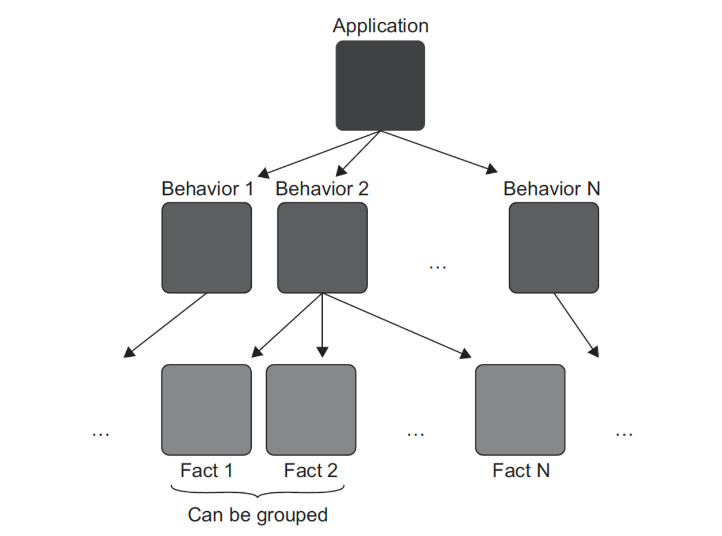

# 5일차 2024-04-05 p.96 ~ 109

## 단위 테스트 명명법

테스트에 표현력이 있는 이름을 붙이는 것이 중요하다. 
올바른 명칭은 테스트가 검증하는 내용과 기본 시스템의 동작을 이해하는 데 도움이 된다.

그렇다면, 단위 테스트 이름을 어떻게 정해야 하는가? 
지난 10년 동안 많은 명명 규칙을 시도해왔다.

가장 유명하지만 가장 도움이 되지 않는 방법 중 하나가 다음과 같은 관습이다.

- 테스트 대상 메서드 : 테스트 중인 메서드의 이름
- 시나리오 : 메서드를 테스트 하는 조건
- 예상 결과 : 현재 시나리오에서 테스트 대상 메서드에 기대하는 것

동작 대신 구현 세부 사항에 집중하게끔 부추기기 때문에 분명히 도움이 되지 않는다.
간단하고 쉬운 영어 구문이 훨씬 더 효과적이며, 엄격한 명명 구조에 얽매이지 않고 표현력이 뛰어나다.

간단한 문구로 고객이나 도메인 전문가에게 의미 있는 방식으로 시스템 동작을 설명할 수 있다.

```java
public class CalculatorTests {

    @Test
    void sumOfTwoNumbersOne() {
        // given
        double first = 10;
        double second = 20;
        Calculator calculator = new Calculator();

        // when
        double result = calculator.sum(first, second);

        // then
        assertEquals(30,result);
    }

}

```

테스트 이름을 [테스트 대상 메서드] _ [시나리오] _ [예상 결과] 규칙으로 다시 쓰면 어떻게 될까? 아마 다음과 같을 것이다.

```java
public void sumTwoNumbersReturnsSum()
```

테스트 대상 메서드는 Sum 이고, 시나리오에는 숫자 두 개가 포함되며, 예상 결과는 이 두 수의 합이다. 


테스트 가독성에 도움이 되지 않는 이름이다.

테스트가 무엇을 검증하는지, 비즈니스 요구 사항과 어떤 관련이 있는지 파악하려면 머리를 더 써야 한다. 
별것 아닌 것처럼 보일지도 모르지만, 시간이 지날수록 정신적으루 부담이 가중된다.

전체 테스트 스위트의 유지비가 천천히 늘어난다.

### 단위 테스트 명명 지침


- 엄격한 명명 정책을 따르지 않는다. 복잡한 동작에 대한 높은 수준의 설명을 이러한 정책의 좁은 상자 안에 넣을 수 없다. 
- 문제 도메인에 익숙한 비개발자들에게 시나리오를 설명하는 것 처럼 테스트 이름을 짓자. 도메인 전문가나 비즈니스 분석가가 좋은 예다.
- 단어를 밑줄 표시로 구분한다. 

테스트 클래스 이름을 지정할 때 [클래스명]Tests 패턴을 사용하지만, 테스트가 해당 클래스만 검증하는 것으로 제한하는 것은 아니다.
단위 테스트에서 단위는 동작의 단위지, 클래스의 단위가 아닌 것을 명심하자.


### 예제: 지침을 따른 테스트 이름 변경


엄격한 정책으로 명명된 테스트

```java
class DeliveryTest {

    @Test
    @DisplayName("과거 배송일은 유효하지 않음을 검증")
    void isDeliveryValidInvalidDateReturnFalse() {
        // given
        DeliveryService sut = new DeliveryService();
        LocalDateTime pastDate = LocalDateTime.now().plusDays(-1);
        Delivery delivery = new Delivery();
        delivery.date = pastDate;

        // when
        boolean isValid = sut.isDeliveryValid(delivery);
        // then
        assertFalse(isValid);
    }

}
```

이 테스트는 DeliveryService 가 잘못된 날짜의 배송을 올바르게 식별하는지 검증한다.

테스트 이름을 쉬운 영어로 다시 작성 해보자

```java
public void DeliveryWithInvalidDateShouldBeConsideredInvalid()
```

- 이제 이름이 프로그래머가 아닌 사람들에게 납득되고, 마찬가지로 프로그래머도 더 쉽게 이해 할 수 있다.
- SUT 의 메서드 이름(IsDeliveryValid) 은 더 이상 테스트명에 포함되지 않는다.

두 번째 요점은 테스트 이름을 쉬운 영어로 다시 썼기에 지나치기 쉽다. 
그러나 중요하고 이 자체만으로 지침으로 삼을 수 있다.

> **테스트명 내 테스트 대상 메서드** <br/>
> 테스트 이름에 SUT의 메서드 이름을 포함하지 말라.
> <br/>
> 코드를 테스트 하는 것이 아니라 애플리케이션 동작을 테스트 하는 것이라는 점을 명심하자.
> 따라서 테스트 대상 메서드의 이름이 중요하지 않다. 앞에서 언급했듯이 SUT 는 단지 진입점, 동작을 호출하는 수단일 뿐이다.
> 테스트대상 메서드의 이름을 isDeliveryCorrect 로 변경할 수 있으며, SUT의 동작에는 아무런 영향을 미치지 않는다.
> 반면 원래 명명 규칙을 따르면 테스트 이름을 바꿔야 한다. 동작 대신 코드를 목표로 하면 해당 코드의 구현 세부 사항과 테스트 간의 결합도가 높아진다는 것을
> 다시 한 번 보여준다.

배송 날짜가 무효하다는 것은 과거의 어느 날짜임을 알 수 있다.

```java
public void DeliveryWithPastDateShouldBeConsideredInvalid()
```
나아지기는 했지만 이상적이지 않다. considered 라는 단어를 제거해도 의미가 퇴색 되지 않는다.

```java
public void DeliveryWithPastDateShouldBeInvalid()
```

should be 문구는 또 다른 일반적인 안티 패턴이다. 

하나의 테스트는 동작 단위에 대해 단순하고 원자적인 사실이다.

사실을 서술할 때는 소망이나 욕구가 들어가지 않는다.

should be를 다음과 같이 is로 바꿔보자.

```java
public void DeliveryWithPastDateIsInvalid()
```

### 매개변수화된 테스트 리팩토링 하기

보통 테스트 하나로는 동작 단위를 완전하게 설명하기에 충분하지 않다.

이 단위는 일반적으로 여러 구성 요소를 포함하며, 각 구성 요소는 자체 테스트로 캡처해야 한다.

동작이 충분히 복잡하면, 이를 설명하는 데 테스트 수가 급격히 증가할 수 있으며 관리하기 어려워 질 수 있다.




가장 빠른 배송일이 오늘로부터 이틀 후가 되도록 작동하는 배송 기능이 있다고 가정
분명히 테스트 하나로는 충분하지 않다.

몇 가지 사실을 포괄하는 테스트

```java
class DeliveryTest {
    
    @ParameterizedTest
    @MethodSource("validDays")
    @DisplayName("복잡한 매개변수 데이터를 사용하여 잘못된 날짜의 배송을 올바르게 식별하는지 검증")
    public void canDetectAnInvalidDeliveryDate(int daysFromNow, boolean expected) {
        DeliveryService sut = new DeliveryService();
        LocalDateTime deliveryDate = LocalDateTime.now().plusDays(daysFromNow);
        Delivery delivery = new Delivery();
        delivery.date = deliveryDate;

        boolean isValid = sut.isDeliveryValid(delivery);

        Assertions.assertEquals(expected, isValid);
    }

    private static Stream<Arguments> validDays() {
        return Stream.of(
                Arguments.of(-1, false),
                Arguments.of(0, false),
                Arguments.of(1, false),
                Arguments.of(2, true)
        );
    }

}
```

매개변수화 된 테스트르 사용하면 테스트 코드의 양을 크게 줄일 수 있지만, 비용이 발생한다.

이제 테스트 메서드가 나타내는 사실을 파악하기가 어려워졌다. 그리고 매개변수가 많을수록 더 어렵다

절충안으로 긍정적인 테스트 케이스는 고유한 테스트로 도출하고, 
가장 중요한 부분을 잘 설명하는 이름을 쓰면 좋다.

긍정적인 시나리오와 부정적인 시나리오를 검증하는 두 가지 테스트

```java
class DeliveryTest {
    
    @ParameterizedTest
    @ValueSource(ints = {-1, 0, 1})
    @DisplayName("어제,오늘,내일 날짜 배송일 실패에 대한 검증")
    public void detectsAnInvalidDeliveryDate(int daysFromNow) {
        DeliveryService sut = new DeliveryService();
        LocalDateTime deliveryDate = LocalDateTime.now().plusDays(daysFromNow);
        Delivery delivery = new Delivery();
        delivery.date = deliveryDate;

        boolean isValid = sut.isDeliveryValid(delivery);

        Assertions.assertFalse(isValid);
    }

    @Test
    @DisplayName("이틀 후 배송일 유효한지 검증")
    public void theSoonestDeliveryDateIsTwoDaysFromNow() {
        DeliveryService sut = new DeliveryService();
        LocalDateTime date = LocalDateTime.now().plusDays(2);
        Delivery delivery = new Delivery();
        delivery.date = date;

        boolean isValid = sut.isDeliveryValid(delivery);

        Assertions.assertTrue(isValid);
    }
}
```

위 방법으로 부정적인 테스트 케이스를 단순하게 할 수 있는데, 테스트 메서드에서
예상되는 boolean 매개변수를 제거 할 수 있기 때문이다.

그리고 물론 긍정적인 테스트 메서드도 매개변수화된 테스트로 바꿔서 여러 날짜를 테스트해볼 수 있다.

보다시피, 테스트 코드의 양과 그 코드의 가독성은 서로 상충된다. 
경험상 입력 매개변수만으로 테스트 케이스를 판단할 수 있다면 긍정적인 테스트 케이스와 부정적인 테스트 케이스 모두
하나의 메서드로 두는 것이 좋다.

그렇지 않으면 긍정적인 테스트 케이스를 도출하라. 그리고 동작이 너무 복잡하면 매개변수화된 테스트를 조금도 사용하지 말라.
긍정적인 테스트 케이스와 부정적인 테스트 케이스 모두 각각 고우의 테스트 메서드로 나타내라.


## 요약

- 모든 단위 테스트는 AAA 패턴을 따라야 한ㄷ다.
- 실행 구절이 한 줄 이상이면 SUT의 API에 문제가 있다는 뜻ㅇ리다.
- SUT 의 이름을 sut로 지정해 SUT 를 테스트에서 구별하자
- 테스트 픽스처 초기화 코드는 생성자에 두지 말고 팩토리 메서드를 도입해서 재사용하자.
- 엄격한 테스트 명명 정책을 시행하지 말라.
- 매개변수화된 테스트로 유사한 테스트에 필요한 코드의 양을 줄일 수 있다.
- 검증문 라이브러리를 사용하면, 쉬운 영어처럼 읽도록 검증문에서 단어 순서를 재구성해 테스트 가독성을 향상 시킬 수 있다.