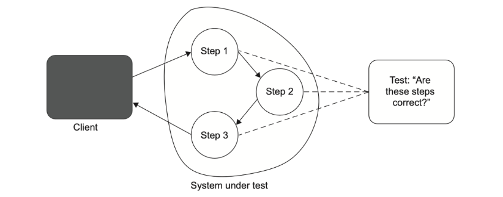
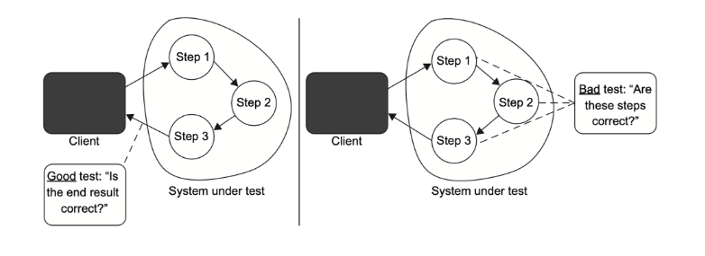

# 6일차 2024-04-06 p.113 ~ 

# 좋은 단위 테스트의 4대 요소

## 좋은 단위 테스트의 4대 요소 살펴보기

- 회귀 방지
- 리팩터링 내성
- 빠른 피드백
- 유지 보수성

### 첫 번째 요소: 회귀 방지

회귀는 코드를 수정한 후 기능이 의도한 대로 작동하지 않는 경우다.

회귀 방지 지표에 대한 테스트 점수가 얼마나 잘 나오는지 평가하려면 다음 사항을 고려 해야 한다.

- 테스트 중에 실행되는 코드의 양
- 코드 복잡도
- 코드의 도메인 유의성


단순한 코드를 다루는 테스트는 실수할 여지가 많지 않기 때문에 회귀 오류가 많이 생기기 않는다.

여러분의 코드 외에 작성하지 않은 코드 (라이브러리, 프레임워크 그리고 프로젝트에서 쓰는 외부 시스템)도 중요하다.

이 코드는 작성한 코드만큼이나 소프트웨어 작동에 영향을 미친다.

### 두 번째 요소: 리팩터링 내성

좋은 단위 테스트의 두 번째 특성은 리팩터링 내성이다. 이는 테스트를 '빨간색'으로 바꾸지 않고
기본 애플리케이션 코드를 리팩터링 할 수 있는지에 대한 척도다.

리팩토링으로 정확히 무엇이 고장 났는지를 자세히 살펴봤지만, 알고 보니 아무것도 고장 나지 않았다. 
기능은 예전과 같이 완벽하게 작동한다. 문제는 기반 코드를 수정하면 테스트가 빨간새긍로 바뀌게끔 작성됐다는 것이다.
그리고 실제로 기능이 작동하지 않는지는 상관없다.

거짓 양성은 허위 경보다. 실제로 기능이 의도한 대로 작동하지만 테스트는 실패를 나타내는 결과다.
이러한 거짓 양성은 일반적으로 코드를 리팩토링할 때, 즉 구현을 수정하지만 식별할 수 있는 동작은 유지할 때 발생한다.

따라서 좋은 단위 테스트의 한 가지 특정으로 이름 붙이자면 '리팩터링 내성'이라 할 수 있다.

리팩터링 내성 지표에서 테스트 점수가 얼마나 잘 나오는지 평가하려면 테스트에서 얼마나 많이 거짓 양성이 발생하는지 살펴봐야 한다. 
적을 수록 좋다.

단위 테스트의 목표는 프로젝트 성장을 지속 가능하게 하는 것이다. 
테스트가 지속 가능한 성장을 하게 하는 메커니즘은 회귀 없이 주기적으로 리팩터링 하고 새로운 기능을 추가하는 것이다.

여기에는 두 가지 장점이 있다.

- 기존 기능이 고장 났을 때 테스트가 조기 경고를 제공한다. 이러한 조기 경고 덕분에 결함이 있는 코드가 운영 환경에 배포되기 훨씬 전에
문제를 해결할 수 있다. 운영 환경이었으면 문제를 처리하는 데 훨씬 더 많은 노력이 필요했을 것이다.
- 코드 변경이 회귀로 이어지지 않을 것이라고 확신하게 된다. 이러한 확신이 없으면 리팩토링을 하는 데 주저하게 되고 코드베이스가 나빠질 가능성이
훨씬 높아진다.


거짓 양성은 이 두가지 이점을 모두 방해한다.

- 테스트가 타당한 이유 없이 실패하면, 코드 문제에 대응하는 능력과 의지가 희석된다. 시간이 흐르면서 그러한 실패에 익숙해지고 
그만큼 신경을 많이 쓰지 않는다. 이내 타당한 실패도 무시하기 시작해 기능이 고장 나도 운영 환경에 들어가게 된다. 
- 반면에 거짓 양성이 빈번하면 테스트 스위트에 대한 신뢰가 서서히 떨어지며, 더 이상 믿을 만한 안전망으로 인식하지 않는다. 
죽, 허위 경보로 인식이 나빠진다. 이렇게 신뢰가 부족해지면 리팩터링이 줄어든다. 회귀를 피하려고 코드 변경을 최소한으로 하기 때문이다.

### 무엇이 거짓 양성의 원인인가?

테스트에서 발생하는 거짓 양성의 수는 테스트 구성 방식과 직접적인 관련이 있다.

테스트와 테스트 대상 시스템(SUT)의 구현 세부 사항이 많이 결합할수록 허위 경보가 더 많이 생긴다.

테스트를 구성하기에 가장 좋은 방법은 문제 영역에 대해 이야기하는 것이다.


메시지의 HTML 표현 생성

```java
@Getter
@Setter
@Builder
@AllArgsConstructor
public class Message {

    public String header;
    public String body;
    public String footer;

}

```

MessageRenderer 클래스는 머리글, 본문, 바닥글을 포함하는 메시지의 HTML 표현을 생성한다.

```java
public class MessageRenderer implements IRenderer {
    public List<IRenderer> subRenderers;

    public MessageRenderer() {
        subRenderers = new ArrayList<>();

        subRenderers.add(new HeaderRenderer());
        subRenderers.add(new BodyRenderer());
        subRenderers.add(new FooterRenderer());
    }

    @Override
    public String render(final Message message) {
        return subRenderers.stream()
                .map(r -> r.render(message))
                .collect(Collectors.joining(""));
    }
}
```

MessageRenderer 의 구조가 올바른지 확인

```java
class MessageRendererTest {

    @Test
    @DisplayName("MessageRenderer 구조가 올바른지 확인")
    void messageRendererUsesCorrectSubRenderers() {
        // given
        MessageRenderer sut = new MessageRenderer();
        // when
        List<IRenderer> renderers = sut.subRenderers;

        // then
        assertEquals(3,renderers.size());
        assertInstanceOf(HeaderRenderer.class,renderers.get(0));
        assertInstanceOf(BodyRenderer.class,renderers.get(1));
        assertInstanceOf(FooterRenderer.class,renderers.get(2));
    }

}
```

이 테스트는 하위 렌더링 클래스가 예상하는 모든 유형이고 올바른 순서로 나타나는지 여부를 확인한다.
여기서 MessageRenderer가 메시지를 처리하는 방식도 정확해야 한다고 가정한다.

처음에는 테스트가 좋아 보이지만, MessageRenderer 의 식별할 수 있는 동작을 실제로 확인하는가? 하위 렌더링 클래스를 재배열하거나
그중 하나를 새 것으로 교체하면 어떻게 될까? 버그로 이어지는가?

반드시 그렇지는 않다. 하위 렌더링 클래스의 구성을 변경해도 HTML 문서가 동일하게 유지될 수 있다.

예를 들어 BodyRender 를 동일한 작업을 수행하는 BoldRenderer 로 바꿀 수 있다.

또는 모든 하위 렌더링 클래스를 제거하고 MessageRenderer 에서 직접 렌더링을 구현 할 수도 있다.

최종 결과가 바뀌지 않을지라도, 테스트를 수행하면 빨간색으로 변할 것이다. 

이는 테스트가 SUT가 생성한 결과가 아니라 SUT 의 구현 세부 사항과 결합했기 때문이다. 



MessageRenderer 클래스의 상당 부분을 리팩터링하면 테스트가 실패한다. 
말하자면, 리팩터링 과정은 애플리케이션의 식별할 수 있는 동작에 영향을 주지 않으면서 구현을 변경하는 것이다.
그리고 변경할 때마다 빨간색으로 변하는 것은 바로 테스트가 구현 세부 사항에 관계돼 있기 때문이다.

따라서 SUT 의 구현 세부 사항과 결합된 테스트는 리팩터링 내성이 없다. 
이러한 테스트는 앞에서 설명한 모든 단점을 보여준다. 

- 회귀 발생 시 조기 경고를 제공하지 않는다. 대부분 잘못된 것이므로 이러한 경고는 무시하게 된다. 
- 리팩터링에 대한 능력과 의지를 방해한다. 당연하다. 버그르 찾을 때 테스트가 어느 방향인지 알려 줄 수 없다면
누가 리팩터링 하고 싶겠는가?


MessageRenderer 클래스의 소스 코드 검증

```java
class MessageRendererTest {
    
    @Test
    @DisplayName("MessageRenderer 클래스의 소스코드 검증")
    public void messageRendererIsImplementedCorrectly() throws IOException {
        String sourceCode = Files.readString(
                Paths.get("./src/main/java/chapter04/falsepositive/MessageRenderer.java")
        );

        Assertions.assertEquals(
                "package chapter04.falsepositive;\n" +
                        "\n" +
                        "import java.util.ArrayList;\n" +
                        "import java.util.List;\n" +
                        "import java.util.stream.Collectors;\n" +
                        "\n" +
                        "public class MessageRenderer implements IRenderer{\n" +
                        "\n" +
                        "    public List<IRenderer> subRenderers;\n" +
                        "\n" +
                        "    public MessageRenderer() {\n" +
                        "        subRenderers = new ArrayList<>();\n" +
                        "\n" +
                        "        subRenderers.add(new HeaderRenderer());\n" +
                        "        subRenderers.add(new BodyRenderer());\n" +
                        "        subRenderers.add(new FooterRenderer());\n" +
                        "    }\n" +
                        "\n" +
                        "    @Override\n" +
                        "    public String render(final Message message) {\n" +
                        "        return String.join(\"\",\n" +
                        "            subRenderers.stream()\n" +
                        "                .map(r -> r.render(message))\n" +
                        "                .collect(Collectors.toList())\n" +
                        "        );\n" +
                        "    }\n" +
                        "\n" +
                        "}\n",
                sourceCode
        );
    }

}
```

MessageRenderer 클래스에서 아주 작은 부분이라도 수정하면 실패한다.

이전에 살펴본 테스트와 다르지 않다. 둘 다 SUT 의 식별할 수 있는 동작을 고려하지 않고 특정한 구현만 고집한다.

그리고 구현을 변경할 때마다 둘 다 빨간색으로 바뀐다. 

### 구현 세부 사항 대신 최종 결과를 목표로 하기

테스트를 깨지지 않게 하고 리팩터링 내성을 높이는 방법은 SUT 의 구현 세부 사항과 테스트 간의 결합도를 낮추는 것이다.
즉, 코드의 내부 작업과 테스트 사이를 가능한 한 멀리 떨어뜨리고 최종 결과를 목표로 하는 것이다. 

MessageRenderer 에서 얻는 최종 결과는 무엇인가? 메시지의 HTML 표현이다.

```java
class MessageRendererTest {

    @Test
    @DisplayName("MessageRenderer 에서 생성하는 결과 검증")
    void renderingAMessage() {
        // given
        MessageRenderer sut = new MessageRenderer();
        Message message = Message.builder()
                .header("h")
                .body("b")
                .footer("f")
                .build();

        // when
        String html = sut.render(message);

        // then
        Assertions.assertEquals("<h1>h</h1><b>b</b><i>f</i>", html);
    }
}

```

이 테스트는 MessageRenderer 를 블랙박스로 취급하고 식별할 수 있는 동작에만 신경 쓴다.
결과적으로 테스트는 리팩터링 내성이 부쩍 늘었다.

즉 HTML 출력을 똑같이 지키는 한, SUT의 변경 사항은 테스트에 영향을 미치지 않는다.

