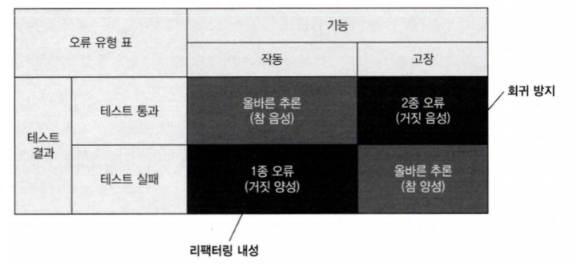
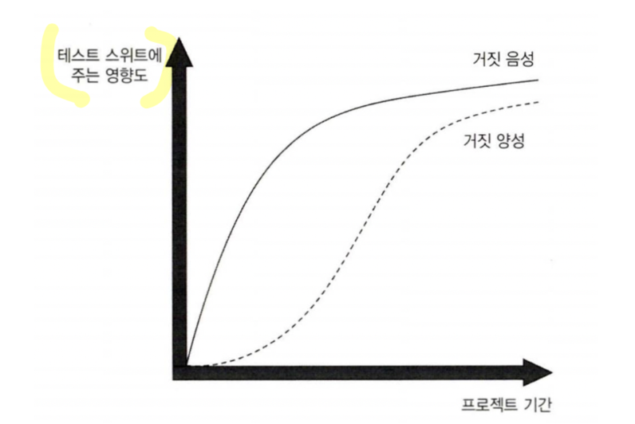
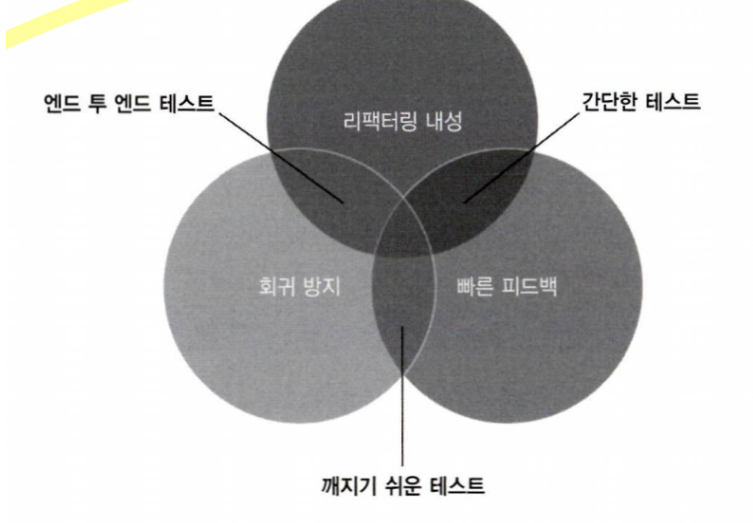
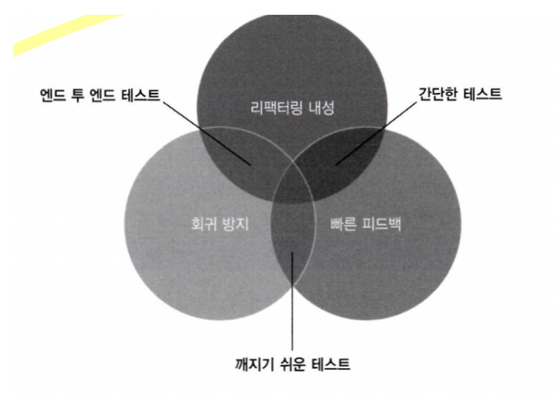

# 7일차 2024-04-06 p.125 ~

## 첫 번째 특성과 두 번째 특성 간의 본질적인 관계

회귀 방지와 리팩터링 내성 사이에는 본질적인 관계가 있다.

둘 다 정반대의 관점에서도 테스트 스위트의 정확도에 기여한다.
이  두 가지 특성은 시간이 흐르면서 프로젝트에 영향을 다르게 미치는 경향이 있다. 프로젝트가 시작된 직후에는
회귀 방지를 훌륭이 갖추는 것이 중요한 데 반해, 리팩터링 내성은 바로 필요하지 않다.

### 테스트 정확도 극대화

테스트는 통과하거나 실패할 수 있다. 
그리고 기능이 잘 작동할 수도 있고 고장 날 수도 있다.



테스트가 통과하고 기본 기능이 의도한 대로 잘 작동하는 상황은 올바른 추론이다. 
테스트는 시스템의 상태를 올바르게 유추했다. 

작동 기능과 통과 테스트의 조합에 대한 용어로 '참 음성'이라고 한다. 

마찬가지로 기능이 고장 나서 테스트가 실패해도 올바른 추론이다. 기능이 제대로 작동하지 않으면
테스트가 실패할 것으로 예상하기 때문이다. 이것이 단위 테스트의 핵심이다.

이 상황에 해당하는 용어는 '참 양성'이다.

그러나 테스트에서 오류가 발생하지 않으면 문제가 된다. 이는 오른쪽 상단 사분면에 속하고 '거짓 음성'이다.

거짓 음성을 피하는 데 좋은 테스트의 첫 번째 특성인 회귀 방지가 도움이 된다.
회귀 방지가 훌륭한 테스트는 2종 오류인 거짓 음성의 수를 최소화하는 데 도움이 된다.

반면에 기능은 올바르지만 테스트가 여전히 실패로 표시되는 대칭적인  상황이 있다.
이는 '거짓 양성', 즉 허위 경보다. 거짓 양성을 피하는 데 두 번째 특성인 리팩터링 내성이 도움이 된다.

여기서 언급한 모든 용어는 통계학에 뿌리를 두고 있지만, 테스트 스위트를 분석하는 데도 적용할 수 있다. 이해하기 좋은 한 가지 방법은
독감 검사를 생각해보는 것이다. 독감 검사는 검사를 받는 사람이 독감에 걸렸을 때 긍정이다. 
독감에 걸리는 것과 관련해서 긍정적인 것은 없기 때문에 긍정이라는 용어가 약간 혼란 스럽기는 하다.

그러나 테스트는 전체적으로 상황을 보지 않는다. 테스트의 맥락에서 긍정은 어떤 조건이 이제 사실임을 의미한다.

이러한 조건은 테스트가 반응하도록 작성자가 설정한 조건이다. 여기서는 독감의 존재가 조건에 해당한다.
반대로 독감이 없으면 독감 검사는 부정이 된다. 

이제 독감 테스트가 얼마나 정확한지 평가할 때 거짓 양성 또는 거짓 음성과 같은 용어가 나타난다.

거짓 양성과 거짓 음성의 확률은 독감 테스트의 수준을 나타낸다. 즉, 확률이 낮을수록 테스트가 더 정확하다.


정확도 지표는 다음 두 가지 요소로 구성된다.

- 테스트가 버그 있음을 얼마나 잘 나타내는가
- 테스트가 버그 없음을 얼마나 잘 나타내는가


테스트 정확도를 향상시키는 방법은 두 가지가 있다. 첫 번째는 분자, 즉 신호를 증가시키는 것이다.
이는  회귀를 더 잘 찾아내는 테스트로 개선하는 것이다.

두 번째는 분모, 즉 소음을 줄이는 것이다. 이는 허위 경보를 발생시키지 않는 테스트로 개선하는 것이다.


### 거짓 양성과 거짓 음성의 중요성 : 역학 관계

단기적으로는 거짓 양성도 거짓 음성 만큼 나쁘지 않다.
프로젝트가 시작될 때, 잘못된 경고를 받는 것은 경고를 전혀 받지 않아 버그가 운영 환경에 들어갈 위험을 감수하는 것에 비해 별일이 아니다.
그러나 프로젝트가 성장함에 따라 거짓 양성은 테스트 스위트에 점점 더 큰 영향을 미치기 시작한다.



초기에는 왜 거짓 양성이 중요하지 않는가? 리팩터링은 바로 중요하지는 않으며, 시간이 지나면서
점차 중요해진다. 프로젝트 초기에는 코드 정리를 많이 할 필요가 없다. 새로 작성된 코드는 완벽하고 반짝반짝하다.

그러나 시간이 흐를수록 코드 베이스는 나빠진다.

이러한 경향을 줄이려면 정기적으로 리팩터링을 해야 한다. 그렇지 않으면 새로운 기능에 드는 비용이 결국 엄청나게 커진다. 

리팩터링이 점점 더 필요해짐에 따라 테스트에서 리팩터링 내성도 점점 더 중요해진다.

### 세 번째 요소와 네 번째 요소: 빠른 피드백과 유지 보수성

테스트 속도가 빠를 수록 테스트 스위트에서 더 많은 테스트를 수행할 수 있고 더 자주 실행할 수 있다.

테스트가 빠르게 실행되면 코드에 결함이 생기자마자 버그에 대해 경고하기 시작할 정도로 피드백 루프를 대폭 줄여서,
버그를 수정하는 비용을 거의 0까지 줄일 수 있다.

반면에 느린 테스트는 피드백을 느리게 하고 잠재적으로 버그를 뒤늦게 눈에 띄게 해서 버그 수정 비용이 증가한다.
오래 걸리는 테스트는 자주 실행하지 못하기 때문에 잘못된 방향으로 가면서 시간을 더 많이 낭비하게 된다.

좋은 단위 테스트의 네 번째 특성인 유지 보수성 지표는 유지비를 평가한다. 이 지표는 다음 두 가지 주요 요소로 구성된다.

- 테스트가 얼마나 이해하기 어려운가
  - 테스트는 코드 라인이 적을 수록 더 읽기 쉽다.
  - 작은 테스트는 필요할 때 변경하는 것도 쉽다.
  - 물론 단지 라인 수를 줄이려고 테스트 코드를 인위적으로 압축하지 않는다고 가정할 때다.
  - 테스트 코드의 품질은 제품 코드만큼 중요하다.
  - 테스트를 작성 할 때 절차를 생략하지 말라. 
  - 테스트 코드를 일급 시민으로 취급하라.
- 테스트가 얼마나 실행하기 어려운가
  - 테스트가 프로세스 외부 종속성으로 작동하면, 데이터베이스 서버를 재부팅하고 네트워크 연결 문제를 해결하는 등 의존성을 상시 운영하는 데 시간을 들여야 한다.


## 이상적인 테스트를 찾아서 

좋은 단위 테스트의 4대 특성

- 회귀 방지
- 리팩토링 내성
- 빠른 피드백
- 유지 보수성

이 네 가지 특성을 곱하면 테스트의 가치가 결정된다. 여기서 곱셈은 수학적인 의미의 곱셈이다.
즉, 어떤 특성이라도 0이 되면 전체가 0이 된다.


물론 이러한 특성을 정확하게 측정하는 것은 불가능하다. 
테스트에 불여서 수치를 정확히 얻을 수 있는 코드 분석 도구는 없다. 

테스트 코드를 포함한 모든 코드는 책임이다. 최소 필수 값에 대해 상당히 높은 임계치를 설정하고 이 임계치를 충족하는 테스트만 테스트 스위트에
남겨라. 소수의 매우 가치 있는 테스트는 다수의 평범한 테스트보다 프로젝트가 계속 성장 하는 데 훨씬 더 효과적이다.


### 이상적인 테스트를 만들 수 있는가?

이상적인 테스트는 네 가지 특성 모두에서 최대 점수를 받는 테스트다.

안타깝게도 그런 이상적인 테스트를 만드는 것은 불가능하다. 처음 세 가지 특성인 회귀 방지, 리팩터링 내성, 빠른 피드백은
상호 배타적이기 때문이다. 세 가지 특성 모두 최대 로 하는 것은 불가능하다. 셋 중 하나를 희생해야 나머지 둘을 최대로 할 수 있다.

네 가지 범주 중 하나에서 0점을 받는 테스트는 가치가 없다. 따라서 특성 중 어느 것도 크게 줄이지 않는 방식으로 최대한 크게 해야 한다.
두 특성을 최대로 하는 것을 목표로 해서 한 가지 특성을 희생해 결국 가치가 0에 가까워진 테스트를 몇 가지 예로 살펴보자.

#### 극단적인 사례 1: 엔드 투 엔드 테스트 

엔드 투 엔드 테스튼는 최종 사용자의 관점에서 시스템을 찾아 본다. 일반적으로 UI, 데이터베이스 ,외부 애플리케이션을 포함한
모든 시스템 구성 요소를 거치게 된다.

엔드 투 엔드 테스트는 많은 코드를 테스트하므로 회귀 방지를 훌륭히 해낸다.

실제로 모든 유형의 테스트 중에서 엔드 투 엔트 테스트가 직접 작성한 코드뿐만 아니라 외부 라이브러리, 프레임워크, 서드파티 애플리케이션 등과
같이 직접 작성하지 않았지만 프로젝트에서 사용하는 코드를 가장 많이 수행한다.

또한 엔드 투 엔드 테스트는 거짓 양성에 면역이 돼 리팩터링 내성도 우수하다. 
리팩터링은 식별할 수 있는 동작을 변경하지 않으므로 엔드 투 엔드 테스트에 영향을 미치지 않는다. 이러한 테스트의 또 다른 장점으로, 
어떤 특정 구현도 강요하지 않는다. 엔드 투 엔드 테스트는 최종 사용자의 관점에서 기능이 어떻게 동작하는지만 볼 수 있으며, 
구현 세부 사항을 최대한 제거했다.

그러나 이러한 이점에도 엔드 투 엔드 테스트에는 큰 단점이 있다. 그것은 바로 느린 속도다. 엔드 투 엔드 테스트에만
의존하는 모든 시스템은 피드백을 빨리 받기가 어려울 것이다.
그리고 많은 개발 팀의 큰 걸림돌이다. 
이는 엔드 투 엔드 테스트만으로 코드베이스를 다루기가 불가능한 까닭이다.



엔드 투 엔드 테스트는 회귀 오류와 거짓 양성에 대한 보호를 훌륭히 해내지만, 빠른 피드백의 지표에서 실패했다.


#### 극단적인  사례 2: 간단한 테스트

간단한 코드를 다루는 간단한 테스트

```java
public class UserTest {

    @Test
    @DisplayName("간단한 코드를 다루는 테스트")
    public void test() {
        User sut = new User();

        sut.name = "John Smith";

        Assertions.assertEquals("John Smith", sut.name);
    }
}

```

엔드 투 엔드 테스트와 달리 , 간단한 테스트는 매우 빠르게 실행되고 빠른 피드백을 제공한다.
또한 거짓 양성이 생길 가능성이 상당히 낮기 때문에 리팩터링 내성도 우수하다.

그러나 기반 코드에 실수할 여지가 많지 않기 때문에 간단한 테스트는 회귀를 나타내지 않을 것이다.

심지어 간단한 테스트는 이름만 바꿀 뿐 '동어 반복 테스트'를 불러온다.
이러한 테스트는 항상 통과하거나 검증이 무의미하기 때문에 어떤 것도 테스트 한다고 할 수 없다.



### 극단적인 사례 3: 깨지지 쉬운 테스트

마찬가지로 실행이 빠르고 회귀를 잡을 가능성이 높지만 거짓 양성이 많은 테스트를 작성하기가 매우 쉽다. 

이러한 테스트를 "깨지기 쉬운 테스트" 라고 한다.

이는 리팩터링을 견디지 못하고, 해당 기능이 고장 났는지 여부와 관계없이 빨간색으로 바뀐다.


실행 중인 SQL 문을 검증하는 테스트

```java
class UserRepositoryTest {

    @Test
    @DisplayName("실행 중인 SQL 문을 검증하는 테스트")
    public void getByIdExecutesCorrectSQLCode()  {
        UserRepository sut = new UserRepository();

        User user = sut.getById(5);

        Assertions.assertEquals(
                "SELECT * FROM dbo.[User] WHERE UserID = 5",
                sut.lastExecutedSqlStatement
        );

        /*
         * SQL문을 변경해도 결과는 같으므로 이 테스트는 좋지않다.

         * SELECT * FROM dbo.User WHERE UserID = 5
         * SELECT * FROM dbo.[User] WHERE UserID = @UserID
         * SELECT UserID, Name, Email FROM dbo.[User] WHERE UserId = 5
         */
    }


}
```

이 테스트는 데이터베이스에서 사용자를 가져올 때 UserRepository 클래스가 올바른 SQL 문을 생성하는 지 확인한다.

이 테스트가 버그를 잡을 수 있는가? 가능 하다. 예를 들어 개발자가 SQL 코드 생성을 엉망으로 할 수 있고 UserId 대신 ID 로 잘못 사용할 수 있으므로
테스트가 실패해서 일르 지적한다. 그러나 이 테스트가 리팩터링 내성이 좋은가? 절대 그렇지 않다.

* SELECT * FROM dbo.User WHERE UserID = 5
* SELECT * FROM dbo.[User] WHERE UserID = @UserID
* SELECT UserID, Name, Email FROM dbo.[User] WHERE UserId = 5

위와 같이 SQL 문을 여러 형태로 변형해도 결과는 같다.


### 이상적인 테스트를 찾아서: 결론