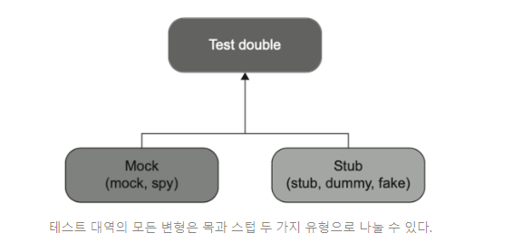
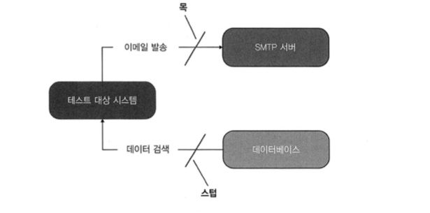

# 8일차 2024-04-17 p.147 ~ 154

## 목과 테스트 취약성

런던파는 테스트 대상 코드 조각을 서로 분리하고 불변 의존성을 제외한 모든 의존성에 테스트 대역을 써서 격리하자고 한다.

고전파는 단위 테스트를 분리해서 병렬로 실행할 수 있게 하자고 한다. 

테스트 간에 공유하는 의존성에 대해서만 테스트 대역을 사용한다. 

## 목과 스텁 구분

목은 테스트 대상 시스템 (SUT) 과 그 협력자 사이의 상호 작용을 검사할 수 있는 테스트 대역이라고 했다. 

### 테스트 대역 유형

테스트 대역은 모든 유형의 비운영용 가짜 의존성을 설명하는 포괄적인 용어다. 

제라드 메스자로스 의 테스트 대역 5가지

- 더미
- 스텁
- 페이크
- 스파이
- 목

테스트 대역의 주 용도는 테스트를 편리하게 하는 것이다. 
테스트 대상 시스템으로 실제 의존성 대신 전달되므로 설정이나 유지보수가 어려울 수 있다.



두 유형의 차이점

- 목은 외부로 나가는 상호 작용을 모방하고 검사하는 데 도움이 된다. 이러한 상호작용은 SUT가 상태를 변경하기 위한 의존성을 호출하는 것에 해당한다. 
- 스텁은 내부로 들어오는 상호 작용을 모방하는 데 도움이 된다. 이러한 상호 작용은 SUT 가 입력 데이터를 얻기 위한 의존성을 호출하는 것에 해당한다.


 


다섯 거지 변형의 차이점

스파이는 목과 같은 역할을 한다. 스파이는 수동으로 작성하는 반면, 목은 목 프레임워크의 도움을 받아 생성된다. 

가끔 '직접 작성한 목' 이라고 부르기도 한다.

한편 스텁, 더미, 페이크의 차이는 얼마나 똑똑한지에 있다. 

더미는 널 값이나 가짜 문자열과 같이 단순하고 하드코딩 된 값이다. SUT 의 메서드 시그니처를 만족시키기 위해
사용하고 최종 결과를 만드는 데 영향을 주지 않는다. 

스텁은 더 정교하다. 시나리오마다 다른 값을 반환하게끔 구성할 수 있도록 필요한 것을 다 갖춘 완전한 의존성이다. 

마지막으로 페이크는 대다수의 목적에 부합하는 스텁과 같다. 차이점은 생성에 있다. 페이크는 보통 아직 존재하지 않는 의존성을 대체하고자  구현 한다.


목과 스텁의 차이점에도 유의 하라

목은 SUT 와 관련 의존성 간의 상호 작용을 모방하고 검사하는 반면, 스텁은 모방만 한다.

### 도구로서의 목과 테스트 대역으로서의 목

`목 라이브러리에서 Mock 클래스를 사용해 목을 생성`


```java
class ControllerTest {

    @Test
    @DisplayName("목 라이브러리에서 Mock 클래스를 사용해 목을 생성")
    void sendingAGreetingsEmail() {
        // given
        IEmailGateway mock = mock(IEmailGateway.class);
        Controller sut = new Controller(mock);

        // when
        sut.greetUser("user@email.com");

        // then
        verify(mock, times(1)).sendGreetingsEmail("user@email.com");
    }

}
```

Mockito 클래스는 테스트 대역을 만들 수 있는 도구다.

다음 테스트에서도 Mockito 클래스를 사용하지만 해당 클래스의 인스턴스는 목이 아니라 스텁이다.

```java
class ControllerTest {
    
    @Test
    @DisplayName("Mock 클래스를 사용해 스텁을 생성")
    void creatingAReport() {
        // given
        IDatabase stub = mock(IDatabase.class);

        when(stub.getNumberOfUsers()).thenReturn(10);
        Controller sut = new Controller(stub);

        // when
        Report report = sut.createReport();

        // then
        assertEquals(10,report.getNumberOfUsers());
        verify(stub, times(1)).getNumberOfUsers();
    }

}
```

이 테스트 대역은 내부로 들어오는 상호 작용, 즉 SUT 에 입력 데이터를 
제공하는 호출을 모방한다. 

이전 예제 에서 sendGreetingsEmail() 에 대한 호출은 외부로
나가는 상호 작용이고 그 목적은 사이트 이펙트를 일으키는 것 뿐이다.

#### 스텁으로 상호 작용을 검증하지 말라

목은 SUT 에서 관련 의존성으로 나가는  상호 작용을 모방하고
검사하는 반면, 스텁은 내부로 들어오는 상호 작용만 모방하고 검사 하지 않는다.

이 두 가지의 차이는 스텁과의 상호 작용을 검증하지 말라는 지침에서 비롯된다.

SUT 에서 스텁으로의 호출은 SUT 가 생성하는 최종 결과가 아니다.

이러한 호출은 최종 결과를 산출하기 위한 수단일 뿐이다. 

즉,  스텁은 SUT 가 출력을 생성하도록 입력을 제공한다.

> 스텁과의 상호 작용을 검증하는 것은 취약한 테스트를 야기하는 일반적인 안티 패턴이다.

테스트에서 거짓 양성을 피하고 리팩터링 내성을 향상시키는 방법은 구현 세부 사항이 아니라
최종 결과를 검증하는 것 뿐이다.

```java
 verify(mock, times(1)).sendGreetingsEmail("user@email.com");
```

위 구문은 실제 결과에 부합하며, 해당 결과는 도메인 전문가에게 의미가 있다.
즉, 인사 메일을 보내는 것은 비즈니스 담당자가 시스템에 하길 원하는 것이다.

그리고 

```java
when(stub.getNumberOfUsers()).thenReturn(10);
  Assertions.assertEquals(10, report.numberOfUsers);
        // 예저 5.3 스텁으로 상호 작용 검증 -> 과잉 명세
  verify(stub, times(1)).getNumberOfUsers();
```
getNumberOfUsers() 를 호출하는 것은 전혀 결과가 아니다.

이는 SUT가 보고서 작성에 필요한 데이터를  수집하는 방법에 대한
내부 구현 사항이다. 

따라서 이러한 호출을 검증 하는 것은 테스트 취약성으로 이어질 수 있다.
결과가 올바르다면 SUT 가 최종 결과를 어떻게 생성하는지는 중요하지 않다.

다음 예제는 깨지기 쉬운 테스트의 예에 해당한다.

`스텁으로 상호 작용 검증`

```java
  @Test
    @DisplayName("Mock 클래스를 사용해 스텁을 생성")
    void creatingAReport() {
        // given
        IDatabase stub = mock(IDatabase.class);

        when(stub.getNumberOfUsers()).thenReturn(10);
        Controller sut = new Controller(stub);

        // when
        Report report = sut.createReport();

        // then
        assertEquals(10,report.getNumberOfUsers());
        //스텁으로 상호 작용 검증
        verify(stub, times(1)).getNumberOfUsers();
    }
```

최종 결과가 아닌 사항을 검증하는 이러한 관행을 과잉 명세라고 부른다.

과잉 명세는 상호 작용을 검사할 때 가장 흔하게 발생한다. 

스텁과의 상호 작용을 확인하는 것은 쉽게 발견할 수 있는 결함이다.

테스트가  스텁과의 상호 작용을 확인해서는 안 되기 때문이다.

목은 더 복잡하다. 목을 쓰면 무조건 테스트 취약성을 초래하는 것은 아니지만
대다수가 그렇다.


#### 목과 스텁 함께 쓰기

때로는 목과 스텁의 특성을 모두 나타내는 테스트 대역을 만들 필요가 있다.

```java
public class StockMockTest {

    @Test
    @DisplayName("목이자 스텁인 storeMock")
    void purchaseFailsWhenNotEnoughInventory() throws Exception {
        // given
        IStore storeMock = mock(IStore.class);
        when(storeMock.hasInsufficientInventory(Product.SHAMPOO, 5)).thenReturn(true);
        LondonCustomer sut = new LondonCustomer();

        // when 
        boolean success = sut.purchase(storeMock, Product.SHAMPOO, 5);

        // then
        assertFalse(success);
        verify(storeMock, times(0)).removeInventory(Product.SHAMPOO, 5);
    }
}
```

테스트 대역은 목이면서 스텁이지만, 여전히 목이라고 부르지 스텁이라고
부르지는 않는다. 
이름을 하나 골라야 하기도 하고, 목이라는 사실이 스텁이라는 사실보다 더 중요하기 때문에 목이라고 한다.