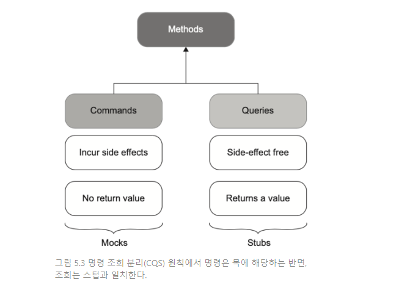
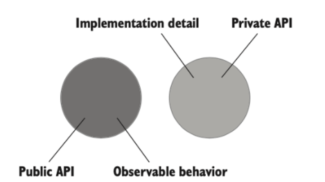
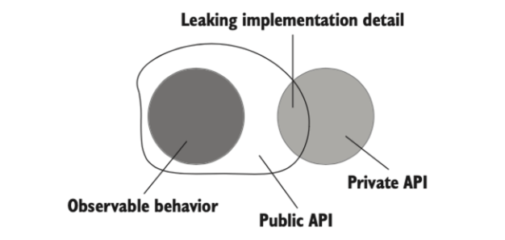

# 9일차 2024-04-18 p.154 ~ 165

### 목과 스텁은 명령과 조회에 어떻게 관련돼 있는가?

목과 스텁의 개념은 명령 조회 분리 (CQS , Command Query Separation) 원칙과 관련이 있다.

CQS 원칙에 따르면 모든 메서드는 명령이거나 조회여야 하며, 이 둘을 혼용해서는 안된다.

명령은 사이드 이펙트를 일으키고 어떤 값도 반환하지 않는 메서드(void 반환)다. 

사이드 이펙트의 예로는 객체 상태 변경, 파일 시스템 내 파일 변경 등이 있다.

조회는 그 반대로, 사이드 이펙트가 없고 값을 반환한다.



이 원칙을 따르고자 할 경우, 메서드가 사이트 이펙트를 일으키면 해당 메서드의 반환 타입이 void 인지 확인하라.

그리고 메서드가 값을 반환하면 사이드 이펙트가 없어야 한다.

다시 말해, 질문을 할 때 답이 달라져서는 안 된다. 이렇게 명확하게 분리하면 코드를 읽기 쉽다.

구현 세부 사항에 대해 자세히 설명하지 않고 시그니처만 봐도 메서드가 무엇을 하는지 알 수 있다.

물론 항상 CQS 원칙을 따를 수 있는 것은 아니다. 사이드 이펙트를 초래하고 값을 반환하는 것이 적절한 메서드는 있기 마련이다,

전형적인 예로 stack.Pop()이 있다. 

이 메서드는 스택에서 최상위 요소를 제거해 호출자에게 반환한다.  그래도 가능할 때마다 CQS 원칙을 따르는 것이 좋다.

명령을 대체하는 테스트 대역은 목이다. 마찬가지로 조회를 대체하는 테스트 대역은 스텁이다.

SendGreetingEmail() 은 이메일을 보내는 사이드 이펙트가 있는 명령이다. 이 명령을 대체하는 테스트 대역이 목이다.

반면 GetNumberOfUsers() 는 값을 반환하고 데이터베이스 상태를 변경하지 않는 조회다. 

해당 테스트의 테스트 대역은 스텁이다.

## 식별할 수 있는 동작과 구현 세부 사항

목과 테스트 취약성 간의 연관성을 찾기 위한 다음 단계로, 취약성을 일으키는 원인을 알아보자.

테스트 취약성은 좋은 단위 테스트의 두 번째 특성인 리팩터링 내성에 해당한다.

단위 테스트에 리팩터링 내성 지표가 있는지 여부는 대부분 이진 선택이므로 리팩토링 내성 지표가 가장 중요하다.

따라서 테스트가 단위 테스트 영역에 있고 엔드 투 엔드 테스트 범주로 바뀌지 않는 한 리팩터링 내성을 최대한 활용하는 것이 좋다.

엔드 투 엔드 테스트 범주로 넘어가면, 리팩터링 내성이 가장 뛰어나도 일반적으로 유지 보수하기가 훨씬 까다롭다.

거짓 양성이 있는 주요 이유는 코드의 구현 세부 사항과 결합돼 있기 때문이라는 것을 알았다.

이러한 강결합을 피하는 방법은 코드가 생성하는 최종 결과를 검증하고 구현 세부 사항과 테스트를 가능한 한 떨어뜨리는 것 뿐이다.

즉, 테스트는 '어떻게'가 아니라 '무엇'에 중점을 둬야 한다. 그렇다면 
구현 세부 사항은 정확히 무엇이며 식별할 수 있는 동작과 어떻게 다른가?


### 식별할 수 있는 동작은 공개 API 와 다르다.

모든 제품 코드는 2차원으로 분류할 수 있다.

- 공개 API 또는 비공개 API
- 식별할 수 있는 동작 또는 구현 세부 사항

식별할 수 있는 동작과 내부 구현 세부 사항에는 미묘한 차이가 있다

코드가 시스템의 식별할 수 있는 동작이려면 다음 중 하나를 해야 한다.

- 클라이언트가 목표를 달성하는 데 도움이 되는 연산을 노출하라.  연산은 계산을 수행하거나 사이트 이펙트를 초래하거나 둘 다 하는 메서드다.
- 클라이언트가 목푤르 달성하는 데 도움이 되는 상태를 노출하라. 상태는 시스템의 현재 상태다.

구현 세부 사항은 이 두 가지 중 아무것도 하지 않는다. 

코드가 식별할 수 있는 동작인지 여부는 해당 클라이언트가 누구인지, 그리고 해당 클라이언트의 목표가 무엇인지에 달려 있다.

식별할 수 있는 동작이 되려면 코드가 이러한 목표 중 하나에라도 직접적인 관계가 있어야 한다. 

클라이언트라는 단어는 코드가 있는 위치에 따라 다른 것을 의미할 수 있다. 
흔한 예로 동일한 코드베이스, 외부 애플리케이션, 또는 사용자 인터페이스 등의 클라이언트 코드가 있다.

이상적으로 시스템의 공개 API는 식별할 수 있는 동작과 일치해야 하며, 모든 구현 세부 사항은 클라이언트 눈에 보이지 않아야 한다.

이러한 시스템은 API  설계가 잘돼 있다.



그러나 종종 시스템의 공개 API가 식별할 수 있는 동작의 범위를 넘어 구현 세부 사항을 노출하기 싲가한다.

이러한 시스템의 구현 세부 사항은 공개 API로 유츨된다.




### 구현 세부 사항 유출: 연산의 예

구현 세부 사항이 공개 API로 유출되는 코드

Name 속성과 NormalizeName() 메서드로 구성된 공개 API가 있는 User 클래스가 있다.


`구현 세부 사항을 유출하는 User 클래스`

```java
public class User {
    
    public String name;
    
    public String normalizeName(String name) {
        String result = (name == null ? "" : name).trim();
        
        if (result.length() > 50) return result.substring(0,50);
        
        return result;
    }
    
}

```
```java
public class UserController {
    
    public void renameUser(int userId, String newName) {
        User user = getUserFromDatabase(userId);

        user.name = user.normalizeName(newName);
        
        saveUserToDatabase(user);
    }

    private void saveUserToDatabase(User user) {
    }

    private User getUserFromDatabase(int userID) {
        return new User();
    }
}

```

UserController 클라이언트 코드

renameUser 메서드에서 User 클래스를 사용한다. 

User 클래스의 API가 잘 설계되지 않는 이유는?
속성과 메서드 둘 다 공개라서..


따라서 클래스 API를 잘 설계하려면 해당 멤버가 식별할 수 있는 동작이 되게 해야 한다.

이를 위해서는 다음 두 가지 중 하나를 해야 한다. 

- 클라이언트가 목표를 달성하는 데 도움이 되는 작업을 노출하라.
- 클라이언트가 목표를 달성하는 데 도움이 되는 상태를 노출하라.

Name 속성만 이 요구 사항을 충족한다. UserController 가 사용자 이름 변경이라는 목표를 달성할 수 있도록 하는 세터를 노출한다.

NormalizeName 메서드도 작업이지만, 클라이언트의 목표에 직결되지 않는다.

NormalizeName 은 클래스의 공개 API로 유출되는 구현 세부 사항이다. 

이 상황을 해결하고 클래스 API를 잘 설계하려면, User 클래스는 NormalizeName() 메서드를 숨기고 속성 세터를 
클라이언트 코드에 의존하지 않으면서 내부적으로 호출해야 한다.


`API가 잘 설계된 User 클래스`

```java
public class AfterUser {
    
    private String _name;
    public String name;
    
    public String getName(){
        return _name;
    }
    
    public void setName(String name) {
        this._name = normalizeName(name);
    }

    private String normalizeName(String name) {
        String result = (name == null ? "" : name).trim();

        if (result.length() > 50) {
            return result.substring(0,50);
        }

        return result;
    }
}

```


식별할 수 있는 동작(Name)만 공개 돼 있고, 구현 세부 사항(NormalizedName) 은 비공개 API 뒤에 숨겨져 있다.


```java
public class AfterUserController {

    public void renameUser(int userId, String newName) {
        AfterUser user = getUserFromDatabase(userId);
        user.setName(newName);
        saveUserToDatabase(user);
    }

    private void saveUserToDatabase(AfterUser user) {
    }

    private AfterUser getUserFromDatabase(int userID) {
        return new AfterUser();
    }
}

```

클래스가 구현 세부 사항을 유출하는 지 판단하는 데 도움이 되는
유용한 규칙이 있다.

단일한 목표를 달성하고자 클래스에서 호출해야 하는 연산의 수가 1보다 크면
해당 클래스에서 구현 세부 사항을 유출할 가능성이 있다.


#### 잘 설계된 API 와 캡슐화

잘 설계된 API를 유지 보수하는 것은 캡슐화 개념과 관련이 있다.

캡슐화는 불변성 위반이라고도 하는 모순을 방지하는 조치다.

불변성은 항상 참이어야 하는 조건이다. 

불변성 위반으로 구현 세부 사항을 노출하게 된다. 

즉, 구현 세부 사항을 노출하면 불변성 위반을 가져온다.

원래 버전의 User는 구현 세부 사항을 유출할 뿐만 아니라
캡슐화를 제대로 유지하지 못했다.

장기적으로 코드베이스 유지에는 캡슐화가 중요하다. 

복잡도 때문이다. 코드 복잡도는 소프트웨어 개발에서 가장 큰 어려움 중 하나다.

코드베이스가 점점 복잡해질수록 작업하기가 더 어려워지고, 개발 속도가 느려지고, 

버그 수가 증가하게 된다.

계속해서 증가하는 코드 복잡도에 대처할 수 있는 방법은 실질적으로 캡슐화 말고는 
없다. 코드 API가 해당 코드로 할 수 있는 것과 할 수 없는 것을 알려주지 않으면 코드가 변경 됐을 때
모순이 생기지 않도록 많은 정볼르 염두에 둬야 한다.

캡슐화를 올바르게 유지해 코드베이스에서 잘못할 수 있는 옵션조차 제공하지 않도록 하는 것이다.

'묻지 말고 말하라' 라는 유사한 원칙이 있다.

이는 마틴 파울러가 고안한 것으로, 데이터를 연산 기능과 결합하는 것을 의미한다.

코드 캡슐화가 목표이지만, 구현 세부 사항을 숨기고 데이터와 기능을 결합하는 것이 해당 목표를 달성하기 위한 수단이다.

- 구현 세부 사항을 숨기면 클라이언트의 시야에서 클래스 내부를 가릴 수 있기 때문에 내부를 손상시킬 위험이 적다.
- 데이터와 연산을 결합하면 해당 연산이 클래스의 불변성을 위반하지 않도록 할 수 있다.

#### 구현 세부 사항 유출 : 상태의 예

`구현 세부 사항으로서의 상태`


```java
public class MessageRenderer implements IRenderer{

    public List<IRenderer> subRenderers;

    public MessageRenderer() {
        subRenderers = new ArrayList<>();

        subRenderers.add(new HeaderRenderer());
        subRenderers.add(new BodyRenderer());
        subRenderers.add(new FooterRenderer());
    }

    @Override
    public String render(final Message message) {
        return String.join("",
            subRenderers.stream()
                .map(r -> r.render(message))
                .collect(Collectors.toList())
        );
    }

}
```

이 테스트는 구현 세부 사항에 결합돼 있어 깨지기 쉽고 테스트 대상을
Render 메서드로 바꿔서 불안정성을 해소했다. 

새로운 테스트 버전은 결과 메시지를 검증한다. 이는 
클라이언트 코드가 유일하게 관심을 갖는 출력으로 식별할 수 있는 동작에 해당한다.


좋은 단위 테스트와 잘 설계된 API 사이에는 본질적인 관계가 있다. 

모든 구현 세부 사항을 비공개로 하면 테스트가 식별할 수 있는 동작을 검증하는 것 외에는 다른
선택지가 없으며, 이로 인해 리팩터링 내성도 자동으로 좋아진다.

