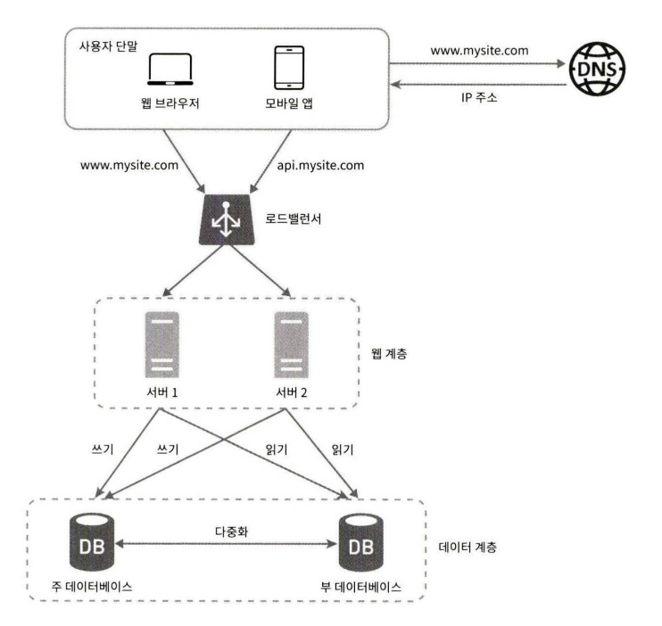

# 1일차  p.1 ~ p.10

## 사용자 수에 따른 규모 확장성

### 단일 서버

사용자 요청 처리 흐름

- 도메인 이름으 도메인 이름 서비스 (Domain Name Service , DNS) 에 질의하여 IP 주소로 변환
- DNS 조회 결과로 IP 주소가 반환된다.
- 해당 IP 주소로 HTTP 요청이 전달된다.
- 요청을 받은 웹 서버는 HTML 페이지나 JSON 형태의 응답을 반환한다.

실제 요청은 웹 앱과 모바일 앱

- 웹 애플리케이션 : 비즈니스 로직, 데이터 저장 등을 처리하기 위해서는 서버 구현용 언어
- 모바일 앱 : 모바일 앱과 웹 서버 간 통신을 위해서 HTTP 프로토콜

### 데이터베이스

사용자가 늘면 서버 하나로 충분하지 않아서 여러 서버를 두어야 한다.

하나는 웹/모바일 트래픽 처리 용도고, 다른 하나는 데이터베이스 용이다.

#### 어떤 데이터베이스를 사용할 것인가?

전통적인 관계형 데이터베이스와 비-관계형 데이터베이스

비 관계형 데이터베이스는 NoSQL 이라고 부른다.

- 키-값 저장소
- 그래프 저장소
- 칼럼 저장소
- 문서 저장소

비-관계형 데이터베이스는 일반적으로 조인 연산은 지원하지 않는다.

비-관계형 데이터베이스가 바람직한 선택인 경우

- 아주 낮은 응답 지연시간이 요구됨
- 다루는 데이터가 비정형이라 관계형 데이터가 아님
- 데이터를 직렬화하거나 역직렬화 할 수 있기만 하면 됨
- 아주 많은 양의 데이터를 저장할 필요가 있음

### 수직적 규모 확장 vs 수평적 규모 확장

소위 '스케일 업(scale up)' 이라고 하는 수직적 규모 확장 프로세스는 서버에 고사양 자원을 추가하는 행위를 말한다.
반면에 '스케일 아웃(scale out)' 이라고 하는 수평적 규모 확장 프로세스는 더 많은 서버를 추가하여 성능을 개선하는 행위

서버로 유입되는 트래픽의 양이 적을 때는 수직적 확장이 좋은 선택이며, 이 방법의 가장 큰 장점은 단순함이다.

그러나 불행하게도 이 방법에는 몇 가지 심각한 단점이 있다.

- 수직적 규모 확장에는 한계가 있다. 한 대의 서버에 CPU 나 메모리를 무한대로 증설할 방법은 없다.
- 수직적 규모 확장법은 장애에 대한 자동복구(failover) 방안이나 다중화(re-dundancy) 방안을 제시하지 않는다. 서버에 장애가 발생하면
웹 사이트/앱은 완전히 중단된다. 

이런 단점 때문에, 대규모 애플리케이션을 지원하는 데는 수평적 규모 확장 법이 보다 적절하다.

#### 로드밸런서

로드밸런서는 부하 분산 집합에 속한 웹 서버들에게 트래픽 부할르 고르게 분산하는 역할을 한다. 

사용자는 로드밸런서의 공개 IP 주소로 접속한다. 
따라서 웹 서버는 클라이언트의 접속을 직접 처리하지 않는다. 
더 나은 보안을 위해 ,서버 간 통신에는 사설 IP 주소가 이용된다.

사설 IP 주소는 같은 네트워크에 속한 서버 사이의 통신에만 쓰일 수 있는 IP 주소로, 인터넷을 통해서는
접속할 수 없다. 로드밸런서는 웹 서버와 통신하기 위해 바로 이 사설 주소를 이용한다.

부하 분산 집합에 또 하나의 웹 서버를 추가하고 나면 장애를 자동복구하지 못하는 문제(no failover)는 해소되며,
웹 계층의 가용성은 향상된다. 

- 서버 1이 다운되면 모든 트래픽은 서버 2로 전송된다. 
- 웹 사이트로 유입되는 트래픽이 가파르게 증가하면 두 대의 서버로 트래픽을 감당할 수 없는 시점이 오는데, 로드밸런서가 있으므로 우아하게 대처 할 수 있다.

#### 데이터베이스 다중화

서버 사이에 주(master) - 부 (slave) 관계를 설정하고 데이터 원본은 주 서버에, 사본은 부 서버에 저장하는 방식이다.

쓰기 연산(write operation) 은 마스터에서만 지원 한다. 부 데이터베이스는 주 데이터베이스로부터 그 사본을 전달받으며,

읽기 연산만을 지원한다. 

데이터베이스를 변경하는 명령어들, 가령 insert , delete , update 등은 주 데이터베이스로만 전달되어야 한다.

대부분의 애플리케이션은 읽기 연산의 비중이 쓰기 연산보다 훨씬 높다.

데이터베이스를 다중화하면 다음과 같은 이득이 있다.

- 더 나은 성능 : 주-부 다중화 모델에서 모든 데이터 변경 연산은 주 데이터베이스로만 전달되는 반면 읽기 연산은 부 데이터베이스 서버들로 분산된다. 
병렬로 처리될 수 있는 질의(query)의 수가 늘어나므로, 성능이 좋아 진다.
- 안정성 (reliability) : 자연 재해 등의 이유로 데이터베이스 서버 가운데 일부가 파괴되어도 데이터는 보존 될 것이다. 
- 가용성 (availability) : 데이터를 여러 지역에 복제해 둠으로써, 하나의 데이터 베이스 서버에 장애가 발생하더라도 다른 서버에 있는 데이터를 가져와
계속 서비스 할 수 있게 된다.

데이터베이스 서버 가운데 하나가 다운되면 무슨 일이 벌어지는가?

- 부 서버가 한 대 뿐인데 다운된 경우라면, 읽기 연산은 한시적으로 모두 주 데이터베이스로 전달 될 것이다. 
- 주 데이터베이스 서버가 다운되면, 한 대의 부 데이터베이스가 있는 경우 해당 부 데이터베이스 서버가 새로운 주 서버가 될 것이며, 모든 데이터베이스는 일시적으로 새로운 주 서버 상에서 수행 될 것이다.
프로덕션 환경에서 벌어지는 일은 이것보다는 사실 더 복잡한데, 부 서버에 보관된 데이터가 최신 상태가 아닐 수 있기 때문이다 

이 설계안은 다음과 같이 동작한다.

- 사용자는 DNS로 부터 로브밸런서의 공개 IP 주소를 받는다.
- 사용자는 해당 IP 주소를 사용해 로드밸런서에 접속한다. 
- HTTP 요청은 서버 1이나 서버 2로 전달된다.
- 웹 서버는 사용자의 데이터를 부 데이터베이스 서버에서 읽는다.
- 웹 서버는 데이터 변경 연산은 주 데이터베이스로 전달한다. 데이터 추가, 삭제, 갱신 연산 등이 이에 해당한다. 