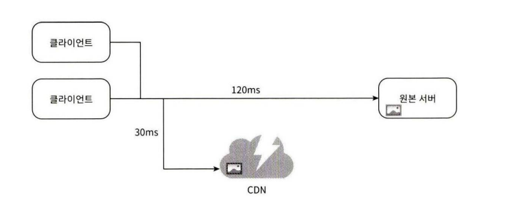
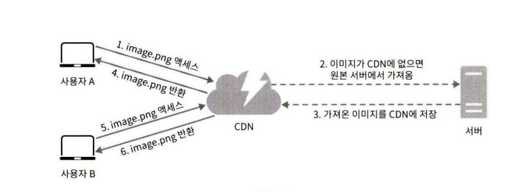
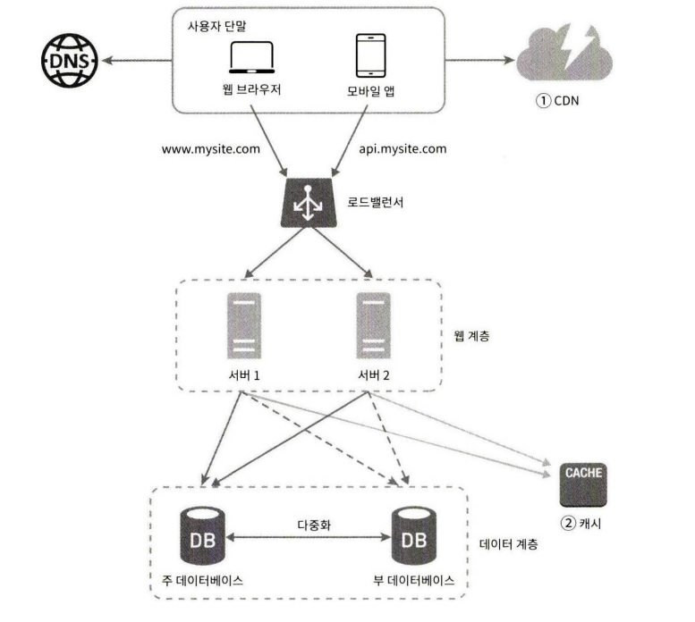
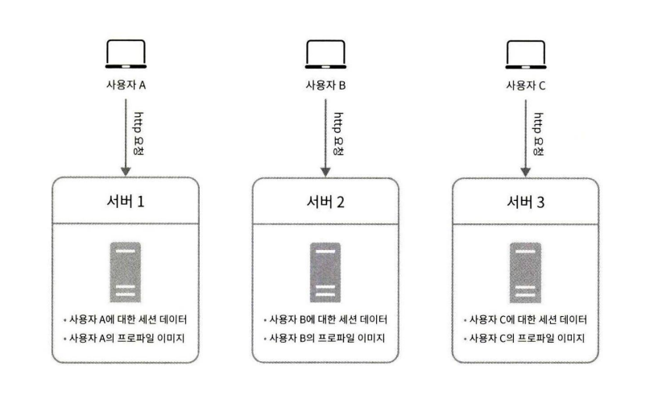
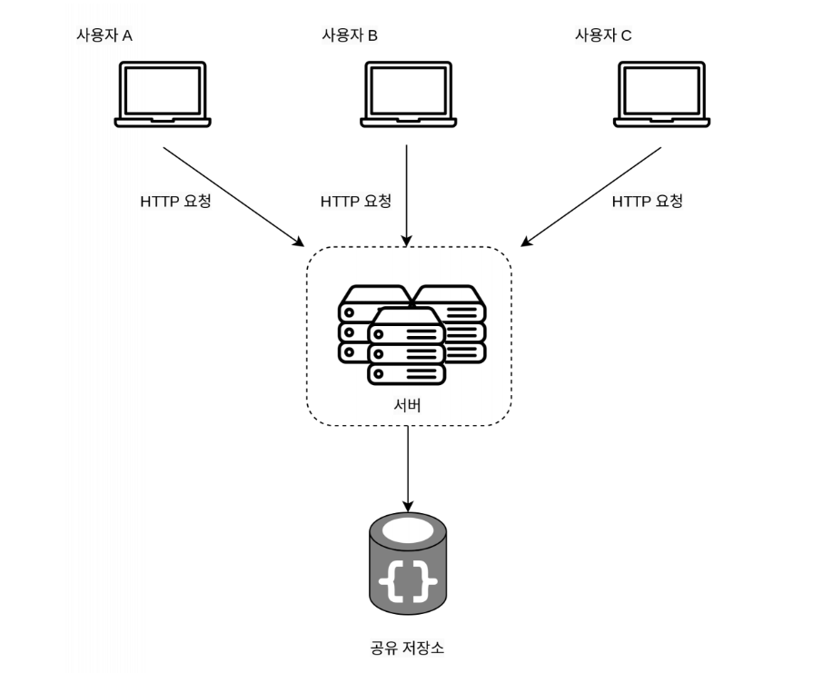
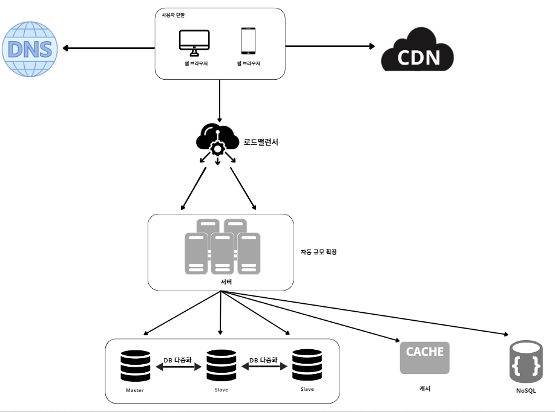

# 2일차  p.11 ~ 19 

## 캐시

캐시는 값 비싼 연산 결과 또는 자주 참조되는 데이터를 메모리 안에 두고, 뒤이은 요청이 보다 빨리 처리 될 수 있도록 하는 저장소다.

애플리케이션의 성능은 데이터베이스를 얼마나 자주 호출하느냐에 크게 좌우되는데, 캐시는 그런 문제를 완화할 수 있다.

### 캐시 계층

캐시 계층은 데이터가 잠시 보관되는 곳으로 데이터베이스보다 훨씬 빠르다. 
별도의 캐시 계층을 두면 성능이 개선될 뿐만 아니라 데이터베이스의 부하를 줄일 수 있고,
캐시 계층의 규모를 독립적으로 확장시키는 것도 가능해진다.

요청을 받은 웹 서버는 캐시에 응답이 저장 되어 있는지를 본다. 만일 저장되어 있다면 해당 데이터를 클라이언트에 반환한다. 없는 경우에는 데이터베이스 질의를 통해 데이터를 찾아 캐시에 저장한 뒤 클라이언트에 반환한다. 

이러한 캐시 전략을 읽기 주도형 캐시 전략 (read-through caching strategy) 이라고 부른다. 

#### 캐시 사용시 유의할 점

- 캐시는 어떤 상황에 바람직한가? 데이터 갱신은 자주 일어나지 않지만 참조는 빈번하게 일어난다면 고려해볼만 하다.
- 어떤 데이터를 캐시에 두어야 하는가? 캐시는 데이터를 휘발성 메모리에 두므로, 영속적으로 보관할 데이터를 캐시에 두는 것은 바람직하지 않다.
- 캐시에 보관된 데이터는 어떻게 만료 되는가?
- 일관성은 어떻게 유지되는가? 일관성은 데이터 저장소의 원본과 캐시내의 사본이 같은지 여부다.
- 장애에는 어떻게 대처할 것인가? 캐시 서버를 한 대만 두는 경우 해당 서버는 단일 장애 지점(Single Point of Failure)이 되어 버릴 가능성이 있다. 결과적으로, SPOF 를 피하려면 여러 지역에 걸쳐 캐시 서버를 분산시켜야 한다.
- 캐시 메모리는 얼마나 크게 잡을 것인가?
- 데이터 방출 (eviction) 정책은 무엇인가? 캐시가 꽉 차버리면 추가로 캐시에 데이터를 넣어야 할 경우 기존 데이터를 내보내야 한다.

### 콘텐츠 전송 네트워크 ( CDN )

CDN 은 정적 콘텐츠를 전송하는 데 쓰이는, 지리적으로 분산된 서버의 네트워크이다. 

이미지, 비디오, CSS ,Javascript 파일 등을 캐시할 수 있다.
동적 컨텐츠 캐싱은 상대적으로 새로운 개념으로서, 이 책에서 다룰 수 있는 범우 밖이다.

CDN이 어떻게 동작하는지를 개략적으로 살펴보면 다음과 같다. 
어떤 사용자가 웹 사이트를 방문하면, 그 사용자에게 가장 가까운 CDN 서버가 정적 콘테를 전달하게 된다.

CDN 서버가 샌프란시스코에 있다면 LA 에 있는 사용자는 유럽 사용자보다 빠른 웹 사이트를 보게 될 것이다.

CDN 이 어떻게 동작하는 지 살펴보자

- 사용자 A가 이미지 URL 을 이용해 image.png 에 접근한다. URL 의 도메인은 CDN 서비스 사업자가 제공한 것이다.
- CDN 서버의 캐시에 해당 이미지가 없는 경우, 서버는 원본 서버에 요청하여 파일을 가져온다.
- 원본 서버가 파일을 CDN 서버에 반환한다.  응답의 HTTP 헤더에는 해당 파일이 얼마나 오래 캐시 될 수 있는지를 설명한느 TTL 값이 들어 있다.
- CDN 서버는 파일을 캐시하고 사용자 A에게 반환한다.
- 사용자 B가 같은 이미지에 대한 요청을 CDN 서버에 전송한다. 
- 만료되지 않은 이미지에 대한 요청은 캐시를 통해 처리 된다.

#### CDN 사용 시 고려해야 할 사항

- 비용 :
- 적절한 만료 시간 설정 : 
- CDN 장애에 대한 대처 방안 : 
- 콘텐츠 무효화 (invalidation )방법 

- 정적 콘텐츠 (JS , CSS , 이미지 등) 는 더 이상 웹 서버를 통해 서비스 하지 않으며, CDN 을 통해 제공하여 더 나은 성능을 보장한다.
- 캐시가 데이터베이스 부하를 줄여준다.

### 무상태(stateless) 웹 계층

이제 웹 계층을 수평적으로 확장하는 방법을 고민해볼 순서다.

이를 위해서는 상태 정보(사용자 세션 데이터와 같은)를 웹 계층에서 제거하여야 한다. 
바람직한 전략은 상태 정볼르 관계형 데이터베이스나 NoSQL 같은 지속성 저장소에 보관하고, 필요할 때 가져오도록 하는 것이다.

이렇게 구성된 웹 계층을 무상태 웹 계층이라 부른다.

#### 상태 정보 의존적인 아키텍처

상태 정보를 보관하는 서버는 클라이언트 정보, 즉 상태를 유지하여 요청들 사이에 공유되도록 한다.

무상태 서버에는 이런 장치가 없다.

같은 클라이언트로부터의 요청은 항상 같은 서버로 전송되어야 한다.

대부분의 로드벨런서가 이를 지원하기 위해 고정 세션(sticky session) 이라는 기능을 제공하고 있는데,
이는 로드밸런서에 부담을 준다.

#### 무상태 아키텍처

사용자로부터의 HTTP 요청은 어떤 웹 서버로도 전달 될 수 있다.

웹 서버는 상태 정보가 필요할 경우 공유 저장소로 부터 데이터를 가져온다.

따라서 상태 정보는 웹 서버로부터 물리적으로 분리되어 있다.

이런 구조는 단순하고, 안정적이며, 규모 확장이 쉽다.

세션 데이터를 웹 계층에서 분리하고 지속성 데이터 보관소에 저장하도록 만들었다.

이 공유 저장소는 관계형 데이터베이스 일 수도 있고, Memcached/Redis 같은 캐시 시스템일 수도 있으며
NoSQL 일수도 있다.

여기서는 NoSQL 을 사용하였는데, 규모 확장이 간편해서다. 자동 규모 확장(autoscaling)은 트래픽 양에 따라
웹 서버를 자동으로 추가하거나 삭제하는 기능을뜻한다. 

상태 정보가 웹 서버들로부터 제거되었으므로, 트래픽 양에 따라 웹 서버를 넣거나 빼기만 하면 자동으로 규모를 확장할 수 있게 되었다.

웹 사이트의 규모가 엄청 커지게 되면

가용성을 높이고 전 세계 어디서도 쾌적하게 사용할 수 있도록 하기 위해서는 여러 데이터 센터를 지원하는 것이 필수다.

