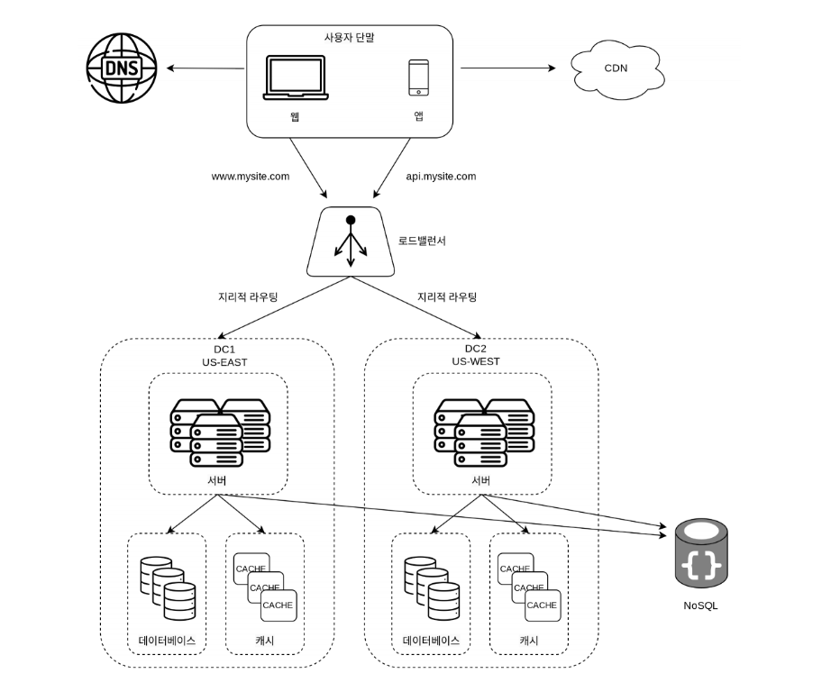
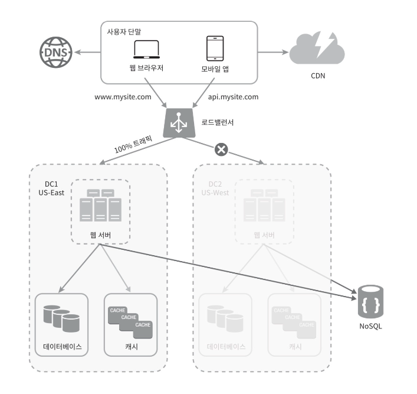
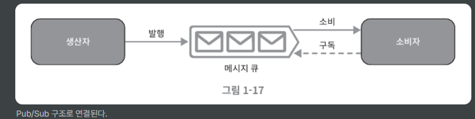
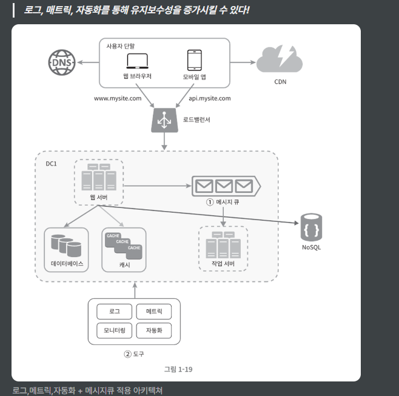
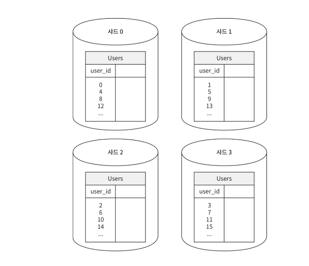
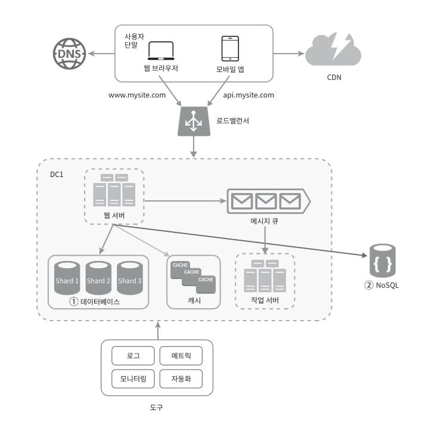

# 3일차  p.20 ~ p.32

## 데이터 센터

두 개의 데이터 센터 

장애가 없는 상황에서 사용자는 가장 가까운 데이터 센터로 안내되는데,
통상 이 절차를 지리적 라우팅(geoDNS-routing) 이라고 부른다.

지리적 라우팅에서의 geoDNS 는 사용자의 위치에 따라 도메인 이름을 어떤 IP 주소로 변환할지 결정 할 수 있도록 해주는 DNS 서비스다.

이 예제의 경우, 그 결과로 x% 사용자는 US-East 센터로, 그리고 (100-x)% 의 사용자는 US-West 센터로 안내된다고 하자.

심각한 장애가 발생하면 모든 트래픽은 장애가 없는 데이터 센터로 전송 된다.

이 사례와 같은 다중 데이터센터 아키텍처를 만들려면 몇 가지 기술적 난제를 해결해야 한다.

- 트래픽 우회 : 올바른 데이터 센터로 트래픽을 보내는 효과적인 방법을 찾아야 한다. GeoDNS는 사용자에게서 가장 가까운 데이터센터로 트래픽을 보낼 수 있도록 해 준다.
- 데이터 동기화 (synchronization) : 데이터 센터 마다 별도의 데이터베이스를 사용하고 있는 상황이라면, 장애가 자동으로 복구되어 트래픽이 다른 데이터베이스로 우회 된다 해도, 해당 데이터 센터에는 찾는 데이터가 없을 수 있다.
이런 상황을 막는 보편적 전략은 데이터를 여러 데이터센터에 걸쳐 다중화하는 것이다. 
- 테스트와 배포 : 여러 데이터 센터를 사용하도록 시스템이 구성된 상황이라면 웹 사이드 또는 애플리케이션을 여러 위치에서 테스트해 보는 것이 중요하다.
한편, 자동화된 배포 도구는 모든 데이터 센터에 동일한 서비스가 설치되도록 하는 데 중요한 역할을 한다.

시스템을 더 큰 규모로 확장하기 위해서는 시스템의 컴포넌트를 분리하여 , 각기 독립적으로 확장될 수 있도록 하여야 한다.

메시지 큐(message queue)는 많은 실제 분산 시스템이 이 문제를 풀기 위해 채용하고 있는 핵심적 전략 가운데 하나다.

## 메시지 큐

메시지 큐는 메시지의 무손실(durability, 즉 메시지 큐에 일단 보관된 메시지는  소비자가 꺼낼 때 까지 안전히 보관된다는 특성)을 보장하는,
비동기 통신을 지원하는 컴포넌트다. 메시지의 버퍼 역할을 하며, 비동기적을 전송한다. 메시지 큐의 기본 아키텍처는 간단하다.

생산자 또는 발행자라고 불리는 입력 서비스가 메시지를 만들어 메시지 큐에 발행한다. 
큐에는 보통 소비자 혹은 구독자라 불리는 서비스 혹은 서버가 연결되어 있는데, 메시지를 받아
그에 맞는 동작을 수행하는 역할을 한다. 

메시지 큐를 이용하면 서비스 또는 서버 간 결합이 느슨해져서, 규모 확장성이 보장되어야 하는 안정적 애플리케이션을 구헝하기 좋다.
생산자는 소비자 프로세스가 다운되어 있어도 메시지를 발행할 수 있고, 소비자는 생산자 서비스가 가용한 상태가 아니더라도
메시지를 수신할 수 있다.

사용 예

이미지의 그로핑, 샤프닝, 블러링 등을 지원하는 사진 보정 애플리케이션

이러한 보정은 시간이 오래 걸릴 수 있는 프로세스이므로 비동기적으로 처리하면 편리하다.

웹 서버는 사진 보정 작업을 메시지 큐에 넣는다. 사진 보정 작업 프로세스들은 이 작업을 메시지 큐에서 꺼내어 비동기적으로 완료한다.

이렇게 하면 생산자와 소비자 서비스의 규모는 각기 독립적으로 확장 될 수 있다. 큐의 크기가 커지면 더 많은 작업 프로세스를
추가해야 처리 시간을 줄일 수 있다.

하지만 큐가 거의 항상 비어 있는 상태라면, 작업 프로세스의 수는 줄일 수 있을 것이다.

## 로그, 메트릭 그리고 자동화

- 로그 : 에러 로그를 모니터링 하는 것은 중요하다. 시스템의 오류와 문제들을 보다 쉽게 찾아낼 수 있도록 하기 때문이다.
에러 로그는 서버 단위로 모니터링 할 수도 있지만, 로그를 단일 서비스로 모아주는 도구를 활용하면 더 편리하게 검색하고 조회할 수 있다.
- 메트릭 : 
  - 호스트 단위 메트릭
  - 종합 메트릭
  - 핵심 비즈니스 메트릭
- 자동화 : 시스템이 크고 복잡해지면 생산성을 높이기 위해 자동화 도구를 활용해야 한다.

#### 메시지 큐, 로그 , 메트릭, 자동화 등을 반영하여 수정한 설계안

- 메시지 큐는 각 컴포넌트가 보다 느슨한 결합이 될 수 있도록 하고, 결함에 대한 내성을 높인다.
- 로그, 모니터링, 메트릭, 자동화 등을 지원하기 위한 장치를 추가하였다.

## 데이터베이스의 규모 확장

데이터베이스의 규모를 확장하는  두 가지 접근 법

### 수직적 확장

스케일 업 

기존 서버에 더 많은 ,또는 고성능의 자원(CPU, RAM ,디스크 등)을 증설하는 방법이다. 

수직적 접근법에는 몇 가지 심각한 약점이 있다.

- 데이터베이스 서버 하드웨어에는 한계가 있으므로 CPU, RAM 등을 무한 증설할 수는 없다. 사용자가 계속 늘어나면 한 대 서버로는 결국 감당하기 어렵게 될 것이다.
- SPOF (Single Point of Failure) 로 인한 위험성이 크다.
- 비용이 많이 든다. 고성능 서버로 갈수록 가격이 올라가게 마련이다

### 수평적 확장

데이터베이스의 수평적 확장은 샤딩이라고도 부르는데, 더 많은 서버를 추가함으로써 성능을 향상시킬 수 있도록 한다.

샤딩은 대규모 데이터베이스를 샤드라고 부르는 작은 단위로 분할하는 기술을 일컫는다.
모든 샤드는 같은 스키마를 쓰지만 샤드에 보관되는 데이터 사이에는 중복이 없다.

사용자 데이터를 어느 샤드에 넣을지는 사용자 ID 에 따라 정한다.
이 사례에서는 user_id % 4 를 해시 함수로 사용하여 데이터가 보관되는 샤드를 정한다.

결과가 0이면 0번 샤드에, 1이면 1번 샤드에 보관하는 방식이다.

각 샤드 노드에 사용자 데이터가 어떻게 보관되는지를 보여 준다.

샤딩 전략을 구현할 때 고려해야 할 가중 중요한 것은 샤딩 키를 어떻게 정하느냐 하는 것이다.

샤딩 키를 정할 때는 데이터를 고르게 분할 할 수 있도록 하는 게 가장 중요하다.

샤딩은 데이터베이스 규모 확자을 실현하는 훌륭한 기술이지만 완벽하진 않다.

샤딩을 도입하면 시스템이 복잡해지고 풀어야 할 새로운 문제도 생긴다.

- 데이터의 재 샤딩
- 유명인사 문제
- 조인과 비정규화

## 백만 사용자, 그리고 그 이상

시스템 규모 확장을 위해 살펴본 기법

- 웹 계층은 무상태 계층으로
- 모든 계층에 다중화 도입
- 가능한 한 많은 데이터를 캐시할 것
- 여러 데이터 센터를 지원할 것
- 정적 콘텐츠는 CDN 을 통해 서비스 할 것
- 데이터 계층은 샤딩을 통해 그 규모를 확장할 것
- 각 계층은 독립적 서비스로 분할할 것
- 시스템을 지속적으로 모니터링하고, 자동화 도구들을 활용할 것 