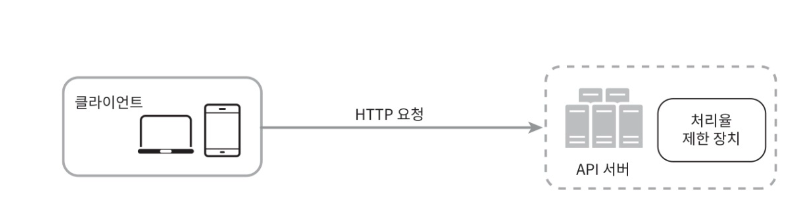
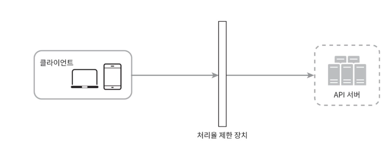

# 5일차 p.51 ~ 

## 처리율 제한 장치의 설계

네트워크 시스템에서 처리율 제한 장치는 클라이언트 또는 서비스가 보내는 트래픽의 처리율을 제어하기 위한 장치다.

API에 처리율 제한 장치를 두면 좋은 점

- Dos (Denial of Service) 공격에 의한 자원 고갈을 방지할 수 있다.
- 비용을 절감한다. 
- 서버 과부하를 막는다. 봇에서 오는 트래픽이나 사용자의 잘못된 이용 패턴으로 유발된 트래픽을 걸러내는 데 처리율 제한 장치를 활용할 수 있다.

### 2단계 개략적 설계안 제시 및 동의 구하기

#### 처리율 제한 장치는 어디에 둘 것인가?

처리율 제한 장치는 클라이언트에 둘 수도 있고 , 서버에 둘 수도 있다.

- 클라이언트 측에 둔다면
- 서버 측에 둔다면

처리율 제한 장치를 API 서버에 두는 대신, 처리율 제한 미들웨워를 만들어 해당 미들웨어로 하여금 API 주소로 가는 요청을 
통제하는 것이다.

초당 2개의 요청으로 제한된 상황에서,

세 번째 요청은 처리율 제한 미들웨어에 의해 가로막히고 클라이언트로는 HTTP 상태 코드 429가 반환된다.

#### 처리율 제한 알고리즘

*토큰 버킷 알고리즘*

각 요청은 처리될 때마다 하나의 토큰을 사용한다. 요청이 도착하면 버킷에 충분한 토큰이 있는지 검사하게 된다.
- 충분한 토큰이 있는 경우, 버킷에서 토큰 하나를 꺼낸 후 요청을 시스템에 전달한다.
- 충분한 토큰이 없는 경우, 해당 요청은 버려진다.

