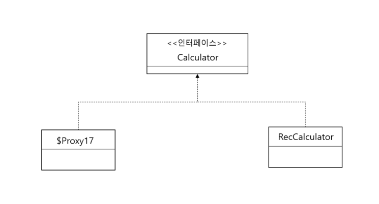

# 10일차 : 2023-09-30 (p.167 ~ 177)

## 프록시 생성 방식

MainAspect 클래스 코드를 다음과 같이 변경해보자

```java
// 수정 전
Calculator cal =  ctx.getBean("calculator", Calculator.class);

// 수정 후
Calculator cal =  ctx.getBean("calculator", RecCalculator.class);
```

익셉션이 발생한다. <br/>
org.springframework.beans.factory.BeanNotOfRequiredTypeException

익셉션 메시지를 보면 getBean() 메서드에 사용한 타입이 RecCalculator 인데 반해 실제 타입은 
$Proxy17 이라는 메시지가 나온다. $Proxy17은 스프링이 런타임에 생성한 프록시 객체의 클래스 이름이다.
이 $Proxy17 클래스는 RecCalculator 클래스가 상속받은 Calculator 인터페이스를 상속받게 된다. 



스프링은 AOP를 위한 프록시 객체를 생성할 때 실제 생성할 빈 객체가 인터페이스를 상속하면 인터페이스를 이용해서
프록시를 생성한다.

RecCalculator 클래스가 Calculator 인터페이스를 상속하므로 Calculator 인터페이스를 상속받은 프록시 객체를 생성했다.

```java
// 설정 클래스
// AOP 적용시 RecCalculator 가 상속받은 Calculator 인터페이스를 이용해서 프록시 생성
@Bean 
public Calculator calculator() {
    return new RecCalculator();    
}

// 자바 코드 :
// "calculator" 빈의 실제 타입은 Calculator를 상속한 프록시 타입이므로
// RecCalculator 로 타입 변환을 할 수 없기 때문에 익셉션 발생
RecCalculator cal = ctx.getBean("calculator" , RecCalculator.class);
```

빈 객체가 인터페이스를 상속할 때 인터페이스가 아닌 클래스를 이용해서 프록시를 생성하고 싶다면 다음과 같이 설정하면 된다.

```java
@Configuration
@EnableAspectJAutoProxy(ProxyTargetClass = true)
public class AppCtx {
    
}
```

@EnableAspectJAutoProxy 애노테이션의 proxyTargetClass 속성을 true로 지정하면 
인터페이스가 아닌 자바 클래스를 상속받아 프록시를 생성한다. 
스프링이 프록시를 이용해 생성한 빈 객체를 구할 때 다음과 같이 getBean() 메서드에 실제 클래스를 이용해서 
빈 객체를 구할 수 있게된다.


### Advice 적용 순서

한 Pointcut에 여러 Advice를 적용할 수도 있다.

```java
@Aspect
public class CacheAspect {

    private Map<Long, Object> cache = new HashMap<Long, Object>();

    @Pointcut("execution(public * chap07..*(long))")
    public void cacheTarget() {

    }

    @Around("cacheTarget()")
    public Object execute(ProceedingJoinPoint joinPoint) throws Throwable {
        Long num = (Long) joinPoint.getArgs()[0];
        if (cache.containsKey(num)) {
            System.out.printf("CacheAspect : Cache에서 구함[%d]\n",num);
            return cache.get(num);
        }

        Object result = joinPoint.proceed();
        cache.put(num, result);
        System.out.printf("CacheAspect : Cache에 추가[%d]\n",num);
        return result;
    }

}
```

새로운 Aspect 를 구현했으므로 스프링 설정 클래스에 Aspect를 추가 할 수 있다.

```java
@Configuration
@EnableAspectJAutoProxy
public class AppCtxWithCache {
	
	@Bean
	public CacheAspect cacheAspect() {
		return new CacheAspect();
	}
	
	@Bean
	public ExeTimeAspect exeTimeAspect() {
		return new ExeTimeAspect();
	}
	
	@Bean
	public Calculator calculator() {
		return new RecCalculator();
	}

}
```

### @Around 의 Pointcut 설정과 @Pointcut 재사용

@Pointcut 애노테이션이 아닌 @Around 애노테이션에 execution 명시자를 직접 지정할 수도 있다.

```java
@Aspect
public class CacheAspect {
    // .. 생략
    
	@Around("execution(public * chap07..*(long))")
	public Object execute(ProceedingJoinPoint joinPoint) throws Throwable {
		Long num = (Long) joinPoint.getArgs()[0];
		if (cache.containsKey(num)) {
			System.out.printf("CacheAspect : Cache에서 구함[%d]\n",num);
			return cache.get(num);
		}
		
		Object result = joinPoint.proceed();
		cache.put(num, result);
		System.out.printf("CacheAspect : Cache에 추가[%d]\n",num);
		return result;
	}

}
```

만약 같은 Pointcut 을 여러 Advice가 함께 사용한다면 공통 Pointcut을 재사용할 수도 있다.

```java
@Aspect
public class ExeTimeAspect {
	
	@Pointcut("execution(public * chap07..*(..))")
	private void publicTarget() {
		
	}
	
	@Around("publicTarget()")
	public Object measure(ProceedingJoinPoint joinPoint) throws Throwable {
		//...
	}

}
```

@Around는 publicTarget() 메서드에 설정한 Pointcut을 사용한다.
publicTarget() 메서드는 private 인데 이 경우 같은 클래스에 있는 @Around 애노테이션에서만 
해당 설정을 사용할 수 있다.