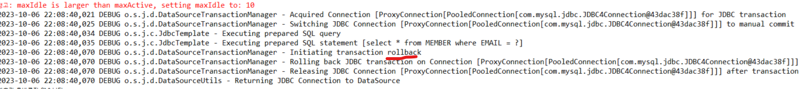

# 13일차 : 2023-10-03 (p.209 ~ 231 )

### 스프링의 익셉션 변환 처리

SQL 문법이 잘못됐을 때 발생한 메시지를 보면 익셉션 클래스가 org.spring.framework.jdbc
패키지에 속한 BadSqlGrammerException 클래스 임을 알 수 있다.
에러 메시지를 보면 BadSqlGrammerException이 발생한 이유는 MySQL 
SyntaxErrorException이 발생했기 때문이다.

위 익셉션이 발생할 때 사용한 코드는 다음과 같았다.
```java
jdbcTemplate.update("update MEMBER set NAME =? , PASSWORD =? where EMAIL = ? "
        , memnber.getName() , member.getPassword(), member.getEmail());
```

BadSqlGrammerException 을 발생한 메서드는 JdbcTemplate 클래스의 update() 
메서드이다.  JdbcTemplate 의 update() 메서드는 DB 연동을 위해 JDBC API를 사용하는데,
JDBC API를 사용하는 과정에서 SQLException이 발생하면 이 익셉션을 알맞은
DataAccessException으로 변환해서 발생한다. 

즉, 다음과 유사한 방식으로 익셉션을 변환해서 재발생한다.

```java
try {
// ... JDBC 사용 코드    
}catch(SQLException ex) {
    throw convertSqlToDataException(ex);
}
```

예를 들어 MySQL 용 JDBC 드라이버는 SQL 문법이 잘못된 경우
SQLException을 상속받은 MySQLSyntaxErrorException을 발생시키는데
JdbcTemplate은 이 익셉션을 DataAccessException을 상속받은 
BadSqlGrammerException으로 변환한다. 

DataAccessException 은 스프링이 제공하는 익셉션 타입으로 데이터 연결에 
문제가 있을 때 스프링 모듈이 발생시킨다. 

그렇다면 스프링은 왜 SQLException을 그대로 전파하지 않고 SQLException을
DataAccessException으로 변환할까?

주된 이유는 연동 기술에 상관없이 동일하게 익셉션을 처리할 수 있도록 하기 위함이다.
스프링은 JDBC 뿐만 아니라 JPA , 하이버네이트 등에 대한 연동을 지원하고
MyBatis는 자체적으로 스프링 연동 기능을 제공한다.

그런데 각각의 구현기술마다 익셉션을 다르게 처리해야 한다면 개발자는 
기술마다 익셉션 처리 코드를 작성해야 할 것이다. 각 연동 기술에 따라
발생하는 익셉셥을 스프링이 제공하는 익셉션으로 변환함으로써 
구현 기술에 상관없이 동일한 코드로 익셉션을 처리할 수 있다.

### 트랜잭션 처리

이메일을 수정하고 인증 상태를 변경하는 두 쿼리

```java
jdbcTemplate.update("update MEMBER set EMAIL = ?" , email);
jdbcTemplate.update("insert into EMAIL_AUTH values(?'T')" , email);
```

만약 첫 번째 쿼리를 실행한 후 두 번째 쿼리를 실행하는 시점에 문제가 발생하면 어떻게 될까?
예를 들어 코드를 잘못 수정/배포해서 두 번째 쿼리에서 사용할 테이블 이름이
잘못되었을 수도 있고, 중복된 값이 존재해서 INSERT 쿼리를 실행하는데 실패할 수도 있다.

두 번째 쿼리가 실패했음에도 불구하고 첫 번째 쿼리 실행 결과가 DB에 반영되면 
이후 해당 사용자의 이메일 주소는 인증되지 않은 채로 계속 남아 있게 된다. 

따라서 두 번째 쿼리 실행에 실패하면 첫 번재 쿼리 실핼 결과도 취소해야 올바른
상태를 유지한다. 

이렇게 두 개 이상의 쿼리를 한 작업으로 실행해야 할 때 사용하는 것이 트랜잭션이다.
트랜잭션은 여러 쿼리를 논리적으로 하나의 작업으로 묶어준다. 

한 트랜잭션으로 묶인 쿼리 중 하나라도 실패하면 전체 쿼리를 실패로 간주하고
실패 이전에 실행한 쿼리를 취소한다. 쿼리 실행 결과를 취소하고 DB를 기존 상태로 되돌리는 것
을 롤백이라고 부른다. 반면에 트랜잭션으로 묶인 모든 쿼리가 성공해서 
쿼리 결과를 DB에 실제로 반영하는 것을 커밋이라고 한다.

트랜잭션을 시작하면 트랜잭션을 커밋하거나 롤백할 때까지 실행한 쿼리들이 하나의 작업 단위가
된다. 
JDBC는 Connction 의 setAutoCommit(false)를 이용해서 트랜잭션을 시작하고
commit() 과 rollback() 을 이용해서 트랜잭션을 반영하거나 취소한다.

```java
Connection conn = null;
try {
    conn = DriverManager.getConnection(jdbcUrl , user ,pw);
    conn.setAutoCommit(false); // 트랜잭션 범위 시작
    // .. 쿼리 실행 
    conn.commit(); // 트랜잭션 범위 종료 : 커밋    
}catch(SQLException ex) {
    if(conn != null) {
        // 트랜잭션 범위 종료 : 롤백
        try { conn.rollback();
        }catch(SQLException e) {}
    }
}finally {
    if(conn != null) {
        try {
            conn.close();
        }catch(SQLException e){}
    }    
}
```

위와 같은 방식은 코드로 직접 트랜잭션 범위를 관리하기 때문에
개발자가 트랜잭션을 커밋하는 코드나 롤백하는 코드를 누락하기 쉽다. 
게다가 구조적인 중복이 반복되는 문제도 잇다. 

스프링이 제공하는 트랜잭션 기능을 사용하면 중복이 없는 매우 간단한 코드로
트랜잭션 범위를 지정할 수 있다.


### @Transactional 을 이용한 트랜잭션 처리

스프링이 제고ㅓㅇ하는 @Transactional 애노테이션을 사용하면 트랜잭션 범위를
매우 쉽게 지정할 수 있다.  트랜잭션 범위에서 실행하고 싶은 메더스에
@Transactional 애노테이션만 붙이면 된다.

```java
@Transactional
public void changePassword(String email, String oldPwd, String newPwd) {
    Member member = memberDao.selectByEmail(email);
    if (member == null)
        throw new MemberNotFoundException();

    member.changePassword(oldPwd, newPwd);

    memberDao.update(member);
}
```

스프링은 @Transactional 애노테이션이 붙은 changePassword() 메서드를 
동일한 트랜잭션 범위에서 실행한다.  

따라서 memberDao.selectByEmail() 에서 실행하는 쿼리와 
member.changePassword() 에서 실행하는 쿼리는 한 트랜잭션에 묶인다. 

@Transactional 애노테이션이 제대로 동작하려면 다음의 두 가지 내용을
스프링 설정에 추가해야 한다.

- 플랫폼 트랜잭션 매니저(Platform TransactionManager)  빈 설정
- @Transactional 애노테이션 활성화 지정

```java
@Configuration
@EnableTransactionManagement
public class AppCtx {
	
	@Bean(destroyMethod = "close")
	public DataSource dataSource() {
		DataSource ds = new DataSource();
		ds.setDriverClassName("com.mysql.jdbc.Driver");
		ds.setUrl("jdbc:mysql://localhost/spring5fs?characterEncoding=utf8");
		// .. 생략 
		return ds;
	}
	
	@Bean
	public MemberDao memberDao() {
		return new MemberDao(dataSource());
	}

}
```

PlatformTransactionManager 는 스프링이 제공하는 트랜잭션 매니저 
인터페이스이다. 스프링은 구현기술에 상관없이 동일한 방식으로 트랜잭션을 처리하기 
위해 이 인터페이스를 사용한다. 

JDBC는 DataSourceTransactionManager 클래스를 PlatformTransactionManager로
사용한다. 위 설정에서 보듯이 dataSource 프로퍼티를 이용해서
트랜잭션 연동에 사용할 DataSource를 지정한다.

@EnableTransactionManagement 애노테이션은 
@Transactional 애노테이션이 붙은 메서드를 트랜잭션 범위에서
실행하는 기능을 활성화 한다.


AppCtx 설정 클래스에 트랜잭션 관련 설정과 ChangePasswordService 클래스를
빈으로 추가하자

```java
@Configuration
@EnableTransactionManagement
public class AppCtx {
	
	@Bean(destroyMethod = "close")
	public DataSource dataSource() {
		DataSource ds = new DataSource();
		ds.setDriverClassName("com.mysql.jdbc.Driver");
		ds.setUrl("jdbc:mysql://localhost/spring5fs?characterEncoding=utf8");
		ds.setUsername("spring5");
		ds.setPassword("spring5");
		ds.setInitialSize(2);
		ds.setMaxActive(10);
		ds.setTestWhileIdle(true);
		ds.setMinEvictableIdleTimeMillis(60000 * 3);
		ds.setTimeBetweenEvictionRunsMillis(10 * 1000);
		return ds;
	}
	
	@Bean
	public PlatformTransactionManager transactionManager() {
		DataSourceTransactionManager tm = new DataSourceTransactionManager();
		tm.setDataSource(dataSource());
		return tm;
	}
	
	@Bean
	public MemberDao memberDao() {
		return new MemberDao(dataSource());
	}
	
	@Bean
	public ChangePasswordService changePwdSvc() {
		ChangePasswordService pwdSvc = new ChangePasswordService();
		pwdSvc.setMemberDao(memberDao());
		return pwdSvc;
	}

}
```


changePwdSvc 빈을 이용해서 암호 변경 기능을 실행하는 메인 클래스를 작성하자

```java
public class MainForCPS {
	
	public static void main(String[] args) {
		AnnotationConfigApplicationContext ctx = new AnnotationConfigApplicationContext(AppCtx.class);
		
		ChangePasswordService cps = ctx.getBean("changePwdSvc",ChangePasswordService.class);
		
		try {
			cps.changePassword("madvirus@madvirus.net", "1234", "1111");
			System.out.println("암호를 변경했습니다.");
		}catch(MemberNotFoundException e) {
			System.out.println("회원 데이터가 존재하지 않습니다.");
		}catch(WrongPasswordException e) {
			System.out.println("암호가 올바르지 않습니다.");
		}
		ctx.close();
	}

}

```

만약에 DB에 있는 암호와 코드에서 입력한 암호가 맞지 않는다면

changePassword() 메서드를 실행할 때 MemberNotFoundException 이 발생하고

콘솔에 트랜잭션을 롤백했다는 로그 메세지가 찍힌다.



그러면 도대체 트랜잭션을 시작하고 커밋하고 롤백하는 것은 누가 처리하는 것일까?


### @Transactional 과 프록시

여러 빈 객체에 공통으로 적용되는 기능을 구현하는 방법으로 AOP를 설명했는데
트랜잭션도 공통 기능 중 하나이다. 스프링은 @Transactional 애노테이션을
이용해서 트랜잭션을 처리하기 위해 내부적으로 AOP를 사용한다. 

스프링에서 AOP는 프록시를 통해서 구현된다는 것을 기억한다면 트랜잭션 처리도 
프록시를 통해서 이루어진다는 것을 유출할 수 있다.

@Tranactional 애노테이션을 적용하기 위해 @EnableTranactionManagement 태그를
사용하면 스프링은 @Transactional 애노테이션이 적용된 빈 객체를
찾아서 프록시 객체를 생성한다.


### @Trasactional 적용 메서드의 롤백 처리 

커밋을 수행하는 주체가 프록시 객체였던 것처럼 롤백을 처리하는 주체 또는 프록시 객체이다.

```java
try {
    cps.changePassword("madvirus@madvirus.net", "12345", "1111");
    System.out.println("암호를 변경했습니다.");
}catch(MemberNotFoundException e) {
    System.out.println("회원 데이터가 존재하지 않습니다.");
}catch(WrongPasswordException e) {
    System.out.println("암호가 올바르지 않습니다.");
}
```

이 코드의 실행 결과를 보면 WrongPasswordException 이 발생했을 때 
트랜잭션이 롤백 된 것을 알 수 있다. 

별도 설정을 추가하지 않으면 발생한 익셉션이 RuntimeException 일 때 트랜잭션을
롤백한다. WrongPasswordException 클래스를 구현할 때 RuntimeException을
상속 한 이유는 바로 트랜잭션 롤백을 염두해 두었기 때문이다.

SQLException 은 RuntimeException을 상속하고 있지 않으므로 SQLException이
발생하면 트랜잭션을 롤백하지 않는다. RuntimeException 뿐만 아니라 
SQLException 이 발생하는 경우에도 트랜잭션을 롤백하고 싶다면 
@Transactional 의 rollbackFor 속성을 사용해야 한다.

```java
import java.sql.SQLException;

@Tranactional(rollbackFor = SQLException.clas)
public void someMethod() {
    
}
```

### 트랜잭션 전파 

@Transactional 의 주요 속성 Propagation 열거 타입 값 목록에서

REQUIRED 값의 설명은 다음과 같다.

> 메서드를 수행하는 데 트랜잭션이 필요하다는 것을 의미한다. 현재 진행 중인 트랜잭션이
> 존재하면 해당 트랜잭션을 사용한다. 존재하지 않으면 새로운 트랜잭션을 생성한다.

이 설명의 이해를 위해 아래 코드를 보자

```java
public class SomeService {
	private AnyService anyService;
	
	@Transactional
	public void some() {
		anyService.any();
	}

	public void setAnyService(AnyService as) {
		this.anyService = as;
	}
}

public class AnyService {
    @Transactional
    public void any() {
        ...
    }

}


```

SomeService 클래스와 AnyService 클래스는 둘 다 @Transactional 애노테이션을
적용하고 있다. 

두 클래스에 대해 프록시가 생성된다. 
즉 SomeService 의 some 메서드를 호출하면 트랜잭션이 시작되고
AnyService 의 any() 메서드를 호출해도 트랜잭션이 시작된다.

그런데 some() 메서드는 내부에서 다시 any() 메서드를 호출하고 있다.

이 경우 트랜잭션 처리는 어떻게 될까?

@Transational 의 propagation 속성은 기본값이 Propagation.REQUIRED 이다.

REQUIRED는 현재 진행 중인 트랜잭션이 존재하면 해당 트랜잭션을 사용하고 존재 하지 않으면
새로운 트랜잭션을 생성한다. 

처음 some() 메서드를 호출하면 트랜잭션을 새로 시작한다. 
하지만 some() 메서드 내부에서 any() 메서드를 호출하면 
이미 some() 메서드에 의해 시작된 트랜잭션이 존재하므로 any() 메서드를 호출하는
시점에는 트랜잭션을 새로 생성하지 않는다. 
대신 존재하는 트랜잭션을 그대로 사용한다. 
즉 some() 메서드와 any() 메서드를 한 트랜잭션으로 묶어서 실행한다.

만약 any() 메서드에 적용한 @Transactional 의 propagation 속성값이 
REQUIREDS_NEW 라면 기존 트랜잭션에 존재하는 지 여부와 상관없이
항상 새로운 트랜잭션을 시작한다. 따라 이 경우에는 some() 메서드에 의해
트랜잭션이 생성되고 다시 any() 메서드에 의해 트랜잭션이 생성된다.

