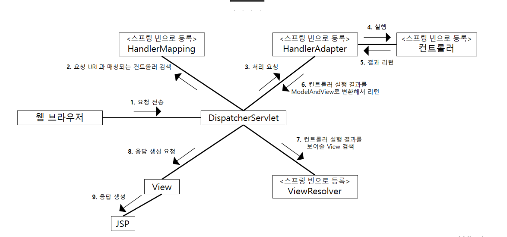

# 15일차 : 2023-10-05 (p. 249 ~ 262 )

## 스프링 MVC 프레임워크 동작 방식 

### 스프링 MVC 핵심 구성 요소



컨트롤러 구성 요소는 개발자가 직접 구현해야 하고 스프링 빈으로 등록해야 한다.

- DispatcherServlet은 모든 연결을 담당한다. 웹 브라우저로 부터 요청이 들어오면 DispatcherServlet은
그 요청을 처리하기 위한 컨트롤러 객체를 검색한다. 
- 이때 DispatcherServlet은 직접 컨트롤러를 검색하지 않고 HandlerMapping 이라는 빈 객체에게 컨트롤러
검색을 요청한다.
- HandlerMapping 은 클라이언트의 요청 경로를 이용해서 이를 처리할 컨트롤러 빈 객체를
DispatcherServlet 에 전달한다. 예를 들어 웹 요청 경로가 "/hello" 라면 등록된 컨트롤러
빈 중에서 '/hello' 요청 경로를 처리할 컨트롤러를 리턴한다.

  
컨트롤러 객체를 DispatcherServlet 이 전달받았다고 해서 바로 컨트롤러 객체의
메서드를 실행할 수 있는 것은 아니다. DispatcherServlet은 @Controller 애노테이션을
이용해서 구현한 컨트롤러 뿐만 아니라 스프링 2.5까지 주로 사용됐던 Controller 인터페이스를 
구현한 컨트롤러, 그리고 특수 목적으로 사용되는 HttpRequestHandler 인터페이스를 구현한
클래스를 동일한 방식으로 실행할 수 있도록 만들어졌다.

@Controller, Controller 인터페이스, HttpRequestHandler 인터페이스를 동일한 
방식으로 처리하기 위해 중간에 사용하는 것이 바로 HandlerAdapter 빈이다.

DispatcherServlet은 HandlerMapping 이 찾아준 컨트롤러 객체를 처리할 수 있는
HandlerAdapter 빈에게 요청 처리를 위임한다. HandlerAdpater 는 컨트롤러의 알맞은
메서드를 호출해서 요청을 처리하고 그 결과를 DispatcherServlet에 리턴한다. 이때 HandlerAdatper
는 컨트롤러의 처리 결과를 ModelAndView 라는 객체로 변환해서 DispatcherServlet에 리턴한다.

HandlerAdapter로부터 컨트롤러의 요청 처리 결과를 ModelAndView로 받으면 DispatcherServlet은
결과를 보여줄 뷰를 찾기 위해 ViewResolver 빈 객체를 사용한다. ModelAndView 는 컨트롤러가
리턴한 뷰 이름을 담고 있는데 ViewResolver는 이 뷰 이름에 해당하는 View 객체를 찾거나
생성해서 리턴한다.


### 컨트롤러와 핸들러

클라이언트의 요청을 실제로 처리하는 것은 컨트롤러이고 DispatcherServlet은 클라이언트의
요청을 전달받는 창구 역할을 한다. 

DispatcherServlet은 클라이언트의 요청을 처리할 컨트롤러를 찾기 위해 HandlerMapping을 사용한다.
컨트롤러를 찾아주는 객체는 ControllerMapping 타입이어야 할 것 같은데 실제는 HandlerMapping이다.

왜 HandlerMapping 이다.

스프링 MVC는 웹 요청을 처리할 수 있는 범용 프레임워크이다. 이 책에서는 @Controller 애노테이션을
붙인 클래스를 이용해서 클라이언트의 요청을 처리하지만 원한다면 자신이 직접 만든 클래스를 
이용해서 클라이언트의 요청을 처리할 수도 있다. 
즉 DispatcherServlet 입장에서는 클라이언트 요청을 처리하는 객체의 타입이 반드시 @Controller
를 적용한 클래스일 필요는 없다. 실제로 스프링이 클라이언트의 요청을 처리하기 위해
제공하는 타입 중에는 HttpRequestHandler도 존재한다.

이런 이유로 스프링 MVC는 웹 요청을 처리하는 객체를 핸들러라고 표현하고 있으며
@Controller 적용 객체나 Controller 인터페이스를 구현한 객체는 모두 스프링 MVC 입장에서는
핸들러가 된다.

### @Controller 를 위한 HandlerMapping 과 HandlerAdapter

@Controller 적용 객체는 DispatcherServlet 입장에서 보면 한 종류의 핸들러 객체이다.
DispatcherServlet 은 웹 브라우저의 요청을 처리할 핸들러 객체를 찾기 위해 
HandlerMapping 을 사용하고 핸들러를 실행하기 위해 HandlerAdapter를 사용한다. 
DispatcherServlet은 스프링 컨테이너에서 HandlerMapping 과 HandlerAdpater 타입의 
빈을 사용하므로 핸들러에 알맞은 HandlerMapping 빈과 HandlerAdapter 빈이 스프링 설정에
등록되어 있어야 한다.

그런데 앞에서는 HandlerMapping 이나 HandlerAdapter 클래스를 빈으로 등록하는 
코드는 보이지 않고 @EnableWebMvc 애노테이션만 추가했다.

@EnableWebMvc 애노테이션은 다양한 스프링 빈 설정을 추가해준다. 이 설정을 사용하지 않고
설정 코드를 직접 작성하려면 백 여 줄에 가까운 코드를 입력해야 한다.

### WebMvcConfigurer 인터페이스와 설정 

@EnableWebMvc 애노테이션을 사용하면 @Controller 애노테이션을 붙인 컨트롤러를 위한 설정을
생성핟나. 또 @EnableWebMvc 애노테이션을 사용하면 WebMvcConfigurer 타입의 빈을 이용해서
MVC 설정을 추가로 생성한다.

```java
@Configuration
@EnableWebMvc
public class MvcConfig implements WebMvcConfigurer {
	
	@Override
	public void configureDefaultServletHandling(DefaultServletHandlerConfigurer configurer) {
		configurer.enable();
	}
	
	@Override
	public void configureViewResolvers(ViewResolverRegistry registry) {
		registry.jsp("/WEB-INF/view/",".jsp");
	}

}
```

### 디폴트 핸들러와 HandlerMapping의 우선순위

web.xml DispatcherServlet 에 대한 매핑 경로

```xml
	<servlet>
		<servlet-name>dispatcher</servlet-name>
		<servlet-class>
			org.springframework.web.servlet.DispatcherServlet
		</servlet-class>
		... 생략
	</servlet>

	<servlet-mapping>
		<servlet-name>dispatcher</servlet-name>
		<url-pattern>/</url-pattern>
	</servlet-mapping>
```

DispatcherServlet 에 대한 매핑 경로를 다음과 같이 '/'로 주었다.

매핑 경로가 '/'인 경우 .jsp 로 끝나는 요청을 제외한 모든 요청을 DispatcherServlet이
처리한다. 즉 /index.html 이나 /css/bootstrap.css 와 같은 확장자가 .jsp가 아닌
모든 요청을 DispatcherServlet이 처리하게 된다. 

그런데 @EnableWebMvc 애노테이션이 등록하는 HandlerMapping 은 @Controller 애노테이션을
적용한 빈 객체가 처리할 수 있는 요청 경로만 대응할수 있다. 
예를 들어 등록된 컨트롤러가 한 개이고 그 컨트롤러가 @GetMapping("/hello") 설정을 한다면
/hello 경로만 처리할 수 있게 된다. 따라서 "/index.html" 이나 "/css/bootstrap.css"와
같은 요청을 처리할 수 있는 컨트롤러 객체를 찾지 못해 DispatcherServlet은 404 응답을 전송한다.

