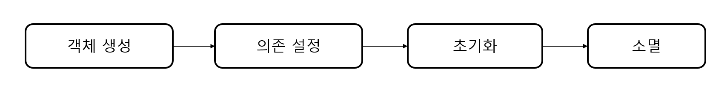

# 7일차 : 2023-09-27 (p.141 ~150 )

## 빈 라이프 사이클과 범위 

### 컨테이너 초기화와 종료

```java
// 1.컨테이너 초기화
AnnotationConfigApplicationContext ctx 
        = new AnnotationConfigApplicationContext(AppContext.class);

// 2. 컨테이너에서 빈 객체를 구해서 사용
Greeter g = ctx.getBean("greeter" , Greeter.class);
String msg = g.greet("스프링");
System.our.println(msg);

// 3. 컨테이너 종료
ctx.close();
```

- AnnotationConfigApplicationContext 생성자를 이용해서 컨텍스트 객체를 생성한다. 
- 스프링 컨테이너는 설정 클래스에서 정보를 읽어와 알맞은 빈 객체를 생성하고 각 빈을 열결하는 작업을 수행한다.


컨테이너를 초기화하고 종료할 때는 다음의 작업도 함께 수행한다.

- 컨테이너 초기화 -> 빈 객체의 생성, 의존 주입, 초기화
- 컨테이너 종료 -> 빈 객체의 소멸


## 스프링 빈 객체의 라이프사이클



스프링 컨테이너를 초기화할 때 스프링 컨테이너는 가장 먼저 빈 객체를 생성하고 의존을 설정한다.
의존 자동 주입을 통한 의존 설정이 이 시점에 수행된다.

모든 의존 설정이 완료되면 빈 객체의 초기화를 수행한다. 빈 객체를 초기화하기 위해
스프링은 빈 객체의 지정된 메서드를 호출한다.

스프링 컨테이너를 종료하면 스프링 컨테이너는 빈 객체의 소멸을 처리한다. 


### 빈 객체의 초기화와 소멸: 스프링 인터페이스 

스프링 컨테이너는 빈 객체를 초기호하고 소멸하기 위해 빈 객체의 지정한 메서드를 호출한다.

스프링은 다음의 두 인터페이스에 이 메서드를 정의하고 있다.

- import org.springframework.beans.factory.InitializingBean;
- import org.springframework.beans.factory.DisposableBean;


```java
public interface InitializingBean {
    
	void afterPropertiesSet() throws Exception;
}

public interface DisposableBean {
    
    void destroy() throws Exception;

}
```

```java
public class Client implements InitializingBean , DisposableBean {
	
	private String host; 
	
	public void setHost(String host) {
		this.host = host;
	}

	@Override
	public void destroy() throws Exception {
		System.out.println("Client.destroy() 실행");
		
	}

	@Override
	public void afterPropertiesSet() throws Exception {
			System.out.println("Client.afterPropertiesSet() 실행;");
	}
	
	public void send() {
		System.out.println("Client.send() to "+ host);
	}

}
```

```java
@Configuration
public class AppCtx {
	
	@Bean
	public Client client() {
		Client client = new Client();
		client.setHost("host");
		return client;
	}
}
```

```java
public class Main {
	public static void main(String[] args) {
		AbstractApplicationContext ctx = new AnnotationConfigApplicationContext(AppCtx.class);
		Client client =  ctx.getBean(Client.class);
		client.send();
		
		ctx.close();
	}

}
```

실행 하면 

afterPropertiesSet() 메서드를 실행한다 
즉 스프링 컨테이너는 빈 객체 생성을 마무리한 뒤에 초기화 메서드를 실행한다. 가장 마지막에
destroy() 메서드를 실행한다.

이 메서드는 스프링 컨테이너를 종료하면 호출된다.


### 빈 객체의 생성과 관리 범위

스프링 컨테이너는 빈 객체를 한 개만 생성한다고 했다. 
```java
Client client1 = ctx.getBean("client", Client.class);
Client client2 = ctx.getBean("client" , Client.class);
// client1 == client2 -> true
```

사용 빈도가 낮긴 하지만 프로토타입 범위의 빈을 설정할 수도 있다. 
빈의 범위를 프로토타입으로 지정하면 빈 객체를 구할 때마다 매번 새로운 객체를 생성한다. 

```java
// client 빈의 범위가 프로토타입일 경우, 매번 새로운 객체 생성
Client client1 = ctx.getBean("client", Client.class);
Client client2 = ctx.getBean("client" , Client.class);
// client1 == client2 -> false
```


특정 빈을 프로토타입 범위로 지정하려면 다음과 같이 값으로 "prototype"을 갖는
@Scope 애노테이션을 @Bean 애노테이션과 함께 사용하면 된다.

```java
@Configuration
public class AppCtxWithPrototype {
	
	@Bean
	@Scope("prototype")
	public Client client() {
		Client client = new Client();
		client.setHost("host");
		return client;
	}
}
```

싱글톤 범위를 명시적으로 지정하고 싶다면 @Scope 애노테이션 값으로 "singleton"을 주면 된다.

```java
	@Bean(initMethod = "connect" , destroyMethod = "close")
	@Scope("prototype")
	public Client client() {
		Client client = new Client();
		client.setHost("host");
		return client;
	}
```

프로토타입 범위를 갖는 빈은 완전한 라이프사이클을 따르지 않는다

스프링 컨테이너는 프로토타입의 빈 객체를 생성하고 프로퍼티를 설정하고 초기화 작업까지는 수행하지만,
컨테이너를 종료한다고 해서 생성한 프로토타입 빈 객체의 소멸 메서드를 실행하지는 않는다.

따라서 프로토타입 범위의 빈을 사용할 때는 빈 객체의 소멸 처리르 코드에서 직접 해야 한다.