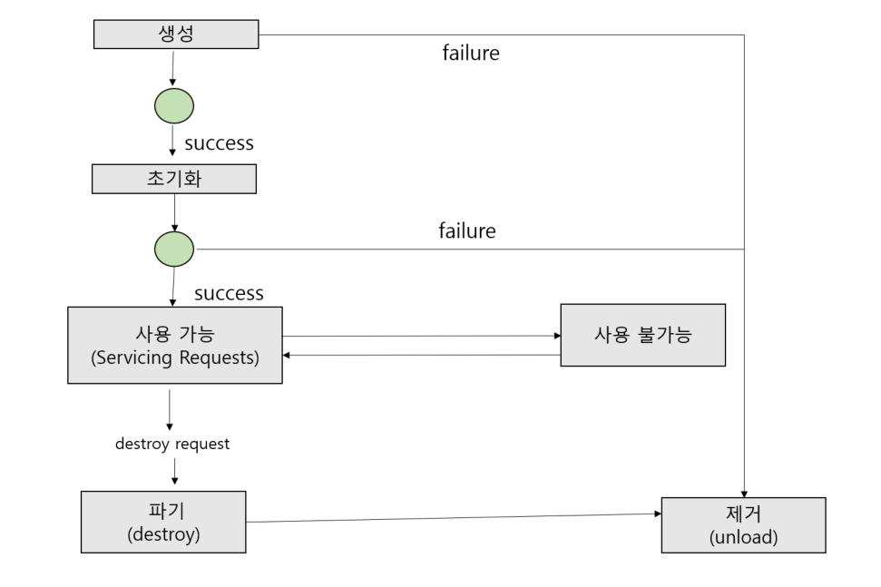
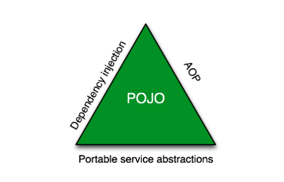

# 16일차 : 2023-09-26 (p. 201 ~ 218)

## JSP 와 서블릿, Spring 에서 발생할 수 있는 여러 문제점

자바 기반의 시스템 중 WAS 에서 병목 현상이 발생할 수 있는 부분을 세밀하게
나눈다고 하면, UI 부분과 비즈니스 로직 부분으로 나눌 수 있다. 


### JSP 와 Servlet 의 기본적인 동작 원리

jsp 의 라이프 사이클

- JSP URL 호출
- 페이지 번역
- JSP 페이지 컴파일
- 클래스 로드
- 인스턴스 생성
- jspInit 메서드 호출
- _jspService 메서드 호출
- jspDestory 메서드 호출


서블릿 라이프 사이클 WAS 의 JVM이 시작된 후

- Servlet 객체가 자동으로 생성되고 초기화 되거나,
- 사용자가 해당 Servlet을 처음으로 호출했을 때 생성되고 초기화 된다. 



그 다음에는 계속 '사용 가능' 상태로 대기한다.
 
그리고 중간에 예외가 발생하면 '사용 불가능' 상태로 빠졌다가 
다시 '사용 가능' 상태로 변환되기도 한다. 그리고 나서, 해당 서블릿이 더 이상
필요 없을 때는 '파기' 상태로 넘어간 후 JVM 에서 '제거 된다'.

서블릿은 JVM에 여러 객체로 생성되지 않는다. 
다시 말 해서 WAS 가 시작하고, '사용 가능' 상태가 된 이상 
대부분의 서블릿은 JVM에 살아 있고, 여러 스레드에서 해당 서블릿의 service() 
메서드를 호출하여 공유한다. 


### 스프링 프레임워크 간단 정리

스프링 프레임워크는 데스크톱과 웹 애플리케이션, 작고 간단한 애플리케이션부터
여러 서버와 연동하여 동작해야 하는 엔터프라이즈 애플리케이션도 범용적인 
애플리케이션 프레임워크다.

Spring의 가장 큰 특징은 복잡한 애플리케이션도 POJO(Plan Old Java Object)로
개발할 수 있다는 점이다. 

Servlet 을 개발하려면 반드시 HttpServlet이라는 클래스를 상속해야 한다.
하지만 스프링을 사용하면 HttpServlet을 확장하지 않아도 
웹 요청을 처리할 수 있는 클래스를 만들 수 있다.

이 밖에도 JMS ,JMX ,Mail , Web Service 등 여러 가지 기능을 POJO 기반으로
사용할 수 있기 때문에, 개발자가 보다 쉽게 자신이 작성한 코드를 테스트 할 수 있다.

### 스프링의 핵심 기술

스프링의 핵심 기술은 바로 Dependency Injection , Aspect Oriented Programming ,
Portable Service Abstraction 으로 함축할 수 있다.



Dependency Injection 은 객체 간의 의존 관계를 관리하는 기술 정도로 생각하면 된다.

객체는 보통 혼자서 모든 일을 처리 하지 않고, 여러 다른 객체와 협업하여 
일을 처리한다. 이때 자신과 협업하는 객체와 자신과의 의존성을 
가능한 낮춰야 유리한 경우가 많다. 다시 말해서, 어떤 객체가 필요로 하는 
객체를 자기 자신이 직접 생성하여 사용하는 것이 아니라 외부에 있는
다른 무언가로부터 필요로 하는 객체를 주입 받는 기술이다. 


예제 코드를 보자

```java
public class A {
    private B b = new B();
}
```

예제 코드를 보면 A클래스의 객체는 항상 B클래스의 객체를 사용하게 된다. 
이렇게 구현하면 나중에 B라는 객체를 다른 것으로 교체하기 힘들다.

```java
public class A {{
    private B b;
    
    public A(B b){
        this.b = b;
    }
}}
```
위와 같이 B클래스의 객체를 외부에서 넘겨 형태로 코드를 작성하면 보다
손쉽게 A 클래스가 사용하는 객체를 다른 것으로 변경할 수 있다. 
즉, 생성자의 매개 변수로 넘어온 B 클래스의 객체를 A 클래스에서 사용하는 b 로 설정하면
A 클래스의 객체를 사용하기 전에 필요한 B객체를 외부에서 미리 만들어서 
넘겨 줄 수 있는 구조가 된다.

스프링은 이렇게 의존성을 쉽게 주입하는 틀을 제공해준다. 
XML이나 어노테이션 등으로 의존성을 주입하는 방법을 제공하며

생성자 주입, 세터 주입, 필드 주입등 다양한 의존성 주입 방법도 제공하고 있다.


스프링에서 제공하는 두번째 핵심 기술은 바로 AOP 이다.

OOP를 보다 더 OOP 스럽게 보완해주는 기술이다.

트랜잭션, 로깅 ,보완 체크 코드는 필요한 작업이긴 하지만 대부분은 비슷한 코드가
중복되고, 코드를 눈으로 읽는 데 방해가 된다. 
이런 코드를 실제 비즈니스 로직과 분리할 수 있도록 도와주는 것이 바로 AOP 이다.

자바에서 가장 유명한 AOP 프레임워크로는 AspectJ가 있다.


마지막으로 스프링이 제공하는 핵심 기술로 PSA를 꼽을 수 있다. 

오픈소스로 제공되는 자바 라이브러리는 매우 많다. 
객체를 XML로 변경하거나 반대로 XML을 다시 객체로 변경하고 싶을 때
사용할 수 있는 라이브러리에는 JAXB , Castor , XMLBeans , JiBX가 있다.

트랜잭션을 처리를 하고 싶을 때 사용하는 기술은 JDBC API를 사용해야 할수도 있고,
iBatis가 제공하는 API, 또는 Hibernate가 제공하는 API를 사용할 수 있다.

이렇게 비슷한 기술을 구현하기 위해 코딩하는 방법은 사용할 라이브러리나 프레임워크에
따라 달라지기 때문에, 추상화가 매우 중요하다.

스프링은 비슷한 기술을 모두 아우를 수 있는 추상화 계층을 제공하며, 사용하는
기술이 바뀌더라도 비즈니스 로직의 변화가 없도록 도와준다.

### 스프링 프레임워크를 사용하면서 발생할 수 있는 문제점들

스프링 프레임워크를 사용할 때 성능 문제가 가장 많이 발생하는 부분은
'프록시' 와 관련되어 있다.


스프링 프록시는 기본적으로 실행 시에 생성된다.
따라서, 개발할 때 적은 요청을 할 때는 이상이 없다가, 요청량이
많은 운영 상황으로 넘어가면 문제가 나타날 수 있다.  
스프링이 프록시를 사용하게 하는 주요 기능은 바로 트랜잭션이다. 

@Transactional 어노테이션을 사용하면 해당 어노테이션을 사용한 
크래스의 인스턴스를 처음 만들 때 프록시 객체를 만든다.  

이 밖에도, 개발자가 직접 스프링 AOP를 사용해서 별도의 기능을 추가하는 경우에도
프록시를 사용하는 데, 이 부분에서 문제가 많이 발생한다.

추가로, 스프링이 내부 매커니즘에서 사용하는 캐시도 조심해서 써야 한다. 
예를 들어 스프링 MVC에서 작성하는 메서드의 리턴 타입으로 다음과 같은 문자열을
사용할 수 있다.

```java
public class SampleController {
    @RequestMapping("/member/{id}")
    public String hello(@PathVariable int id) {
        return "redirect:/member/"+id;
    }
}
```

문자열 자체를 리턴하면 스프링은 해당 문자열에 해당하는 실제 뷰 객체를 
찾는 매커니즘을 사용하는데 , 이 때 매번 동일한 문자열에 대한 뷰 객체를
새로 찾기 보다는 이미 찾아온 뷰 객체를 캐싱해두면 다음에도 동일한 문자열이
반환됐을 때 훨씬 빠르게 뷰 객체를 찾을 수 있다. 

스프링에서 제공하는 ViewResolver 중에 자주 사용되는 InternalResourceViewResolver
에는 그러한 캐싱 기능이 내장되어 있다.

만약 매번 다른 문자열이 생성도리 가능성이 높고, 상당히 많은 수의 키 값으로
캐시 값이 생성될 여지가 있는 상황에서는 문자열을 반환하는 게 메모리에
치명적일 수 있다. 따라서 이런 상황에서는 뷰 이름을 
문자열로 반환하기 보다는 뷰 객체 자체를 반환하는 방법이 메모리 락을
방지하는 데 도움이 된다.

```java
public class SampleController {
    @RequestMapping("/member/{id}")
    public String hello(@PathVariable int id) {
        return new RedirectView("/member/"+id);
    }
}
```
