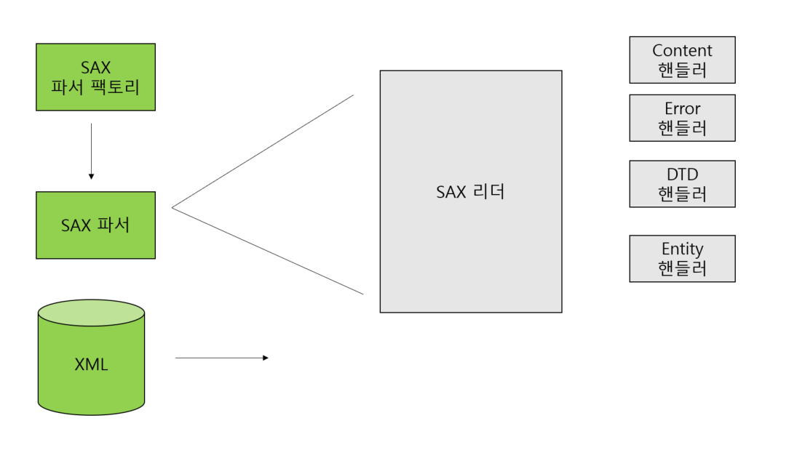
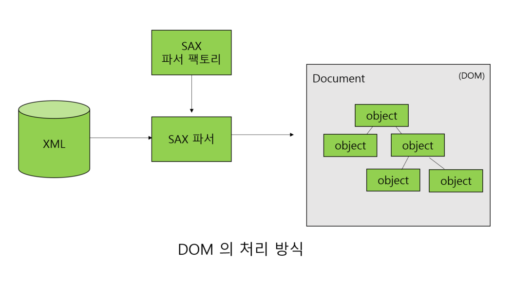

# 18일차 : 2023-09-28 (p.237 ~ )

요즘 자바로 개발할 때 각종 설정 파일과 DB 쿼리를 XML에서 관리하는 것은 
기본이고, 데이터를 XML 및 JSON 타입으로 주고 받는 시스템도 늘어나고 있다.
하지만 XML이나 JSON을 쓸 경우 시스템의 성능이 안 좋아질 수도 있다.
필요에 따라 써야 할 곳에서는 쓰는 곳이 좋지만, 꼭 그럴 필요가 없는 곳까지
맹목적으로 쓰는 것은 좋지 않다. 

### 자바에서 사용하는 XML 파서의 종류는 ?

XML은 eXtensible Markup Language 의 약자이다. XML의 가장 큰 장점은 
누구나 데이터의 구조를 정의하고 그 정의된 구조를 공유함으로써 일관된 데이터 전송 및
처리를 할 수 있다는 점이다. 이러한 특성 때문에 데이터를 파싱해야 한다.

자바에서는 XML을 파싱하기 위해서 JAXP를 제공한다. JAXP는 SAX , DOM , XSLT
에서 사용하는 기본 API를 제공한다. 그렇기 때문에 JXAP 기반의 API를 
쓴다면, 파서를 제공하는 벤더에 종속되지 않을 수 있다.

- JAXP : Java API for XML Proxcessing - javax.xml.parsers
- SAX : Simple API for XML - org.xml.sax
- DOM : Document Object Model - org.w3c.dom
- XSLT : Xml Stylesheet Language for Transformations - javax.xml.transform

JAXP의 javax.xml.parsers 패키지는 SAX와 DOM 에서 사용하는 
SAXParserFactory 와 DocumentBuilderFactory 를 제공한다.

#### SAX의 처리 방식

SAX는 순차적 방식으로 XML을 처리한다. 

반면 DOM은 모든 XML을 읽어서 트리를 만든 후 XML을 처리하는 방식이다.

SAX는 각 XML의 노드를 읽는 대로 처리하기 때문에 메모리에 부담이 DOM 에 비해서 많지 않다.
하지만 DOM은 모든 XML을 메모리에 올려서 작업하기 때문에 메모리에 
부담이 가게 된다. 

SAX는 Content 핸들러, Error 핸들러 , DTD 핸들러, Entity 리졸버를 통해서
순차적인 이벤트를처리한다. 그러므로 이미 밁은 데이터의 구조를 수정하거나 
삭제하기 어렵다.