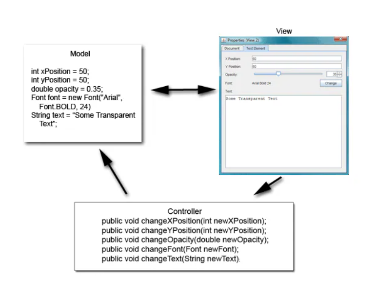
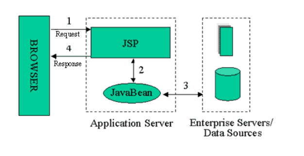
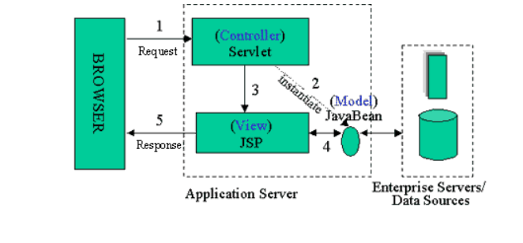
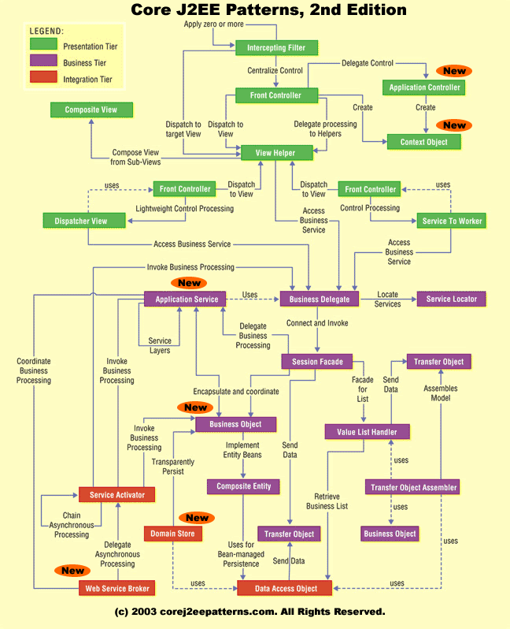

# 1일차 - 2023-08-21 (p.1 ~ 17)  

## 요약

**적어도 MVC 모델은 적용해야죠**

J2EE 패턴을 공부하려면, MVC 모델에 대해 먼저 이해해야 한다. 
왜냐하면 J2EE 패턴에는 MVC 구조가 기본으로 깔려 있기 때문이다.

MVC는 Model, View , Controller 의 약자이다.

하나의 JSP 나 스윙(Swing)처럼 화면에 모든 처리 로직을 모아 두는 것이 아니라 
모델 역할, 뷰 역할, 컨트롤러 역할을 하는 클래스를 각각 만들어서 개발하는 모델이다.



View:
- 뷰는 사용자가 결과를 보거나 입력할 수 있는 화면이라고 생각하자
- 이벤트를 발생시키고, 이벤트의 결과를 보여주는 역할을 한다.

Controller:
- 컨트롤러는 뷰와 모델의 연결자라고 생각하면 된다.
- 뷰에서 받은 이벤트를 모델로 연결하는 역할을 한다.
- 위의 그림에서는 인터페이스를 제공하여 뷰에서 호출하는 부분이다. 

Model:
- 뷰에서 입력한 내용을 저장, 관리, 수정하는 역할을 한다. 
- 이벤트에 대한 실질적인 일을 하는 부분


웹이 아닌 2 티어 구조에서는 위와 같이 처리되고, 3 티어로 되어있는 JSP 모델은 주로 모델1과 모델2를 사용한다.


#### JSP 모델 1



- JSP에서 자바 빈을 호출하고 데이터베이스에서 정보를 조회, 등록, 수정, 삭제 업무를 한 후 결과를 브라우저로 보내 주는 방식
- 간단하게 개발할 수 있다는 장점이 있지만, 개발 후 프로세스 변경이 생길 경우에 수정이 어렵다는 단점이 있다.
- 이러한 구조로 개발하면 화면과 비즈니스 모델의 분업화가 어려워 개발자의 역량에 따라서 코드가 많이 달라질 수 있다.
- 이 모델은 컨트롤러가 없기 때문에 MVC 모델이라고 하기는 어렵다.

#### JSP 모델 2



- JSP 모델2는 MVC 모델을 정확히 따른다. 
- JSP로 요청을 직접 하는 JSP 모델 1과 가장 큰 차이점은 서블릿으로 요청을 한다는 것이다. 
- 모델2에서는 서블릿이 컨트롤러 역할을 수행한다. 


**J2EE 디자인 패턴이란?**

패턴
> 시스템을 만들기 위해서 전체 일부 의미 있는 클래스들을 묶은 각각의 집합


sun 에서 제공했던 Core J2EE 패턴 카탈로그



가장 윗 부분은 Presentation tier <br/>
중간 부분은 Business tier <br/>
하단 부분은 Integration tier 이다.
<br/>
위로 갈 수록 화면에 가깝고, 아래로 갈수록 DB와 같은 저장소에 가깝다


- **Intercepting Filter 패턴** : 요청 타입에 따라 다른 처리를 하기 위해 패턴이다.
- **Front Controller 패턴** : 요청 전후에 처리하기 위한 컨트롤러를 지정하는 패턴이다.
- **View Helper 패턴** : 프레젠테이션 로직과 상관 없는 비즈니스 로직을 헬퍼로 지정하는 패턴이다.
- **Composite View 패턴** : 최소 단위의 하위 컴포넌트를 분리하여 화면을 구성하는 패턴
- **Service to Worker 패턴** : Front Controller 와 View Helper 사이에 디스패처를 두어 조합하는 패턴
- **Dispathcher View 패턴** : Front Controller 와 View Helper로 디스패처 컴포넌트를 형성한다. 뷰 처리가 종료될 때까지 다른 활동을 지연
한다는 점이 Service to Worker 패턴과 다르다.
- **Business Delegate 패턴** : 비즈니스 서비스 접근을 캡슐화하는 패턴이다.
- **Service Locator 패턴**: 서비스와 컴포넌트 검색을 쉽게 하는 패턴
- **Composite Entity 패턴** : 로컬 엔티티 빈과 POJO를 이용하여 큰 단위의 엔티티 객체를 구현한다.
- **Transfer Object 패턴** : 일명 Value Object 패턴이라고 알려져 있다. 데이터를 전송하기 위한 객체에 대한 패턴이다.
- **Value List Handler 패턴**: 데이터 조회를 처리하고, 결과를 임시 저장하며, 결과 집합을 검색하여 필요한 항목을 선택하는 역할을 수행한다. 
- **Data Access Object 패턴** : 일명 DAO라고 많이 알려져 있다. DB에 접근을 전담하는 클래스를 추상화하고 캡슐화한다.
- **Service Activator 패턴**  : 비동기적 호출을 처리하기 위한 패턴이다.


**Transfer Object 패턴**

Value Object라고도 불리는 Transfer Object 는 데이터를 전송하기 위한 객체에 대한 패턴이다.

```java
public class EmployeeTO implements Serializable {
    private String empName;
    private String empId;
    private String empPhone;

    public EmployeeTO() {
        super();
    }

    public EmployeeTO(String empName, String empId, String empPhone) {
        this.empName = empName;
        this.empId = empId;
        this.empPhone = empPhone;
    }

    public String getEmpId() {
        return empId;
    }

    public void setEmpId(String empId) {
        this.empId = empId;
    }

    public String getEmpName() {
        if (empName == null) return "";
        return empName;
    }

    public void setEmpName(String empName) {
        this.empName = empName;
    }

   
    public String getEmpPhone() {
        return empPhone;
    }

    public void setEmpPhone(String empPhone) {
        this.empPhone = empPhone;
    }

    @Override
    public String toString() {
        StringBuilder sb = new StringBuilder();
        sb.append("empName=").append(empName).append("empID=").append(empId)
                .append(" empPhone=").append(empPhone);
        return sb.toString();
    }
}

```

- Transfer Object 패턴은 Transfer Object 를 만들어 하나의 객체에 여러 타입의 값을 전달하는 일을 수행한다.
- 성능상으로 따지면 getter , setter 를 만들지 않는 것이 더 빠르다
- 하지만 정보를 은닉하고 , 모든 필드의 값들을 아무나 마음대로 수정할 수 없게 하려고 getter , setter 를 만들었다.
- empName이 null 값이라도 null을 리턴하지 않고 길이가 0인 String을 리턴한다.
- Transfer Object 를 잘 만들어 놓으면 각 소스에서 일일이 null 체크를 할 필요가 없기 때문에 개발할 때 편하다.


※ Serializable 는 왜 구현했을까?

- 이 인터페이스를 구현했다고 반드시 구현 해야하는 메서드 , 변수가 존재하는 것이 아니다.
- 하지만 이 인터페이스를 구현하면 객체를 직렬화할 수가 있다.
- 즉, 서버 사이의 데이터 전송이 가능해진다.
- 원격지 서버에 데이터를 전송하거나 , 파일로 객체를 저장할 경우에는 이 인터페이스를 구현해야 한다.


**Service Locator 패턴**

```java
public class ServiceLocator {
    private InitialContext ic;
    private Map cache;
    private static ServiceLocator me;
    static {
        me = new ServiceLocator();
    }
    
    private ServiceLocator() {
        cache = Collections.synchronizedMap(new HashMap());
    }
    
    public InitialContext getInitialContext() throws Exception {
        try {
            if (ic == null) {
                ic = new InitialContext();
            }
        }catch (Exception e) {
            throw e;
        }
        return ic;
    }
    
    public static ServiceLocator getInstance() {
        return me;
    }
}
```

- Service Locator 패턴은 예전에 많이 사용되었던 EJB의 EJB Home 객체나 DB의 DataSource를 찾을 때 소요되는 응답 속도를 
감소시키기 위해서 사용된다.

**정리하며**

자바 기반의 시슽메을 분석, 설계하고 개발하면서 패턴을 모른다면 반쪽 분석 설계자나 개발자라고 할 수 있다.

성능 개선은 물론 개발과 유지보수의 편의를 위해서 J2EE 패턴 중에서 적어도 Business Delegate , 
Session Facade , Data Access Object , Service Locator , Transfer Object 패턴을 적용해야 한다.

## 메모

2티어 아키텍처

> 2개의 주요 계층으로 구성된 아키텍처


- 일반적으로 클라이언트와 서버로 나뉘며, 사용자 인터페이스(UI) 와 비즈니스 로직, 데이버테이스 등의 계층으로 구성된다.
- MVC 패턴을 2티어 아키텍처에 적용한다면, 모델은 비즈니스 로직과 데이터베이스를 담당하며, 뷰와 컨트롤러는 클라이언트 측에 위치한다.


3티어 아키텍처

> 3개의 주요 계층으로 구성된 아키텍처

- 일반적으로 클라이언트 (UI) , 비즈니스 로직(애플리케이션 서버) , 데이터 관리(데이터베이스)로 나뉜다.
- 각 계층은 독립적으로 관리되고 확장 될 수 있다.
- MVC 패턴을 3티어 아키텍처에 적용한다면, 모델은 비즈니스 로직에 위치하며, 뷰와 컨트롤러는 클라이언트 계층에 위치한다.

