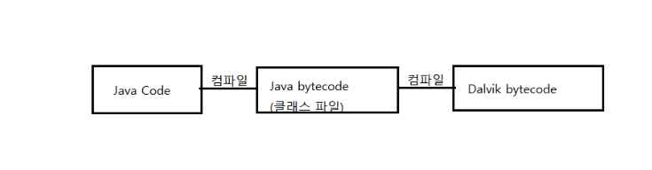

# 21일차 : 2023-10-03 (p. 277 ~ 294 )

### 일반적인 서버 프로그램 개발과 안드로이드 개발은 다르다. 

안드로이드는 오라클이나 IBM에서 만든 JVM을 사용하지 않고, Dalvik VM이라는 것을 사용한다.
PC에 자바를 설치해서 안드로이드를 개발하는 것은 그냥 일반 자바 JVM에서 수행된다고 착각할 수 있다.
자바 코드가 안드로이드에서 수행 가능한 상태가 되려면 다음 절차로 코드가 수행 된다.

첫 번째 컴파일은 javac를 통해서 수행되며, 두번째 컴파일은 dex라는 구글에서
제공하는 컴파일러에서 수행한다. 

자바와 문법은 같지만 컴파일러와 가상 머신은 다르다.

### 안드로이드 성능 개선

- Avoid Creating Unnecessary Objects : 필요 없는 객체 생성을 피하자
  - String 대신 StringBuffer 사용
  - Integer 배열 대신 int 배열 사용
  - 다차원 배열 대신 1차원 배열 사용
- Prefer Static Over Virtual : static 을 적절히 사용하자
  - 만약 인스턴스 변수에 접근할 일이 없을 경우엔 static 메서드를 선언하여 호출하는 것은 15~20% 성능 개선이 발생할 수 있다.
- Use Static Final For Constants : 상수에는 static final 을 사용하자.
  - 변하지 않는 상수를 선언할 때 static final 로 선언할 경우와 static으로 선언할 때 저장되고 참조되는 위치가 달라진다.
  - static final이 접근 속도가 훨씬 빠르다.
- Avoid Internal Getters/Setters : 내부에서는 getter 와 setter 사용을 피하자.
  - 인스턴스 변수에 직접 접근 하는 것이 getter 나 setter 메서드를 사용하여 접근하는 것보다 빠르다.
  - JIT 컴파일러가 적용되지 않을 경우 3배, 적용될 경우 7배 정도 빨라진다.
- Use Enhanced For Loop Syntax : 개선된 for 루프를 사용하자.
  - Iterable 인터페이스를 사용하는 대부분의 Collection 에서 제공하는 클래스들은 전통적인 for 루프를 사용하는 것보다는 for-each
루프를 사용하는 방법이 더 성능상 유리하다. 
  - 하지만 ArrayList 는 전총적인 for 루프가 3배 빠르다.
- Consider Package Instead of Private Access with Private Inner Classes : private 한 Inner 클래스의 private 접근을 피하자.
  - 자바에서 Inner 클래스는 감싸고 있는 클래스의 private 변수를 접근할 수 있다.
  - 그런데, VM 에서는 내부 클래스와 감싸고 있는 클래스는 다른 클래스로 인식한다. 그래서, 컴파일러는 감싸고 있는 클래스의 private 변수에 접근할 수 있는
메서드를 자동으로 생성해 준다. 따라서, 변수에 직접 접근이 불가하므로 getter 나 setter를 사용하는 것처럼 성능이 저하된다.
- Avoid Using Floating-Point : 소수점 연산을 피하자
  - 안드로이드 기기에는 정수 연산보다 소수점 연산이 2배 느리다. 그리고, double이 float 보다 2배의 저장 공간을 사용하므로, 가능하다면 float 을 사용하는 것을 권장한다.
- Know and Use the Libraries : 라이브러리를 알고 사용하자.
  - API에서 제공하는 클래스와 메서드가 훨씬 더 빠를 수 있다. 예를 들면 배열을 복사할 때 System.arraycopy() 메서드를 사용하면
루프를 사용하는 것보다 9배 이상 빠르다.
- Use Native Methods Carefully : Native 메서드는 유의해서 사용하자.
  - 안드로이드 NDK를 사용한 Native 코드 호출을 할 때는 신중하게 접근해야만 한다.
예를 들면 JIT 컴파일러가 최적화도 못하고, 게다가 각각의 상이한 아키텍처에 따라서 컴파일을 별도로 진행해야 하는 경우도 발생한다.

