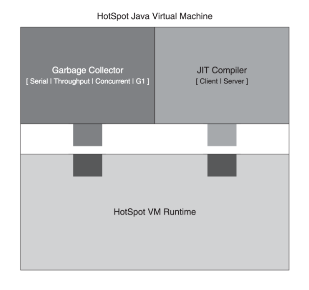
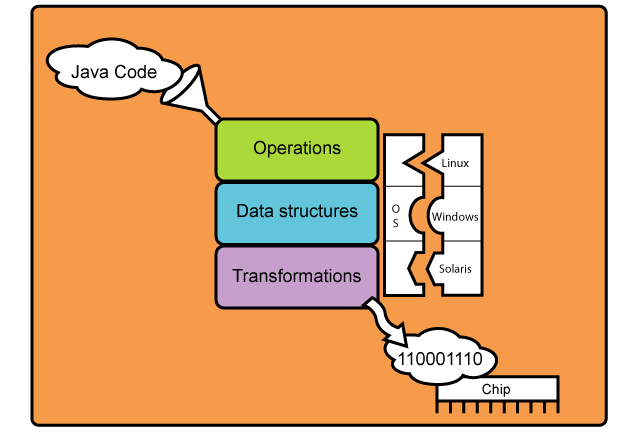
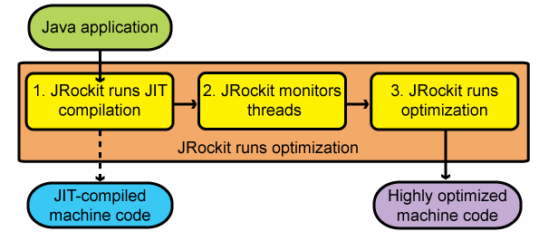

# 22일차 : 2023-10-02 (p.295 ~ 305  )

## JVM은 도대체 어떻게 구동 될까?

알아두면 좋은 내용

- HotSpot VM의 구조
- JIT 옵티마이저
- JVM의 구동 절차
- JVM의 종료 절차
- 클래스 로딩의 절차
- 예외 처리의 절차

### HotSpot VM은 어떻게 구성되어 있을까?

자바에서 HotSpot은 Java HotSpot Performance Engine 이다.  
왜 이름을 이렇게 지었을까?

자바를 만든 Sun 에서는 자바의 성능을 개선하기 위해서 Just In Time (JIT) 컴파일러를 
만들었고, 이름을 HotSpot으로 지었다. 여기서 JIT 컴파일러는 프로그램의 성능에 영향을 주는
지점에 대해서 지속적으로 분석한다. 분석된 지점은 부하를 최소화하고, 높은 성능을 내기 위한
최적화의 대상이 된다. 

이 HotSpot은 자바 1.3 버전부터 기본 VM으로 사용되어 왔기 때문에, 지금 운영되고 있는
대부분의 시스템들은 모두 HotSpot 기반의 VM이라고 생각하면 된다.

HotSpot VM은 세 가지 주요 컴포넌트로 되어 있다.

- VM 런타임 
- JIT 컴파일러
- 메모리 관리자

HotSpot VM은 높은 성능과 확장성을 제공한다.  JIT 컴파일러는 자바 애플리케이션이
수행되는 상황을 보고 동적으로 최적화를 수행한다. 

※ 참고 
> JIT는 우리나라말로 하면 '적절한 시간'이라는 의미다. JIT를 사용한다는 것은 
> '언제나 자바 메서드가 호출되면 바이트 코드를 컴파일하고 실행 가능한 네이티브 코드로 변환한다'
> 는 의미다. 하지만, 매번 JIT로 컴파일을 하면 성능 저하가 심하므로, 최적화 단계를 거치게 된다.

HotSpot VM의 아키텍처 그림




HotSpot VM 런타임에 GC 방식과 JIT 컴파일러를 끼워 맞춰 사용할 수 있다.
이를 위해서 'VM 런타임은' JIT 컴파일러용 API와 가비지 컬렉터용 API를 제공한다. 
그리고, JVM을 시작하는 런처와 스레드 관리, JNI 등도 VM 런타임에서 제공한다.


### JIT Optimizer 라는 게 도대체 뭘까?

컴파일이라는 작업은 상위 레벨의 언어로 만들어진 기계에 의존적인 코드로 변환하는 것을 말한다.
자바는 javac라는 컴파일러를 사용한다. 이 컴파일러는 소스코드를 바이트 코드로 된 
class라는 파일로 변환 해준다. 그렇기 때문에 JVM은 항상 바이트 코드로 시작하며,
동적으로 기계에 의존적인 코드로 변환한다.

JIT는 애플리케이션에서 각각의 메서드를 컴파일할 만큼 시간적 여유가 많지 않다. 
그러므로, 모든 코드는 초기에 인터프리터에 의해서 시작되고, 해당 코드가 
충분히 많이 사용될 경우에 컴파일할 대상이 된다. HotSpot VM에서 이 작업은
각 메서드에 있는 카운터를 통해서 통제되며, 메서드에는 두 개의 카운터가 존재 한다.

- 수행 카운터(invocation counter) : 메서드를 시작할 때마다 증가
- 백에지 카운터(backedge counter) : 높은 바이트 코드 인덱스에서 낮은 인덱스로 컨트롤 흐름이 변경될 때마다 증가

백에지 카운터는 메서드가 루프가 존재하는지를 확인할 때 사용되며, 수행 카운터 보다 
컴파일 우선순위가 높다.

이 카운터들이 인터프리터에 의해서 증가될 때마다, 그 값들이 한계치에 도달했는지를 확인하고,
도달했을 경우 인터프리터는 컴파일을 요청한다. 여기서 수행 카운터에서 
사용하는 한계치는 CompileThreshold  이다.

### JRockit 의 JIT 컴파일 및 최적화 절차




JVM은 각 OS에서 작동할 수 있도록 자바 코드를 입력 값으로 받아
각종 변환을 거친 후 해당 칩의 아키텍처에서 잘 돌아가는 기계어 코드로 변환되어
수행되는 구조로 되어 있다. 



JRockit 은 최적화 단계를 거치도록 되어 있다.

- JRockit runs JIT compliation
자바 애플리케이션을 실행하면 기본적으로 1번 단계인 JIT 컴파일을 거친 후 실행이 된다.
이 단계를 거친 후 메서드가 수행되면, 그 다음부터는 컴파일 된 코드를 호출하기 때문에
처리 성능이 빨라진다.
애플리케이션이 시작하는 동안 몇천 개의 새로운 메서드가 수행되며 이로 인해 
다른 JVM보다 JRockit JVM이 더 느릴 수도 있다. 그리고, 이 작업으로 인해 JIT가 메서드를
수행하고 컴파일 하는 작업은 오버헤드가 되지만, JIT가 없으면 JVM은 계속 느린 상태로 
지속될 것이다. 다시 말해서, JIT를 사용하면 시작할 때의 성능을 느리겠지만, 
지속적으로 수행할 때는 더 빠른 처리가 가능하다. 모든 메서드를 컴파일하고 최적화하는 작업은
JVM 시작 시간을 느리게 만들기 때문에 시작할 때는 모든 메서드를 최적화하지는 않는다.

- JRockit monitors threads 
JRockit에는 'sampler thread'라는 스레드가 존재하며 주기적으로 애플리케이션의 스레드를
점검한다. 이 스레드는 어떤 스레드가 동작 중인지 여부와 수행 내역을 관리한다. 
이 정보들을 통해서 어떤 메서드가 많이 사용되는 지를 확인하여 최적화 대상을 찾는다.

- JRockit JVM Runs Optimization
'sample thread'가 식별한 대상을 최적화한다. 이 작업은 백그라운드에서 진행되며 
수행중인 애플리케이션에 영향을 주지는 않는다.


실제로 코드가 어떻게 최적화 되는지를 살펴 보자

```java
class A {
    B b;
    public void foo() {
        v = b.get();
        // 중간 생략
        z = b.get();
        sum = y+z;
    }
}

class B {
    int value;
    final int get() {
        return value;
    }
}
```

foo() 라는 메서드를 보면 y와 z 변수에 b.get()이라는 메서드를 호출하고,
그 결과를 더한다. 여기서 중복 호출이 된다는 것을 알 수 있다. 게다가 B 클래스의
get() 메서드는 value 값만을 리턴하는 아주 단순한 코드다. 

이 코드를 JRockit JIT 컴파일러에서는 다음과 같이 최적화한다.

```java
class A {
    B b;
    public void foo() {
        y = b.value;
        // 중간 생략
        sum = y +y;
    }
}
```

|최적화 단계 |코드 변환 | 설명|
|----|----|----|
|시작 단계 | 변겅 없음 | |
| 1.final 로 선언된 메서드 인라인 처리 | public void  food() { <br/> y = b.value; <br/> // 중간 생략 <br/> z = b.value; <br/> sum = y+z ; <br/> } |b.get() 이 b.value로 변환된다. 이 작업을 통해서 메서드 호출로 인한 성능 저하가 개선된다. 
| 2. 불필요한 부하 제거 | public void foo() { <br/> y = b.value; <br/> // 중간 생략 <br/> z =y; <br/> sum = y +z; <br/> } | z와 y 값이 동일하므로, z에 y 값을 할당한다.
| 3. 복제 | public void foo() { <br/> y = b.value; <br/> // 중간 생략 <br/> y = y; <br/> sum = y + y; <br/> } | z와 y의 값이 동일하므로 불필요한 변수인 z를 y로 변경한다.
| 4. 죽은 코드 삭제 | public void foo() { <br/> y = b.value; <br/> //중간 생략 <br/> sum = y+y; <br/> } | y= y 코드가 불필요하므로 삭제한다.

