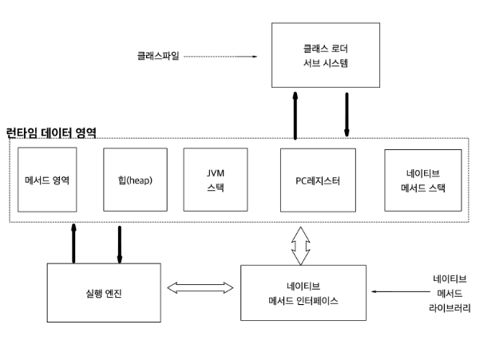

# 24일차 : 2023-10-04 (p. 319 ~ 327 )

## 도대체 GC는 언제 발생할까?

GC를 많이 하면 할수록 응답 시간에 많은 영향을 끼친다. 
자신이 만든 자바 프로그램의 성능을 생각하는 자바 엔지니어라면, GC가 어떻게 처리되는 지 
기본 지식은 갖고 있는 것이 좋다.

### GC란?

자바에서는 메모리를 GC라는 알고리즘을 통하여 관리하기 때문에, 
개발자 메모리를 처리하기 위한 로직을 만들 필요가 없고, 절대로 만들어서는 안 된다.

Garbage Collection은 말 그대로 쓰레기를 정리하는 작업이다. 
자바 프로그래밍을 할 때 쓰레기란 어떤 것일까? 
자바에서 쓰레기는 객체이다. 하나의 객체는 메모리를 점유하고, 필요하지 않으면
메모리에서 해제되어야 한다. 메모리 점유는 다음과 같이 쉽게 할 수 있다.
이러한 코드에서는 a라는 객체가 만들어져 메모리의 한 부분을 점유하게 된다.

```java
String a = new String();
```

다음의 코드를 보자.

```java
Public String makeQuery(String code) {
    String queryPre = "Select * from table_a where a= '";
    String queryPost = "' order by c";
    return queryPre + code + queryPost;
}
```

이 코드에서 makeQuery() 메서드를 호출한 후 수행이 완료되면 queryPre 객체와 
queryPost 객체는 더 이상 필요가 없는 객체, 즉 쓰레기가 된다. 
이 쓰레기 객첼르 효과적으로 처리하는 작업을 GC 라고 한다.

### 자바의 Runtime data area는 이렇게 구성된다. 

Runtime Data Areas 구성 목록

- PC 레지스터
- JVM 스택
- 힙(Heap)
- 메서드 영역
- 런타임 상수 풀
- 네이티브 메서드 스택

이 영역 중에서 GC가 발생하는 부분이 바로 힙 영역이다. 거꾸로 말하면 , 나머지 영역은
GC 대상이 아니라는 것이다.



상단에 있는 '클래스 로더 서브 시스템' 은 클래스나 인터페이스를 
JVM 으로 로딩하는 기능을 수행하고, '실행 엔진'은 로딩된 클래스의 메서드들에 포함되어 있는
모든 인스트럭션 정보를 실행한다.


단순하게 이야기 하면 자바의 메모리 영역은 'Heap 메모리' 와 'Non-heap 메모리' 로 나뉜다.

#### Heap 메모리

클래스 인스턴스, 배열이 이 메모리에 쌓인다. 이 메모리는 '공유 메모리'라고도 불리우며
여러 스레드에서 공유하는 데이터들이 저장되는 메모리다.  


#### Non-heap 메모리

이 메모리는 자바의 내부 처리를 위해서 필요한 영역이다. 여기서 주된 영역이 바로 메서드 영역이다.

- 메서드 영역 : 메서드 영역은 모든 JVM 스레드에서 공유한다. 이 영역에 저장되는 데이터들은 
다음 과 같다.
  - 런타임 상수 풀 : 자바의 클래스 파일에는 constant_pool 이라는 정보가 포함되어 있다. 이 conatant_pool 에 대한 정보를 실행 시에 참조하기 위한 영역이다. 실제 상수 값도 여기에 포함될 수 있지만, 실행 시에 변하게 되는 필드 정보도 포함된다.
  - 필드 정보에는 메서드 데이터, 메서드와 생성자 코드가 있다.
- JVM 스택: 스레드가 시작할 때 JVM 스택이 생성된다. 이 스택에는 메서드가 호출되는 정보인 프레임이 저장된다. 그리고, 지역 변수와 임시 결과, 메서드 수행과 리턴에 관련된 정보들도 포함된다.
- 네이티브 메서드 스택 : 자바 코드가 아닌 다른 언어로 된 코드들이 실행하게 될 때의 스택 정보를 관리한다. 
- PC 레지스터 : 자바의 스레드들은 각자의 pc 레지스터를 갖는다. 네이티브한 코드를 제외한 모든 자바 코드들이 수행될 때 JVM의 인스트럭션 주소를 pc 레지스터에 보관한다.

여기서 Heap 영역과 메서드 영역은 JVM이 시작될 때 생성된다. 


#### GC의 원리

GC 작업을 하는 가지비 콜렉터는 다음 역할을 한다.

- 메모리 할당
- 사용 중인 메모리 인식
- 사용하지 않는 메모리 인식

사용하지 않는 메모리를 인식하는 작업을 수행하지 않으면, 할당한 메모리 영역이 꽉 차서
JVM에 행이 걸리거나, 더 많은 메모리를 할당하려는 현상이 발생할 것이다. 
만약 JVM의 최대 메모리 크기를 지정해서 전부 사용한 다음, GC를 해도 
더 이상 사용 가능한 메모리 영역이 없는데 계속 메모리를 할당하려고 하면 OutOfMemoryError
가 발생하여 JVM가 다운될 수도 있다. 