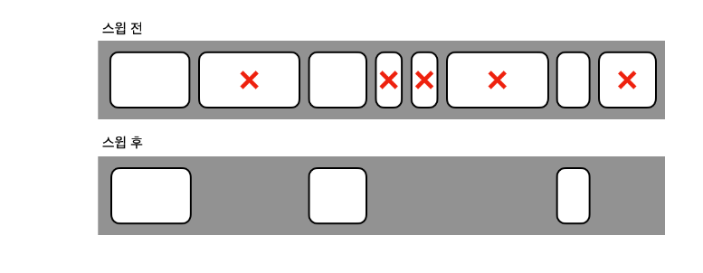

# 25일차 : 2023-10-05 (p. 328 ~ 342 )

### 자바의 힙 영역


Young , Old , Perm 세 영역으로 나뉜다.
이 중 Perm 영역은 거의 사용되지 않는 영역으로 클래스와 메서드 정보와 같이
자바 언어 레벨에서 사용하는 영역이 아니기 때문이다. 
게다가 JDK 8부터는 이 영역이 사라진다. Virtual 이라고 쓰여 있는 부분 또한 
가상 영역이므로 고려하지 말자. 이 두 영역을 제외하면 Young 영역과 Old 영역 일부가 남는다.

Young 영역은 다시 Eden 영역 및 두 개의 Survivor 영역으로 나뉘므로 우리가 고려해야 할 
자바의 메모리 영역은 총 4개 영역으로 나뉜다고 볼 수 있다.


※ 참고 
> Perm 영역에는 클래스와 메서드 정보외에도 intern 된 String 정보도 포함하고 있다. 
> String 클래스에는 intern() 이라는 메서드가 존재한다. 이 메서드를 호출하면 해당 문자열의 
> 값을 바탕으로 한 단순 비교가 가능하다. 즉 , 참조 자료형은 equals() 메서드로 비교를 해야 하지만,
> intern() 메서드가 호출된 문자열들은 == 비교가 가능하다. 따라서 , 값 비교 성능은 빨라지지만,
> 문자열 정보들이 Perm 영역에 들어가기 때문에 Perm 영역의 GC가 발생하는 원인이 되기도 한다.
> 물론 이 현상은 JDK 8부터는 발생하지 않을 것이다.

일단 메모리에 객체가 생성되면, 아래 그림의 가장 왼쪽인 Eden 영역에 객체가 지정된다.


Eden 영역에 데이터가 꽉 차면, 이 영역에 있던 객체가 어디론가 옮겨지거나 삭제되어야 한다.
이때 옮겨 가는 위치가 Survivor 영역이다.  
위의 그림에서는 구분을 하기 위해서 1과2로 나눈 것 뿐이며, 
두 개의 Survivor 영역 사이에 우선 순위가 있는 것은 아니다.


이 두 개의 영역 중 한 영역은 반드시 비어 있어야 한다. 
그 비어 있는 영역에 Eden 영역에 있던 객체 중 GC 후에 살아 남아 있는 객체들이 이동한다.


혹은 다음과 같이 할당된다.


이와 같이 Eden 영역에 있던 객체는 Survivor 영역의 둘 중 하나에 할당된다. 
할당된 Survivor 영역이 차면, GC가 되면서 Eden 영역에 있는 객체와 꽉 찬 Survivor 
영역에 있는 객체가 비어 있는 Survivor 영역으로 이동한다. 이러한 작업을 반복하면서,
Survivor 1과 2를 왔다 갔다 하던 객체들은 Old 영역으로 이동한다.

그리고, Young 영역에서 Old 영역으로 넘어가는 객체 중 Survivor 영역을 거치지 않고
바로 Old 영역으로 이동하는 객체가 있을 수 있다. 객체의 크기가 아주 큰 경우인데,
예를 들어 Survivor 영역의 크기가 16MB인데 20MB를 점유하는 객체가 Eden 영역에서
생성되면 Survivor 영역으로 옮겨갈 수가 없다. 이런 객체들은 바로 Old 영역으로 이동하게 된다.


### GC의 종류

GC는 크게 두 가지 타입으로 나뉜다. 마이너 GC와 메이저 GC의 두 가지 GC가 발생할 수 있다.

- 마이너 GC : Young 영역에서 발생하는 GC
- 메이저 GC : Old 영역이나 Perm 영역에서 발생하는 GC

이 두가지 GC가 어떻게 상호 작용하느냐에 따라서 GC 방식에 차이가 나며, 성능에도 영향을 준다.
GC가 발생하거나 객체가 각 영역에서 다른 영역으로 이동할 때 애플리케이션의 병목이 발생하면서
성능에 영향을 주게 된다. 그래서 핫 스팟(Hot Spot) JVM에서는 스레드 로컬 할당 버퍼
(TLABs : Tread-Local Allocation Buffers)라는 것을 사용한다.  이를 통하여
각 스레드별 메모리 버퍼를 사용하면 다른 스레드에 영향을 주지 않는 메모리 할당 작업이 가능해진다.

### 5가지 GC 방식

JDK 7이상에서 지원하는 GC 방식에는 다섯 가지가 있다.

- Serial Collector 
- Parallel Collector
- Parallel Compacting Collector
- Concurrent Mask-Sweep (CMS) Collector
- Garbage First Collector 

여기 명시된 다섯 가지의 GC 방식은 WAS 나 자바 애플리케이션 수행 시 옵션을 지정하여
선택할 수 있다. 그런데, G1 콜렉터는 JDK 7부터 정식으로 사용할 수 있다.
JDK 6에서는 early access 라고 해서 미리 맛보기로 사용할 수 있지만, 안정적인 상태가
아니므로 사용하지 말자


#### 시리얼 콜렉터

Young 영역과 Old 영역이 시리얼하게 처리되며 하나의 CPU를 사용한다.
Sun 에서는 이 처리를 수행할 때를 Stop-the-world 라고 표현한다. 다시 말하면, 콜렉션이
수행될 때 애플리케이션 수행이 정지된다.


그림의 내용은 다음과 같다.

- 일단 살아 있는 객체들은 Eden 영역에 있다. 
- Eden 영역이 꽉차게 되면 To Survivor 영역으로 살아 있는 객체가 이동한다. 이때 Survivor
영역에 들어가기에 너무 큰 객체는 바로 Old 영역으로 이동한다. 그리고 From Survivor 영역에 
있는 살아 있는 객체는 To Survivor 영역으로 이동한다.
- To Survivor 영역이 꽉 찼을 경우, Eden 영역이나 From Survivor 영역에 남아 있는 객체들은
Old 영역으로 이동한다.

이동한 결과는 다음과 같다.


이후에 Old 영역이나 Perm 영역에 있는 객체들은 Mark-sweep-compact 콜렉션 알고리즘을 따른다.
이 알고리즘에 대해서 간단하게 말하면, 쓰이지 않는 객체를 표시해서 삭제하고 
한 곳으로 모으는 알고리즘이다. Mark-sweep-compact 콜렉션 알고리즘은 다음과 같이 수행된다.

- Old 영역으로 아동된 객체들 중 살아 있는 객체를 식별한다. (표시 단계)
- Old 영역의 객체들을 훑는 작업을 수행하여 쓰레기 객체를 식별한다. (스윕 단계)
- 필요 없는 객체들을 지우고 살아 있는 객체들을 한 곳으로 모은다. (컴펙션 단계)

Mark-sweep-compact 단계를 거친 Old 영역은 다음과 같은 상태가 된다.


이렇게 작동하는 시리얼 콜렉터는 일반적으로 클라이언트 종류의 장비에서 많이 사용된다.
다시 말하면, 대기 시간이 많아도 크게 문제되지 않는 시스템에서 사용된다는 의미이다.
시리얼 콜렉터를 명시적으로 지정하려면 자바 명령 옵션에 -XX:+UseSerialGC를 지정하면 된다.


#### 병렬 콜렉터

이 방식은 스루풋 콜렉터(throughput collector)로도 알려진 방식이다.
이 방식의 목표는 다른 CPU가 대기 상태로 남아 있는 것을 최소화하는 것이다. 
시리얼 콜렉터와 달리 Young 영역에서의 콜렉션을 병렬로 처리한다. 
많은 CPU를 사용하기 때문에 GC의 부하를 줄이고 애플리케이션의 처리량을 증가시킬 수 있다.

Old 영역의 GC는 시리얼 콜렉터와 마찬가지로 Mark-sweep-compact 콜렉션 알고리즘을
사용한다. 이 방법으로 GC를 하도록 명시적으로 지정하려면 -XX:+UseParallelGC 옵션을
자바 명령 옵션에 추가하면 된다.


#### 병렬 콤팩팅 콜렉터

이 방식은 JDK 5.0 업데이트 6부터 사용 가능하다. 병렬 콜렉터와 다른 점은 Old 영역
GC에서 새로운 알고리즘을 사용한다는 것이다. 그러므로 Young 영역에 대한 GC는 
병렬 콜렉터와 동일하지만, Old 영역의 GC는 다음의 3단계를 거친다.

- 표시 단계 : 살아 있는 객체를 식별하여 표시해 놓는 단계
- 종합 단계 : 이전에 GC를 수행하여 컴팩션된 영역에 살아 있는 객체의 위치를 조사 하는 단계
- 컴팩션 단계 : 컴팩션을 수행하는 단계. 수행 이후에는 컴팩션된 영역과 비어 있는 영역으로 나뉜다.

병렬 콜렉터와 동일하게 이 방식도 여러 CPU를 사용하는 서버에 적합하다. GC를 사용하는
스레드 개수는 -XX:ParallelGCThreads=n 옵션으로 조정할 수 있다.
이 방식을 사용하려면 -XX:+UseParallelOldGC 옵션을 자바 명령 옵션에 추가하면 된다.

※ 참고 
> 시리얼 콜렉터와 병렬 콜렉터의 Old 영역의 방식과 병렬 콤팩팅 콜렉터의 Old 영역의 방식은
> 어떤 점이 다를까? 두 방식의 가장 큰 다른 점은 두번째 단계이다.
> 즉, 스윕(sweep) 단계와 종합(Summary) 단계의 차이라고 보면 된다.
> - 스윕 단계는 단일 스레드가 Old 영역 전체를 훑는다.
> - 종합 단계는 여러 스레드가 Old 영역을 분리하여 훑는다. 게다가, 앞서 진행된 GC에서 컴팩션된
> 영역을 별도로 훑는다는 점도 다르다.

#### CMS 콜렉터

이 방식은 로우 레이턴시 콜렉터(low-latency collector)로도 알려져 있으며, 
힙 메모리 영역의 크기가 클 때 적합하다. Young 영역에 대한 GC는 병렬 콜렉터와 동일하다.

Old 영역의 GC는 다음 단계를 거친다.

- 초기 표시 단계 : 매우 짧은 대기 시간으로 살아 있는 객체를 찾는 단계.
- 컨커런트 표시 단계 : 서버 수행과 동시에 살아 있는 객체에 표시를 해 놓는 단계.
- 재표시 단계 : 컨커런트 표시 단계에서 표시하는 동안 변경된 객체에 대해서 다시 표시하는 단계
- 컨커런트 스윕 단계 : 표시되어 있는 쓰레기를 정리하는 단계

CMS는 컴펙션 단계를 거치지 않기 때문에 왼쪽으로 메모리를 몰아 놓는 작업을 수행하지 않는다.
그래서 GC 이후에 그림 33과 같이 빈 공간이 발생하므로, 
-XX:CMSInitiatingOccupancyFraction=n 옵션을 
사용하여 Old 영역의 %를 n값에 지정한다. 여기서 n 값의 기본값은 68이다.


GC 이후이 CMS 콜렉터




CMS 콜렉터 방식은 2개 이상의 프로세서를 사용하는 서버에 적당하다. 
가장 적당한 대상으로는 웹 서버가 있다. 
-XX:+UseConcMarkSweepGC 옵션으로 이 GC 방식을 지정할 수 있다.

CMS 콜렉터는 추가적인 옵션으로 점진적 방식을 지원한다. 
이 방식은 Young 영역의 GC를 더 잘게 쪼개어 서버의 대기 시간을 줄일 수 있다.
CPU가 많지 않고 시스템의 대기 시간이 짧아야 할 때 사용하면 된다.
점진적인 GC를 수행하려면 -XX:+CMSIncrementalMode 옵션을 지정하면 된다. 
JVM에 따라서는 -Xingc 라는 옵션을 지정해도 같은 의미가 된다. 하지만 이 옵션을 
지정할 경우 예기치 못한 성능상 저하가 발생할 수 있으므로, 충분한 테스트를 한 후에
운영 서버에 적용 해야 한다.

#### G1 콜렉터

지금까지 설명한 모든 Garbage Collector 는 Eden 과 Survivor 영역으로 나뉘는 
Young 영역과 Old 영역으로 구성되어 있다. 하지만, Garbage First 는 
지금까지의 Garbage Collector 와는 다른 영역으로 구성되어 있다.


G1은 그림과 같이 되어 있다. 편하게 생각하려면 바둑판 모양이라고 생각하면 된다.
여기서 각 바둑판의 사각형을 region 이라고 하는데, Young 영역이나 Old 영역이라는 
단어와 구분하기 위해서 한국말로 '구역'이라고 하자.

그림에서 보듯이 G1은 Young 영역과 Old 영역이 물리적으로 나뉘어 있지 않고, 
각 구역의 크기는 모두 동일하다. 
앞서 살펴본 콜렉터들은 모두 Young 과 Old 영역의 주소가 물리적으로 Linear 하게
나열되지만, G1은 그렇지 않다. 여기서 구역의 개수는 약 2000 개 정도라고 한다.

이 바둑판 모양의 구역이 각각 Eden , Survivor , Old 영역의 역할을 변경해 가면서
하고, Humongous 영역도 포함된다. 

G1이 Young GC를 어떻게 하는지 살펴보면 다음과 같다. 

- 몇 개의 구역을 선정하여 Young 영역으로 지정한다.
- 이 Linear 하지 않은 구역에 객체가 생성되면서 데이터가 쌓인다.
- Young 영역으로 할당된 구역에 데이터가 꽉 차면, GC를 수행한다.
- GC를 수행하면서 살아있는 객체들만 Survivor 구역으로 이동시킨다.

이렇게 살아 남은 객체들이 이동된 구역은 새로운 Survivor 영역이 된다.
그 다음 Young GC가 발생하면 Survivor 영역에 계속 쌓는다. 
그러면서, 몇 번의 aging 작업을 통해서 (Survivor 영역에 있는 객체가 몇 번의 
Young GC 이후에도 살아 있으면) , Old 영역으로 승격된다.

G1 의 Old 영역 GC는 CMS GC의 방식과 비슷하며 아래 여섯 단계로 나뉜다. 
여기서 STW라고 표시된 단계에서는 모두 Stop the world 가 발생한다.

- 초기 표시 단계 (STW) : Old 영역에 있는 객체에서 Survivor 영역의 객체를 참조하고 있는 객체들을 표시한다.
- 기본 구역 스캔(Root region scanning) 단계 : Old 영역 참조를 위해서 Survivor 영역을 훑는다. 
참고로 이 작업은 Young GC가 발생하기 전에 수행된다.
- 컨커런트 표시 단계 : 전체 힙 영역에 살아있는 객체를 찾는다. 만약 이때 Young GC가 발생하면 잠시 멈춘다.
- 제 표시(Remark)단계 (STW) : 힙에 살아있는 객체들의 표시 작업을 완료한다. 이 때 snapshot-at-the-beginning (SATB)라는 알고리즘을 사용하며,
이는 CMS GC에서 사용하는 방식보다 빠르다.
- 청소 (Cleaning) 단계 (STW) : 살아있는 객체와 비어 있는 구역을 식별하고, 필요 없는 개체들을 지운다.
그리고 나서 비어 있는 구역을 초기화 한다. 
- 복사 단계 (STW) : 살아있는 객체들을 비어 있는 구역으로 모은다.


### 강제로 GC시키기 

강제로 GC를 발생시킬 수도 있다. System.gc() 메서드나 Runtime.getRuntime().gc()
메서드를 쓰면 된다. 하지만 여러분들의 코드에 사용하면 안되고, 특히 웹 기반의 
시스템에서는 절대로 사용하지 말 것을 권장한다. GC를 강제로 하면 안되는 이유를 알아보자.

```java
<%
        long mainTime = System.nanoTime();
        for (int outLoop = 0; outLoop < 10; outLoop++) {
        String aValue = "abcdefghijklmnopqrstuvwxyz";
        for (int loop=0; loop<10; loop++) {
        aValue += aValue;
        }
        System.gc();
        }
        double mainTimeElapsed = (System.nanoTime() - mainTime) /1000000.000;
        out.println("<BR><B>" +mainTimeElapsed + "</B><BR><BR>");
        
        
        %>
```

System.gc() 메서드를 수행해 강제로 GC를 하도록 코딩하였다.  

수행 해보면 약 5,000배 이상의 성능 차이가 발생한다. 
이것은 하나의 웹 화면의 응답 속도를 비교했을 경우 임을 감안하자. 
GC 방식이 무엇이든 관계없이 GC를 수행하는 동안 다른 애플리케이션의 성능에
영향을 미친다는 점은 변함이 없으므로 만약 실제 운영 중인 시스템에 이 코드가 있다면 
실제 시스템의 응답 속도에 미치는 영향이 엄청나게 커질 것이다. 


### 정리하며

개발자들이 자바의 GC 방식을 외우면서 개발하거나 서버를  설정할 필요는 없다.
그냥 이해만 하고 있으면 된다. 필요할 때 이 장의 내용을 참고하면서 알맞은 
GC 방식을 개발한 시스템에 적용하는 정도가 가장 바람직하다.