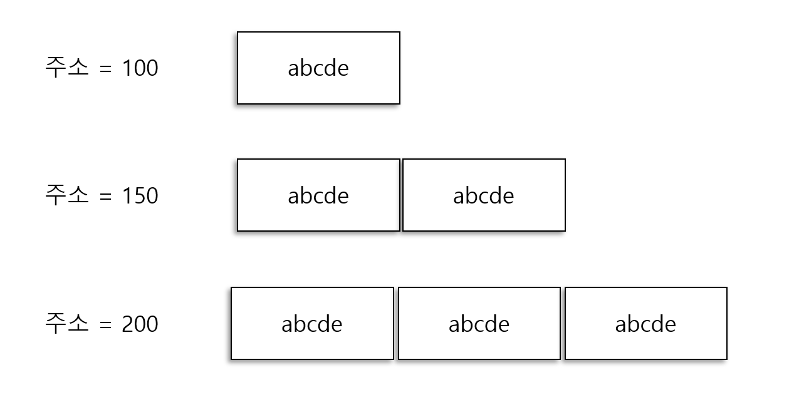
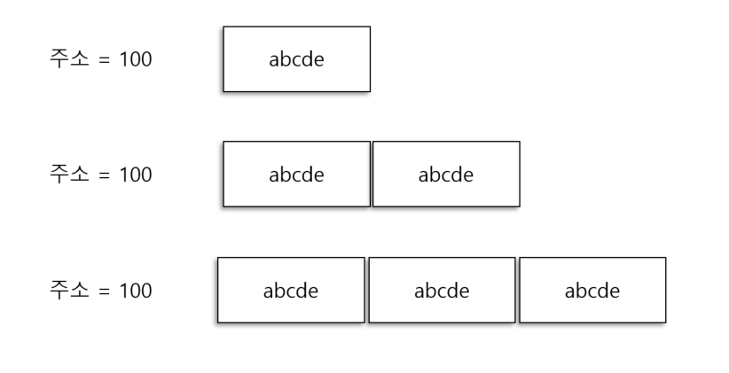

# 5일차 - 2023-08-25  ( p.49 ~ 56 ) 

## 요약

**String vs StringBuffer vs StringBuilder**

```java
<%
    final String aValue = "abcde";
    for (int outLoop =0; outLoop <10; outLoop++) {
        String a= new String();
        StringBuffer b= new StringBuffer();
        StringBuilder c = new StringBuilder();
        
        for (int loop = 0; loop < 10000; loop++) {
            a+=aValue;
        }
        for (int loop = 0; loop < 10000; loop++) {
            b.append(aValue);
        }
        for (int loop = 0; loop < 10000; loop++) {
            c.append(aValue);
        }
        String temp2 = c.toString();
        
    }
%>
ok
<%=
   System.currentTimeMillis() 
%>
```

소스를 JSP로 만든 이유는 이 코드를 java 파일로 만들어 반복 작업을 수행할 경우,
클래스를 메모리로 로딩하는 데 소요되는 시간이 발생하기 때문이다.


코드에 대한 설명

- 더할 값(aValue)에서 임시로 사용하는 객체가 생성되지 않도록 하기 위해서 finalString 으로 지정해 놓았다.
- 그리고 문자열을 더하기 위한 객체를 3가지로 만들었다.
- 각각의 객체를 만 번씩 수행하면서 각 객체에 'abced'를 추가한다.
- StringBuffer 와 StringBuilder 가 String 클래스의 객체로 변환되는 동일한 역할을 
할 수 있도록 toString()을 호출한다.
- 이러한 행위를 10회 반복한다.
- 앞서 수행항 결과 화면과 다른지 확인하기 위해서 현재 시간을 프린트한다.


**결과** 

응답 시간은 String 보다 StringBuffer 가 약 367배 빠르며, StringBuilder 가 약 512배 빠르다.
메모리는 StringBuffer 와 StringBuilder 보다 String 에서 약 3,390배 더 사용한다. 

왜 이러한 결과가 발생 할까??

```java
a += aValue;
```

a에 aValue를 더하면 새로운 String 클래스의 객체가 만들어지고, 
이전에 있던 a 객체는 필요 없는 쓰레기 값이 되어 GC의 대상이 된다.


```java
a += aValue 값(첫 번째 수행) : abcde
a += aValue 값(두 번째 수행) : abcdeabcde
a += aValue 값(세 번째 수행) : abcdeabcdeabcde
```




- 가장 처음에 a 객체는 'abcde' 값이 저장되어 있다
- 값이 더해기지 전의 a 객체는 a += aValue; 를 수행하면서 사라진다 (쓰레기가 된다.)
- 새로운 주소와 'abcdeabcde'라는 값을 갖는 a 객체가 생성된다.
- 세 번째 수행되면 'abcdeabcdeabcde' 라는 값을 갖는 또 다른 새로운 객체가 만들어진다.

이러한 작업이 반복 수행되면서 메모리를 많이 사용하게 되고, 응답 속도에도 많은 영향을 미치게 된다.
GC를 하면 할수록 시스템의 CPU를 사용하게 되고 시간도 많이 소요된다. 


**StringBuffer 와 StringBuilder 의 동작 원리**




String 과는 다르게 새로운 객체를 생성하지 않고, 기존에 있는 객체의 크기를 증가시키면서 값을 더한다.


그렇다면 String 을 쓰는 것은 무조건 나쁘고, 무조건 StringBuffer 와 StringBuilder 클래스만을 
사용해야 하는 것일까??

정리 해보자

- String 은 짧은 문자열을 더할 경우 사용한다.
- StringBuffer 는 스레드에 안전한 프로그램이 필요할 때나, 개발 중인 시스템의 부분이 스레드에 안전한지 모를 경우 사용하면 좋다.
  - 만약 클래스에 static 으로 선언한 문자열을 변경하거나, singleton 으로 선언된 클래스에 선언된 문자열일 경우에는 이 클래스를 사용한다.
- StringBuilder 는 스레드에 안전한지의 여부와 전혀 관계 없는 프로그램을 개발할 때 사용하면 좋다. 
  - 만약 메서드 내에 변수를 선언했다면, 해당 변수는 그 메서드 내에서만 살아있으므로, StringBuilder 를 사용하면 된다.


**정리하며**

String, StringBuffer , StringBuilder  세 가지 클래스 중에서,

메모리를 가장 많이 차지하고 응답 시간에 많은 영향을 주는 것은 String 클래스이다.

만약 WAS 나 시스템이 JDK 5.0 이상을 사용하면, 컴파일러에서 자동으로 StrinBuilder 로 변환하여 준다.

하지만 반복 루프를 사용해서 문자열을 더할 때는 객체를 계속 추가한다는 사실에는 변함이 없다.
그러므로 String 클래스를 쓰는 대신, 스레드와 관련이 있으면 StringBuffer 를 , 스레드 안전 여부와 
상관이 없으면 StringBuilder 를 사용하는 것을 권장한다.


## 발췌

※ 참고
> 자바 기반의 애플리케이션의 응답을 측정할 경우. '무조건' 처음 수행한 화면의 결과 값은 무시해야 한다.
> 클래스를 메모리로 로딩할 때는 시간이 오래 걸리기 때문에, 그 때 측정한 결과 값은 의미가 없기 때문이다.


