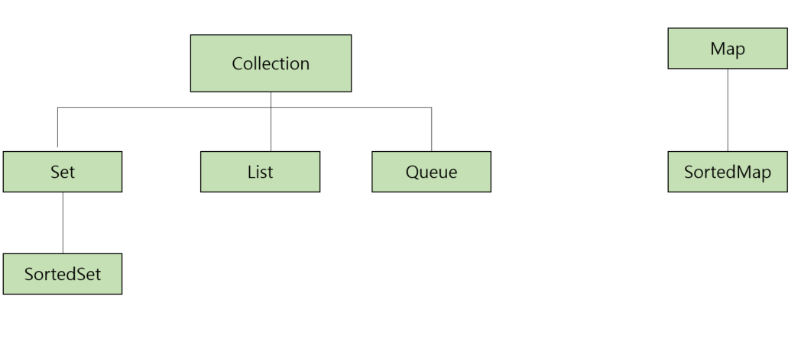

# 6일차 - 2023-08-26 (p.57 ~ 63)

## 요약

**Collection 및 Map 인터페이스의 이해**

배열을 제외하면 데이터를 담기 가장 좋은 객체는 Collection 과 Map 인터페이스를 상속한 객체이다.

- Collection : 가장 상위 인터페이스이다.
- Set : 중복을 허용하지 않는 집합으르 처리하기 위한 인터페이스이다.
- SortedSet: 오름차순을 갖는 Set 인터페이스이다.
- List : 순서가 있는 집합을 처리하기 위한 인터페이스이기 때문에 인덱스가 있어 위치를 지정하여 값을 찾을 수 잇다.
  - 중복을 허용하며, List 인터페이스를 상속받는 클래스 중에 가장 많이 사용하는 것으로 ArrayList가 있다.
- Queue : 여러 개의 객체를 처리하기 전에 담아서 처리할 때 사용하기 위한 인터페이스이다. 기본적으로 FIFO를 따른다.
- Map : Map 은 키와 값의 쌍으로 구성된 객체의 집합을 처리하기 위한 인터페이스이다.  이 객체는 중복되는 키를 허용하지 않는다.
- SortedMap : 키를 오름차순으로 정렬하는 Map 인터페이스이다. 

Set 인터페이스는 중복이 없는 집합 객체를 만들 때 유용하다.
예를 들어 전체 임직원 이름이 몇 개 인지 확인해 보려면, 중복되는 이름을 제외해야 할 것이다.  
이럴 때 그냥 Set 객체에 데이터를 집어 넣으면 중복된 데이터는 들어가지 않는다. 

### Set

Set 인터페이스를 구현한 클래스로는 HastSet , TreeSet , LinkedHashSet 세 가지가 있다.

- HashSet : 데이터를 해쉬 테이블에 담는 클래스로 순서 없이 저장된다. 
- TreeSet : red-black 이라는 트리에 데이터를 답는다. 값에 따라서 순서가 정해진다. 
데이터를 담으면서 동시에 정렬을 하기 때문에 HashSet 보다 성능상 느리다. 
- LinkedHashSet : 해쉬 테이블에 데이터를 담는데, 저장된 순서에 따라서 순서가 결정된다. 

### List

List는 배열의 확장판이라고 보면 된다. C나 Java의 배열은 모두 최초 선언 시 담을 수 있는 
데이터의 개수가 한정 되어 있다. 하지만 List 인터페이스를 구현한 클래스들은 담을 수 있는 
크기가 자동으로 증가되므로, 데이터의 개수를 확실히 모를 때 유용하게 사용된다.

구현 된 클래스에는 ArrayList 와 Linked-List 클래스가 있으며, 
원조 클래스 격인 Vector 클래스가 있다. 

- Vector : 객체 생성시에 크기를 지정할 필요가 없는 배열 클래승리다.
- ArrayList : Vector 와 비슷하지만, 동기화 처리가 되어 있지 않다. 
- LinkedList : ArrayList 와 동일하지만, Queue 인터페이스를 구현했기 때문에 FIFO 큐 작업을 수행한다.

### Map

Map은 Key 와 Value 의 쌍으로 저장되는 구조체이다. 그래서 단일 객체만 저장되는
다른 Collection API들과는 다르게 따로 분리되어 있다. 

이러한 Map 은 ID 와 패스워드 , 코드와 이름 등 고유한 값과 그 값을 설명하는 데이터를 보관할 때 유용하다. 

Map 인터페이스를 구현한 클래스들은 HashMap, TreeMap , LinkedHashMap 세 가지가 있고,
원조 클래스 격인 HashTable 클래스가 있다.

- HashTable : 데이터를 해쉬 테이블에 담는 클래스이다. 내부에서 관리하는 해쉬 테이블 객체가 동기화 되어 있으므로,
동기화가 필요한 부분에서는 이 클래스를 사용하자
- HashMap : 데이터를 해쉬 테이블에 담는 클래스이다. HashTable 클래스와 다른 점은 null 값을 허용한다는 것과
동기화되어 있지 않다는 것이다.
- TreeMap : red-black 트리에 데이터를 담는다. TreeSet 과 다른 점은 키에 의헤서 순서가 정해진다는 것이다.
- LinkedHashMap : HashMap 과 거의 동일하며 이중 연결 리스트라는 방식을 사용하여 데이터를 담는다는 점만 다르다.

### Queue

Queue는 데이터를 담아 두었다가 먼저 들어온 데이터부터 처리하기 위해서 사용된다. 
예를 들어 SMS 와 같은 문자를 처리할 때 서버에서 들어오는 순서대로 처리해 주려면 이 Queue에 던져 주고,
처음에 요청한 데이터부터 처리하면 된다. 
그런데, List도 순서가 있고, Queue 도 순서가 있는데 왜 굳이 Queue 가 필요할까?

List의 가장 큰 단점은 데이터가 많은 경우 처리 시간이 늘어난다는 점이다. 가장
앞에 있는 데이터를 지우면 그 다음 1번 데이터부터 마지막 데이터까지 한 칸씩 옮기는 작업을 수행해야 하므로,
데이터가 적을 때는 상관 없지만, 데이터가 많으면 많을수록 가장 앞에 있는 데이터를 지우는데 소요되는
시간이 증가된다.

Queue 인터페이스를 구현한 클래스는 두 가지로 나뉜다. 
java.util 패키지에 속하는 LinkedList 와 PriorityQueue는 일반적인 목적의 큐 클래스이며,

java.util.concurrent 패키지에 속하는 클래스들은 컨커런트 큐 클래스이다. 

- PriorityQueue : 큐에 추가된 순서와 상관없이 먼저 생성된 객체가 먼저 나오도록 되어 있는 큐다.
- LinkedBlockingQueue : 저장할 데이터의 크기를 선택적으로 정할 수도 있는 FIFO 기반의 링크 노드를 사용하는
블로킹 큐다.
- ArrayBlockingQueue : 저장되는 데이터의 크기가 정해져 있는 FIFO 기반의 블로킹 큐다.
- PriorityBlockingQueue : 저장되는 데이터의 크기가 정해져 있지 않고, 객체의 생성순서에 따라서 순서가
저장되는 블로킹 큐다.
- DelayQueue : 큐가 대기하는 시간을 지정하여 처리하도록 되어 있는 큐다.
- SynchronousQueue : put() 메서드를 호출하면, 다른 스레드에서 take() 메서드가 호출될 때까지
대기하도록 되어 있는 큐다. 이 큐에는 저장되는 데이터가 없다. API에서 제공하는 대부분의 메서드는 0이나 
null을 리턴한다. 

※참고
> 블로킹 큐란 크기가 지정되어 있는 큐에 더 이상 공간이 없을 때, 공간이 생길 때까지 대기하도록
> 만들어진 큐를 의미한다. 

